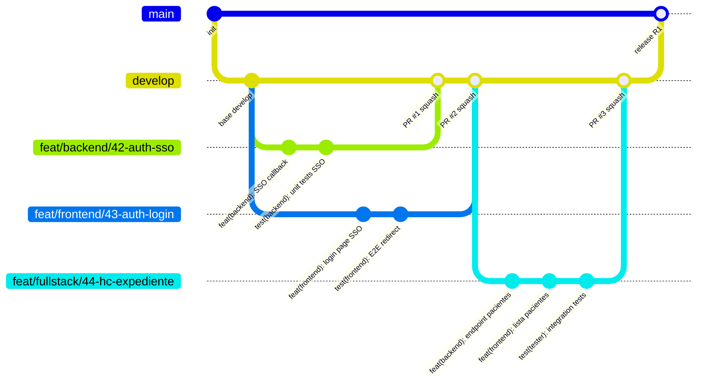
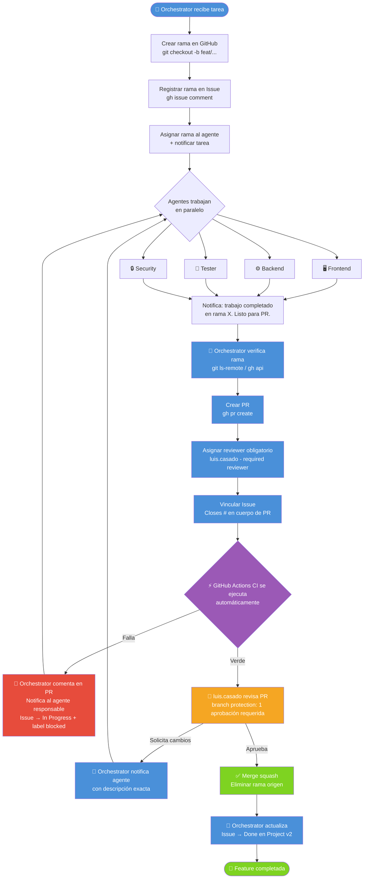
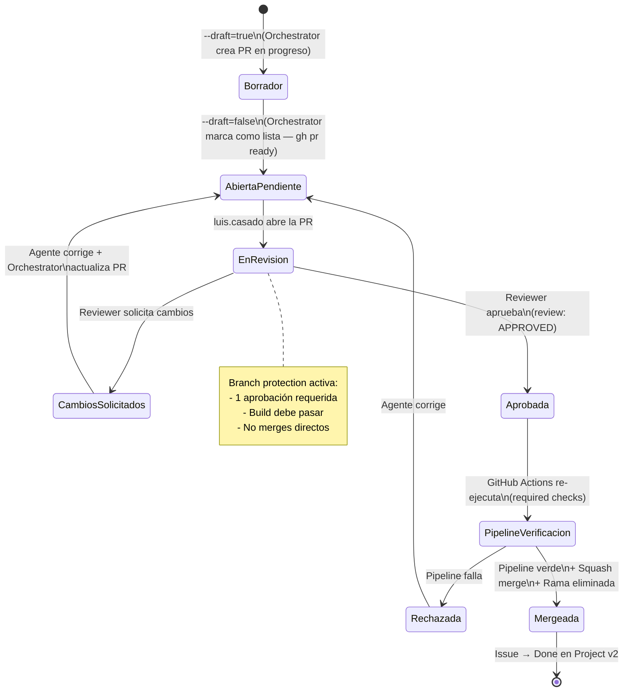
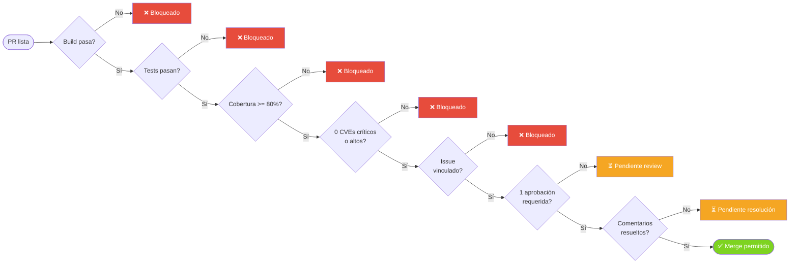

# 3. Pull Requests — HC Digital

> **Fuente de verdad** para el proceso completo de Pull Requests en el proyecto HC.  
> Repositorio: `github.com/$GITHUB_ORG/$GITHUB_REPO` · CI/CD: GitHub Actions  
> Orchestrator crea ramas y PRs · Revisión y merge: `luis.casado@aleatica.com`

---

## Tabla de Contenidos

1. [Estrategia de Branching](#31-estrategia-de-branching)
2. [Convención de Commits](#32-convención-de-commits)
3. [Flujo completo: de tarea a merge](#33-flujo-completo-de-tarea-a-merge)
4. [Template estándar de PR](#34-template-estándar-de-pr)
5. [Proceso de Review y Aprobación](#35-proceso-de-review-y-aprobación)
6. [Criterios de Merge](#36-criterios-de-merge)
7. [Automatización con GitHub Actions](#37-automatización-con-github-actions)

---

## 3.1 Estrategia de Branching

### Ramas permanentes

| Rama | Propósito | Protegida | Merge permitido desde |
|---|---|---|---|
| `main` | Producción — código desplegado en PRO | ✅ Sí | `develop` (solo release tags) |
| `develop` | Integración continua — rama base de todas las features | ✅ Sí | PRs de feature/fix/chore/test |

> ⚠️ **Nunca** crear ramas directamente desde `main`.  
> ⚠️ **Solo el Orchestrator** crea ramas. Los agentes especializados trabajan sobre la rama asignada.

### Ramas de trabajo (corta vida)

```
feat/<agente>/<descripcion-kebab-case>    nueva funcionalidad
fix/<agente>/<descripcion-kebab-case>     corrección de bug
chore/<agente>/<descripcion-kebab-case>   configuración / dependencias
test/<agente>/<descripcion-kebab-case>    solo tests, sin código de producción
feat/fullstack/<descripcion>              Frontend + Backend en la misma rama
```

**Scopes de agente válidos**: `frontend` · `backend` · `devops` · `security` · `tester`

#### Ejemplos reales del proyecto

```
feat/backend/42-auth-sso-callback
feat/frontend/43-hc-lista-pacientes
feat/fullstack/44-consultas-nueva
fix/backend/45-filtro-sociedad-nullpointer
fix/frontend/46-paginador-reset-busqueda
chore/devops/47-github-actions-ci-base
test/tester/48-rbac-matrix-exhaustivo
```

#### Cuándo usar una rama por agente vs. rama compartida

| Situación | Estrategia |
|---|---|
| Frontend y Backend con contratos independientes | Una rama por agente |
| Frontend y Backend con riesgo de conflicto de ficheros | `feat/fullstack/<modulo>` |
| Solo un agente produce código | Rama específica del agente |
| Configuración, Docker, pipelines | `chore/devops/...` |
| Solo tests sin código de producción | `test/tester/...` |

### Diagrama de ramas



---

## 3.2 Convención de Commits

Todos los commits siguen **Conventional Commits**:

```
<tipo>(<scope>): <descripción imperativa en minúsculas>

[cuerpo opcional]

[pie: BREAKING CHANGE: o refs a Issue (#<ID>)]
```

| Tipo | Cuándo usarlo |
|---|---|
| `feat` | Nueva funcionalidad |
| `fix` | Corrección de bug |
| `refactor` | Cambio sin alterar comportamiento externo |
| `test` | Añadir o modificar tests |
| `docs` | Solo documentación o specs |
| `chore` | Configuración, dependencias, scripts |

**Reglas**:
- Descripción en **imperativo** y **minúsculas** (❌ "Implementado", ❌ "Implementar")
- Scope obligatorio: `frontend`, `backend`, `tester`, `orchestrator`, `devops`, `security`
- Sin punto al final
- Breaking changes: `BREAKING CHANGE:` en el pie del commit

**Ejemplos**:
```
feat(backend): implementar endpoint POST /api/v1/pacientes con validación DTO (#42)
fix(backend): corregir filtro sociedad en query pacientes (#45)
refactor(backend): extraer lógica auditoría a AuditoriaService (#50)
test(tester): añadir tests E2E alta de paciente 4 pasos (#48)
docs(orchestrator): actualizar specs contrato API pacientes (#51)
chore(devops): configurar GitHub Actions CI con sonar y jacoco (#47)
feat(frontend): implementar lista pacientes con paginación y debounce (#43)
```

---

## 3.3 Flujo completo: de tarea a merge

### Visión general



### Responsabilidades por actor

| Actor | Crea rama | Hace commits | Crea PR | Revisa PR | Aprueba PR | Mergea |
|---|---|---|---|---|---|---|
| 🤖 Orchestrator | ✅ | ❌ | ✅ | ✅ (checklist) | ❌ | ❌ |
| 🖥️ Frontend | ❌ | ✅ | ❌ | ❌ | ❌ | ❌ |
| ⚙️ Backend | ❌ | ✅ | ❌ | ❌ | ❌ | ❌ |
| 🧪 Tester | ❌ | ✅ | ❌ | ❌ | ❌ | ❌ |
| 🔒 Security | ❌ | ✅ | ❌ | ❌ | ❌ | ❌ |
| 🛠️ DevOps | ❌ | ✅ | ❌ | ❌ | ❌ | ❌ |
| 👤 luis.casado | ❌ | ❌ | ❌ | ✅ | ✅ | ✅ |

> **Principio clave**: El Orchestrator actúa con el token del usuario `orquestadoria` para commits de metadatos (specs, tasks.md) y creación de PRs. El merge y la aprobación final siempre recaen en `luis.casado@aleatica.com`.

### Pasos detallados del Orchestrator para crear una PR

```bash
# Lee GITHUB_ORG, GITHUB_REPO, GITHUB_PROJECT_NUMBER, BASE_BRANCH de docs/PROJECT.md
ORG="$GITHUB_ORG"
REPO="$GITHUB_REPO"
BASE="$BASE_BRANCH"  # típicamente develop
BRANCH="<rama-origen>"
ISSUE_ID="<número-issue>"

# 1. Verificar que la rama existe en remoto
git ls-remote --exit-code --heads "https://github.com/$ORG/$REPO.git" "$BRANCH" \
  || { echo "Rama $BRANCH no existe en remoto"; exit 1; }

# 2. Crear la PR (Closes #<ID> auto-cierra el Issue al mergear)
PR_URL=$(gh pr create \
  --repo "$ORG/$REPO" \
  --base "$BASE" \
  --head "$BRANCH" \
  --title "[<Agente>] <descripción funcional concisa> (#$ISSUE_ID)" \
  --body "<ver template §3.4 — debe contener 'Closes #$ISSUE_ID'>" \
  --draft=false)        # usa --draft=true si aún es WIP

# 3. Asignar reviewer obligatorio
# REVIEWER debe ser un username de GitHub válido (sin puntos) o un team slug
# (ej. "lcasadov" o "padelpro-dev/maintainers"). Leer de docs/PROJECT.md
# o pasarse explícitamente al agente.
REVIEWER="${REVIEWER:-lcasadov}"
gh pr edit "$PR_URL" --repo "$ORG/$REPO" \
  --add-reviewer "$REVIEWER"

# 4. Vincular Issue (automático vía 'Closes #<ID>' en el cuerpo de la PR);
#    además etiquetar el Issue como in-review en GitHub Projects v2
gh issue edit "$ISSUE_ID" --repo "$ORG/$REPO" \
  --add-label "in-review" \
  --remove-label "in-progress"
# Mover el item del Project v2 a "In Review" (helper en gh-projects-sync)
# update_project_status "$ISSUE_ID" "In Review"

# 5. Comentar en el Issue con la URL de la PR
gh issue comment "$ISSUE_ID" --repo "$ORG/$REPO" \
  --body "PR creada: $PR_URL"
```

---

## 3.4 Template estándar de PR

Usar esta plantilla como `--body` en `gh pr create`:

```markdown
## 📋 Descripción
<!-- Qué hace este cambio y por qué. Incluir contexto de negocio si aplica. -->

## Issues vinculados
- User Story: Closes #<ID>
- Tasks completadas: Closes #<ID1>, Closes #<ID2>
- Project: https://github.com/orgs/$GITHUB_ORG/projects/$GITHUB_PROJECT_NUMBER

## 🌿 Rama
`<rama-origen>` → `develop`

## 👥 Agentes que han contribuido
- [ ] Frontend
- [ ] Backend
- [ ] Tester
- [ ] Security
- [ ] DevOps

## 🏷️ Tipo de cambio
- [ ] ✨ Nueva funcionalidad
- [ ] 🐛 Corrección de bug
- [ ] ♻️ Refactor sin cambio de comportamiento
- [ ] 🧪 Tests
- [ ] 🔧 Configuración / infraestructura
- [ ] 📝 Documentación

---

## ✅ Checklist — Orchestrator verifica antes de crear la PR

### General
- [ ] Pipeline CI pasando (build + tests + lint + análisis de calidad)
- [ ] Cobertura ≥ 80% (JaCoCo backend / Jest frontend)
- [ ] Sin vulnerabilidades críticas o altas (OWASP Dependency-Check / npm audit)
- [ ] Commits siguen Conventional Commits
- [ ] Sin `console.log`, `System.out.println` ni código comentado
- [ ] Sin `// TODO` sin número de ticket asociado

### Backend (si aplica)
- [ ] Endpoints nuevos con `@PreAuthorize` y filtro de sociedad
- [ ] DTOs validados con Bean Validation (`@NotNull`, `@Size`, etc.)
- [ ] Logs de auditoría generados para nuevas operaciones (AOP)
- [ ] Migraciones Flyway incluidas si hay cambio de esquema
- [ ] Swagger/OpenAPI actualizado (`@Operation`, `@ApiResponse`)

### Frontend (si aplica)
- [ ] Todos los textos nuevos con clave i18n en `es/` y `en/`
- [ ] Sin uso de `any` de TypeScript
- [ ] Permisos CASL aplicados en componentes nuevos
- [ ] Sin acceso directo a rutas sin guard de autenticación

### Tests
- [ ] Tests unitarios pasan (`mvn test` / `npm test`)
- [ ] Tests de integración pasan (si aplica)
- [ ] Tests E2E Cypress pasan con backend real (si aplica)

### Security (si hay cambios de acceso o datos sensibles)
- [ ] Security ha revisado cambios con impacto de seguridad
- [ ] Sin datos sensibles en logs ni en respuestas de error
- [ ] RBAC correcto para los roles afectados (ver `docs/seguridad/matriz-rbac.md`)

---

## 🧪 Resultados de Tests
<!-- Pegar resumen del pipeline o indicar cobertura -->
- Backend coverage: __%
- Frontend coverage: __%
- E2E: __ / __ tests passing

## 📸 Screenshots (si aplica Frontend)
<!-- Adjuntar capturas de los cambios visuales -->

## 📝 Notas adicionales para el reviewer
<!-- Cualquier decisión de diseño, trade-off o contexto que ayude al revisor -->
```

---

## 3.5 Proceso de Review y Aprobación

### Diagrama de estados de una PR



### Política de branch protection en GitHub (`develop`)

Configurar en **Repo Settings → Branches → Branch protection rules → develop**:

| Policy | Valor | Motivo |
|---|---|---|
| Require pull request reviews before merging | **1** aprobación (luis.casado requerido) | Revisión humana obligatoria |
| Require linked issue (`Closes #<ID>` en PR) | **Required** | Trazabilidad con GitHub Projects |
| Require conversation resolution before merging | **Required** | Sin comentarios sin resolver |
| Allow merge commits / squash / rebase | **Squash merge only** | Historial limpio en develop |
| Require status checks to pass before merging | **GitHub Actions CI** | CI debe pasar |
| Automatically delete head branches | **Sí** | Higiene de ramas |

### Protocolo de review para `luis.casado`

1. **Verificar** que el pipeline CI ha pasado (pestaña Checks de la PR).
2. **Revisar** los ficheros cambiados — foco en lógica de negocio, seguridad y RBAC.
3. **Ejecutar localmente** si el cambio afecta a flujos críticos (SSO, datos clínicos).
4. Si hay **dudas o problemas**:
   - Añadir comentario en la línea afectada → el Orchestrator lo recibe y notifica al agente.
   - Marcar la PR como "Waiting for author".
5. Si la revisión es **satisfactoria**:
   - Aprobar con **"Approve"** (review: APPROVED).
   - Completar con **Squash merge**.
   - La rama origen se elimina automáticamente.

### Tiempos objetivo de review

| Tipo de PR | SLA objetivo |
|---|---|
| Hotfix / Bug crítico | ≤ 4 horas |
| Feature nueva | ≤ 1 día laborable |
| Refactor / Tests | ≤ 2 días laborables |
| Configuración / DevOps | ≤ 1 día laborable |

---

## 3.6 Criterios de Merge

Una PR **solo puede mergearse** cuando se cumplen **todos** los criterios siguientes:

### Criterios automáticos (bloqueantes — branch protection)



### Tabla de criterios detallada

| # | Criterio | Tipo | Responsable | Umbral |
|---|---|---|---|---|
| 1 | Build compila sin errores | Automático | GitHub Actions | 100% |
| 2 | Tests unitarios pasan | Automático | GitHub Actions | 100% |
| 3 | Cobertura de código | Automático | JaCoCo / Jest | ≥ 80% |
| 4 | Análisis SonarQube | Automático | GitHub Actions | Quality Gate: passed |
| 5 | OWASP Dependency-Check | Automático | GitHub Actions | 0 CVEs críticos/altos |
| 6 | Lint sin errores | Automático | Checkstyle / ESLint | 0 errores |
| 7 | Issue vinculado (`Closes #<ID>`) | Automático | Branch protection GitHub | Requerido |
| 8 | 1 aprobación requerida | Manual | luis.casado@aleatica.com | Aprobado |
| 9 | Comentarios resueltos | Manual | luis.casado / Agente | Todos resueltos |
| 10 | Security sign-off | Manual (si aplica) | Security agent | Para cambios de acceso/datos |

### Excepciones documentadas

| Excepción | Condición | Autorización |
|---|---|---|
| Cobertura < 80% en módulo nuevo | Primera PR del módulo (código base sin tests aún) | luis.casado debe aprobarlo explícitamente con comentario justificado |
| Hotfix en `main` directo | Bug crítico en producción que no puede esperar | luis.casado crea PR directamente + notificación inmediata al equipo |

---

## 3.7 Automatización con GitHub Actions

### Estructura de workflows por entorno

```mermaid
flowchart TD
    subgraph "Trigger: PR → develop"
        PR_TRIGGER[PR abierta o actualizada]
        PR_TRIGGER --> CI[.github/workflows/ci.yml\nCI — Build + Test + Scan]
        CI --> CI_BUILD[Build\nBackend: mvn package\nFrontend: npm run build]
        CI_BUILD --> CI_TEST[Tests\nBackend: mvn test + JaCoCo\nFrontend: npm test + Jest]
        CI_TEST --> CI_QUALITY[Calidad\nSonarQube\nOWASP Dep-Check\nnpm audit]
        CI_QUALITY --> CI_RESULT{Quality Gate}
        CI_RESULT -->|Falla| PR_FAIL[❌ PR bloqueada]
        CI_RESULT -->|Pasa| PR_OK[✅ PR desbloqueada\npara merge]
    end

    subgraph "Trigger: merge → develop"
        MERGE[Merge completado\nen develop]
        MERGE --> CD_QA[.github/workflows/cd-qa.yml\nDeploy → QA/PRE]
        CD_QA --> IT[.github/workflows/integration-tests.yml\nIntegration Tests\nTestcontainers + Cypress E2E]
        IT --> IT_RESULT{Tests IT}
        IT_RESULT -->|Falla| NOTIFY_IT[🔔 Notificar Orchestrator\nIssue → In Progress + label blocked]
        IT_RESULT -->|Pasa| QA_OK[✅ QA validado]
    end

    subgraph "Trigger: release tag → main"
        TAG[Tag release en main\nvX.Y.Z]
        TAG --> CD_PRO[.github/workflows/cd-pro.yml\nDeploy → PRO]
        CD_PRO --> SMOKE[Smoke tests\nEndpoints críticos]
        SMOKE --> PRO_OK[✅ Producción]
    end

    style PR_FAIL fill:#E74C3C,color:#fff
    style PR_OK fill:#7ED321,color:#fff
    style QA_OK fill:#7ED321,color:#fff
    style PRO_OK fill:#7ED321,color:#fff
    style NOTIFY_IT fill:#E74C3C,color:#fff
```



### Workflow CI (`.github/workflows/ci.yml`) — jobs

#### Backend (`.github/workflows/backend-ci.yml`)

```yaml
name: Backend CI
on:
  pull_request:
    branches: [develop]
    paths: ['hc-api/**']

jobs:
  build_and_test:
    runs-on: ubuntu-latest
    steps:
      - uses: actions/checkout@v4
      - uses: actions/setup-java@v4
        with:
          distribution: temurin
          java-version: '21'
          cache: maven

      - name: Build + Test + JaCoCo + Checkstyle
        run: mvn -f hc-api/pom.xml -P ci clean verify

      - name: Publish test results
        if: always()
        uses: dorny/test-reporter@v1
        with:
          name: Backend tests
          path: 'hc-api/target/surefire-reports/*.xml'
          reporter: java-junit

      - name: Upload coverage report
        uses: actions/upload-artifact@v4
        with:
          name: jacoco-report
          path: 'hc-api/target/site/jacoco/jacoco.xml'
          # Umbral configurado en jacoco-maven-plugin: 80% líneas, 80% ramas

  quality:
    needs: build_and_test
    runs-on: ubuntu-latest
    steps:
      - uses: actions/checkout@v4
      - name: SonarQube scan
        # Quality Gate: bloqueante si no pasa
        run: mvn -f hc-api/pom.xml sonar:sonar
        env:
          SONAR_TOKEN: ${{ secrets.SONAR_TOKEN }}
      - name: OWASP Dependency-Check
        uses: dependency-check/Dependency-Check_Action@main
        with:
          project: hc-api
          path: hc-api
          format: HTML
          args: '--failOnCVSS 7'           # bloquea con CVSS >= 7 (High/Critical)
```

#### Frontend (`.github/workflows/frontend-ci.yml`)

```yaml
name: Frontend CI
on:
  pull_request:
    branches: [develop]
    paths: ['frontend/**']

jobs:
  build_and_test:
    runs-on: ubuntu-latest
    steps:
      - uses: actions/checkout@v4
      - uses: actions/setup-node@v4
        with:
          node-version: '20'
          cache: npm
          cache-dependency-path: frontend/package-lock.json

      - run: npm ci
        working-directory: frontend
      - run: npm run lint                 # ESLint + Prettier check
        working-directory: frontend
      - run: npm test -- --coverage --watchAll=false
        # Umbral Jest: branches 80%, lines 80%, functions 80%
        working-directory: frontend
      - run: npm run build
        working-directory: frontend

      - name: Publish test results
        if: always()
        uses: dorny/test-reporter@v1
        with:
          name: Frontend tests
          path: 'frontend/coverage/junit.xml'
          reporter: jest-junit

  quality:
    needs: build_and_test
    runs-on: ubuntu-latest
    steps:
      - uses: actions/checkout@v4
      - run: npm ci
        working-directory: frontend
      - run: npm audit --audit-level=high  # Falla si hay vulnerabilidades high o critical
        working-directory: frontend
      - name: SonarQube scan
        run: npm run sonar
        working-directory: frontend
        env:
          SONAR_TOKEN: ${{ secrets.SONAR_TOKEN }}
```

### Resumen de gates por workflow

| Gate | Workflow | Umbral | Acción si falla |
|---|---|---|---|
| Build sin errores | CI | 0 errores | Bloquea PR |
| Tests unitarios | CI | 100% passing | Bloquea PR |
| Cobertura líneas | CI | ≥ 80% | Bloquea PR |
| Cobertura ramas | CI | ≥ 80% | Bloquea PR |
| SonarQube Quality Gate | CI | Passed | Bloquea PR |
| OWASP CVSS | CI | < 7.0 | Bloquea PR |
| npm audit | CI | 0 high/critical | Bloquea PR |
| Tests integración | CD QA | 100% passing | Notifica, no bloquea deploy |
| Tests E2E Cypress | CD QA | 100% passing | Notifica, bloquea release |

---

## Referencias cruzadas

| Documento | Contenido relacionado |
|---|---|
| `github.md` | Protocolo completo del Orchestrator + gestión de GitHub Projects |
| `.github/agents/orchestrator.agent.md` | Instrucciones del agente Orchestrator |
| `.github/agents/PROJECT.md` | Stack, entornos, reviewer, estructura de repo |
| `docs/seguridad/matriz-rbac.md` | Roles y permisos — checklist de PR Security |
| `docs/Userstories/userStories.md` | DoD global + tickets por fase |
| `openspec/changes/` | Specs y contratos API por feature |
