# PadelPro - Sistema de Gestión de Reservas de Pádel

---

## Índice

1. [Descripción general del producto](#1-descripción-general-del-producto)
2. [PRD – Casos de Uso Principales](#2-prd--casos-de-uso-principales)
3. [Arquitectura del sistema](#3-arquitectura-del-sistema)
   - 3.1 [Diagrama de Contexto — C4 L1](#31-diagrama-de-contexto-del-sistema--c4-level-1)
   - 3.2 [Visión General](#32-visión-general-del-sistema)
   - 3.3 [Arquitectura General — C4 L2](#33-diagrama-de-arquitectura-general--c4-level-2)
   - 3.4 [Arquitectura Hexagonal — C4 L3](#34-arquitectura-hexagonal-por-módulos--c4-level-3)
     - 3.4.5 [Diagrama de Clases — C4 L4 · Módulo `reservas`](#345-diagrama-de-clases--c4-level-4--módulo-reservas)
   - 3.5 [Diagrama de Componentes del Backend](#35-diagrama-de-componentes-del-backend-por-módulos)
   - 3.6 [Diagrama de Despliegue — Docker Compose](#36-diagrama-de-despliegue--docker-compose-on-premise)
   - 3.7 [Diagrama de Seguridad — JWT y OTP](#37-diagrama-de-seguridad--flujo-jwt-y-otp)
   - 3.8 [Análisis del Stack Tecnológico](#38-análisis-del-stack-tecnológico)
4. [Modelo de datos](#4-modelo-de-datos)
5. [Especificación de la API](#5-especificación-de-la-api)


---

## 1. Descripción general del producto

### 1.1 Descripción General

**PadelPro** es una plataforma digital integral para la gestión de reservas de pistas de pádel en instalaciones pequeñas y medianas. Combina una aplicación web moderna con integración nativa en canales de mensajería (WhatsApp y Telegram), eliminando los problemas de gestión manual que se producen cuando las reservas se coordinan a través de grupos de mensajería sin ningún sistema centralizado.

El sistema centraliza en un único punto la reserva de pistas, el control de disponibilidad en tiempo real, la gestión de participantes, el cobro de reservas y el seguimiento de ingresos, ofreciendo tanto una interfaz web intuitiva como la posibilidad de operar directamente desde el grupo de WhatsApp o Telegram ya existente en la comunidad de jugadores.

---

### 1.2 Objetivo

#### Descripción

PadelPro nace para resolver un problema concreto y frecuente en instalaciones deportivas pequeñas: la coexistencia de múltiples canales de reserva (grupos de mensajería + aplicaciones de pago externas) que no están sincronizados entre sí, generando solapamientos, pérdida de control económico y una experiencia de usuario deficiente.

El objetivo es proporcionar una herramienta única que:

- Actúe como **sistema de reservas centralizado** con calendario en tiempo real.
- Se integre de forma **nativa con WhatsApp y Telegram**, respetando el canal de comunicación que ya usa la comunidad.
- Permita la **gestión económica** completa: pagos online, registro de efectivo y seguimiento de ingresos.
- Ofrezca al administrador **control total** sobre usuarios, reservas, notificaciones y configuración.

#### Valor Añadido

| Área | Problema actual | Valor que aporta PadelPro |
|---|---|---|
| Disponibilidad | Solapamientos entre WhatsApp y app externa | Calendario único y en tiempo real |
| Comunicación | Gestión manual de mensajes en grupo | Bot integrado que lee y actualiza reservas automáticamente |
| Pagos | Efectivo sin registro, sin trazabilidad | Link de pago seguro + registro digital de todos los cobros |
| Gestión | Sin histórico electrónico | Dashboard con gráficas, histórico de reservas e ingresos |
| Participantes | Apuntarse por copia-pega en WhatsApp | Flujo guiado web + confirmación automática en el grupo |

#### Ventajas Competitivas

- **Integración real con WhatsApp/Telegram:** no es un bot externo, es parte del núcleo del sistema. Las reservas realizadas desde el grupo se registran instantáneamente y viceversa.
- **Cero fricción para el jugador casual:** puede apuntarse a una pista respondiendo un mensaje en WhatsApp sin necesidad de registrarse en ninguna app.
- **Modelo de pago flexible:** admite pago online mediante link seguro Y efectivo registrado por el administrador, adaptándose a comunidades donde el efectivo sigue siendo habitual.
- **Diseñado para instalaciones pequeñas:** no requiere integración con sistemas de gestión deportiva complejos ni hardware adicional. Es operativo desde el primer día.
- **Auditabilidad completa:** todas las acciones quedan registradas, lo que aporta transparencia tanto al administrador como a los jugadores.

---

### 1.3 Investigación y Análisis de Mercado

#### Contexto del Mercado

España cuenta con más de 20.000 pistas de pádel registradas, siendo el segundo país del mundo con más instalaciones. Una parte significativa corresponde a pistas municipales, de clubes pequeños o comunidades de vecinos que carecen de sistemas digitales de gestión y siguen operando con hojas de papel, grupos de WhatsApp o aplicaciones genéricas no adaptadas a sus necesidades.

#### Alternativas Existentes

| Solución | Descripción | Limitaciones frente a PadelPro |
|---|---|---|
| **Playtomic** | App líder de reservas de pádel en España | Orientada a grandes clubes, comisión por reserva, sin integración WhatsApp, coste elevado para instalaciones pequeñas |
| **CourtReserve** | Software de gestión deportiva | Muy completo pero complejo y costoso para una sola pista |
| **Wuolah / Resasport** | Plataformas de reservas deportivas | No integran mensajería, requieren migración total del flujo de los usuarios |
| **Grupo de WhatsApp manual** | Coordinación informal actual | Sin control de solapamientos, sin registro económico, dependiente de una persona gestora |
| **Fintonic (uso actual)** | App de pagos | Solo gestiona el cobro, no la disponibilidad ni la comunicación |

#### Oportunidad de Mercado

PadelPro cubre un **nicho desatendido**: instalaciones con una o pocas pistas que ya tienen una comunidad activa en WhatsApp/Telegram y necesitan digitalizar su gestión sin abandonar el canal de comunicación que ya funciona socialmente. La propuesta no compite con Playtomic en el segmento premium, sino que digitaliza a quienes aún están fuera del ecosistema digital.

---

### 1.4 Funcionalidades Principales

#### Módulo Web

- **Dashboard:** Últimas reservas, calendario semanal, gráficas de uso (semanal, mensual, anual).
- **Calendario de pista:** Vista completa de todas las reservas con disponibilidad en tiempo real.
- **Nueva reserva:** Selección de franja horaria (mínimo 1h, intervalos de 30 min, máximo 3h), asignación de hasta 4 participantes (jugadores registrados o externos).
- **Unirse a una reserva:** Visualización de reservas incompletas de la semana, incorporación con un clic.
- **Pago de reserva:** Link de pago electrónico seguro o registro de pago en efectivo por el administrador.
- **Histórico:** Reservas realizadas, pagadas y pendientes de pago por usuario y por fechas.
- **Panel de administración:** Gestión de usuarios (altas, bajas, roles, reset de contraseña), configuración de políticas de cancelación, notificaciones masivas, registro de pagos en efectivo.

#### Módulo de Mensajería (WhatsApp / Telegram)

- **Reserva desde el grupo:** El usuario envía `reserva de pista DD/MM/AA HH:MM duración`. El sistema verifica disponibilidad, solicita confirmación por código OTP al WhatsApp personal y registra la reserva.
- **Cancelación desde el grupo:** El usuario envía `cancelación reserva DD/MM/AA HH:MM`. El sistema solicita confirmación OTP al titular de la reserva.
- **Publicación automática:** Al crear una reserva (web o bot), se publica en el grupo el mensaje con los participantes y huecos libres.
- **Incorporación por respuesta:** Un jugador puede completar su hueco respondiendo al mensaje del grupo con el formato establecido.
- **Link de pago:** El titular recibe en su WhatsApp personal el link de pago seguro.

#### Seguridad y Auditoría

- Autenticación web con contraseña cifrada.
- Verificación OTP por WhatsApp para operaciones críticas desde mensajería.
- Registro de auditoría de todas las acciones de usuario.
- Roles diferenciados: Administrador y Usuario.

#### Notificaciones

- Alta de usuario: envío de credenciales por email y WhatsApp.
- Reset de contraseña: código OTP por email y WhatsApp.
- Notificaciones configurables a usuarios individuales o al grupo completo.

---

#### Customer Journey

```
JUGADOR HABITUAL
──────────────────────────────────────────────────────────────────────
  1. Accede a la web / abre WhatsApp del grupo
  2. Consulta el calendario de disponibilidad
  3. Crea una reserva (web) o la solicita por WhatsApp
  4. Añade participantes o deja huecos abiertos
  5. La app publica el mensaje en el grupo automáticamente
  6. Otros jugadores se unen (web o respondiendo en WhatsApp)
  7. El titular recibe el link de pago y abona la reserva
  8. La reserva queda confirmada y pagada en el sistema

JUGADOR CASUAL (sin cuenta)
──────────────────────────────────────────────────────────────────────
  1. Ve el mensaje de reserva en el grupo de WhatsApp
  2. Responde copiando el mensaje y añadiendo su nombre al hueco
  3. El bot lo registra como participante
  4. No necesita cuenta en la plataforma

ADMINISTRADOR
──────────────────────────────────────────────────────────────────────
  1. Accede al panel de administración
  2. Gestiona usuarios (altas, bajas, resets)
  3. Configura políticas de cancelación y link de pago
  4. Registra pagos en efectivo
  5. Consulta dashboards de uso e ingresos
  6. Envía notificaciones al grupo o a usuarios individuales
```

---

### 1.5 Lean Canvas

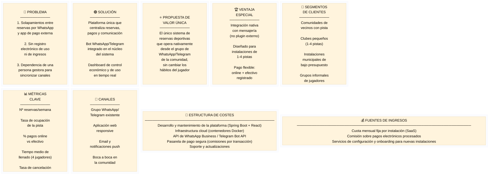
```mermaid
%%{init: {'theme': 'base', 'themeVariables': {'fontSize': '14px'}}}%%
block-beta
  columns 5

  block:problema:1
    P["🔴 PROBLEMA
    ────────────
    1. Solapamientos entre
    reservas por WhatsApp
    y app de pago externa
    
    2. Sin registro
    electrónico de uso
    ni de ingresos
    
    3. Dependencia de una
    persona gestora para
    sincronizar canales"]
  end

  block:solucion:1
    S["🟢 SOLUCIÓN
    ────────────
    Plataforma única que
    centraliza reservas,
    pagos y comunicación
    
    Bot WhatsApp/Telegram
    integrado en el núcleo
    del sistema
    
    Dashboard de control
    económico y de uso
    en tiempo real"]
  end

  block:pvunico:1
    PVU["⭐ PROPUESTA DE
    VALOR ÚNICA
    ────────────
    El único sistema de
    reservas deportivas
    que opera nativamente
    desde el grupo de
    WhatsApp/Telegram
    de la comunidad,
    sin cambiar los
    hábitos del jugador"]
  end

  block:ventaja:1
    V["🏆 VENTAJA
    ESPECIAL
    ────────────
    Integración nativa
    con mensajería
    (no plugin externo)
    
    Diseñado para
    instalaciones de
    1-4 pistas
    
    Pago flexible:
    online + efectivo
    registrado"]
  end

  block:segmentos:1
    SEG["👥 SEGMENTOS
    DE CLIENTES
    ────────────
    Comunidades de
    vecinos con pista
    
    Clubes pequeños
    (1-4 pistas)
    
    Instalaciones
    municipales de
    bajo presupuesto
    
    Grupos informales
    de jugadores"]
  end

  block:metricas:1
    M["📊 MÉTRICAS
    CLAVE
    ────────────
    Nº reservas/semana
    
    Tasa de ocupación
    de la pista
    
    % pagos online
    vs efectivo
    
    Tiempo medio de
    llenado (4 jugadores)
    
    Tasa de cancelación"]
  end

  block:canales:1
    C["📣 CANALES
    ────────────
    Grupo WhatsApp/
    Telegram existente
    
    Aplicación web
    responsive
    
    Email y
    notificaciones push
    
    Boca a boca en
    la comunidad"]
  end

  block:costes:2
    CO["💸 ESTRUCTURA DE COSTES
    ────────────────────────────────────────────────────
    Desarrollo y mantenimiento de la plataforma (Spring Boot + React)
    Infraestructura cloud (contenedores Docker)
    API de WhatsApp Business / Telegram Bot API
    Pasarela de pago segura (comisiones por transacción)
    Soporte y actualizaciones"]
  end

  block:ingresos:3
    I["💰 FUENTES DE INGRESOS
    ──────────────────────────────────────────────────────────────────────
    Cuota mensual fija por instalación (SaaS)
    Comisión sobre pagos electrónicos procesados
    Servicios de configuración y onboarding para nuevas instalaciones"]
  end
```

---

> **Nota:** Los puntos 4 a 8 del documento (Modelo de datos, Especificación de la API, Historias de usuario, Tickets de trabajo y Pull requests) se desarrollarán en las siguientes fases del proyecto.

---

## 2. PRD – Casos de Uso Principales

### 2.0 Visión General de Casos de Uso

Los tres casos de uso principales del sistema son los flujos críticos que cubren el ciclo completo de vida de una reserva: su **creación**, la posibilidad de que otros usuarios se **incorporen** a ella y su **pago**. Estos tres flujos están clasificados con cobertura de pruebas obligatoria del 100%.

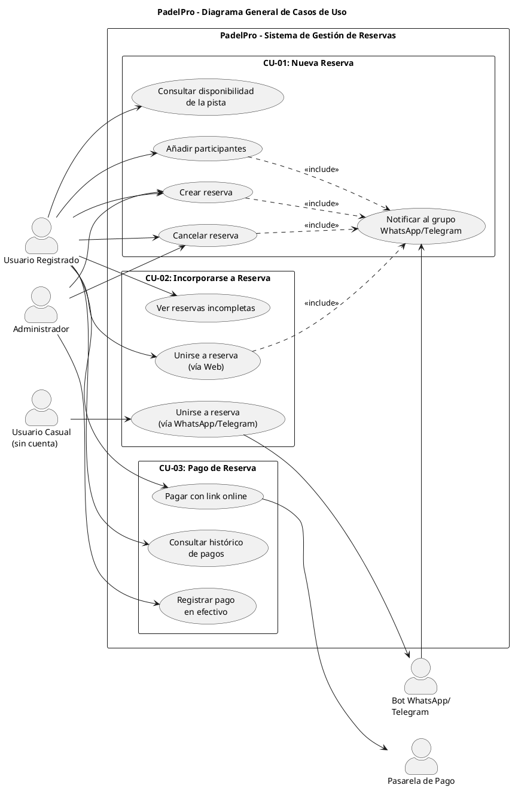
```plantuml
@startuml DiagramaGeneralCasosDeUso
title PadelPro – Diagrama General de Casos de Uso

left to right direction
skinparam packageStyle rectangle
skinparam actorStyle awesome

actor "Usuario Registrado" as U
actor "Usuario Casual\n(sin cuenta)" as UC
actor "Administrador" as A
actor "Pasarela de Pago" as PP
actor "Bot WhatsApp/\nTelegram" as BOT

rectangle "PadelPro – Sistema de Gestión de Reservas" {

  rectangle "CU-01: Nueva Reserva" {
    usecase "Consultar disponibilidad\nde la pista" as CU01a
    usecase "Crear reserva" as CU01b
    usecase "Cancelar reserva" as CU01c
    usecase "Añadir participantes" as CU01d
    usecase "Notificar al grupo\nWhatsApp/Telegram" as CU01e
  }

  rectangle "CU-02: Incorporarse a Reserva" {
    usecase "Ver reservas incompletas" as CU02a
    usecase "Unirse a reserva\n(vía Web)" as CU02b
    usecase "Unirse a reserva\n(vía WhatsApp/Telegram)" as CU02c
  }

  rectangle "CU-03: Pago de Reserva" {
    usecase "Pagar con link online" as CU03a
    usecase "Registrar pago\nen efectivo" as CU03b
    usecase "Consultar histórico\nde pagos" as CU03c
  }
}

U --> CU01a
U --> CU01b
U --> CU01c
U --> CU01d
CU01b ..> CU01e : <<include>>
CU01d ..> CU01e : <<include>>
CU01c ..> CU01e : <<include>>

U --> CU02a
U --> CU02b
UC --> CU02c
CU02b ..> CU01e : <<include>>
CU02c --> BOT

U --> CU03a
U --> CU03c
CU03a --> PP
A --> CU03b

BOT --> CU01e
A --> CU01b
A --> CU01c

@enduml
```

---

### 2.1 CU-01 – Nueva Reserva

#### 2.1.1 Descripción del Caso de Uso

| Campo | Detalle |
|---|---|
| **ID** | CU-01 |
| **Nombre** | Nueva Reserva |
| **Versión** | 1.0 |
| **Prioridad** | Alta |
| **Módulo** | Web + Mensajería (WhatsApp/Telegram) |
| **Descripción** | Permite a un usuario registrado crear una reserva de la pista seleccionando una franja horaria libre, indicando la duración y añadiendo participantes. El sistema publica automáticamente la reserva en el grupo de mensajería. |

#### 2.1.2 Actores

| Actor | Rol |
|---|---|
| **Usuario Registrado** | Actor principal. Inicia y confirma la reserva. Es el titular y responsable del pago. |
| **Administrador** | Puede crear y cancelar reservas desde el panel de administración. |
| **Sistema de Reservas** | Verifica disponibilidad, registra la reserva y gestiona el estado. |
| **Bot WhatsApp/Telegram** | Publica y actualiza el mensaje de reserva en el grupo. |

#### 2.1.3 Precondiciones

- El usuario está autenticado en la plataforma web.
- La franja horaria seleccionada está libre (sin solapamiento con otras reservas).
- La duración seleccionada está entre 1 hora y 3 horas, en intervalos de 30 minutos.

#### 2.1.4 Postcondiciones

- La reserva queda registrada en el sistema con estado **Confirmada**.
- El pago queda asignado al usuario titular de la reserva.
- Se publica un mensaje en el grupo WhatsApp/Telegram con los participantes y huecos libres.

#### 2.1.5 Flujo Principal

| Paso | Actor | Acción |
|---|---|---|
| 1 | Usuario | Accede a la sección **"Nueva Reserva"** desde su perfil. |
| 2 | Sistema | Muestra el calendario con las franjas horarias **libres** y **ocupadas** del día/semana. |
| 3 | Usuario | Selecciona la **fecha** y la **hora de inicio**. |
| 4 | Usuario | Selecciona la **duración** (mínimo 1h, intervalos de 30 min, máximo 3h). |
| 5 | Sistema | Verifica en tiempo real que la franja no está ocupada. |
| 6 | Usuario | Añade los **nombres de los participantes** (hasta 4; pueden ser externos no registrados). |
| 7 | Usuario | Pulsa **"Confirmar Reserva"**. |
| 8 | Sistema | Registra la reserva, asigna el pago al titular y genera el identificador único de reserva. |
| 9 | Sistema/Bot | Publica en el grupo WhatsApp/Telegram el mensaje de reserva con participantes y huecos vacíos. |
| 10 | Sistema | Muestra confirmación al usuario con resumen de la reserva. |

#### 2.1.6 Flujos Alternativos

| ID | Condición | Pasos alternativos |
|---|---|---|
| FA-01 | Franja horaria ocupada (paso 5) | Sistema muestra aviso de no disponibilidad y propone franjas cercanas libres. El flujo retorna al paso 3. |
| FA-02 | Menos de 4 participantes (paso 6) | La reserva se crea con huecos vacíos. El mensaje publicado en el grupo muestra los huecos sin nombre para que otros jugadores se unan. |
| FA-03 | Cancelación dentro del periodo permitido | La reserva pasa a estado **Cancelada** y el pago asignado se anula. El grupo recibe notificación de cancelación. |
| FA-04 | Cancelación fuera del periodo configurado | La reserva pasa a estado **Pendiente de Pago** y el pago no se cancela automáticamente. El administrador gestiona el caso. |
| FA-05 | Reserva vía WhatsApp/Telegram (flujo crítico) | El usuario envía al grupo: `reserva de pista DD/MM/AA HH:MM duración`. El sistema verifica disponibilidad, envía código OTP al WhatsApp personal del usuario, y tras confirmación registra la reserva. Publica el mensaje de confirmación en el grupo. |

#### 2.1.7 Reglas de Negocio

- **RN-01:** Solo se puede reservar en horas libres. No se permiten solapamientos.
- **RN-02:** Duración mínima: 1 hora. Duración máxima: 3 horas. Intervalos de 30 minutos.
- **RN-03:** Máximo 4 participantes por reserva.
- **RN-04:** El titular de la reserva es el único responsable del pago, independientemente de cuántos participantes se unan.
- **RN-05:** El periodo de cancelación sin coste es configurable por el administrador (en horas de antelación).
- **RN-06:** Toda reserva creada genera automáticamente un mensaje en el grupo de mensajería.
- **RN-07:** La confirmación de reserva vía WhatsApp requiere validación OTP.

#### 2.1.8 Requisitos No Funcionales

- El calendario de disponibilidad debe actualizarse en **tiempo real** (sin recargar página).
- La publicación en el grupo WhatsApp/Telegram debe producirse en menos de **5 segundos** tras la confirmación.
- El sistema debe soportar la confirmación OTP con un tiempo de expiración máximo de **10 minutos**.
- Todas las acciones deben quedar registradas en el **log de auditoría**.

#### 2.1.9 Diagrama UML – CU-01

**Flujo Web — Crear y Cancelar Reserva**

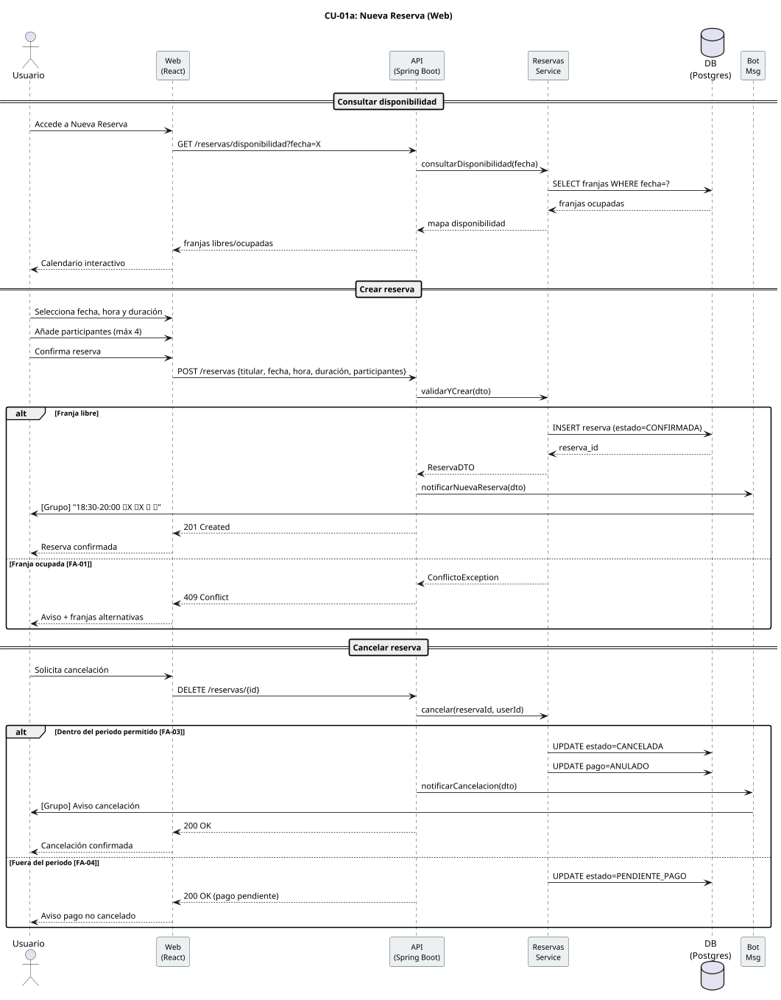
```plantuml
@startuml CU-01-Web
title CU-01a: Nueva Reserva (Web)
scale 0.85

skinparam sequenceArrowThickness 1
skinparam sequenceParticipantFontSize 12
skinparam sequenceMessageFontSize 11
skinparam roundcorner 5
skinparam sequenceParticipantBackgroundColor #ECF0F1
skinparam sequenceParticipantBorderColor #2C3E50

actor Usuario as U
participant "Web\n(React)" as W
participant "API\n(Spring Boot)" as API
participant "Reservas\nService" as SR
database "DB\n(Postgres)" as DB
participant "Bot\nMsg" as BOT

== Consultar disponibilidad ==
U -> W: Accede a Nueva Reserva
W -> API: GET /reservas/disponibilidad?fecha=X
API -> SR: consultarDisponibilidad(fecha)
SR -> DB: SELECT franjas WHERE fecha=?
DB --> SR: franjas ocupadas
SR --> API: mapa disponibilidad
API --> W: franjas libres/ocupadas
W --> U: Calendario interactivo

== Crear reserva ==
U -> W: Selecciona fecha, hora y duración
U -> W: Añade participantes (máx 4)
U -> W: Confirma reserva
W -> API: POST /reservas {titular, fecha, hora, duración, participantes}
API -> SR: validarYCrear(dto)

alt Franja libre
    SR -> DB: INSERT reserva (estado=CONFIRMADA)
    DB --> SR: reserva_id
    SR --> API: ReservaDTO
    API -> BOT: notificarNuevaReserva(dto)
    BOT -> U: [Grupo] "18:30-20:00 🎾X 🎾X 🎾 🎾"
    API --> W: 201 Created
    W --> U: Reserva confirmada
else Franja ocupada [FA-01]
    SR --> API: ConflictoException
    API --> W: 409 Conflict
    W --> U: Aviso + franjas alternativas
end

== Cancelar reserva ==
U -> W: Solicita cancelación
W -> API: DELETE /reservas/{id}
API -> SR: cancelar(reservaId, userId)

alt Dentro del periodo permitido [FA-03]
    SR -> DB: UPDATE estado=CANCELADA
    SR -> DB: UPDATE pago=ANULADO
    API -> BOT: notificarCancelacion(dto)
    BOT -> U: [Grupo] Aviso cancelación
    API --> W: 200 OK
    W --> U: Cancelación confirmada
else Fuera del periodo [FA-04]
    SR -> DB: UPDATE estado=PENDIENTE_PAGO
    API --> W: 200 OK (pago pendiente)
    W --> U: Aviso pago no cancelado
end
@enduml
```

**Flujo WhatsApp/Telegram — Reserva con OTP (Flujo Crítico)**

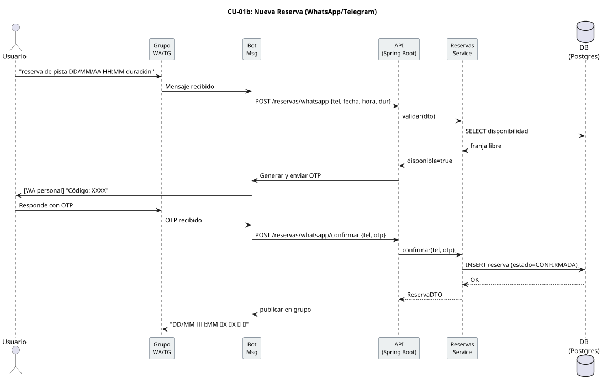
```plantuml
@startuml CU-01-WhatsApp
title CU-01b: Nueva Reserva (WhatsApp/Telegram)
scale 0.85

skinparam sequenceArrowThickness 1
skinparam sequenceParticipantFontSize 12
skinparam sequenceMessageFontSize 11
skinparam roundcorner 5
skinparam sequenceParticipantBackgroundColor #ECF0F1
skinparam sequenceParticipantBorderColor #2C3E50

actor Usuario as U
participant "Grupo\nWA/TG" as G
participant "Bot\nMsg" as BOT
participant "API\n(Spring Boot)" as API
participant "Reservas\nService" as SR
database "DB\n(Postgres)" as DB

U -> G: "reserva de pista DD/MM/AA HH:MM duración"
G -> BOT: Mensaje recibido
BOT -> API: POST /reservas/whatsapp {tel, fecha, hora, dur}
API -> SR: validar(dto)
SR -> DB: SELECT disponibilidad
DB --> SR: franja libre

SR --> API: disponible=true
API -> BOT: Generar y enviar OTP
BOT -> U: [WA personal] "Código: XXXX"

U -> G: Responde con OTP
G -> BOT: OTP recibido
BOT -> API: POST /reservas/whatsapp/confirmar {tel, otp}
API -> SR: confirmar(tel, otp)
SR -> DB: INSERT reserva (estado=CONFIRMADA)
DB --> SR: OK
SR --> API: ReservaDTO
API -> BOT: publicar en grupo
BOT -> G: "DD/MM HH:MM 🎾X 🎾X 🎾 🎾"
@enduml
```

---

### 2.2 CU-02 – Incorporarse a una Reserva Existente

#### 2.2.1 Descripción del Caso de Uso

| Campo | Detalle |
|---|---|
| **ID** | CU-02 |
| **Nombre** | Incorporarse a una Reserva Existente |
| **Versión** | 1.0 |
| **Prioridad** | Alta |
| **Módulo** | Web + Mensajería (WhatsApp/Telegram) |
| **Descripción** | Permite a un usuario (registrado o casual sin cuenta) unirse como participante a una reserva ya creada que aún tiene huecos disponibles. Puede hacerse desde la web o respondiendo al mensaje del grupo de mensajería. |

#### 2.2.2 Actores

| Actor | Rol |
|---|---|
| **Usuario Registrado** | Se une a la reserva desde la web o desde el grupo de mensajería. |
| **Usuario Casual (sin cuenta)** | Se une respondiendo al mensaje del grupo sin necesitar cuenta en la plataforma. |
| **Sistema de Reservas** | Valida la disponibilidad del hueco y actualiza la reserva. |
| **Bot WhatsApp/Telegram** | Lee la respuesta del usuario casual y actualiza el mensaje en el grupo. |

#### 2.2.3 Precondiciones

- Existe al menos una reserva en la semana actual con huecos disponibles (menos de 4 participantes).
- Para el canal web: el usuario está autenticado.
- Para el canal WhatsApp/Telegram: el usuario responde al mensaje del grupo con el formato correcto.

#### 2.2.4 Postcondiciones

- El usuario queda registrado como participante en la reserva seleccionada.
- El mensaje en el grupo WhatsApp/Telegram se actualiza reflejando el nuevo participante.

#### 2.2.5 Flujo Principal (Canal Web)

| Paso | Actor | Acción |
|---|---|---|
| 1 | Usuario | Accede a **"Incluirse en una reserva"** desde su perfil. |
| 2 | Sistema | Muestra el calendario de la semana actual con las reservas que tienen huecos disponibles. |
| 3 | Usuario | Selecciona la reserva en la que desea participar. |
| 4 | Sistema | Verifica que la reserva sigue teniendo huecos disponibles. |
| 5 | Sistema | Registra al usuario como nuevo participante en la reserva. |
| 6 | Sistema/Bot | Actualiza el mensaje en el grupo WhatsApp/Telegram con el nombre del nuevo participante. |
| 7 | Sistema | Muestra confirmación al usuario. |

#### 2.2.6 Flujo Alternativo (Canal WhatsApp/Telegram)

| Paso | Actor | Acción |
|---|---|---|
| 1 | Usuario Casual | Ve el mensaje de reserva en el grupo con huecos vacíos (🎾 sin nombre). |
| 2 | Usuario Casual | Copia el mensaje y añade su nombre en el hueco vacío. Responde en el grupo. |
| 3 | Bot | Lee el mensaje de respuesta e identifica el nombre añadido en el hueco. |
| 4 | Sistema | Valida que el hueco sigue disponible y registra al participante. |
| 5 | Bot | Actualiza el mensaje del grupo con el nombre del nuevo participante. |

#### 2.2.7 Reglas de Negocio

- **RN-08:** Solo se muestran reservas con huecos disponibles en la semana en curso.
- **RN-09:** El usuario casual (sin cuenta) solo puede incorporarse vía WhatsApp/Telegram; no tiene acceso a la web.
- **RN-10:** Si entre el paso 3 y el paso 5 otro usuario ocupa el último hueco, el sistema informa al usuario y le redirige a otras reservas disponibles.
- **RN-11:** El participante incorporado no adquiere responsabilidad de pago; este sigue siendo del titular de la reserva.

#### 2.2.8 Requisitos No Funcionales

- La lista de reservas incompletas debe mostrarse actualizada en tiempo real.
- El bot debe procesar la respuesta del usuario casual y actualizar la reserva en menos de **5 segundos**.
- El sistema debe manejar correctamente las condiciones de carrera (dos usuarios intentando ocupar el último hueco simultáneamente).

#### 2.2.9 Diagrama UML – CU-02

**Flujo Web — Unirse a una reserva con hueco**

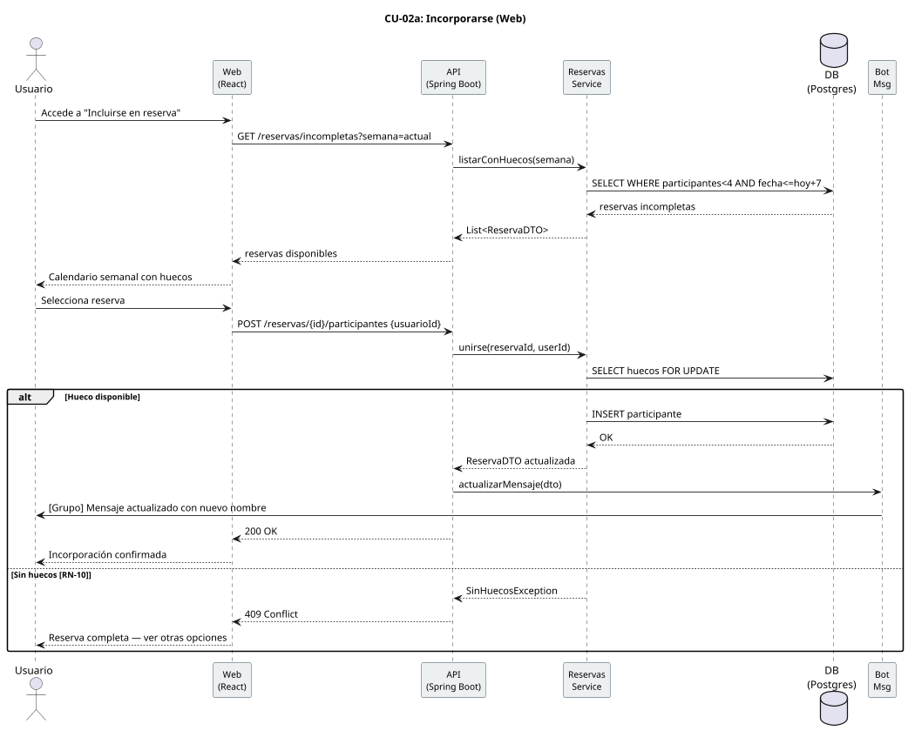
```plantuml
@startuml CU-02-Web
title CU-02a: Incorporarse (Web)
scale 0.85

skinparam sequenceArrowThickness 1
skinparam sequenceParticipantFontSize 12
skinparam sequenceMessageFontSize 11
skinparam roundcorner 5
skinparam sequenceParticipantBackgroundColor #ECF0F1
skinparam sequenceParticipantBorderColor #2C3E50

actor Usuario as U
participant "Web\n(React)" as W
participant "API\n(Spring Boot)" as API
participant "Reservas\nService" as SR
database "DB\n(Postgres)" as DB
participant "Bot\nMsg" as BOT

U -> W: Accede a "Incluirse en reserva"
W -> API: GET /reservas/incompletas?semana=actual
API -> SR: listarConHuecos(semana)
SR -> DB: SELECT WHERE participantes<4 AND fecha<=hoy+7
DB --> SR: reservas incompletas
SR --> API: List<ReservaDTO>
API --> W: reservas disponibles
W --> U: Calendario semanal con huecos

U -> W: Selecciona reserva
W -> API: POST /reservas/{id}/participantes {usuarioId}
API -> SR: unirse(reservaId, userId)
SR -> DB: SELECT huecos FOR UPDATE

alt Hueco disponible
    SR -> DB: INSERT participante
    DB --> SR: OK
    SR --> API: ReservaDTO actualizada
    API -> BOT: actualizarMensaje(dto)
    BOT -> U: [Grupo] Mensaje actualizado con nuevo nombre
    API --> W: 200 OK
    W --> U: Incorporación confirmada
else Sin huecos [RN-10]
    SR --> API: SinHuecosException
    API --> W: 409 Conflict
    W --> U: Reserva completa — ver otras opciones
end
@enduml
```

**Flujo WhatsApp/Telegram — Usuario casual sin cuenta**

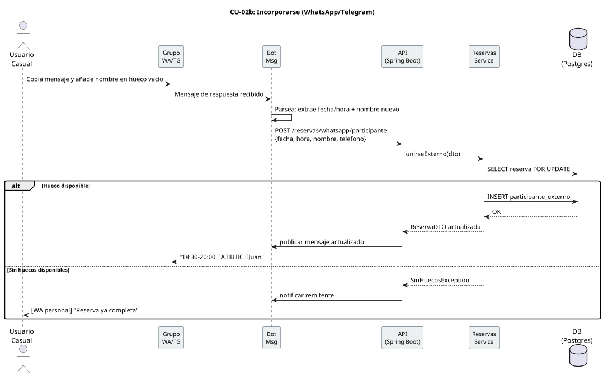
```plantuml
@startuml CU-02-WhatsApp
title CU-02b: Incorporarse (WhatsApp/Telegram)
scale 0.85

skinparam sequenceArrowThickness 1
skinparam sequenceParticipantFontSize 12
skinparam sequenceMessageFontSize 11
skinparam roundcorner 5
skinparam sequenceParticipantBackgroundColor #ECF0F1
skinparam sequenceParticipantBorderColor #2C3E50

actor "Usuario\nCasual" as UC
participant "Grupo\nWA/TG" as G
participant "Bot\nMsg" as BOT
participant "API\n(Spring Boot)" as API
participant "Reservas\nService" as SR
database "DB\n(Postgres)" as DB

UC -> G: Copia mensaje y añade nombre en hueco vacío
G -> BOT: Mensaje de respuesta recibido
BOT -> BOT: Parsea: extrae fecha/hora + nombre nuevo
BOT -> API: POST /reservas/whatsapp/participante\n{fecha, hora, nombre, telefono}
API -> SR: unirseExterno(dto)
SR -> DB: SELECT reserva FOR UPDATE

alt Hueco disponible
    SR -> DB: INSERT participante_externo
    DB --> SR: OK
    SR --> API: ReservaDTO actualizada
    API -> BOT: publicar mensaje actualizado
    BOT -> G: "18:30-20:00 🎾A 🎾B 🎾C 🎾Juan"
else Sin huecos disponibles
    SR --> API: SinHuecosException
    API -> BOT: notificar remitente
    BOT -> UC: [WA personal] "Reserva ya completa"
end
@enduml
```

---

### 2.3 CU-03 – Pago de Reserva

#### 2.3.1 Descripción del Caso de Uso

| Campo | Detalle |
|---|---|
| **ID** | CU-03 |
| **Nombre** | Pago de Reserva |
| **Versión** | 1.0 |
| **Prioridad** | Alta |
| **Módulo** | Web + Administración + Mensajería |
| **Descripción** | Permite al titular de una reserva abonar el importe correspondiente, ya sea mediante un link de pago electrónico seguro o en efectivo al administrador. El administrador puede registrar los pagos en efectivo y consultar el histórico de ingresos. |

#### 2.3.2 Actores

| Actor | Rol |
|---|---|
| **Usuario Titular** | Actor principal. Es el responsable del pago de la reserva que ha creado. |
| **Administrador** | Registra pagos en efectivo y gestiona el estado de los pagos. |
| **Pasarela de Pago** | Procesa el pago online mediante link seguro configurado por el banco. |
| **Bot WhatsApp/Telegram** | Envía el link de pago al WhatsApp personal del titular. |
| **Sistema de Reservas** | Gestiona los estados de pago y registra los ingresos. |

#### 2.3.3 Precondiciones

- Existe una reserva asociada al usuario titular con estado **Confirmada** o **Pendiente de Pago**.
- El link de pago electrónico ha sido configurado por el administrador.

#### 2.3.4 Postcondiciones

- La reserva queda en estado **Pagada**.
- El ingreso queda registrado en el sistema con fecha, importe y método de pago.
- El histórico del usuario refleja la reserva como pagada.

#### 2.3.5 Flujo Principal A – Pago Online (Link de Pago)

| Paso | Actor | Acción |
|---|---|---|
| 1 | Sistema/Bot | Tras confirmar la reserva, envía el link de pago seguro al WhatsApp personal del titular. |
| 2 | Usuario Titular | Accede al link o a la sección **"Pago de Reserva"** en la web. |
| 3 | Sistema | Muestra las reservas pendientes de pago del usuario. |
| 4 | Usuario | Selecciona la reserva y pulsa **"Pagar"**. |
| 5 | Sistema | Redirige al usuario a la pasarela de pago segura. |
| 6 | Usuario | Completa el pago en la pasarela. |
| 7 | Pasarela | Notifica al sistema la confirmación del pago (webhook). |
| 8 | Sistema | Actualiza la reserva a estado **Pagada** y registra el ingreso. |
| 9 | Sistema | Notifica al usuario la confirmación del pago. |

#### 2.3.6 Flujo Principal B – Pago en Efectivo (vía Administrador)

| Paso | Actor | Acción |
|---|---|---|
| 1 | Usuario | Entrega el pago en efectivo al administrador. |
| 2 | Administrador | Accede al panel **"Administración de Reservas"**. |
| 3 | Administrador | Busca y selecciona la reserva correspondiente. |
| 4 | Administrador | Marca la reserva como **"Pagada en efectivo"**. |
| 5 | Sistema | Actualiza el estado de la reserva a **Pagada** y registra el ingreso con método = EFECTIVO. |
| 6 | Sistema | El histórico del usuario refleja la reserva como pagada. |

#### 2.3.7 Reglas de Negocio

- **RN-12:** Solo el titular de la reserva es responsable del pago, independientemente del número de participantes.
- **RN-13:** Si la reserva se cancela dentro del periodo permitido, el pago se anula automáticamente.
- **RN-14:** Si la reserva se cancela fuera del periodo permitido, el pago permanece como **Pendiente de Pago**.
- **RN-15:** El link de pago electrónico es seguro, único por reserva y está configurado por el banco/administrador.
- **RN-16:** El pago puede realizarse en cualquier momento desde la confirmación de la reserva.
- **RN-17:** El administrador es el único que puede registrar pagos en efectivo.
- **RN-18:** Cada ingreso registrado (online o efectivo) queda auditado con usuario, fecha, importe y método.

#### 2.3.8 Requisitos No Funcionales

- El link de pago debe ser un enlace **seguro (HTTPS)** con token único e intransferible.
- El webhook de confirmación de la pasarela debe procesarse en menos de **3 segundos**.
- Todos los registros de pago deben incluir entrada en el **log de auditoría**.
- El histórico de pagos debe ser consultable por rango de fechas y por estado (pagado / pendiente).

#### 2.3.9 Diagrama UML – CU-03

**Flujo A — Pago online mediante link seguro**

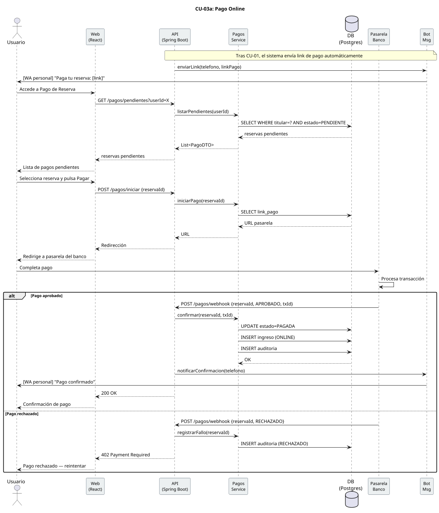
```plantuml
@startuml CU-03-Online
title CU-03a: Pago Online
scale 0.85

skinparam sequenceArrowThickness 1
skinparam sequenceParticipantFontSize 12
skinparam sequenceMessageFontSize 11
skinparam roundcorner 5
skinparam sequenceParticipantBackgroundColor #ECF0F1
skinparam sequenceParticipantBorderColor #2C3E50

actor Usuario as U
participant "Web\n(React)" as W
participant "API\n(Spring Boot)" as API
participant "Pagos\nService" as PS
database "DB\n(Postgres)" as DB
participant "Pasarela\nBanco" as PP
participant "Bot\nMsg" as BOT

note over API, BOT: Tras CU-01, el sistema envía link de pago automáticamente
API -> BOT: enviarLink(telefono, linkPago)
BOT -> U: [WA personal] "Paga tu reserva: [link]"

U -> W: Accede a Pago de Reserva
W -> API: GET /pagos/pendientes?userId=X
API -> PS: listarPendientes(userId)
PS -> DB: SELECT WHERE titular=? AND estado=PENDIENTE
DB --> PS: reservas pendientes
PS --> API: List<PagoDTO>
API --> W: reservas pendientes
W --> U: Lista de pagos pendientes

U -> W: Selecciona reserva y pulsa Pagar
W -> API: POST /pagos/iniciar {reservaId}
API -> PS: iniciarPago(reservaId)
PS -> DB: SELECT link_pago
DB --> PS: URL pasarela
PS --> API: URL
API --> W: Redirección
W --> U: Redirige a pasarela del banco

U -> PP: Completa pago
PP -> PP: Procesa transacción

alt Pago aprobado
    PP -> API: POST /pagos/webhook {reservaId, APROBADO, txId}
    API -> PS: confirmar(reservaId, txId)
    PS -> DB: UPDATE estado=PAGADA
    PS -> DB: INSERT ingreso (ONLINE)
    PS -> DB: INSERT auditoria
    DB --> PS: OK
    API -> BOT: notificarConfirmacion(telefono)
    BOT -> U: [WA personal] "Pago confirmado"
    API --> W: 200 OK
    W --> U: Confirmación de pago
else Pago rechazado
    PP -> API: POST /pagos/webhook {reservaId, RECHAZADO}
    API -> PS: registrarFallo(reservaId)
    PS -> DB: INSERT auditoria (RECHAZADO)
    API --> W: 402 Payment Required
    W --> U: Pago rechazado — reintentar
end
@enduml
```

**Flujo B — Pago en efectivo registrado por el administrador**

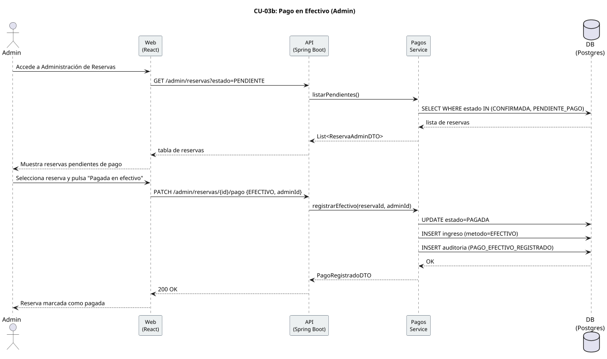
```plantuml
@startuml CU-03-Efectivo
title CU-03b: Pago en Efectivo (Admin)
scale 0.85

skinparam sequenceArrowThickness 1
skinparam sequenceParticipantFontSize 12
skinparam sequenceMessageFontSize 11
skinparam roundcorner 5
skinparam sequenceParticipantBackgroundColor #ECF0F1
skinparam sequenceParticipantBorderColor #2C3E50

actor Admin as A
participant "Web\n(React)" as W
participant "API\n(Spring Boot)" as API
participant "Pagos\nService" as PS
database "DB\n(Postgres)" as DB

A -> W: Accede a Administración de Reservas
W -> API: GET /admin/reservas?estado=PENDIENTE
API -> PS: listarPendientes()
PS -> DB: SELECT WHERE estado IN (CONFIRMADA, PENDIENTE_PAGO)
DB --> PS: lista de reservas
PS --> API: List<ReservaAdminDTO>
API --> W: tabla de reservas
W --> A: Muestra reservas pendientes de pago

A -> W: Selecciona reserva y pulsa "Pagada en efectivo"
W -> API: PATCH /admin/reservas/{id}/pago {EFECTIVO, adminId}
API -> PS: registrarEfectivo(reservaId, adminId)
PS -> DB: UPDATE estado=PAGADA
PS -> DB: INSERT ingreso (metodo=EFECTIVO)
PS -> DB: INSERT auditoria (PAGO_EFECTIVO_REGISTRADO)
DB --> PS: OK
PS --> API: PagoRegistradoDTO
API --> W: 200 OK
W --> A: Reserva marcada como pagada
@enduml
```

---

> **Nota:** Los puntos 4 a 8 del documento (Modelo de datos, Especificación de la API, Historias de usuario, Tickets de trabajo y Pull requests) se desarrollarán en las siguientes fases del proyecto.

---

## 3. Arquitectura del Sistema

### 3.1 Diagrama de Contexto del Sistema — C4 Level 1

> Vista de más alto nivel: PadelPro como caja negra, los actores que la usan y los sistemas externos con los que se integra en v1.0.

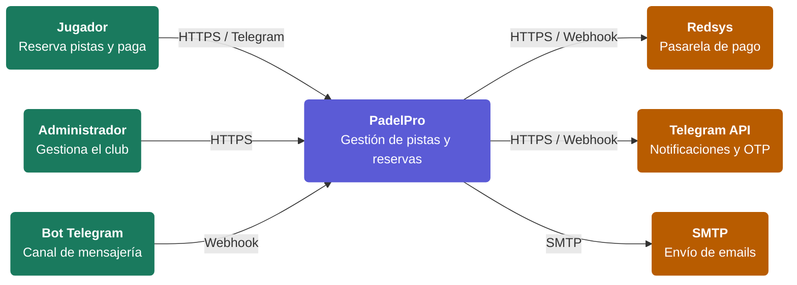
```mermaid
graph LR
    J("<b>Jugador</b><br/>Reserva pistas y paga"):::persona
    A("<b>Administrador</b><br/>Gestiona el club"):::persona
    B("<b>Bot Telegram</b><br/>Canal de mensajería"):::persona

    PP("<b>PadelPro</b><br/>Gestión de pistas y reservas"):::system

    R("<b>Redsys</b><br/>Pasarela de pago"):::external
    T("<b>Telegram API</b><br/>Notificaciones y OTP"):::external
    S("<b>SMTP</b><br/>Envío de emails"):::external

    J -->|HTTPS / Telegram| PP
    A -->|HTTPS| PP
    B -->|Webhook| PP
    PP -->|HTTPS / Webhook| R
    PP -->|HTTPS / Webhook| T
    PP -->|SMTP| S

    classDef persona  fill:#1a7a5e,stroke:#1a7a5e,color:#fff
    classDef system   fill:#5b5bd6,stroke:#5b5bd6,color:#fff
    classDef external fill:#b85c00,stroke:#b85c00,color:#fff
```

| Símbolo | Significado |
|---|---|
| 🟩 Verde | Personas / actores que interactúan con el sistema |
| 🟦 Azul-violeta | Sistema PadelPro (caja negra en este nivel) |
| 🟧 Naranja | Sistemas externos de los que depende PadelPro |

---

### 3.2 Visión General del Sistema

El backend de PadelPro se construye sobre **Arquitectura Hexagonal** (Ports & Adapters), combinada con un despliegue en **tres capas físicas** (Presentación → Backend → Datos) sobre contenedores Docker en entorno **On-Premise**. Esta decisión arquitectónica es especialmente adecuada para este sistema porque:

- Existen **múltiples canales de entrada** (API REST desde la web, Webhooks de Telegram como canal principal) que deben converger en el mismo dominio de negocio sin contaminar su lógica.
- Existen **múltiples adaptadores de salida** (PostgreSQL, Telegram Bot API, Redsys como pasarela de pago por defecto, SMTP) que deben ser intercambiables sin modificar el núcleo del negocio. La arquitectura hexagonal permite sustituir o añadir adaptadores (ej. incorporar WhatsApp Business API en una fase futura) sin tocar el dominio.
- El requisito de **cobertura de tests del 80%+** con TDD/BDD exige que el dominio sea 100% testeable de forma aislada, sin dependencias de infraestructura.

**Decisiones técnicas confirmadas para v1.0:**

| Decisión | Elección v1.0 | Notas |
|---|---|---|
| Canal de mensajería | **Telegram Bot API** | Gratuito, sin aprobaciones. WhatsApp Business API previsto para v2. |
| Pasarela de pago | **Redsys** (default) | Configurable por el administrador. Estándar bancario en España. |
| Despliegue | **On-Premise** | Servidor propio del cliente. Docker Compose sobre Linux. |
| Alcance instalaciones | **Una sola pista** | Sin multi-tenancy en v1.0. Arquitectura preparada para escalar. |

La comunicación entre el frontend y el backend es exclusivamente a través de una **API REST** documentada con OpenAPI/Swagger.

El sistema está diseñado bajo los siguientes principios:
- **Arquitectura Hexagonal:** el dominio de negocio es el centro; los adaptadores lo rodean y nunca al revés.
- **Separación de responsabilidades:** cada capa tiene un rol claro y no invade el de otra.
- **Seguridad por capas:** autenticación JWT, cifrado de contraseñas BCrypt, OTP por Telegram para operaciones críticas y registro de auditoría completo.
- **Observabilidad:** todas las acciones de usuario quedan registradas en un log de auditoría persistente en base de datos.
- **Despliegue On-Premise:** Docker Compose sobre servidor local del cliente, sin dependencia de proveedores cloud.

---

### 3.3 Diagrama de Arquitectura General — C4 Level 2

**Vista simplificada — contenedores y sistemas externos:**

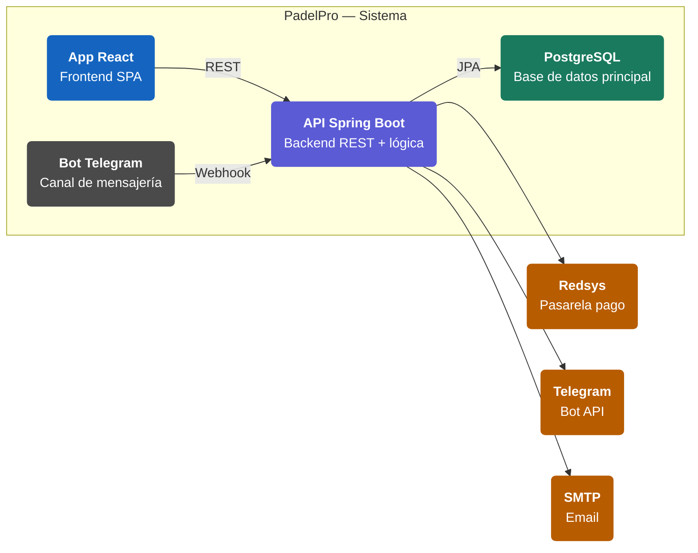
```mermaid
graph LR
    subgraph SYS["PadelPro — Sistema"]
        REACT("<b>App React</b><br/>Frontend SPA"):::int_blue
        API("<b>API Spring Boot</b><br/>Backend REST + lógica"):::int_purple
        DB("<b>PostgreSQL</b><br/>Base de datos principal"):::int_teal
        BOT("<b>Bot Telegram</b><br/>Canal de mensajería"):::int_dark
    end

    REDSYS("<b>Redsys</b><br/>Pasarela pago"):::ext
    TG("<b>Telegram</b><br/>Bot API"):::ext
    SMTP_NODE("<b>SMTP</b><br/>Email"):::ext

    REACT  -->|REST| API
    BOT    -->|Webhook| API
    API    -->|JPA| DB
    API    --> REDSYS
    API    --> TG
    API    --> SMTP_NODE

    classDef int_blue   fill:#1565C0,stroke:#1565C0,color:#fff
    classDef int_purple fill:#5b5bd6,stroke:#5b5bd6,color:#fff
    classDef int_teal   fill:#1a7a5e,stroke:#1a7a5e,color:#fff
    classDef int_dark   fill:#4a4a4a,stroke:#4a4a4a,color:#fff
    classDef ext        fill:#b85c00,stroke:#b85c00,color:#fff
```

**Vista detallada — capas internas y flujos de comunicación:**

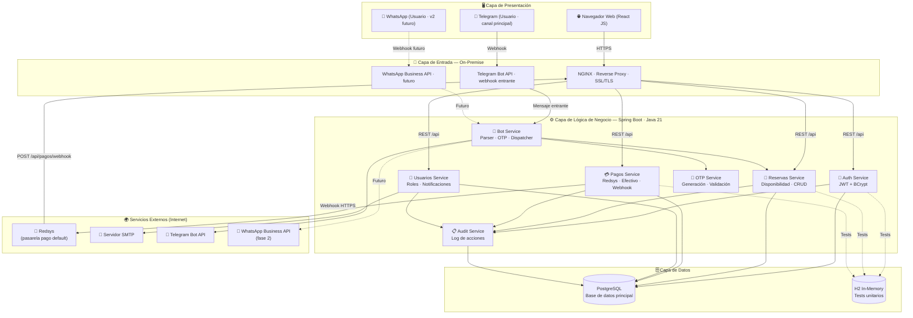
```mermaid
graph TB
    subgraph CLIENTES["🖥️ Capa de Presentación"]
        BROWSER["🌐 Navegador Web (React JS)"]
        TG["📱 Telegram (Usuario · canal principal)"]
        WA["📱 WhatsApp (Usuario · v2 futuro)"]
    end

    subgraph GATEWAY["🔀 Capa de Entrada — On-Premise"]
        NGINX["NGINX · Reverse Proxy · SSL/TLS"]
        TGAPI["Telegram Bot API · webhook entrante"]
        WAAPI["WhatsApp Business API · futuro"]
    end

    subgraph BACKEND["⚙️ Capa de Lógica de Negocio — Spring Boot · Java 21"]
        AUTH["🔐 Auth Service\nJWT + BCrypt"]
        RESERVAS["📅 Reservas Service\nDisponibilidad · CRUD"]
        PAGOS["💳 Pagos Service\nRedsys · Efectivo · Webhook"]
        USUARIOS["👤 Usuarios Service\nRoles · Notificaciones"]
        BOT["🤖 Bot Service\nParser · OTP · Dispatcher"]
        AUDIT["📋 Audit Service\nLog de acciones"]
        OTP["🔑 OTP Service\nGeneración · Validación"]
    end

    subgraph DATOS["🗄️ Capa de Datos"]
        PG[("PostgreSQL\nBase de datos principal")]
        H2[("H2 In-Memory\nTests unitarios")]
    end

    subgraph EXTERNOS["🌍 Servicios Externos (Internet)"]
        REDSYS["🏦 Redsys\n(pasarela pago default)"]
        SMTP["📧 Servidor SMTP"]
        TGEXT["📲 Telegram Bot API"]
        WAEXT["📲 WhatsApp Business API\n(fase 2)"]
    end

    BROWSER -->|HTTPS| NGINX
    TG -->|Webhook| TGAPI
    WA -.->|Webhook futuro| WAAPI

    NGINX -->|REST /api| AUTH
    NGINX -->|REST /api| RESERVAS
    NGINX -->|REST /api| PAGOS
    NGINX -->|REST /api| USUARIOS

    TGAPI -->|Mensaje entrante| BOT
    WAAPI -.->|Futuro| BOT

    AUTH --> PG
    RESERVAS --> PG
    PAGOS --> PG
    USUARIOS --> PG
    BOT --> RESERVAS
    BOT --> OTP
    AUDIT --> PG

    AUTH --> AUDIT
    RESERVAS --> AUDIT
    PAGOS --> AUDIT
    USUARIOS --> AUDIT

    PAGOS -->|Webhook HTTPS| REDSYS
    REDSYS -->|"POST /api/pagos/webhook"| NGINX
    USUARIOS --> SMTP
    BOT --> TGEXT
    BOT -.->|Futuro| WAEXT

    AUTH -.->|Tests| H2
    RESERVAS -.->|Tests| H2
    PAGOS -.->|Tests| H2
```

---

### 3.4 Arquitectura Hexagonal por Módulos — C4 Level 3

#### 3.4.1 Definición de Módulos y Capas Internas

El backend se divide en **6 módulos** alineados con los contextos de negocio. Cada módulo aplica internamente **cuatro capas** siguiendo la arquitectura hexagonal completa:

```
┌─────────────────────────────────────────────────────────┐
│  INFRASTRUCTURE  ←──────────────────────────────────    │
│  Adaptadores Primarios    Adaptadores Secundarios        │
│  (Controllers, Webhooks)  (JPA, API clients, SMTP)      │
│        │                          ▲                      │
│        ▼                          │                      │
│  ┌─────────────────────────────────────────────────┐    │
│  │  APPLICATION                                     │    │
│  │  *ApplicationService implements UseCase          │    │
│  │  @Transactional · Orquesta dominio y puertos    │    │
│  │        │                     │                   │    │
│  │        ▼                     ▼                   │    │
│  │  ┌───────────────────────────────────────────┐  │    │
│  │  │  DOMAIN                                   │  │    │
│  │  │  Entities · Value Objects                 │  │    │
│  │  │  Domain Services (reglas puras)           │  │    │
│  │  │  port/inbound  «UseCase interfaces»       │  │    │
│  │  │  port/outbound «Repository/Service ports» │  │    │
│  │  └───────────────────────────────────────────┘  │    │
│  └─────────────────────────────────────────────────┘    │
└─────────────────────────────────────────────────────────┘
```

**¿Por qué cuatro capas y no tres?**

| Capa | Qué contiene | Qué NO contiene |
|---|---|---|
| **Domain** | Entidades con reglas de negocio puras (`Reserva.calcularImporte()`, `Reserva.puedeSerCancelada()`). Interfaces de puertos inbound/outbound. Domain Services sin dependencias externas. | `@Transactional`, llamadas a repositorios, llamadas a APIs externas |
| **Application** | `*ApplicationService` que implementan los puertos inbound (UseCase). Orquesta entidades, llama a puertos outbound, gestiona `@Transactional`. | Lógica de negocio pura (vive en Domain), detalles de HTTP o JPA |
| **Infrastructure (inbound)** | Controllers REST, Webhook adapters. Mapean requests HTTP/mensajes al Command/Query que la Application entiende. | Lógica de negocio, acceso a datos |
| **Infrastructure (outbound)** | JPA adapters, API clients (Telegram, Redsys, SMTP). Implementan los puertos outbound definidos en Domain. | Lógica de negocio, lógica de aplicación |

**Módulos del sistema:**

| Módulo | Responsabilidad | Tipo |
|---|---|---|
| **reservas** | Gestión del ciclo de vida de reservas y participantes | Negocio core |
| **pagos** | Procesamiento de pagos online y registro de efectivo | Negocio core |
| **usuarios** | Gestión de usuarios, autenticación y autorización | Negocio core |
| **mensajeria** | Integración con Telegram (v1) y WhatsApp (v2 futuro) | Canal / Infraestructura |
| **otp** | Generación y validación de códigos OTP para operaciones críticas | Seguridad transversal |
| **auditoria** | Registro inmutable de todas las acciones del sistema | Transversal |
| **shared** | Configuración Spring, seguridad JWT, DTOs comunes | Infraestructura compartida |

**Regla de dependencias entre módulos:**
```
reservas  ──uses──▶  mensajeria · auditoria
pagos     ──uses──▶  mensajeria · auditoria
usuarios  ──uses──▶  mensajeria · auditoria · otp
mensajeria──uses──▶  otp
```
> La capa Application de cada módulo solo depende de interfaces (puertos definidos en Domain). Nunca de implementaciones concretas de otro módulo.

---

#### 3.4.2 Mapa de Módulos

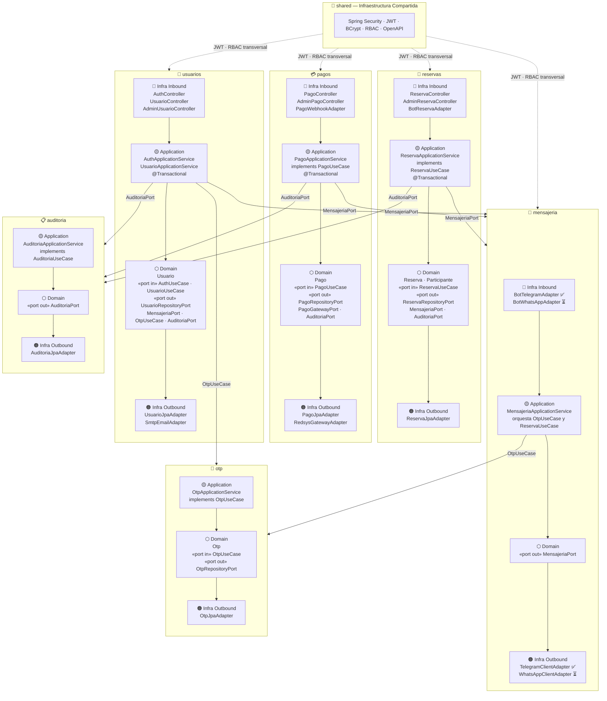
```mermaid
graph TB
    subgraph SHARED["🔧 shared — Infraestructura Compartida"]
        SEC["Spring Security · JWT · BCrypt · RBAC · OpenAPI"]
    end

    subgraph MOD_R["📅 reservas"]
        direction TB
        R_IN["🔵 Infra Inbound\nReservaController\nAdminReservaController\nBotReservaAdapter"]
        R_APP["🟡 Application\nReservaApplicationService\nimplements ReservaUseCase\n@Transactional"]
        R_DOM["⬡ Domain\nReserva · Participante\n«port in» ReservaUseCase\n«port out» ReservaRepositoryPort\nMensajeriaPort · AuditoriaPort"]
        R_OUT["🟠 Infra Outbound\nReservaJpaAdapter"]
        R_IN --> R_APP --> R_DOM --> R_OUT
    end

    subgraph MOD_P["💳 pagos"]
        direction TB
        P_IN["🔵 Infra Inbound\nPagoController\nAdminPagoController\nPagoWebhookAdapter"]
        P_APP["🟡 Application\nPagoApplicationService\nimplements PagoUseCase\n@Transactional"]
        P_DOM["⬡ Domain\nPago\n«port in» PagoUseCase\n«port out» PagoRepositoryPort\nPagoGatewayPort · AuditoriaPort"]
        P_OUT["🟠 Infra Outbound\nPagoJpaAdapter\nRedsysGatewayAdapter"]
        P_IN --> P_APP --> P_DOM --> P_OUT
    end

    subgraph MOD_U["👤 usuarios"]
        direction TB
        U_IN["🔵 Infra Inbound\nAuthController\nUsuarioController\nAdminUsuarioController"]
        U_APP["🟡 Application\nAuthApplicationService\nUsuarioApplicationService\n@Transactional"]
        U_DOM["⬡ Domain\nUsuario\n«port in» AuthUseCase · UsuarioUseCase\n«port out» UsuarioRepositoryPort\nMensajeriaPort · OtpUseCase · AuditoriaPort"]
        U_OUT["🟠 Infra Outbound\nUsuarioJpaAdapter\nSmtpEmailAdapter"]
        U_IN --> U_APP --> U_DOM --> U_OUT
    end

    subgraph MOD_M["📲 mensajeria"]
        direction TB
        M_IN["🔵 Infra Inbound\nBotTelegramAdapter ✅\nBotWhatsAppAdapter ⏳"]
        M_APP["🟡 Application\nMensajeriaApplicationService\norquesta OtpUseCase y ReservaUseCase"]
        M_DOM["⬡ Domain\n«port out» MensajeriaPort"]
        M_OUT["🟠 Infra Outbound\nTelegramClientAdapter ✅\nWhatsAppClientAdapter ⏳"]
        M_IN --> M_APP --> M_DOM --> M_OUT
    end

    subgraph MOD_O["🔑 otp"]
        direction TB
        O_APP["🟡 Application\nOtpApplicationService\nimplements OtpUseCase"]
        O_DOM["⬡ Domain\nOtp\n«port in» OtpUseCase\n«port out» OtpRepositoryPort"]
        O_OUT["🟠 Infra Outbound\nOtpJpaAdapter"]
        O_APP --> O_DOM --> O_OUT
    end

    subgraph MOD_A["📋 auditoria"]
        direction TB
        A_APP["🟡 Application\nAuditoriaApplicationService\nimplements AuditoriaUseCase"]
        A_DOM["⬡ Domain\n«port out» AuditoriaPort"]
        A_OUT["🟠 Infra Outbound\nAuditoriaJpaAdapter"]
        A_APP --> A_DOM --> A_OUT
    end

    SHARED -.->|JWT · RBAC transversal| MOD_R & MOD_P & MOD_U & MOD_M

    R_APP -->|MensajeriaPort| MOD_M
    R_APP -->|AuditoriaPort| MOD_A
    P_APP -->|MensajeriaPort| MOD_M
    P_APP -->|AuditoriaPort| MOD_A
    U_APP -->|MensajeriaPort| MOD_M
    U_APP -->|AuditoriaPort| MOD_A
    U_APP -->|OtpUseCase| MOD_O
    M_APP -->|OtpUseCase| MOD_O
```

---

#### 3.4.3 Diagrama Hexagonal por Módulo

**Módulo `reservas`**

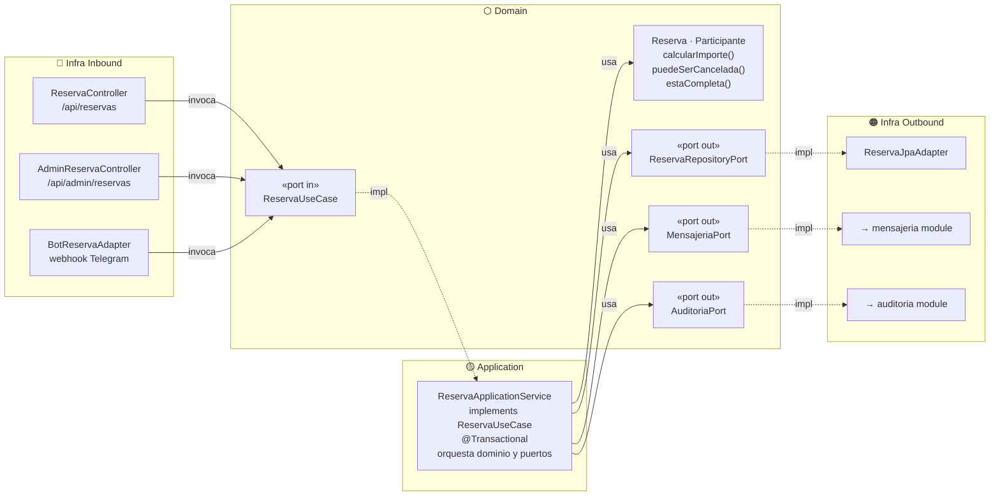
```mermaid
graph LR
    subgraph R_INFRA_IN["🔵 Infra Inbound"]
        RC["ReservaController\n/api/reservas"]
        ARC["AdminReservaController\n/api/admin/reservas"]
        BRA["BotReservaAdapter\nwebhook Telegram"]
    end
    subgraph R_APP["🟡 Application"]
        RAS["ReservaApplicationService\nimplements ReservaUseCase\n@Transactional\norquesta dominio y puertos"]
    end
    subgraph R_DOM["⬡ Domain"]
        RUC["«port in»\nReservaUseCase"]
        RE["Reserva · Participante\ncalcularImporte()\npuedeSerCancelada()\nestaCompleta()"]
        RRP["«port out»\nReservaRepositoryPort"]
        RMP["«port out»\nMensajeriaPort"]
        RAP["«port out»\nAuditoriaPort"]
    end
    subgraph R_INFRA_OUT["🟠 Infra Outbound"]
        RJPA["ReservaJpaAdapter"]
        RMSG["→ mensajeria module"]
        RAUD["→ auditoria module"]
    end
    RC & ARC & BRA -->|invoca| RUC
    RUC -.->|impl| RAS
    RAS -->|usa| RE
    RAS -->|usa| RRP & RMP & RAP
    RRP -.->|impl| RJPA
    RMP -.->|impl| RMSG
    RAP -.->|impl| RAUD
```

**Módulo `pagos`**

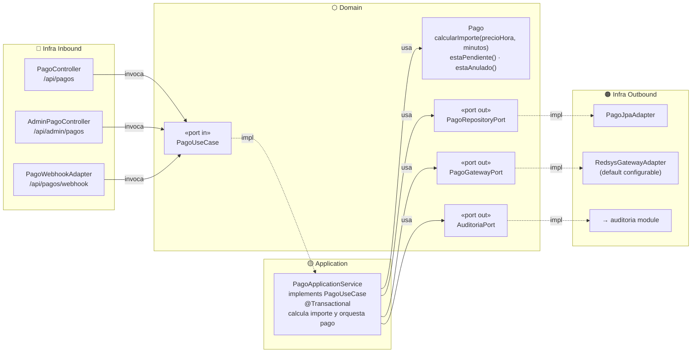
```mermaid
graph LR
    subgraph P_INFRA_IN["🔵 Infra Inbound"]
        PC["PagoController\n/api/pagos"]
        APC["AdminPagoController\n/api/admin/pagos"]
        PWA["PagoWebhookAdapter\n/api/pagos/webhook"]
    end
    subgraph P_APP["🟡 Application"]
        PAS["PagoApplicationService\nimplements PagoUseCase\n@Transactional\ncalcula importe y orquesta pago"]
    end
    subgraph P_DOM["⬡ Domain"]
        PUC["«port in»\nPagoUseCase"]
        PE["Pago\ncalcularImporte(precioHora, minutos)\nestaPendiente() · estaAnulado()"]
        PRP["«port out»\nPagoRepositoryPort"]
        PGP["«port out»\nPagoGatewayPort"]
        PAP["«port out»\nAuditoriaPort"]
    end
    subgraph P_INFRA_OUT["🟠 Infra Outbound"]
        PJPA["PagoJpaAdapter"]
        PGA["RedsysGatewayAdapter\n(default configurable)"]
        PAUD["→ auditoria module"]
    end
    PC & APC & PWA -->|invoca| PUC
    PUC -.->|impl| PAS
    PAS -->|usa| PE
    PAS -->|usa| PRP & PGP & PAP
    PRP -.->|impl| PJPA
    PGP -.->|impl| PGA
    PAP -.->|impl| PAUD
```

**Módulo `usuarios`**

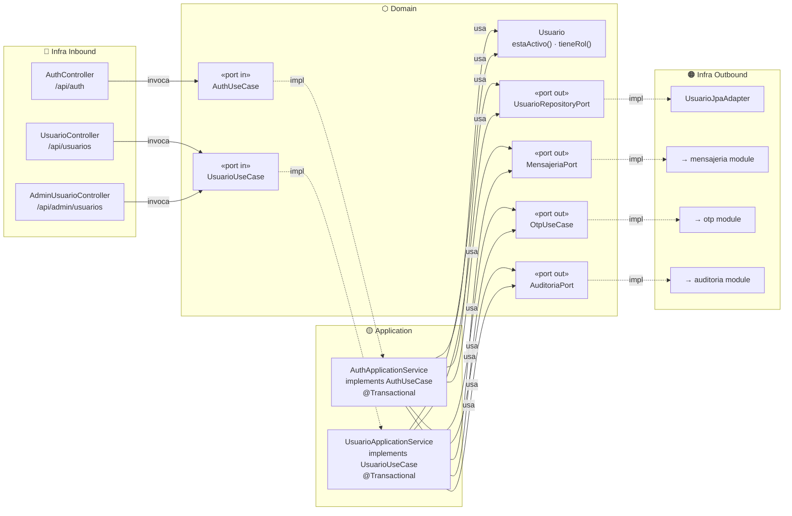
```mermaid
graph LR
    subgraph U_INFRA_IN["🔵 Infra Inbound"]
        AC["AuthController\n/api/auth"]
        UC["UsuarioController\n/api/usuarios"]
        AUC["AdminUsuarioController\n/api/admin/usuarios"]
    end
    subgraph U_APP["🟡 Application"]
        AAS["AuthApplicationService\nimplements AuthUseCase\n@Transactional"]
        UAS["UsuarioApplicationService\nimplements UsuarioUseCase\n@Transactional"]
    end
    subgraph U_DOM["⬡ Domain"]
        AUI["«port in»\nAuthUseCase"]
        UUI["«port in»\nUsuarioUseCase"]
        UE["Usuario\nestaActivo() · tieneRol()"]
        URP["«port out»\nUsuarioRepositoryPort"]
        UMP["«port out»\nMensajeriaPort"]
        UOP["«port out»\nOtpUseCase"]
        UAP["«port out»\nAuditoriaPort"]
    end
    subgraph U_INFRA_OUT["🟠 Infra Outbound"]
        UJPA["UsuarioJpaAdapter"]
        UMSG["→ mensajeria module"]
        UOTP["→ otp module"]
        UAUD["→ auditoria module"]
    end
    AC -->|invoca| AUI
    UC & AUC -->|invoca| UUI
    AUI -.->|impl| AAS
    UUI -.->|impl| UAS
    AAS & UAS -->|usa| UE
    AAS & UAS -->|usa| URP & UMP & UOP & UAP
    URP -.->|impl| UJPA
    UMP -.->|impl| UMSG
    UOP -.->|impl| UOTP
    UAP -.->|impl| UAUD
```

**Módulo `mensajeria`**

> Canal principal: **Telegram Bot API** ✅ v1.0. WhatsApp Business API ⏳ v2 futuro — el puerto `MensajeriaPort` permite añadir el adaptador sin modificar dominio ni application.

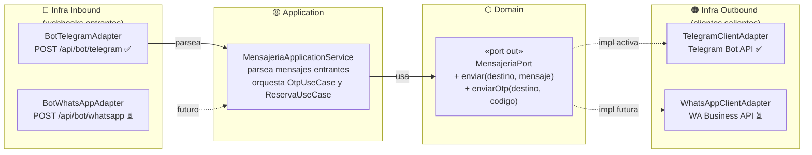
```mermaid
graph LR
    subgraph M_INFRA_IN["🔵 Infra Inbound\n(webhooks entrantes)"]
        BTA["BotTelegramAdapter\nPOST /api/bot/telegram ✅"]
        BWA["BotWhatsAppAdapter\nPOST /api/bot/whatsapp ⏳"]
    end
    subgraph M_APP["🟡 Application"]
        MAS["MensajeriaApplicationService\nparsea mensajes entrantes\norquesta OtpUseCase y ReservaUseCase"]
    end
    subgraph M_DOM["⬡ Domain"]
        MP["«port out»\nMensajeriaPort\n+ enviar(destino, mensaje)\n+ enviarOtp(destino, codigo)"]
    end
    subgraph M_INFRA_OUT["🟠 Infra Outbound\n(clientes salientes)"]
        TGC["TelegramClientAdapter\nTelegram Bot API ✅"]
        WAC["WhatsAppClientAdapter\nWA Business API ⏳"]
    end
    BTA -->|parsea| MAS
    BWA -.->|futuro| MAS
    MAS -->|usa| MP
    MP -.->|impl activa| TGC
    MP -.->|impl futura| WAC
```

**Módulos transversales `otp` y `auditoria`**

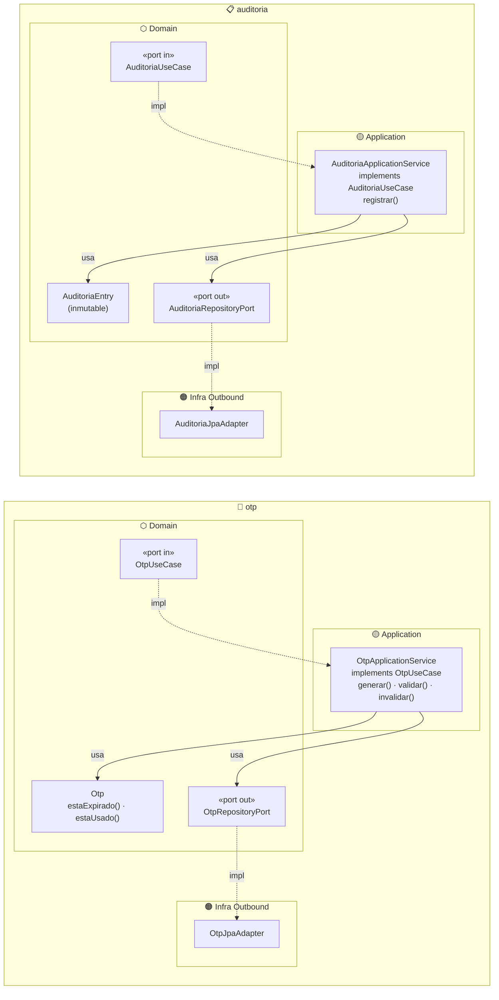
```mermaid
graph LR
    subgraph MOD_OTP["🔑 otp"]
        subgraph OTP_APP["🟡 Application"]
            OAS["OtpApplicationService\nimplements OtpUseCase\ngenerar() · validar() · invalidar()"]
        end
        subgraph OTP_DOM["⬡ Domain"]
            OUC["«port in»\nOtpUseCase"]
            OE["Otp\nestaExpirado() · estaUsado()"]
            ORP["«port out»\nOtpRepositoryPort"]
        end
        subgraph OTP_OUT["🟠 Infra Outbound"]
            OJPA["OtpJpaAdapter"]
        end
        OUC -.->|impl| OAS
        OAS -->|usa| OE & ORP
        ORP -.->|impl| OJPA
    end

    subgraph MOD_AUD["📋 auditoria"]
        subgraph AUD_APP["🟡 Application"]
            AAS2["AuditoriaApplicationService\nimplements AuditoriaUseCase\nregistrar()"]
        end
        subgraph AUD_DOM["⬡ Domain"]
            AUC2["«port in»\nAuditoriaUseCase"]
            AE["AuditoriaEntry\n(inmutable)"]
            ARP["«port out»\nAuditoriaRepositoryPort"]
        end
        subgraph AUD_OUT["🟠 Infra Outbound"]
            AJPA["AuditoriaJpaAdapter"]
        end
        AUC2 -.->|impl| AAS2
        AAS2 -->|usa| AE & ARP
        ARP -.->|impl| AJPA
    end
```

---

#### 3.4.4 Estructura de Paquetes por Módulo

```
com.padelpro
│
├── reservas/
│   ├── domain/
│   │   ├── model/
│   │   │   ├── Reserva.java                           ← entidad: calcularImporte(), puedeSerCancelada(), estaCompleta()
│   │   │   └── Participante.java                      ← value object
│   │   ├── port/
│   │   │   ├── inbound/
│   │   │   │   └── ReservaUseCase.java                ← interfaz del puerto primario
│   │   │   └── outbound/
│   │   │       ├── ReservaRepositoryPort.java
│   │   │       ├── MensajeriaPort.java                ← ref al módulo mensajeria
│   │   │       └── AuditoriaPort.java                 ← ref al módulo auditoria
│   │   └── service/
│   │       └── ReservaDisponibilidadService.java      ← domain service: solo reglas puras, sin @Transactional
│   ├── application/
│   │   └── service/
│   │       └── ReservaApplicationService.java         ← implements ReservaUseCase, @Transactional
│   └── infrastructure/
│       ├── adapter/
│       │   ├── inbound/
│       │   │   ├── web/
│       │   │   │   ├── ReservaController.java
│       │   │   │   ├── AdminReservaController.java
│       │   │   │   └── dto/
│       │   │   └── messaging/
│       │   │       └── BotReservaAdapter.java
│       │   └── outbound/
│       │       └── persistence/
│       │           ├── ReservaJpaAdapter.java
│       │           └── entity/
│       │               └── ReservaEntity.java
│       └── config/
│           └── ReservaConfig.java
│
├── pagos/
│   ├── domain/
│   │   ├── model/
│   │   │   └── Pago.java                             ← entidad: calcularImporte(), estaPendiente(), estaAnulado()
│   │   ├── port/
│   │   │   ├── inbound/
│   │   │   │   └── PagoUseCase.java
│   │   │   └── outbound/
│   │   │       ├── PagoRepositoryPort.java
│   │   │       ├── PagoGatewayPort.java
│   │   │       └── AuditoriaPort.java
│   │   └── service/
│   │       └── PagoCalculoService.java               ← domain service: reglas de cálculo puras
│   ├── application/
│   │   └── service/
│   │       └── PagoApplicationService.java           ← implements PagoUseCase, @Transactional
│   └── infrastructure/
│       ├── adapter/
│       │   ├── inbound/
│       │   │   ├── web/
│       │   │   │   ├── PagoController.java
│       │   │   │   └── AdminPagoController.java
│       │   │   └── webhook/
│       │   │       └── PagoWebhookAdapter.java
│       │   └── outbound/
│       │       ├── persistence/
│       │       │   ├── PagoJpaAdapter.java
│       │       │   └── entity/
│       │       │       └── PagoEntity.java
│       │       └── payment/
│       │           └── RedsysGatewayAdapter.java     ← implements PagoGatewayPort (HMAC SHA-256)
│       └── config/
│           └── PagoConfig.java
│
├── usuarios/
│   ├── domain/
│   │   ├── model/
│   │   │   └── Usuario.java                          ← entidad: estaActivo(), tieneRol()
│   │   ├── port/
│   │   │   ├── inbound/
│   │   │   │   ├── AuthUseCase.java
│   │   │   │   └── UsuarioUseCase.java
│   │   │   └── outbound/
│   │   │       ├── UsuarioRepositoryPort.java
│   │   │       ├── MensajeriaPort.java
│   │   │       ├── OtpUseCase.java                   ← ref al módulo otp
│   │   │       └── AuditoriaPort.java
│   │   └── service/
│   │       └── PasswordPolicyService.java            ← domain service: validación de políticas de contraseña
│   ├── application/
│   │   └── service/
│   │       ├── AuthApplicationService.java           ← implements AuthUseCase, @Transactional
│   │       └── UsuarioApplicationService.java        ← implements UsuarioUseCase, @Transactional
│   └── infrastructure/
│       ├── adapter/
│       │   ├── inbound/
│       │   │   └── web/
│       │   │       ├── AuthController.java
│       │   │       ├── UsuarioController.java
│       │   │       └── AdminUsuarioController.java
│       │   └── outbound/
│       │       ├── persistence/
│       │       │   ├── UsuarioJpaAdapter.java
│       │       │   └── entity/
│       │       │       └── UsuarioEntity.java
│       │       └── email/
│       │           └── SmtpEmailAdapter.java
│       └── config/
│           └── UsuarioConfig.java
│
├── mensajeria/
│   ├── domain/
│   │   └── port/
│   │       └── MensajeriaPort.java                   ← puerto compartido: enviar(), enviarOtp()
│   ├── application/
│   │   └── service/
│   │       └── MensajeriaApplicationService.java     ← parsea mensajes entrantes, orquesta OtpUseCase y ReservaUseCase
│   └── infrastructure/
│       ├── adapter/
│       │   ├── inbound/
│       │   │   ├── BotTelegramAdapter.java            ← webhook POST /api/bot/telegram ✅
│       │   │   └── BotWhatsAppAdapter.java            ← webhook POST /api/bot/whatsapp ⏳ v2
│       │   └── outbound/
│       │       ├── TelegramClientAdapter.java         ← implements MensajeriaPort ✅
│       │       └── WhatsAppClientAdapter.java         ← implements MensajeriaPort ⏳ v2
│       └── config/
│           └── MensajeriaConfig.java
│
├── otp/
│   ├── domain/
│   │   ├── model/
│   │   │   └── Otp.java                              ← entidad: estaExpirado(), estaUsado()
│   │   └── port/
│   │       ├── inbound/
│   │       │   └── OtpUseCase.java                   ← generar(), validar(), invalidar()
│   │       └── outbound/
│   │           └── OtpRepositoryPort.java
│   ├── application/
│   │   └── service/
│   │       └── OtpApplicationService.java            ← implements OtpUseCase, TTL 10 min, 3 tipos OTP
│   └── infrastructure/
│       └── adapter/
│           └── outbound/
│               ├── OtpJpaAdapter.java
│               └── entity/
│                   └── OtpEntity.java
│
├── auditoria/
│   ├── domain/
│   │   ├── model/
│   │   │   └── AuditoriaEntry.java                   ← value object inmutable
│   │   └── port/
│   │       ├── inbound/
│   │       │   └── AuditoriaUseCase.java             ← registrar()
│   │       └── outbound/
│   │           └── AuditoriaRepositoryPort.java
│   ├── application/
│   │   └── service/
│   │       └── AuditoriaApplicationService.java      ← implements AuditoriaUseCase
│   └── infrastructure/
│       └── adapter/
│           └── outbound/
│               ├── AuditoriaJpaAdapter.java
│               └── entity/
│                   └── AuditoriaEntity.java
│
└── shared/
    ├── config/
    │   ├── SecurityConfig.java                       ← JWT, BCrypt, RBAC global
    │   └── SwaggerConfig.java
    ├── security/
    │   ├── JwtFilter.java
    │   └── JwtProvider.java
    └── exception/
        └── GlobalExceptionHandler.java
```

---

#### 3.4.5 Diagrama de Clases — C4 Level 4 · Módulo `reservas`

> El módulo `reservas` es el más representativo del sistema y sirve de **plantilla de implementación** para el resto de módulos.

**Vista de componentes — Puertos y Adaptadores:**

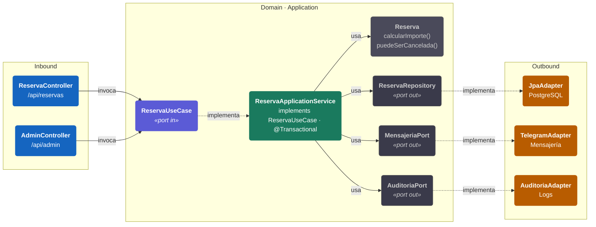
```mermaid
graph LR
    subgraph IN["Inbound"]
        RC("<b>ReservaController</b><br/>/api/reservas"):::inbound
        AC("<b>AdminController</b><br/>/api/admin"):::inbound
    end

    subgraph DOM["Domain · Application"]
        RUC("<b>ReservaUseCase</b><br/><i>«port in»</i>"):::port_in
        RE("<b>Reserva</b><br/>calcularImporte()<br/>puedeSerCancelada()"):::entity
        RRP("<b>ReservaRepository</b><br/><i>«port out»</i>"):::port_out
        MP("<b>MensajeriaPort</b><br/><i>«port out»</i>"):::port_out
        AP("<b>AuditoriaPort</b><br/><i>«port out»</i>"):::port_out
        RAS("<b>ReservaApplicationService</b><br/>implements ReservaUseCase · @Transactional"):::app
    end

    subgraph OUT["Outbound"]
        JPA("<b>JpaAdapter</b><br/>PostgreSQL"):::outbound
        TGA("<b>TelegramAdapter</b><br/>Mensajería"):::outbound
        AUDA("<b>AuditoriaAdapter</b><br/>Logs"):::outbound
    end

    RC  -->|invoca| RUC
    AC  -->|invoca| RUC
    RUC -.->|implementa| RAS
    RAS -->|usa| RE
    RAS -->|usa| RRP
    RAS -->|usa| MP
    RAS -->|usa| AP
    RRP -.->|implementa| JPA
    MP  -.->|implementa| TGA
    AP  -.->|implementa| AUDA

    classDef inbound  fill:#1565C0,stroke:#1565C0,color:#fff
    classDef port_in  fill:#5b5bd6,stroke:#5b5bd6,color:#fff
    classDef entity   fill:#4a4a5a,stroke:#555,color:#ccc
    classDef port_out fill:#3a3a4a,stroke:#555,color:#ccc
    classDef app      fill:#1a7a5e,stroke:#1a7a5e,color:#fff
    classDef outbound fill:#b85c00,stroke:#b85c00,color:#fff
```

> `→ invoca` — llamada directa &nbsp;&nbsp;&nbsp; `- - → implementa` — el adaptador implementa el puerto

---

**Diagrama A — Modelo de Dominio y Puertos** *(detalle de clases)*

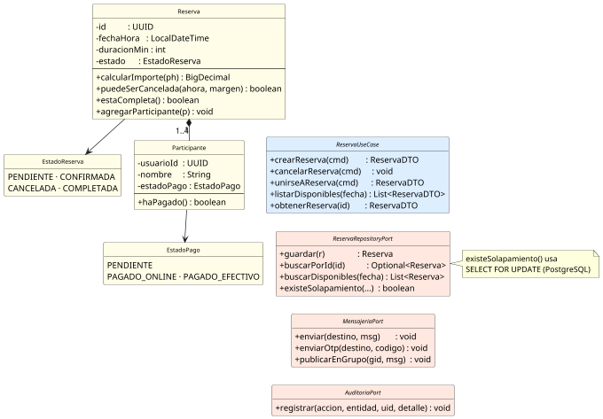
```plantuml
@startuml reservas-domain-ports
scale max 680 width
skinparam classAttributeIconSize 0
skinparam classFontSize 10
skinparam packageFontSize 10
skinparam nodesep 20
skinparam ranksep 30
hide empty members
hide circle

' ── Entidades ──────────────────────────────
class Reserva #FFFDE7 {
    - id          : UUID
    - fechaHora   : LocalDateTime
    - duracionMin : int
    - estado      : EstadoReserva
    --
    + calcularImporte(ph) : BigDecimal
    + puedeSerCancelada(ahora, margen) : boolean
    + estaCompleta() : boolean
    + agregarParticipante(p) : void
}
class Participante #FFFDE7 {
    - usuarioId  : UUID
    - nombre     : String
    - estadoPago : EstadoPago
    --
    + haPagado() : boolean
}
enum EstadoReserva #FFFDE7 {
    PENDIENTE · CONFIRMADA
    CANCELADA · COMPLETADA
}
enum EstadoPago #FFFDE7 {
    PENDIENTE
    PAGADO_ONLINE · PAGADO_EFECTIVO
}

' ── Puerto primario ────────────────────────
interface ReservaUseCase #DDEEFF {
    + crearReserva(cmd)        : ReservaDTO
    + cancelarReserva(cmd)     : void
    + unirseAReserva(cmd)      : ReservaDTO
    + listarDisponibles(fecha) : List<ReservaDTO>
    + obtenerReserva(id)       : ReservaDTO
}

' ── Puertos secundarios ────────────────────
interface ReservaRepositoryPort #FFE8E0 {
    + guardar(r)               : Reserva
    + buscarPorId(id)          : Optional<Reserva>
    + buscarDisponibles(fecha) : List<Reserva>
    + existeSolapamiento(...)  : boolean
}
interface MensajeriaPort #FFE8E0 {
    + enviar(destino, msg)       : void
    + enviarOtp(destino, codigo) : void
    + publicarEnGrupo(gid, msg)  : void
}
interface AuditoriaPort #FFE8E0 {
    + registrar(accion, entidad, uid, detalle) : void
}

' ── Relaciones de dominio ──────────────────
Reserva "1" *-- "1..4" Participante
Reserva      --> EstadoReserva
Participante --> EstadoPago

' ── Apilado vertical forzado ──────────────
Reserva               -[hidden]down-> ReservaUseCase
ReservaUseCase        -[hidden]down-> ReservaRepositoryPort
ReservaRepositoryPort -[hidden]down-> MensajeriaPort
MensajeriaPort        -[hidden]down-> AuditoriaPort
EstadoReserva         -[hidden]right-> Participante

note right of ReservaRepositoryPort
    existeSolapamiento() usa
    SELECT FOR UPDATE (PostgreSQL)
end note

@enduml
```

---

**Diagrama B — Capa Application e Infraestructura**

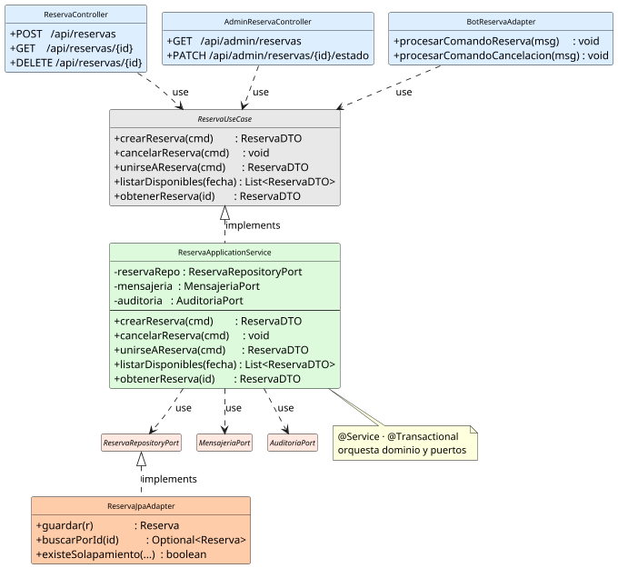
```plantuml
@startuml reservas-application-infra
scale max 680 width
skinparam classAttributeIconSize 0
skinparam classFontSize 10
skinparam packageFontSize 10
skinparam nodesep 20
skinparam ranksep 30
hide empty members
hide circle

' ── Infra Inbound (agrupado) ───────────────
class ReservaController #DDEEFF {
    + POST   /api/reservas
    + GET    /api/reservas/{id}
    + DELETE /api/reservas/{id}
}
class AdminReservaController #DDEEFF {
    + GET   /api/admin/reservas
    + PATCH /api/admin/reservas/{id}/estado
}
class BotReservaAdapter #DDEEFF {
    + procesarComandoReserva(msg)     : void
    + procesarComandoCancelacion(msg) : void
}

' ── Puerto primario ────────────────────────
interface ReservaUseCase #E8E8E8 {
    + crearReserva(cmd)        : ReservaDTO
    + cancelarReserva(cmd)     : void
    + unirseAReserva(cmd)      : ReservaDTO
    + listarDisponibles(fecha) : List<ReservaDTO>
    + obtenerReserva(id)       : ReservaDTO
}

' ── Application Service ────────────────────
class ReservaApplicationService #DDFADD {
    - reservaRepo : ReservaRepositoryPort
    - mensajeria  : MensajeriaPort
    - auditoria   : AuditoriaPort
    --
    + crearReserva(cmd)        : ReservaDTO
    + cancelarReserva(cmd)     : void
    + unirseAReserva(cmd)      : ReservaDTO
    + listarDisponibles(fecha) : List<ReservaDTO>
    + obtenerReserva(id)       : ReservaDTO
}

' ── Puertos outbound ───────────────────────
interface ReservaRepositoryPort #FFE8E0
interface MensajeriaPort        #FFE8E0
interface AuditoriaPort         #FFE8E0

' ── Infra Outbound ─────────────────────────
class ReservaJpaAdapter #FFCCAA {
    + guardar(r)               : Reserva
    + buscarPorId(id)          : Optional<Reserva>
    + existeSolapamiento(...)  : boolean
}

' ── Apilado vertical forzado ──────────────
ReservaController      -[hidden]right-> AdminReservaController
AdminReservaController -[hidden]right-> BotReservaAdapter
ReservaController      -[hidden]down->  ReservaUseCase
ReservaUseCase         -[hidden]down->  ReservaApplicationService
ReservaApplicationService -[hidden]down-> ReservaRepositoryPort
ReservaRepositoryPort  -[hidden]right-> MensajeriaPort
MensajeriaPort         -[hidden]right-> AuditoriaPort
ReservaRepositoryPort  -[hidden]down->  ReservaJpaAdapter

' ── Relaciones reales ──────────────────────
ReservaController      ..> ReservaUseCase             : use
AdminReservaController ..> ReservaUseCase             : use
BotReservaAdapter      ..> ReservaUseCase             : use
ReservaUseCase         <|.. ReservaApplicationService : implements
ReservaApplicationService ..> ReservaRepositoryPort   : use
ReservaApplicationService ..> MensajeriaPort          : use
ReservaApplicationService ..> AuditoriaPort           : use
ReservaRepositoryPort  <|.. ReservaJpaAdapter         : implements

note bottom of ReservaApplicationService
    @Service · @Transactional
    orquesta dominio y puertos
end note

@enduml
```

---

### 3.5 Diagrama de Componentes del Backend (por Módulos)

```mermaid
graph TB
    subgraph SHARED["🔧 shared"]
        JWT["JwtFilter · JwtProvider\nSecurityConfig · RBAC"]
    end

    subgraph MOD_R["📅 Módulo reservas"]
        direction TB
        subgraph R_IN2["🔵 Infra Inbound"]
            RC2["ReservaController"]
            ARC2["AdminReservaController"]
            BRA2["BotReservaAdapter"]
        end
        subgraph R_APP2["🟡 Application"]
            RAS2["ReservaApplicationService\nimplements ReservaUseCase\n@Transactional"]
        end
        subgraph R_DOM2["⬡ Domain"]
            RUC2["«port in» ReservaUseCase"]
            RE2["Reserva · Participante"]
        end
        subgraph R_OUT2["🟠 Infra Outbound"]
            RJPA2["ReservaJpaAdapter"]
        end
        RC2 & ARC2 & BRA2 -->|invoca| RUC2
        RUC2 -.->|impl| RAS2
        RAS2 -->|usa| RE2
        RAS2 --> RJPA2
    end

    subgraph MOD_P2["💳 Módulo pagos"]
        direction TB
        subgraph P_IN2["🔵 Infra Inbound"]
            PC2["PagoController"]
            APC2["AdminPagoController"]
            PWA2["PagoWebhookAdapter"]
        end
        subgraph P_APP2["🟡 Application"]
            PAS2["PagoApplicationService\nimplements PagoUseCase\n@Transactional"]
        end
        subgraph P_DOM2["⬡ Domain"]
            PUC2["«port in» PagoUseCase"]
            PE2["Pago"]
        end
        subgraph P_OUT2["🟠 Infra Outbound"]
            PJPA2["PagoJpaAdapter"]
            PGA2["RedsysGatewayAdapter"]
        end
        PC2 & APC2 & PWA2 -->|invoca| PUC2
        PUC2 -.->|impl| PAS2
        PAS2 -->|usa| PE2
        PAS2 --> PJPA2 & PGA2
    end

    subgraph MOD_U2["👤 Módulo usuarios"]
        direction TB
        subgraph U_IN2["🔵 Infra Inbound"]
            AC2["AuthController"]
            UC2["UsuarioController"]
            AUC2["AdminUsuarioController"]
        end
        subgraph U_APP2["🟡 Application"]
            AAS2["AuthApplicationService\nimplements AuthUseCase\n@Transactional"]
            UAS2["UsuarioApplicationService\nimplements UsuarioUseCase\n@Transactional"]
        end
        subgraph U_DOM2["⬡ Domain"]
            AUI2["«port in» AuthUseCase"]
            UUI2["«port in» UsuarioUseCase"]
            UE2["Usuario"]
        end
        subgraph U_OUT2["🟠 Infra Outbound"]
            UJPA2["UsuarioJpaAdapter"]
            USMTP2["SmtpEmailAdapter"]
        end
        AC2 -->|invoca| AUI2
        UC2 & AUC2 -->|invoca| UUI2
        AUI2 -.->|impl| AAS2
        UUI2 -.->|impl| UAS2
        AAS2 & UAS2 -->|usa| UE2
        AAS2 & UAS2 --> UJPA2 & USMTP2
    end

    subgraph MOD_M2["📲 Módulo mensajeria"]
        direction TB
        subgraph M_IN2["🔵 Infra Inbound"]
            BTA2["BotTelegramAdapter ✅"]
            BWA2["BotWhatsAppAdapter ⏳"]
        end
        subgraph M_APP2["🟡 Application"]
            MAS2["MensajeriaApplicationService\nparsea · orquesta OtpUseCase + ReservaUseCase"]
        end
        subgraph M_OUT2["🟠 Infra Outbound"]
            TGC2["TelegramClientAdapter ✅"]
            WAC2["WhatsAppClientAdapter ⏳"]
        end
        BTA2 & BWA2 -->|parsea| MAS2
        MAS2 --> TGC2 & WAC2
    end

    subgraph MOD_O2["🔑 Módulo otp"]
        direction TB
        subgraph O_APP2["🟡 Application"]
            OAS2["OtpApplicationService\nimplements OtpUseCase"]
        end
        subgraph O_DOM2["⬡ Domain"]
            OUC2["«port in» OtpUseCase"]
            OE2["Otp"]
        end
        subgraph O_OUT2["🟠 Infra Outbound"]
            OJPA2["OtpJpaAdapter"]
        end
        OUC2 -.->|impl| OAS2
        OAS2 -->|usa| OE2
        OAS2 --> OJPA2
    end

    subgraph MOD_A2["📋 Módulo auditoria"]
        direction TB
        subgraph A_APP2["🟡 Application"]
            AudAS2["AuditoriaApplicationService\nimplements AuditoriaUseCase"]
        end
        subgraph A_DOM2["⬡ Domain"]
            AUC2_P["«port in» AuditoriaUseCase"]
            AE2["AuditoriaEntry (inmutable)"]
        end
        subgraph A_OUT2["🟠 Infra Outbound"]
            AJPA2["AuditoriaJpaAdapter"]
        end
        AUC2_P -.->|impl| AudAS2
        AudAS2 -->|usa| AE2
        AudAS2 --> AJPA2
    end

    JWT -.->|protege| RC2 & ARC2 & PC2 & APC2 & AC2 & UC2 & AUC2

    RAS2 -->|MensajeriaPort| MAS2
    RAS2 -->|AuditoriaUseCase| AUC2_P
    PAS2 -->|AuditoriaUseCase| AUC2_P
    AAS2 & UAS2 -->|OtpUseCase| OUC2
    AAS2 & UAS2 -->|AuditoriaUseCase| AUC2_P
    MAS2 -->|OtpUseCase| OUC2
    MAS2 -->|ReservaUseCase| RUC2
```

---

### 3.6 Diagrama de Despliegue — Docker Compose (On-Premise)

> El sistema se despliega **On-Premise** en un servidor propio del cliente (Linux) mediante Docker Compose. El acceso externo se gestiona a través de un router/firewall que expone únicamente el puerto 443. Los servicios externos (Telegram, Redsys, SMTP) se consumen desde la red interna del servidor hacia Internet.

```mermaid
graph TB
    USUARIOS(["👤 Usuarios\n(navegador / Telegram)"])
    ROUTER(["🔒 Router / Firewall\nNAT · Puerto 443"])

    subgraph HOST["🖥️ Servidor On-Premise (Linux · Docker Host)"]
        subgraph NET["Red interna Docker: padelpro-network"]

            subgraph CN["Container: nginx · :80/:443"]
                NGINX_SVC["NGINX Reverse Proxy\nSSL/TLS · Cert Let's Encrypt"]
            end

            subgraph CF["Container: frontend"]
                REACT["React JS\nBuild estático servido por NGINX"]
            end

            subgraph CB["Container: backend · :8080"]
                SPRING["Spring Boot · Java 21\nActuator · JaCoCo"]
            end

            subgraph CD["Container: database · :5432"]
                POSTGRES["PostgreSQL 15"]
                VOL[("📦 Volume\npadelpro_data")]
            end
        end
        subgraph BACKUP["Backup local"]
            BKP["🗄️ pg_dump diario\n/backups/padelpro"]
        end
    end

    subgraph EXT["🌍 Servicios Externos (Internet)"]
        TGAPI_EXT["📲 Telegram Bot API\n✅ canal principal v1.0"]
        REDSYS_EXT["🏦 Redsys\npasarela pago default\nconfigurable por admin"]
        SMTP_EXT["📧 Servidor SMTP"]
        WAAPI_EXT["📲 WhatsApp Business API\n⏳ fase 2"]
    end

    USUARIOS -->|HTTPS| ROUTER
    ROUTER -->|:443 forward| NGINX_SVC
    NGINX_SVC -->|"proxy /"| REACT
    NGINX_SVC -->|"proxy /api"| SPRING
    SPRING <-->|":5432 interno"| POSTGRES
    POSTGRES --- VOL
    POSTGRES -.->|backup diario| BKP

    SPRING <-->|HTTPS outbound| TGAPI_EXT
    SPRING <-->|HTTPS outbound| REDSYS_EXT
    SPRING -->|SMTP| SMTP_EXT
    SPRING <-.->|HTTPS futuro| WAAPI_EXT

    TGAPI_EXT -->|"POST /api/bot/telegram\n(webhook Telegram → servidor)"| ROUTER
    REDSYS_EXT -->|"POST /api/pagos/webhook\n(notif. pago → servidor)"| ROUTER
```

**Requisitos de red On-Premise:**

| Requisito | Detalle |
|---|---|
| **IP pública o DDNS** | Necesaria para que Telegram y Redsys puedan hacer callback al servidor |
| **Puerto expuesto** | Solo 443 (HTTPS). El 80 redirige a 443. |
| **Certificado SSL** | Let's Encrypt (gratuito) mediante Certbot en el contenedor NGINX |
| **Firewall** | Solo tráfico entrante en :443. Tráfico saliente libre para HTTPS/SMTP |
| **Backup** | `pg_dump` diario en volumen local + copia a almacenamiento externo recomendada |

---

### 3.7 Diagrama de Seguridad — Flujo JWT y OTP

```mermaid
sequenceDiagram
    title Autenticación Web (JWT) y Confirmación por OTP (Mensajería)

    actor U as Usuario
    participant W as React (Web)
    participant API as Spring Boot API
    participant DB as PostgreSQL

    note over U,DB: ── Autenticación Web ──
    U->>W: Login (usuario + contraseña)
    W->>API: POST /api/auth/login
    API->>DB: SELECT usuario WHERE login=?
    DB-->>API: hash BCrypt almacenado
    API->>API: BCrypt.verify(input, hash)

    alt Credenciales válidas
        API->>API: Genera JWT firmado\n(userId, rol, exp 8h)
        API-->>W: 200 OK + JWT
        W->>W: Guarda JWT (httpOnly cookie)
        U->>W: Acción protegida
        W->>API: Request + Authorization Bearer JWT
        API->>API: JWT Filter:\nverifica firma · expiración · rol
        API-->>W: Respuesta autorizada
    else Credenciales inválidas
        API-->>W: 401 Unauthorized
    end

    note over U,DB: ── Confirmación OTP (Telegram · canal principal) ──
    U->>API: Solicitud operación crítica\n(ej: reserva por Telegram)
    API->>API: OtpService.generar(userId)
    API->>DB: INSERT otp (userId, código, exp 10min)
    API-->>U: Envía OTP por Telegram personal y/o Email
    U->>API: Responde con código OTP
    API->>DB: SELECT otp WHERE userId=? AND código=?\nAND expiración > NOW()
    DB-->>API: OTP válido
    API->>DB: DELETE otp (invalidar uso futuro)
    API-->>U: Operación confirmada
```

---

### 3.8 Análisis del Stack Tecnológico

#### 3.7.1 Stack Definido

| Capa | Tecnología | Versión | Notas |
|---|---|---|---|
| Frontend | React JS | 18.x | — |
| Backend | Spring Boot | 3.x | — |
| Lenguaje Backend | Java | 21 LTS | — |
| Base de Datos | PostgreSQL | 15.x | — |
| Infraestructura | Docker / Docker Compose | — | On-Premise |
| Tests Backend | JUnit 5 + Mockito + JaCoCo | — | Cobertura mín. 80% |
| Tests DB (unitarios) | H2 In-Memory | MODE=PostgreSQL | — |
| Tests Frontend | Jest + React Testing Library | — | — |
| Tests E2E | Cypress | — | Flujos críticos |
| Seguridad | Spring Security + JWT + BCrypt | — | — |
| API Specs | OpenAPI 3 / Swagger | — | — |
| Gestión de tareas | GitHub Projects + Copilot | — | — |
| Mensajería (v1.0) | **Telegram Bot API** | — | Canal principal. Gratuito. |
| Mensajería (v2) | WhatsApp Business API | — | Futuro. Requiere aprobación Meta. |
| Pasarela de pago | **Redsys** (default) | — | Configurable por administrador |
| SSL On-Premise | Let's Encrypt / Certbot | — | Certificado gratuito en NGINX |

---

#### 3.7.2 Ventajas del Stack Seleccionado

| Tecnología | Ventajas |
|---|---|
| **Spring Boot + Java 21** | Madurez empresarial probada. Virtual threads (Project Loom) para alta concurrencia. Spring Security ofrece JWT y RBAC listos para producción. Spring Data JPA reduce el boilerplate. Amplia comunidad y documentación. |
| **React JS** | Ecosistema masivo de componentes UI (calendarios, dashboards). SPA que minimiza la carga del servidor tras el login. Alta reutilización de componentes entre vistas. |
| **PostgreSQL** | ACID compliant. Row-level locking (`SELECT FOR UPDATE`) crítico para condiciones de carrera en reservas simultáneas. Funciona perfectamente en On-Premise sin coste de licencia. |
| **Docker Compose On-Premise** | Sin coste de infraestructura cloud. El cliente controla sus datos completamente. Entorno reproducible en desarrollo y producción. Fácil backup con volúmenes Docker. |
| **Telegram Bot API** | Completamente gratuita. Sin proceso de aprobación ni cuenta de empresa. SDK bien documentado. Permite envío de mensajes, OTP y recepción de webhooks sin restricciones. Ideal para comunidades pequeñas. |
| **Redsys** | Estándar de facto en España: compatible con todos los bancos españoles. Amplia documentación oficial. Soporta pagos con tarjeta, Bizum y TPV virtual. Proceso de integración conocido por la mayoría de proveedores web españoles. |
| **H2 + PostgreSQL (híbrido)** | H2 acelera tests unitarios sin I/O de red. PostgreSQL en integración garantiza fidelidad con producción. |
| **OpenAPI / Swagger** | Documentación autogenerada y siempre sincronizada con el código. Genera clientes tipados para el frontend. |

---

#### 3.7.3 Desventajas y Riesgos

| Tecnología | Desventajas / Riesgos |
|---|---|
| **Spring Boot + Java 21** | Arranque lento (~3-8s). Mayor consumo de memoria en reposo (~300-500MB). Para un servidor On-Premise modesto puede ser un factor: se recomienda mínimo 2GB RAM para el contenedor backend. |
| **React JS** | Sin SSR nativo. El bundle puede crecer sin disciplina de code-splitting. Requiere gestión explícita del estado global. |
| **PostgreSQL** | Requiere gestión manual de backups y actualizaciones en On-Premise. Sin un proceso de backup automático, existe riesgo de pérdida de datos ante fallo de hardware. |
| **Docker Compose On-Premise** | Responsabilidad de mantenimiento del servidor recae en el cliente (actualizaciones de SO, parches de seguridad, hardware). Sin alta disponibilidad nativa: si el servidor cae, el servicio cae. Requiere IP pública o DDNS para los webhooks de Telegram y Redsys. |
| **Telegram Bot API** | Dependencia de la disponibilidad de la infraestructura de Telegram (SLA no garantizado). Si Telegram cae o bloquea el bot, el canal de mensajería queda inoperativo. Migrar a WhatsApp requiere trabajo adicional. |
| **Redsys** | Integración técnicamente más compleja que Stripe o PayPal (SHA256 HMAC, formulario redirigido, entorno de pruebas separado). Exclusiva del mercado español: no sirve para internacionalización. Requiere contrato con el banco. |
| **WhatsApp Business API (v2)** | *(Riesgo diferido)* Requiere aprobación de Meta, cuenta empresa verificada y coste por mensaje. No recomendado para v1.0. |

---

#### 3.7.4 Stack Alternativo Propuesto

Dado el contexto confirmado (una sola instalación, On-Premise, Telegram como canal principal, Redsys como pasarela), se proponen las siguientes alternativas solo para fases futuras:

| Capa | v1.0 (actual) | Alternativa futura | Cuándo considerar |
|---|---|---|---|
| **Backend** | Spring Boot 3 | **Quarkus + Java 21** | Si el hardware On-Premise es muy limitado (<1GB RAM) o si los tiempos de arranque son críticos. ~50% menos memoria. |
| **Frontend** | React JS | **Next.js (React)** | Si se necesita SSR o mejorar los Core Web Vitals. Mantiene React como base. |
| **Base de Datos** | PostgreSQL | **PostgreSQL** *(mantener)* | Sin alternativa mejor para ACID + row-level locking. |
| **Mensajería** | Telegram Bot API | **+ WhatsApp Business API** | Fase 2: si los usuarios demandan WhatsApp. El puerto `MensajeriaPort` ya está preparado para añadir el adaptador sin tocar el dominio. |
| **Pasarela de pago** | Redsys (default) | **+ Stripe / PayPal** | Si se quiere ofrecer alternativas internacionales. Configurable por administrador gracias al puerto `PagoGatewayPort`. |
| **Infraestructura** | Docker Compose On-Premise | **+ Réplica en VPS** | Si se necesita alta disponibilidad o backup remoto automático. No requiere Kubernetes para una sola instalación. |
| **Autenticación** | Spring Security + JWT | **Keycloak** | Solo si se escala a múltiples instalaciones. Innecesario en v1.0. |

> **✅ Recomendación para v1.0:** El stack confirmado (Spring Boot + React + PostgreSQL + Docker Compose On-Premise + Telegram + Redsys) es la elección más ajustada al contexto real del proyecto: instalación única, sin coste de infraestructura cloud, canal de mensajería gratuito y pasarela de pago estándar en España. La arquitectura hexagonal garantiza que cualquier sustitución futura de adaptadores (WA, Stripe, VPS) se realice sin impacto en el dominio de negocio.

---

## 4. Modelo de Datos

### 4.1 Visión General de Entidades

El modelo de datos está compuesto por **8 entidades** organizadas en dos grupos:

| Grupo | Entidad | Responsabilidad | Filas estimadas |
|---|---|---|---|
| **Negocio Core** | `USERS` | Usuarios registrados de la plataforma | Decenas |
| **Negocio Core** | `RESERVATIONS` | Reservas de la pista con su estado completo | Cientos/año |
| **Negocio Core** | `PARTICIPANTS` | Participantes de cada reserva (registrados o externos) | 4× reservas |
| **Negocio Core** | `PAYMENTS` | Pago asociado a cada reserva | 1× reservas |
| **Transversal** | `OTP_CODES` | Códigos de confirmación temporales (TTL 10 min) | Baja rotación |
| **Transversal** | `AUDIT_LOG` | Registro inmutable de todas las acciones | Alta rotación |
| **Transversal** | `NOTIFICATION_LOG` | Registro de notificaciones enviadas (email/Telegram) | Alta rotación |
| **Configuración** | `SYSTEM_CONFIG` | Configuración global del sistema (singleton) | 1 fila |

**Decisiones de diseño:**
- `PAYMENTS` es una entidad separada de `RESERVATIONS` para respetar el principio de responsabilidad única y facilitar el módulo de ingresos del dashboard.
- `PARTICIPANTS` admite jugadores externos (no registrados) con `user_id = NULL` y nombre/teléfono libre, tal como describe el requisito.
- `SYSTEM_CONFIG` es un **singleton** (siempre `id = 1`). Contiene precio/hora, configuración de Redsys, Telegram y SMTP, todos los campos sensibles cifrados en base de datos.
- El número de teléfono (`phone`) en `USERS` es el identificador para mensajes directos por Telegram, ya que el usuario lo tiene configurado en su perfil.

---

### 4.2 Diagrama ER — Modelo de Negocio Core

```mermaid
erDiagram
    USERS {
        bigint id PK
        varchar login UK
        varchar password_hash
        varchar first_name
        varchar last_name
        varchar phone UK
        varchar email UK
        varchar status
        varchar role
        timestamp registered_at
        timestamp updated_at
    }

    RESERVATIONS {
        bigint id PK
        bigint owner_id FK
        date reservation_date
        time start_time
        time end_time
        integer duration_minutes
        varchar status
        varchar channel
        varchar cancellation_reason
        timestamp created_at
        timestamp updated_at
    }

    PARTICIPANTS {
        bigint id PK
        bigint reservation_id FK
        bigint user_id FK
        varchar external_name
        varchar external_phone
        integer slot_position
        boolean is_owner
        varchar joined_via
        timestamp joined_at
    }

    PAYMENTS {
        bigint id PK
        bigint reservation_id FK
        decimal amount
        varchar method
        varchar status
        varchar payment_link
        varchar gateway
        varchar transaction_id
        timestamp paid_at
        bigint registered_by_id FK
        timestamp created_at
        timestamp updated_at
    }

    USERS ||--|{ RESERVATIONS : "owns"
    RESERVATIONS ||--|{ PARTICIPANTS : "has (1..4)"
    USERS ||--o{ PARTICIPANTS : "participates as"
    RESERVATIONS ||--|| PAYMENTS : "has exactly one"
    USERS ||--o{ PAYMENTS : "registers cash payment"
```

---

### 4.3 Diagrama ER — Modelo Transversal y Configuración

```mermaid
erDiagram
    USERS {
        bigint id PK
        varchar login UK
        varchar phone UK
        varchar email UK
        varchar status
        varchar role
    }

    OTP_CODES {
        bigint id PK
        bigint user_id FK
        varchar code
        varchar type
        timestamp expires_at
        boolean used
        timestamp created_at
    }

    AUDIT_LOG {
        bigint id PK
        bigint user_id FK
        varchar action
        varchar entity_type
        bigint entity_id
        text details
        varchar ip_address
        varchar channel
        timestamp created_at
    }

    NOTIFICATION_LOG {
        bigint id PK
        bigint user_id FK
        varchar type
        varchar recipient
        varchar subject
        text message
        varchar status
        varchar error_message
        varchar related_entity_type
        bigint related_entity_id
        timestamp sent_at
        timestamp created_at
    }

    SYSTEM_CONFIG {
        bigint id PK
        decimal price_per_hour
        integer cancellation_deadline_hours
        varchar payment_gateway
        varchar redsys_merchant_code
        varchar redsys_terminal
        varchar redsys_secret_key
        varchar telegram_bot_token
        varchar telegram_group_id
        varchar smtp_host
        integer smtp_port
        varchar smtp_user
        varchar smtp_password
        timestamp updated_at
        bigint updated_by_id FK
    }

    USERS ||--o{ OTP_CODES : "receives"
    USERS ||--o{ AUDIT_LOG : "generates"
    USERS ||--o{ NOTIFICATION_LOG : "receives"
    USERS ||--o| SYSTEM_CONFIG : "last updated by"
```

---

### 4.4 Definición Completa de Entidades

#### USERS

| Campo | Tipo | Constraints | Descripción |
|---|---|---|---|
| `id` | `BIGINT` | PK, AUTO_INCREMENT | Identificador único |
| `login` | `VARCHAR(50)` | UNIQUE, NOT NULL | Nombre de usuario para login |
| `password_hash` | `VARCHAR(255)` | NOT NULL | Contraseña cifrada con BCrypt |
| `first_name` | `VARCHAR(100)` | NOT NULL | Nombre |
| `last_name` | `VARCHAR(100)` | NOT NULL | Apellidos |
| `phone` | `VARCHAR(20)` | UNIQUE, NOT NULL | Teléfono. Usado como identificador para mensajes directos por Telegram y envío de OTP |
| `email` | `VARCHAR(150)` | UNIQUE, NOT NULL | Correo electrónico |
| `status` | `VARCHAR(10)` | NOT NULL, DEFAULT `'ACTIVE'` | `ACTIVE` \| `INACTIVE`. El usuario inactivo no puede operar |
| `role` | `VARCHAR(10)` | NOT NULL, DEFAULT `'USER'` | `ADMIN` \| `USER` |
| `registered_at` | `TIMESTAMP` | NOT NULL, DEFAULT NOW() | Fecha de alta en la plataforma |
| `updated_at` | `TIMESTAMP` | NOT NULL, DEFAULT NOW() | Última modificación |

---

#### RESERVATIONS

| Campo | Tipo | Constraints | Descripción |
|---|---|---|---|
| `id` | `BIGINT` | PK, AUTO_INCREMENT | Identificador único |
| `owner_id` | `BIGINT` | FK → USERS(id), NOT NULL | Titular de la reserva y responsable del pago |
| `reservation_date` | `DATE` | NOT NULL | Fecha de la reserva |
| `start_time` | `TIME` | NOT NULL | Hora de inicio |
| `end_time` | `TIME` | NOT NULL | Hora de fin (= start_time + duration_minutes) |
| `duration_minutes` | `INTEGER` | NOT NULL | Duración en minutos. Valores válidos: `60`, `90`, `120`, `150`, `180` |
| `status` | `VARCHAR(20)` | NOT NULL, DEFAULT `'CONFIRMED'` | `CONFIRMED` \| `CANCELLED` \| `PENDING_PAYMENT` \| `PAID` |
| `channel` | `VARCHAR(10)` | NOT NULL | `WEB` \| `TELEGRAM`. Canal por el que se creó la reserva |
| `cancellation_reason` | `VARCHAR(255)` | NULLABLE | Motivo de cancelación, si aplica |
| `created_at` | `TIMESTAMP` | NOT NULL, DEFAULT NOW() | Fecha y hora de creación |
| `updated_at` | `TIMESTAMP` | NOT NULL, DEFAULT NOW() | Última modificación |

**Regla de integridad:** No pueden existir dos reservas con el mismo `reservation_date` y franjas `start_time`/`end_time` solapadas. Se garantiza con constraint de unicidad compuesto y lock de fila en consultas de disponibilidad (`SELECT FOR UPDATE`).

---

#### PARTICIPANTS

| Campo | Tipo | Constraints | Descripción |
|---|---|---|---|
| `id` | `BIGINT` | PK, AUTO_INCREMENT | Identificador único |
| `reservation_id` | `BIGINT` | FK → RESERVATIONS(id), NOT NULL | Reserva a la que pertenece |
| `user_id` | `BIGINT` | FK → USERS(id), NULLABLE | Usuario registrado. `NULL` si es jugador externo |
| `external_name` | `VARCHAR(100)` | NULLABLE | Nombre del jugador externo (no registrado) |
| `external_phone` | `VARCHAR(20)` | NULLABLE | Teléfono del jugador externo |
| `slot_position` | `INTEGER` | NOT NULL, CHECK (1..4) | Posición en la reserva (1 = titular) |
| `is_owner` | `BOOLEAN` | NOT NULL, DEFAULT `false` | `true` solo para el titular de la reserva |
| `joined_via` | `VARCHAR(10)` | NOT NULL | `WEB` \| `TELEGRAM`. Canal por el que se incorporó |
| `joined_at` | `TIMESTAMP` | NOT NULL, DEFAULT NOW() | Momento de incorporación |

**Regla de integridad:** Por cada `reservation_id`, máximo 4 filas. `slot_position` único por reserva. Si `user_id IS NULL` entonces `external_name NOT NULL`.

---

#### PAYMENTS

| Campo | Tipo | Constraints | Descripción |
|---|---|---|---|
| `id` | `BIGINT` | PK, AUTO_INCREMENT | Identificador único |
| `reservation_id` | `BIGINT` | FK → RESERVATIONS(id), UNIQUE, NOT NULL | Una reserva tiene exactamente un pago |
| `amount` | `DECIMAL(10,2)` | NOT NULL | Importe calculado: `price_per_hour × (duration_minutes / 60)` |
| `method` | `VARCHAR(10)` | NULLABLE | `ONLINE` \| `CASH`. Nulo hasta que se selecciona método |
| `status` | `VARCHAR(10)` | NOT NULL, DEFAULT `'PENDING'` | `PENDING` \| `PAID` \| `CANCELLED` \| `REJECTED` |
| `payment_link` | `VARCHAR(500)` | NULLABLE | URL segura de Redsys generada para el pago online |
| `gateway` | `VARCHAR(10)` | NULLABLE | `REDSYS` \| `STRIPE` \| `PAYPAL` |
| `transaction_id` | `VARCHAR(100)` | NULLABLE | Referencia de la pasarela de pago |
| `paid_at` | `TIMESTAMP` | NULLABLE | Momento en que se confirmó el pago |
| `registered_by_id` | `BIGINT` | FK → USERS(id), NULLABLE | Admin que registró el pago en efectivo |
| `created_at` | `TIMESTAMP` | NOT NULL, DEFAULT NOW() | Fecha de creación del registro de pago |
| `updated_at` | `TIMESTAMP` | NOT NULL, DEFAULT NOW() | Última modificación |

---

#### OTP_CODES

| Campo | Tipo | Constraints | Descripción |
|---|---|---|---|
| `id` | `BIGINT` | PK, AUTO_INCREMENT | Identificador único |
| `user_id` | `BIGINT` | FK → USERS(id), NOT NULL | Usuario al que pertenece el código |
| `code` | `VARCHAR(10)` | NOT NULL | Código OTP generado (numérico de 6 dígitos) |
| `type` | `VARCHAR(30)` | NOT NULL | `RESERVATION_CONFIRM` \| `CANCELLATION_CONFIRM` \| `PASSWORD_RESET` |
| `expires_at` | `TIMESTAMP` | NOT NULL | Expiración: NOW() + 10 minutos |
| `used` | `BOOLEAN` | NOT NULL, DEFAULT `false` | `true` tras ser validado. Impide reutilización |
| `created_at` | `TIMESTAMP` | NOT NULL, DEFAULT NOW() | Momento de generación |

---

#### AUDIT_LOG

| Campo | Tipo | Constraints | Descripción |
|---|---|---|---|
| `id` | `BIGINT` | PK, AUTO_INCREMENT | Identificador único |
| `user_id` | `BIGINT` | FK → USERS(id), NULLABLE | Usuario que ejecutó la acción. `NULL` para acciones del sistema |
| `action` | `VARCHAR(100)` | NOT NULL | Código de acción: `RESERVATION_CREATED`, `PAYMENT_CONFIRMED`, `USER_DEACTIVATED`, `PASSWORD_RESET`... |
| `entity_type` | `VARCHAR(50)` | NOT NULL | Entidad afectada: `RESERVATION`, `PAYMENT`, `USER`, `CONFIG` |
| `entity_id` | `BIGINT` | NULLABLE | ID de la entidad afectada |
| `details` | `TEXT` | NULLABLE | JSON con información adicional (valores anteriores/nuevos) |
| `ip_address` | `VARCHAR(45)` | NULLABLE | IP del cliente (IPv4 o IPv6) |
| `channel` | `VARCHAR(10)` | NOT NULL | `WEB` \| `TELEGRAM` \| `SYSTEM` |
| `created_at` | `TIMESTAMP` | NOT NULL, DEFAULT NOW() | Momento de la acción. **Inmutable** |

---

#### NOTIFICATION_LOG

| Campo | Tipo | Constraints | Descripción |
|---|---|---|---|
| `id` | `BIGINT` | PK, AUTO_INCREMENT | Identificador único |
| `user_id` | `BIGINT` | FK → USERS(id), NULLABLE | Destinatario registrado. `NULL` para notificaciones al grupo |
| `type` | `VARCHAR(20)` | NOT NULL | `EMAIL` \| `TELEGRAM_DIRECT` \| `TELEGRAM_GROUP` |
| `recipient` | `VARCHAR(255)` | NOT NULL | Email, teléfono o `telegram_group_id` según el tipo |
| `subject` | `VARCHAR(255)` | NULLABLE | Asunto del email. Nulo para Telegram |
| `message` | `TEXT` | NOT NULL | Contenido del mensaje enviado |
| `status` | `VARCHAR(10)` | NOT NULL, DEFAULT `'PENDING'` | `PENDING` \| `SENT` \| `FAILED` |
| `error_message` | `VARCHAR(500)` | NULLABLE | Detalle del error si `status = FAILED` |
| `related_entity_type` | `VARCHAR(50)` | NULLABLE | Entidad relacionada: `RESERVATION`, `PAYMENT`, `USER` |
| `related_entity_id` | `BIGINT` | NULLABLE | ID de la entidad relacionada |
| `sent_at` | `TIMESTAMP` | NULLABLE | Momento del envío confirmado |
| `created_at` | `TIMESTAMP` | NOT NULL, DEFAULT NOW() | Momento de creación del registro |

---

#### SYSTEM_CONFIG

| Campo | Tipo | Constraints | Descripción |
|---|---|---|---|
| `id` | `BIGINT` | PK, CHECK (id = 1) | Singleton. Siempre `id = 1` |
| `price_per_hour` | `DECIMAL(10,2)` | NOT NULL | Precio por hora configurado por el administrador |
| `cancellation_deadline_hours` | `INTEGER` | NOT NULL, DEFAULT `2` | Horas de antelación mínima para cancelar sin penalización |
| `payment_gateway` | `VARCHAR(10)` | NOT NULL, DEFAULT `'REDSYS'` | `REDSYS` \| `STRIPE` \| `PAYPAL` |
| `redsys_merchant_code` | `VARCHAR(50)` | NULLABLE | Código de comercio Redsys |
| `redsys_terminal` | `VARCHAR(5)` | NULLABLE | Número de terminal Redsys |
| `redsys_secret_key` | `VARCHAR(255)` | NULLABLE | Clave HMAC SHA-256 Redsys. **Cifrada en BD** |
| `telegram_bot_token` | `VARCHAR(255)` | NULLABLE | Token del bot de Telegram. **Cifrado en BD** |
| `telegram_group_id` | `VARCHAR(50)` | NULLABLE | ID del grupo de Telegram de la comunidad |
| `smtp_host` | `VARCHAR(100)` | NULLABLE | Servidor SMTP para envío de email |
| `smtp_port` | `INTEGER` | NULLABLE | Puerto SMTP (ej. 587) |
| `smtp_user` | `VARCHAR(100)` | NULLABLE | Usuario SMTP |
| `smtp_password` | `VARCHAR(255)` | NULLABLE | Contraseña SMTP. **Cifrada en BD** |
| `updated_at` | `TIMESTAMP` | NOT NULL, DEFAULT NOW() | Última modificación |
| `updated_by_id` | `BIGINT` | FK → USERS(id), NULLABLE | Admin que realizó el último cambio |

---

### 4.5 Relaciones y Cardinalidades

| Relación | Tipo | Descripción |
|---|---|---|
| `USERS` → `RESERVATIONS` | 1 : N | Un usuario puede tener múltiples reservas como titular |
| `RESERVATIONS` → `PARTICIPANTS` | 1 : N (1..4) | Una reserva tiene entre 1 y 4 participantes |
| `USERS` → `PARTICIPANTS` | 1 : N (opcional) | Un usuario registrado puede aparecer en múltiples reservas como participante |
| `RESERVATIONS` → `PAYMENTS` | 1 : 1 | Cada reserva tiene exactamente un registro de pago |
| `USERS` → `PAYMENTS` | 1 : N (opcional) | Un admin puede registrar múltiples pagos en efectivo |
| `USERS` → `OTP_CODES` | 1 : N | Un usuario puede tener múltiples códigos OTP (distintos tipos) |
| `USERS` → `AUDIT_LOG` | 1 : N (opcional) | Un usuario genera múltiples entradas de auditoría |
| `USERS` → `NOTIFICATION_LOG` | 1 : N (opcional) | Un usuario puede recibir múltiples notificaciones |
| `USERS` → `SYSTEM_CONFIG` | 1 : 0..1 | El admin que actualizó por última vez la configuración |

---

### 4.6 Estrategia de Índices

> Los índices se diseñan a partir del análisis de las 8 consultas frecuentes identificadas en la sección 4.7. Se distinguen tres tipos: **B-Tree simple**, **B-Tree compuesto** (clave multi-columna) e **índices parciales** (filtran solo las filas relevantes, reduciendo tamaño y mejorando rendimiento).

| Tabla | Nombre | Tipo | Columnas / Expresión | Parcial (`WHERE`) | Consulta cubierta |
|---|---|---|---|---|---|
| `USERS` | `idx_users_login` | UNIQUE B-Tree | `login` | — | Q8 — Autenticación |
| `USERS` | `idx_users_phone` | UNIQUE B-Tree | `phone` | — | Q6 — OTP / Telegram |
| `USERS` | `idx_users_email` | UNIQUE B-Tree | `email` | — | Reset contraseña |
| `USERS` | `idx_users_status_role` | B-Tree | `(status, role)` | — | Listado admin de usuarios activos |
| `RESERVATIONS` | `excl_res_no_overlap` | **GiST exclusion** | `tsrange(reservation_date+start_time, reservation_date+end_time)` | `status <> 'CANCELLED'` | **Q1 — Prevención de solapamiento** |
| `RESERVATIONS` | `idx_res_date_status` | B-Tree compuesto | `(reservation_date, status)` | `status <> 'CANCELLED'` | Q1, Q2 — Disponibilidad y calendario |
| `RESERVATIONS` | `idx_res_date_start` | B-Tree compuesto | `(reservation_date, start_time)` | — | Q2 — Ordenación calendario semanal |
| `RESERVATIONS` | `idx_res_owner_date` | B-Tree compuesto | `(owner_id, reservation_date DESC)` | — | Q4 — Historial de usuario |
| `RESERVATIONS` | `idx_res_owner_status` | B-Tree compuesto | `(owner_id, status)` | `status = 'PENDING_PAYMENT'` | Q5 — Pagos pendientes del usuario |
| `PARTICIPANTS` | `idx_part_reservation` | B-Tree | `reservation_id` | — | Q3 — Carga de participantes por reserva |
| `PARTICIPANTS` | `idx_part_user_res` | B-Tree compuesto | `(user_id, reservation_id)` | `user_id IS NOT NULL` | Q3 — Reservas de usuario como participante |
| `PARTICIPANTS` | `idx_part_slot_unique` | UNIQUE B-Tree | `(reservation_id, slot_position)` | — | Integridad: posición única por reserva |
| `PAYMENTS` | `idx_pay_reservation` | UNIQUE B-Tree | `reservation_id` | — | Q5 — Join reserva-pago (1:1) |
| `PAYMENTS` | `idx_pay_status_date` | B-Tree compuesto | `(status, created_at)` | `status = 'PENDING'` | Q5 — Dashboard pagos pendientes (admin) |
| `OTP_CODES` | `idx_otp_active` | B-Tree compuesto | `(user_id, type, expires_at)` | `used = false` | **Q6 — Validación OTP activos** |
| `OTP_CODES` | `idx_otp_cleanup` | B-Tree | `expires_at` | `used = false` | Job de limpieza nocturna |
| `AUDIT_LOG` | `idx_audit_user_time` | B-Tree compuesto | `(user_id, created_at DESC)` | — | Historial por usuario (admin panel) |
| `AUDIT_LOG` | `idx_audit_entity` | B-Tree compuesto | `(entity_type, entity_id)` | — | Trazabilidad de entidad concreta |
| `NOTIFICATION_LOG` | `idx_notif_user_time` | B-Tree compuesto | `(user_id, created_at DESC)` | — | Notificaciones de un usuario |
| `NOTIFICATION_LOG` | `idx_notif_failed` | B-Tree | `status` | `status = 'FAILED'` | Detección y reintento de fallos |

**Nota sobre el índice GiST de exclusión (`excl_res_no_overlap`):**
Requiere activar la extensión `btree_gist` (`CREATE EXTENSION IF NOT EXISTS btree_gist`). Es la solución nativa de PostgreSQL para prevenir solapamientos temporales a nivel de base de datos, eliminando la posibilidad de condición de carrera incluso sin `SELECT FOR UPDATE`.

---

### 4.7 Consultas Frecuentes y Optimización

#### Q1 — Comprobación de disponibilidad (crítica)

Se ejecuta en cada intento de reserva, tanto desde la web como desde el bot de Telegram. Debe ser la más rápida del sistema.

```sql
-- Detecta solapamiento con cualquier reserva existente en la misma franja
SELECT id, start_time, end_time, status
FROM   RESERVATIONS
WHERE  reservation_date = :fecha
  AND  status <> 'CANCELLED'
  AND  start_time < :hora_fin
  AND  end_time   > :hora_inicio
FOR UPDATE;  -- Bloqueo de fila: evita doble reserva concurrente
```

**Índice activo:** `idx_res_date_status` + `excl_res_no_overlap` (barrera de seguridad de nivel BD)
**Tiempo esperado:** < 1 ms (tabla de cientos de filas, índice en fecha+estado)

---

#### Q2 — Calendario semanal (dashboard)

Se ejecuta al cargar el dashboard y al navegar el calendario. Frecuencia: cada carga de página.

```sql
SELECT r.id, r.reservation_date, r.start_time, r.end_time,
       r.status, r.owner_id, COUNT(p.id) AS num_participants
FROM   RESERVATIONS r
LEFT JOIN PARTICIPANTS p ON p.reservation_id = r.id
WHERE  r.reservation_date BETWEEN :hoy AND :hoy_mas_7
  AND  r.status <> 'CANCELLED'
GROUP BY r.id
ORDER BY r.reservation_date, r.start_time;
```

**Índices activos:** `idx_res_date_status`, `idx_res_date_start`, `idx_part_reservation`
**Caché:** Resultado cacheado 30 segundos (ver sección 4.10)

---

#### Q3 — Reservas incompletas (unirse a partida)

Se ejecuta cuando el usuario accede a "Incluirse en reserva". Busca reservas de la semana con menos de 4 participantes.

```sql
SELECT r.id, r.reservation_date, r.start_time, r.end_time,
       r.owner_id, COUNT(p.id) AS ocupados,
       (4 - COUNT(p.id))       AS huecos_libres
FROM   RESERVATIONS r
LEFT JOIN PARTICIPANTS p ON p.reservation_id = r.id
WHERE  r.reservation_date BETWEEN :hoy AND :hoy_mas_7
  AND  r.status = 'CONFIRMED'
GROUP BY r.id
HAVING COUNT(p.id) < 4
ORDER BY r.reservation_date, r.start_time;
```

**Índices activos:** `idx_res_date_status`, `idx_part_reservation`

---

#### Q4 — Historial de reservas del usuario

Se ejecuta en el apartado "Histórico" del perfil de usuario.

```sql
SELECT r.*, p.status AS payment_status, p.amount, p.method, p.paid_at
FROM   RESERVATIONS r
JOIN   PAYMENTS p ON p.reservation_id = r.id
WHERE  r.owner_id = :user_id
  AND  (:fecha_inicio IS NULL OR r.reservation_date >= :fecha_inicio)
  AND  (:fecha_fin    IS NULL OR r.reservation_date <= :fecha_fin)
ORDER BY r.reservation_date DESC
LIMIT  :page_size OFFSET :offset;
```

**Índices activos:** `idx_res_owner_date`, `idx_pay_reservation`

---

#### Q5 — Pagos pendientes del usuario

Se ejecuta en el badge de notificación y en la vista de pagos pendientes.

```sql
SELECT r.id, r.reservation_date, r.start_time, p.amount, p.status
FROM   RESERVATIONS r
JOIN   PAYMENTS p ON p.reservation_id = r.id
WHERE  r.owner_id = :user_id
  AND  p.status   = 'PENDING';
```

**Índices activos:** `idx_res_owner_status` (parcial `status='PENDING_PAYMENT'`), `idx_pay_reservation`

---

#### Q6 — Validación de OTP activo

Se ejecuta en cada flujo que requiere confirmación (reserva, cancelación, reset de contraseña). TTL estricto de 10 minutos.

```sql
SELECT id, code, type, expires_at
FROM   OTP_CODES
WHERE  user_id    = :user_id
  AND  type       = :tipo
  AND  used       = false
  AND  expires_at > NOW()
ORDER BY created_at DESC
LIMIT  1;
```

**Índice activo:** `idx_otp_active` (parcial `used = false`, compuesto por user_id+type+expires_at)
**Tiempo esperado:** < 0.5 ms

---

#### Q7 — Dashboard de ingresos (admin)

Se ejecuta en el panel de administración para el resumen económico.

```sql
SELECT DATE_TRUNC('month', p.paid_at) AS mes,
       COUNT(*)                        AS num_pagos,
       SUM(p.amount)                   AS total_ingresos,
       COUNT(*) FILTER (WHERE p.method = 'CASH')   AS pagos_efectivo,
       COUNT(*) FILTER (WHERE p.method = 'ONLINE') AS pagos_online
FROM   PAYMENTS p
WHERE  p.status   = 'PAID'
  AND  p.paid_at >= :inicio_periodo
GROUP BY 1
ORDER BY 1;
```

**Índices activos:** `idx_pay_status_date`

---

#### Q8 — Autenticación de usuario

Se ejecuta en cada login. Debe ser instantánea.

```sql
SELECT id, password_hash, status, role
FROM   USERS
WHERE  login = :login;
-- La lógica de status ACTIVE/INACTIVE se valida en aplicación tras recuperar la fila
```

**Índice activo:** `idx_users_login` (UNIQUE — O(log n) garantizado)
**Caché:** El perfil del usuario autenticado se cachea por sesión JWT (ver sección 4.10)

---

### 4.8 Constraints de Integridad de Negocio

Los constraints siguientes se aplican a nivel de base de datos como segunda línea de defensa (la primera es la capa de dominio). Garantizan la integridad incluso ante accesos directos a la BD o bugs en la aplicación.

```sql
-- ─────────────────────────────────────────────────────────────────
--  EXTENSIÓN REQUERIDA para el constraint de solapamiento
-- ─────────────────────────────────────────────────────────────────
CREATE EXTENSION IF NOT EXISTS btree_gist;

-- ─────────────────────────────────────────────────────────────────
--  RESERVATIONS
-- ─────────────────────────────────────────────────────────────────

-- Duraciones permitidas: 1h, 1h30, 2h, 2h30, 3h
ALTER TABLE RESERVATIONS
  ADD CONSTRAINT chk_res_duration
  CHECK (duration_minutes IN (60, 90, 120, 150, 180));

-- end_time debe ser coherente con start_time + duration
ALTER TABLE RESERVATIONS
  ADD CONSTRAINT chk_res_end_time
  CHECK (end_time = (start_time + (duration_minutes || ' minutes')::INTERVAL));

-- Las reservas solo pueden comenzar en punto o en media hora
ALTER TABLE RESERVATIONS
  ADD CONSTRAINT chk_res_start_minutes
  CHECK (EXTRACT(MINUTE FROM start_time) IN (0, 30));

-- Estados permitidos
ALTER TABLE RESERVATIONS
  ADD CONSTRAINT chk_res_status
  CHECK (status IN ('CONFIRMED', 'CANCELLED', 'PENDING_PAYMENT', 'PAID'));

-- Canal de creación permitido
ALTER TABLE RESERVATIONS
  ADD CONSTRAINT chk_res_channel
  CHECK (channel IN ('WEB', 'TELEGRAM'));

-- *** CONSTRAINT PRINCIPAL: prevención de solapamiento a nivel BD ***
ALTER TABLE RESERVATIONS
  ADD CONSTRAINT excl_res_no_overlap
  EXCLUDE USING gist (
    reservation_date WITH =,
    tsrange(
      reservation_date + start_time,
      reservation_date + end_time,
      '[)'
    ) WITH &&
  )
  WHERE (status <> 'CANCELLED');

-- ─────────────────────────────────────────────────────────────────
--  PARTICIPANTS
-- ─────────────────────────────────────────────────────────────────

-- Posición del slot entre 1 y 4
ALTER TABLE PARTICIPANTS
  ADD CONSTRAINT chk_part_slot
  CHECK (slot_position BETWEEN 1 AND 4);

-- Máximo 4 participantes por reserva (enforced también por lógica de aplicación)
-- Se gestiona con UNIQUE (reservation_id, slot_position) más lógica en ApplicationService

-- Jugador externo XOR registrado: exactamente uno de los dos debe estar informado
ALTER TABLE PARTICIPANTS
  ADD CONSTRAINT chk_part_user_or_external
  CHECK (
    (user_id IS NOT NULL AND external_name IS NULL) OR
    (user_id IS NULL     AND external_name IS NOT NULL)
  );

-- Canal de incorporación
ALTER TABLE PARTICIPANTS
  ADD CONSTRAINT chk_part_channel
  CHECK (joined_via IN ('WEB', 'TELEGRAM'));

-- ─────────────────────────────────────────────────────────────────
--  PAYMENTS
-- ─────────────────────────────────────────────────────────────────

-- El importe debe ser positivo
ALTER TABLE PAYMENTS
  ADD CONSTRAINT chk_pay_amount
  CHECK (amount > 0);

-- Estados permitidos
ALTER TABLE PAYMENTS
  ADD CONSTRAINT chk_pay_status
  CHECK (status IN ('PENDING', 'PAID', 'CANCELLED', 'REJECTED'));

-- Método de pago permitido (puede ser NULL hasta que se elige)
ALTER TABLE PAYMENTS
  ADD CONSTRAINT chk_pay_method
  CHECK (method IS NULL OR method IN ('ONLINE', 'CASH'));

-- ─────────────────────────────────────────────────────────────────
--  OTP_CODES
-- ─────────────────────────────────────────────────────────────────

-- Tipos de OTP permitidos
ALTER TABLE OTP_CODES
  ADD CONSTRAINT chk_otp_type
  CHECK (type IN ('RESERVATION_CONFIRM', 'CANCELLATION_CONFIRM', 'PASSWORD_RESET'));

-- El código tiene exactamente 6 dígitos
ALTER TABLE OTP_CODES
  ADD CONSTRAINT chk_otp_format
  CHECK (code ~ '^\d{6}$');

-- La expiración debe ser futura respecto a la creación
ALTER TABLE OTP_CODES
  ADD CONSTRAINT chk_otp_expiry
  CHECK (expires_at > created_at);

-- ─────────────────────────────────────────────────────────────────
--  SYSTEM_CONFIG
-- ─────────────────────────────────────────────────────────────────

-- Singleton: solo puede existir la fila con id = 1
ALTER TABLE SYSTEM_CONFIG
  ADD CONSTRAINT chk_cfg_singleton
  CHECK (id = 1);

-- El precio por hora debe ser positivo
ALTER TABLE SYSTEM_CONFIG
  ADD CONSTRAINT chk_cfg_price
  CHECK (price_per_hour > 0);

-- El plazo de cancelación no puede ser negativo
ALTER TABLE SYSTEM_CONFIG
  ADD CONSTRAINT chk_cfg_deadline
  CHECK (cancellation_deadline_hours >= 0);

-- Pasarela de pago permitida
ALTER TABLE SYSTEM_CONFIG
  ADD CONSTRAINT chk_cfg_gateway
  CHECK (payment_gateway IN ('REDSYS', 'STRIPE', 'PAYPAL'));
```

---

### 4.9 Estrategia de Particionado

#### Estimación de volumen (pista única, instalación On-Premise)

| Tabla | Filas/año (estimado) | Filas a 5 años | Tamaño estimado 5 años |
|---|---|---|---|
| `RESERVATIONS` | ~730 (2 reservas/día) | ~3.650 | < 1 MB |
| `PARTICIPANTS` | ~2.920 (4 × reservas) | ~14.600 | < 2 MB |
| `PAYMENTS` | ~730 (1:1 con reservas) | ~3.650 | < 1 MB |
| `AUDIT_LOG` | ~15.000 (acciones de usuario) | ~75.000 | ~20 MB |
| `NOTIFICATION_LOG` | ~5.000 (notificaciones) | ~25.000 | ~10 MB |
| `OTP_CODES` | ~3.000 (rotación alta) | ~3.000* | < 1 MB |

> *`OTP_CODES` se limpia periódicamente (job nocturno elimina registros `used=true` o `expires_at < NOW() - 7 días`).

#### Conclusión

> **El particionado NO es necesario para v1.0** en este contexto (instalación única, ~730 reservas/año). Los volúmenes son triviales para PostgreSQL: incluso a 5 años, la tabla más grande (`AUDIT_LOG`) no supera 75.000 filas.

**Cuándo considerar particionado:**

| Tabla | Umbral | Estrategia recomendada |
|---|---|---|
| `AUDIT_LOG` | > 500.000 filas o > 2 años de datos | `PARTITION BY RANGE (created_at)` — partición anual |
| `NOTIFICATION_LOG` | > 200.000 filas | `PARTITION BY RANGE (created_at)` — partición anual |
| `RESERVATIONS` | Si el sistema escala a múltiples pistas/instalaciones | `PARTITION BY LIST (installation_id)` |

**Implementación futura de partición anual en `AUDIT_LOG`:**

```sql
-- Solo necesario cuando supere ~500.000 filas (no antes de varios años)
CREATE TABLE AUDIT_LOG (
  ...
  created_at TIMESTAMP NOT NULL
) PARTITION BY RANGE (created_at);

CREATE TABLE audit_log_2025 PARTITION OF AUDIT_LOG
  FOR VALUES FROM ('2025-01-01') TO ('2026-01-01');

CREATE TABLE audit_log_2026 PARTITION OF AUDIT_LOG
  FOR VALUES FROM ('2026-01-01') TO ('2027-01-01');
```

---

### 4.10 Estrategia de Caché

#### Tecnología

Se utiliza **Spring Cache con Caffeine** (caché en memoria JVM). Esta elección es coherente con la arquitectura On-Premise de una sola instancia y no requiere infraestructura adicional (sin Redis).

> Si en el futuro el sistema escala a múltiples instancias o la caché necesita persistencia entre reinicios, se puede sustituir Caffeine por **Redis** sin cambiar el código de negocio (solo cambia el bean `CacheManager`).

#### Dependencia Maven

```xml
<dependency>
    <groupId>org.springframework.boot</groupId>
    <artifactId>spring-boot-starter-cache</artifactId>
</dependency>
<dependency>
    <groupId>com.github.ben-manes.caffeine</groupId>
    <artifactId>caffeine</artifactId>
</dependency>
```

#### Configuración de cachés (`application.yml`)

```yaml
spring:
  cache:
    type: caffeine
    caffeine:
      spec: maximumSize=500,expireAfterWrite=300s  # default

padelpro:
  cache:
    system-config:
      ttl: 0           # Sin expiración — invalidación explícita al guardar
      max-size: 1
    available-slots:
      ttl: 30          # 30 segundos — datos de disponibilidad casi en tiempo real
      max-size: 50     # Una entrada por día consultado
    user-profile:
      ttl: 300         # 5 minutos — perfil del usuario autenticado
      max-size: 200    # Un entry por usuario activo simultáneo
    weekly-calendar:
      ttl: 30          # 30 segundos — misma frecuencia que available-slots
      max-size: 10
```

#### Catálogo de cachés por caso de uso

| Caché | Entidad cacheada | TTL | Invalidación explícita | Justificación |
|---|---|---|---|---|
| `system-config` | `SystemConfigDTO` (singleton) | Sin expiración | Al `PATCH /api/admin/config` | Se lee en cada operación de precio y configuración. Cambia raramente. |
| `available-slots` | `List<ReservaDTO>` por fecha | 30 s | Al crear/cancelar reserva | Datos de disponibilidad: frecuentes y críticos. TTL corto para consistencia. |
| `weekly-calendar` | `List<ReservaDTO>` semana actual | 30 s | Al crear/cancelar reserva | Carga del dashboard y calendario. Misma invalidación que disponibilidad. |
| `user-profile` | `UsuarioDTO` por `userId` | 5 min | Al `PATCH /api/usuarios/me` o cambio de estado admin | El perfil se lee en cada request autenticado (para verificar status y rol). |

#### Anotaciones en la capa Application

```java
// ReservaApplicationService
@Cacheable(value = "available-slots", key = "#fecha")
public List<ReservaDTO> listarDisponibles(LocalDate fecha) { ... }

@CacheEvict(value = {"available-slots", "weekly-calendar"}, allEntries = true)
@Transactional
public ReservaDTO crearReserva(CrearReservaCommand cmd) { ... }

@CacheEvict(value = {"available-slots", "weekly-calendar"}, allEntries = true)
@Transactional
public void cancelarReserva(CancelarReservaCommand cmd) { ... }

// SystemConfigApplicationService
@Cacheable(value = "system-config", key = "'singleton'")
public SystemConfigDTO obtenerConfig() { ... }

@CacheEvict(value = "system-config", key = "'singleton'")
@Transactional
public void actualizarConfig(ActualizarConfigCommand cmd) { ... }

// UsuarioApplicationService
@Cacheable(value = "user-profile", key = "#userId")
public UsuarioDTO obtenerPerfil(Long userId) { ... }

@CacheEvict(value = "user-profile", key = "#cmd.userId")
@Transactional
public UsuarioDTO actualizarPerfil(ActualizarPerfilCommand cmd) { ... }
```

#### Lo que NO se cachea (y por qué)

| Dato | Razón |
|---|---|
| **Resultado de OTP** | Datos de seguridad con TTL de 10 min. La BD es la fuente de verdad. Caché podría dar un OTP ya usado como válido. |
| **Histórico de reservas del usuario** | Paginado, filtrable por fechas, baja frecuencia. La complejidad del cache-key no compensa. |
| **AUDIT_LOG / NOTIFICATION_LOG** | Solo escritura desde la app. Solo lectura desde el panel admin (baja frecuencia). |
| **Estado del pago en curso** | Webhook de Redsys puede actualizar el estado en cualquier momento. Datos demasiado volátiles. |

---

> **Nota:** Los campos sensibles de `SYSTEM_CONFIG` (`redsys_secret_key`, `telegram_bot_token`, `smtp_password`) se almacenan cifrados mediante AES-256 a nivel de aplicación antes de persistirlos en base de datos. El `SystemConfigDTO` que se cachea **contiene las credenciales ya descifradas en memoria** — esto es aceptable en una instalación On-Premise de instancia única con la JVM protegida.

---

## 5. Especificación de la API

### 5.1 Convenciones Generales

#### URL base y cabeceras

| Parámetro | Valor |
|---|---|
| URL base (producción) | `https://padelpro.local/api` |
| URL base (desarrollo) | `http://localhost:8080/api` |
| Content-Type | `application/json` |
| Cabecera de autenticación | `Authorization: Bearer <jwt_token>` |

#### Formato de error

Todos los errores devuelven el mismo envelope JSON:

```json
{
  "code": "VALIDATION_ERROR",
  "message": "Los datos de la solicitud no son válidos.",
  "errors": [
    {
      "field": "email",
      "message": "El formato del email no es válido."
    }
  ]
}
```

El campo `errors` es un array vacío `[]` cuando el error no está asociado a campos concretos (p. ej. `UNAUTHORIZED`, `FORBIDDEN`, `INTERNAL_ERROR`).

**Códigos de error de aplicación (`code`) más frecuentes:**

| `code` | Descripción |
|---|---|
| `VALIDATION_ERROR` | Datos de entrada inválidos (errores de campo en `errors[]`) |
| `UNAUTHORIZED` | Token ausente, inválido o expirado |
| `FORBIDDEN` | El usuario autenticado no tiene el rol requerido |
| `NOT_FOUND` | El recurso solicitado no existe |
| `CONFLICT` | Conflicto de estado (p. ej. franja ya reservada) |
| `UNPROCESSABLE` | La petición es semánticamente incorrecta (reglas de negocio) |
| `INTERNAL_ERROR` | Error inesperado en el servidor |

#### Paginación

Las peticiones que devuelven listas aceptan los parámetros de consulta:

| Parámetro | Tipo | Por defecto | Descripción |
|---|---|---|---|
| `page` | `integer` | `0` | Índice de la página (base 0) |
| `pageSize` | `integer` | `20` | Número de elementos por página (máximo 100) |

**Formato de respuesta paginada:**

```json
{
  "data": [ ],
  "total": 47,
  "page": 0,
  "pageSize": 20
}
```

#### Códigos de estado HTTP

| Código | Significado | Uso habitual |
|---|---|---|
| `200 OK` | Éxito | Consultas y actualizaciones que devuelven cuerpo |
| `201 Created` | Recurso creado | POST que crea un nuevo recurso |
| `204 No Content` | Éxito sin cuerpo | DELETE y acciones sin datos que devolver |
| `400 Bad Request` | Petición malformada | JSON inválido o parámetros de tipo incorrecto |
| `401 Unauthorized` | No autenticado | Token ausente, inválido o expirado |
| `403 Forbidden` | No autorizado | Rol insuficiente o acceso a recurso ajeno |
| `404 Not Found` | Recurso no encontrado | ID inexistente en la base de datos |
| `409 Conflict` | Conflicto de estado | Franja ocupada, login duplicado, etc. |
| `422 Unprocessable Entity` | Error de reglas de negocio | Cancelación fuera de plazo, OTP expirado, etc. |
| `500 Internal Server Error` | Error del servidor | Fallo inesperado no controlado |

---

### 5.2 Mapa de Endpoints

```mermaid
mindmap
  root((API PadelPro))
    Auth
      POST /api/auth/login
      POST /api/auth/register
      POST /api/auth/refresh
      POST /api/auth/logout
      POST /api/auth/password/solicitar-reset
      POST /api/auth/password/confirmar-reset
    Usuarios
      GET /api/usuarios/me
      PATCH /api/usuarios/me
      GET /api/admin/usuarios
      POST /api/admin/usuarios
      GET /api/admin/usuarios/{id}
      PATCH /api/admin/usuarios/{id}
      PATCH /api/admin/usuarios/{id}/aprobar
      DELETE /api/admin/usuarios/{id}
    Reservas
      GET /api/reservas/disponibles
      GET /api/reservas
      POST /api/reservas
      GET /api/reservas/{id}
      DELETE /api/reservas/{id}
      POST /api/reservas/{id}/unirse
      GET /api/admin/reservas
      PATCH /api/admin/reservas/{id}/estado
    Pagos
      GET /api/pagos
      POST /api/pagos/iniciar
      POST /api/admin/pagos/{reservaId}/efectivo
      GET /api/admin/pagos
    OTP
      POST /api/otp/verificar
```

---

### 5.3 Módulo `auth`

#### POST /api/auth/login

Autentica un usuario con credenciales y devuelve un par de tokens JWT.

**Request body:**

```json
{
  "login": "string",
  "password": "string"
}
```

**Response body (200):**

```json
{
  "accessToken": "string",
  "refreshToken": "string",
  "expiresIn": 3600
}
```

**Códigos de estado:**

| Código | Escenario |
|---|---|
| `200 OK` | Credenciales correctas, tokens devueltos |
| `400 Bad Request` | Campos ausentes o vacíos |
| `401 Unauthorized` | Login o contraseña incorrectos |
| `403 Forbidden` | Cuenta pendiente de aprobación o desactivada |

**Validaciones:**
- `login` requerido, no vacío.
- `password` requerido, no vacío.
- Si el estado del usuario es `PENDING` o `INACTIVE` se devuelve `403` con código de aplicación `FORBIDDEN`.

---

#### POST /api/auth/register

Registra un nuevo usuario. La cuenta queda en estado `PENDING` hasta que un administrador la apruebe.

**Request body:**

```json
{
  "login": "string",
  "email": "string",
  "phone": "string",
  "name": "string",
  "password": "string"
}
```

**Response body (201):**

```json
{
  "id": "integer",
  "login": "string",
  "email": "string",
  "phone": "string",
  "name": "string",
  "status": "PENDING"
}
```

**Códigos de estado:**

| Código | Escenario |
|---|---|
| `201 Created` | Usuario registrado correctamente |
| `400 Bad Request` | Campos inválidos o ausentes |
| `409 Conflict` | El `login` o el `email` ya están en uso |

**Validaciones:**
- `login` requerido, 3-50 caracteres, alfanumérico + guión bajo.
- `email` requerido, formato válido.
- `phone` requerido, formato E.164 (p. ej. `+34612345678`).
- `name` requerido, 2-100 caracteres.
- `password` requerido, mínimo 8 caracteres, al menos una mayúscula y un número.

---

#### POST /api/auth/refresh

Obtiene un nuevo `accessToken` a partir de un `refreshToken` válido.

**Request body:**

```json
{
  "refreshToken": "string"
}
```

**Response body (200):**

```json
{
  "accessToken": "string",
  "refreshToken": "string",
  "expiresIn": 3600
}
```

**Códigos de estado:**

| Código | Escenario |
|---|---|
| `200 OK` | Refresh token válido, nuevos tokens devueltos |
| `400 Bad Request` | Campo ausente |
| `401 Unauthorized` | Refresh token inválido o expirado |

**Validaciones:**
- `refreshToken` requerido y no vacío.
- El refresh token debe existir en base de datos y no haber expirado.

---

#### POST /api/auth/logout

Invalida el refresh token del usuario autenticado.

**Request body:**

```json
{
  "refreshToken": "string"
}
```

**Response body:** vacío (`204 No Content`).

**Códigos de estado:**

| Código | Escenario |
|---|---|
| `204 No Content` | Token invalidado correctamente |
| `400 Bad Request` | Campo ausente |
| `401 Unauthorized` | Access token inválido o expirado |

**Validaciones:**
- Requiere cabecera `Authorization: Bearer <accessToken>`.
- `refreshToken` requerido.

---

#### POST /api/auth/password/solicitar-reset

Inicia el flujo de restablecimiento de contraseña. El sistema envía un OTP de tipo `PASSWORD_RESET` al Telegram del usuario asociado al email indicado.

**Request body:**

```json
{
  "email": "string"
}
```

**Response body (200):**

```json
{
  "message": "Si el email existe en el sistema, se ha enviado un código de verificación."
}
```

**Códigos de estado:**

| Código | Escenario |
|---|---|
| `200 OK` | Solicitud procesada (respuesta neutral por seguridad) |
| `400 Bad Request` | Email ausente o formato inválido |

**Validaciones:**
- La respuesta es siempre `200` para no revelar si el email existe (seguridad por oscuridad).
- Si el usuario no tiene Telegram vinculado, no se envía el OTP y el mensaje de respuesta es el mismo.

---

#### POST /api/auth/password/confirmar-reset

Confirma el restablecimiento de contraseña usando el OTP recibido.

**Request body:**

```json
{
  "email": "string",
  "codigo": "string",
  "nuevaPassword": "string"
}
```

**Response body (200):**

```json
{
  "message": "Contraseña restablecida correctamente."
}
```

**Códigos de estado:**

| Código | Escenario |
|---|---|
| `200 OK` | Contraseña cambiada correctamente |
| `400 Bad Request` | Campos ausentes o inválidos |
| `422 Unprocessable Entity` | OTP incorrecto, expirado o ya utilizado |

**Validaciones:**
- `email` requerido, formato válido.
- `codigo` requerido.
- `nuevaPassword` requerido, mínimo 8 caracteres, al menos una mayúscula y un número.
- El OTP debe ser de tipo `PASSWORD_RESET`, no haber sido utilizado (`used = false`) y no haber expirado (`expires_at > now()`).

---

### 5.4 Módulo `usuarios`

#### GET /api/usuarios/me

Devuelve el perfil del usuario autenticado. Requiere `ROLE_USER`.

**Request body:** ninguno.

**Response body (200):**

```json
{
  "id": "integer",
  "login": "string",
  "email": "string",
  "phone": "string",
  "name": "string",
  "role": "ROLE_USER",
  "status": "ACTIVE",
  "telegramLinked": false,
  "telegramLinkedAt": null
}
```

**Códigos de estado:**

| Código | Escenario |
|---|---|
| `200 OK` | Perfil devuelto correctamente |
| `401 Unauthorized` | Token ausente o inválido |

---

#### PATCH /api/usuarios/me

Actualiza el perfil del usuario autenticado. Requiere `ROLE_USER`.

**Request body (todos los campos opcionales):**

```json
{
  "email": "string",
  "phone": "string",
  "name": "string",
  "password": "string"
}
```

**Response body (200):**

```json
{
  "id": "integer",
  "login": "string",
  "email": "string",
  "phone": "string",
  "name": "string",
  "role": "ROLE_USER",
  "status": "ACTIVE",
  "telegramLinked": true,
  "telegramLinkedAt": "2025-03-10T14:22:00Z"
}
```

**Códigos de estado:**

| Código | Escenario |
|---|---|
| `200 OK` | Perfil actualizado correctamente |
| `400 Bad Request` | Datos inválidos |
| `401 Unauthorized` | Token ausente o inválido |
| `409 Conflict` | El email ya está en uso por otro usuario |

**Validaciones:**
- Solo se actualizan los campos presentes en el cuerpo (semántica PATCH).
- `email` formato válido si se proporciona.
- `phone` formato E.164 si se proporciona.
- `password` mínimo 8 caracteres, al menos una mayúscula y un número, si se proporciona.

---

#### GET /api/admin/usuarios

Lista todos los usuarios con paginación y filtrado. Requiere `ROLE_ADMIN`.

**Parámetros de consulta:**

| Parámetro | Tipo | Requerido | Descripción |
|---|---|---|---|
| `page` | `integer` | No | Página (base 0, por defecto 0) |
| `pageSize` | `integer` | No | Elementos por página (por defecto 20) |
| `status` | `string` | No | Filtrar por estado: `PENDING`, `ACTIVE`, `INACTIVE` |

**Response body (200):**

```json
{
  "data": [
    {
      "id": 1,
      "login": "jdoe",
      "email": "jdoe@example.com",
      "phone": "+34612345678",
      "name": "John Doe",
      "role": "ROLE_USER",
      "status": "ACTIVE",
      "telegramLinked": true,
      "telegramLinkedAt": "2025-03-10T14:22:00Z"
    }
  ],
  "total": 42,
  "page": 0,
  "pageSize": 20
}
```

**Códigos de estado:**

| Código | Escenario |
|---|---|
| `200 OK` | Lista devuelta correctamente |
| `401 Unauthorized` | Token ausente o inválido |
| `403 Forbidden` | El usuario no tiene rol `ROLE_ADMIN` |

---

#### POST /api/admin/usuarios

Crea un nuevo usuario directamente (sin proceso de aprobación). Requiere `ROLE_ADMIN`.

**Request body:**

```json
{
  "login": "string",
  "email": "string",
  "phone": "string",
  "name": "string",
  "password": "string",
  "role": "ROLE_USER"
}
```

**Response body (201):**

```json
{
  "id": "integer",
  "login": "string",
  "email": "string",
  "phone": "string",
  "name": "string",
  "role": "ROLE_USER",
  "status": "ACTIVE",
  "telegramLinked": false,
  "telegramLinkedAt": null
}
```

**Códigos de estado:**

| Código | Escenario |
|---|---|
| `201 Created` | Usuario creado correctamente |
| `400 Bad Request` | Campos inválidos o ausentes |
| `401 Unauthorized` | Token ausente o inválido |
| `403 Forbidden` | El usuario no tiene rol `ROLE_ADMIN` |
| `409 Conflict` | El `login` o el `email` ya están en uso |

**Validaciones:**
- Mismas reglas de formato que `POST /api/auth/register`.
- `role` debe ser `ROLE_USER` o `ROLE_ADMIN`.
- El usuario se crea con estado `ACTIVE` directamente.

---

#### GET /api/admin/usuarios/{id}

Obtiene los datos de un usuario concreto. Requiere `ROLE_ADMIN`.

**Parámetros de ruta:**

| Parámetro | Tipo | Descripción |
|---|---|---|
| `id` | `integer` | Identificador del usuario |

**Response body (200):** mismo esquema que el elemento de la lista en `GET /api/admin/usuarios`.

**Códigos de estado:**

| Código | Escenario |
|---|---|
| `200 OK` | Usuario encontrado |
| `401 Unauthorized` | Token ausente o inválido |
| `403 Forbidden` | El usuario no tiene rol `ROLE_ADMIN` |
| `404 Not Found` | No existe un usuario con ese `id` |

---

#### PATCH /api/admin/usuarios/{id}

Actualiza los datos de un usuario. Requiere `ROLE_ADMIN`.

**Parámetros de ruta:**

| Parámetro | Tipo | Descripción |
|---|---|---|
| `id` | `integer` | Identificador del usuario |

**Request body (todos los campos opcionales):**

```json
{
  "email": "string",
  "phone": "string",
  "name": "string",
  "role": "ROLE_USER",
  "status": "ACTIVE",
  "password": "string"
}
```

**Response body (200):** mismo esquema que `GET /api/admin/usuarios/{id}`.

**Códigos de estado:**

| Código | Escenario |
|---|---|
| `200 OK` | Usuario actualizado correctamente |
| `400 Bad Request` | Datos inválidos |
| `401 Unauthorized` | Token ausente o inválido |
| `403 Forbidden` | El usuario no tiene rol `ROLE_ADMIN` |
| `404 Not Found` | No existe un usuario con ese `id` |
| `409 Conflict` | El email ya está en uso por otro usuario |

---

#### PATCH /api/admin/usuarios/{id}/aprobar

Aprueba una cuenta de usuario pendiente, cambiando su estado a `ACTIVE`. Requiere `ROLE_ADMIN`.

**Parámetros de ruta:**

| Parámetro | Tipo | Descripción |
|---|---|---|
| `id` | `integer` | Identificador del usuario |

**Request body:** ninguno.

**Response body (200):**

```json
{
  "id": "integer",
  "login": "string",
  "status": "ACTIVE"
}
```

**Códigos de estado:**

| Código | Escenario |
|---|---|
| `200 OK` | Cuenta aprobada correctamente |
| `401 Unauthorized` | Token ausente o inválido |
| `403 Forbidden` | El usuario no tiene rol `ROLE_ADMIN` |
| `404 Not Found` | No existe un usuario con ese `id` |
| `422 Unprocessable Entity` | El usuario no estaba en estado `PENDING` |

---

#### DELETE /api/admin/usuarios/{id}

Desactiva (borrado lógico) un usuario. Requiere `ROLE_ADMIN`.

**Parámetros de ruta:**

| Parámetro | Tipo | Descripción |
|---|---|---|
| `id` | `integer` | Identificador del usuario |

**Response body:** vacío (`204 No Content`).

**Códigos de estado:**

| Código | Escenario |
|---|---|
| `204 No Content` | Usuario desactivado correctamente |
| `401 Unauthorized` | Token ausente o inválido |
| `403 Forbidden` | El usuario no tiene rol `ROLE_ADMIN` |
| `404 Not Found` | No existe un usuario con ese `id` |
| `422 Unprocessable Entity` | No se puede eliminar el propio usuario administrador activo |

**Validaciones:**
- El borrado es lógico: el estado pasa a `INACTIVE`, el registro permanece en base de datos.
- Un administrador no puede desactivarse a sí mismo.

---

### 5.5 Módulo `reservas`

#### GET /api/reservas/disponibles

Devuelve los tramos horarios disponibles para una fecha concreta. Requiere `ROLE_USER`.

**Parámetros de consulta:**

| Parámetro | Tipo | Requerido | Descripción |
|---|---|---|---|
| `fecha` | `string (YYYY-MM-DD)` | Sí | Fecha para la que se consulta disponibilidad |

**Response body (200):**

```json
{
  "fecha": "2025-06-15",
  "tramosDisponibles": [
    {
      "horaInicio": "09:00",
      "duracionMinutos": 60,
      "plazasLibres": 3
    },
    {
      "horaInicio": "10:00",
      "duracionMinutos": 60,
      "plazasLibres": 4
    }
  ]
}
```

**Códigos de estado:**

| Código | Escenario |
|---|---|
| `200 OK` | Disponibilidad calculada correctamente |
| `400 Bad Request` | Parámetro `fecha` ausente o formato inválido |
| `401 Unauthorized` | Token ausente o inválido |

**Validaciones:**
- `fecha` requerido, formato `YYYY-MM-DD`.
- Solo se devuelven tramos con al menos una plaza libre (máximo de participantes configurable en `SYSTEM_CONFIG.max_participants`).

---

#### GET /api/reservas

Lista las reservas del usuario autenticado con paginación. Requiere `ROLE_USER`.

**Parámetros de consulta:**

| Parámetro | Tipo | Requerido | Descripción |
|---|---|---|---|
| `page` | `integer` | No | Página (base 0, por defecto 0) |
| `pageSize` | `integer` | No | Elementos por página (por defecto 20) |

**Response body (200):**

```json
{
  "data": [
    {
      "id": 1,
      "reservationDate": "2025-06-15",
      "startTime": "09:00",
      "durationMinutes": 60,
      "status": "CONFIRMED",
      "priceTotal": 15.00,
      "notes": "string",
      "participants": [
        {
          "id": 1,
          "userId": 5,
          "nombre": "John Doe",
          "statusPago": "PAID"
        }
      ]
    }
  ],
  "total": 5,
  "page": 0,
  "pageSize": 20
}
```

**Códigos de estado:**

| Código | Escenario |
|---|---|
| `200 OK` | Lista devuelta correctamente |
| `401 Unauthorized` | Token ausente o inválido |

**Validaciones:**
- Solo se devuelven reservas en las que el usuario autenticado es propietario o participante.

---

#### POST /api/reservas

Crea una nueva reserva. El usuario autenticado es automáticamente añadido como primer participante. Requiere `ROLE_USER`.

**Request body:**

```json
{
  "reservationDate": "2025-06-15",
  "startTime": "09:00",
  "durationMinutes": 60,
  "notes": "string",
  "participantesAdicionales": [
    {
      "userId": 7
    },
    {
      "externalName": "Carlos García"
    }
  ]
}
```

**Response body (201):**

```json
{
  "id": "integer",
  "reservationDate": "2025-06-15",
  "startTime": "09:00",
  "durationMinutes": 60,
  "status": "PENDING_CONFIRMATION",
  "priceTotal": 15.00,
  "notes": "string",
  "participants": [
    {
      "id": 1,
      "userId": 5,
      "nombre": "John Doe",
      "statusPago": "PENDING"
    }
  ]
}
```

**Códigos de estado:**

| Código | Escenario |
|---|---|
| `201 Created` | Reserva creada correctamente |
| `400 Bad Request` | Campos inválidos o ausentes |
| `401 Unauthorized` | Token ausente o inválido |
| `409 Conflict` | El tramo horario ya está ocupado |
| `422 Unprocessable Entity` | Número máximo de participantes superado |

**Validaciones:**
- `reservationDate` requerido, formato `YYYY-MM-DD`, no puede ser en el pasado.
- `startTime` requerido, formato `HH:mm`.
- `durationMinutes` requerido, valores permitidos: `60` o `90`.
- El número total de participantes (creador + adicionales) no puede superar `SYSTEM_CONFIG.max_participants` (4).
- Cada participante adicional debe incluir `userId` (usuario registrado) o `externalName` (participante externo), pero no ambos.
- Se envía OTP de tipo `RESERVATION_CONFIRM` al creador vía Telegram.

---

#### GET /api/reservas/{id}

Obtiene el detalle de una reserva concreta. Requiere `ROLE_USER`.

**Parámetros de ruta:**

| Parámetro | Tipo | Descripción |
|---|---|---|
| `id` | `integer` | Identificador de la reserva |

**Response body (200):** mismo esquema que el elemento de la lista en `GET /api/reservas`.

**Códigos de estado:**

| Código | Escenario |
|---|---|
| `200 OK` | Reserva encontrada |
| `401 Unauthorized` | Token ausente o inválido |
| `403 Forbidden` | El usuario no es propietario ni participante |
| `404 Not Found` | No existe una reserva con ese `id` |

---

#### DELETE /api/reservas/{id}

Cancela una reserva. Solo puede hacerlo el propietario. Requiere `ROLE_USER`.

**Parámetros de ruta:**

| Parámetro | Tipo | Descripción |
|---|---|---|
| `id` | `integer` | Identificador de la reserva |

**Response body:** vacío (`204 No Content`).

**Códigos de estado:**

| Código | Escenario |
|---|---|
| `204 No Content` | Reserva cancelada correctamente |
| `401 Unauthorized` | Token ausente o inválido |
| `403 Forbidden` | El usuario no es el propietario de la reserva |
| `404 Not Found` | No existe una reserva con ese `id` |
| `422 Unprocessable Entity` | La cancelación está fuera del plazo permitido (`SYSTEM_CONFIG.cancellation_deadline_hours`) |

**Validaciones:**
- Solo el propietario (`owner_id`) puede cancelar.
- La cancelación debe realizarse con al menos `cancellation_deadline_hours` de antelación.
- Se envía OTP de tipo `CANCELLATION_CONFIRM` al propietario vía Telegram.
- El estado de la reserva pasa a `CANCELLED`.

---

#### POST /api/reservas/{id}/unirse

Permite a un usuario autenticado unirse a una reserva existente como participante. Requiere `ROLE_USER`.

**Parámetros de ruta:**

| Parámetro | Tipo | Descripción |
|---|---|---|
| `id` | `integer` | Identificador de la reserva |

**Request body:** ninguno.

**Response body (200):**

```json
{
  "participanteId": "integer",
  "reservaId": "integer",
  "userId": "integer",
  "nombre": "string",
  "statusPago": "PENDING"
}
```

**Códigos de estado:**

| Código | Escenario |
|---|---|
| `200 OK` | Usuario añadido como participante |
| `401 Unauthorized` | Token ausente o inválido |
| `404 Not Found` | No existe una reserva con ese `id` |
| `409 Conflict` | El usuario ya es participante en esa reserva |
| `422 Unprocessable Entity` | La reserva está completa o en un estado que no admite nuevos participantes |

**Validaciones:**
- La reserva debe estar en estado `PENDING_CONFIRMATION` o `CONFIRMED`.
- El número de participantes no puede superar `SYSTEM_CONFIG.max_participants`.
- Un usuario no puede unirse a la misma reserva dos veces.

---

#### GET /api/admin/reservas

Lista todas las reservas con filtros y paginación. Requiere `ROLE_ADMIN`.

**Parámetros de consulta:**

| Parámetro | Tipo | Requerido | Descripción |
|---|---|---|---|
| `fecha` | `string (YYYY-MM-DD)` | No | Filtrar por fecha de reserva |
| `status` | `string` | No | Filtrar por estado: `PENDING_CONFIRMATION`, `CONFIRMED`, `CANCELLED`, `COMPLETED` |
| `page` | `integer` | No | Página (base 0, por defecto 0) |
| `pageSize` | `integer` | No | Elementos por página (por defecto 20) |

**Response body (200):**

```json
{
  "data": [
    {
      "id": 1,
      "reservationDate": "2025-06-15",
      "startTime": "09:00",
      "durationMinutes": 60,
      "status": "CONFIRMED",
      "ownerId": 5,
      "ownerName": "John Doe",
      "priceTotal": 15.00,
      "notes": "string",
      "participants": []
    }
  ],
  "total": 120,
  "page": 0,
  "pageSize": 20
}
```

**Códigos de estado:**

| Código | Escenario |
|---|---|
| `200 OK` | Lista devuelta correctamente |
| `401 Unauthorized` | Token ausente o inválido |
| `403 Forbidden` | El usuario no tiene rol `ROLE_ADMIN` |

---

#### PATCH /api/admin/reservas/{id}/estado

Cambia el estado de una reserva. Requiere `ROLE_ADMIN`.

**Parámetros de ruta:**

| Parámetro | Tipo | Descripción |
|---|---|---|
| `id` | `integer` | Identificador de la reserva |

**Request body:**

```json
{
  "status": "CONFIRMED"
}
```

**Response body (200):**

```json
{
  "id": "integer",
  "status": "CONFIRMED"
}
```

**Códigos de estado:**

| Código | Escenario |
|---|---|
| `200 OK` | Estado actualizado correctamente |
| `400 Bad Request` | Valor de `status` inválido |
| `401 Unauthorized` | Token ausente o inválido |
| `403 Forbidden` | El usuario no tiene rol `ROLE_ADMIN` |
| `404 Not Found` | No existe una reserva con ese `id` |
| `422 Unprocessable Entity` | La transición de estado no está permitida |

**Validaciones:**
- Transiciones permitidas: `PENDING_CONFIRMATION → CONFIRMED`, `CONFIRMED → COMPLETED`, `CONFIRMED → CANCELLED`.
- El campo `status` debe ser uno de los valores del enum de estados de reserva.

---

### 5.6 Módulo `pagos`

#### GET /api/pagos

Lista los pagos del usuario autenticado con paginación. Requiere `ROLE_USER`.

**Parámetros de consulta:**

| Parámetro | Tipo | Requerido | Descripción |
|---|---|---|---|
| `page` | `integer` | No | Página (base 0, por defecto 0) |
| `pageSize` | `integer` | No | Elementos por página (por defecto 20) |

**Response body (200):**

```json
{
  "data": [
    {
      "id": 1,
      "reservaId": 10,
      "participanteId": 3,
      "amount": 15.00,
      "method": "REDSYS",
      "status": "PAID",
      "redsysOrderId": "ORDER-20250615-001",
      "redsysUrl": null,
      "paidAt": "2025-06-14T10:30:00Z"
    }
  ],
  "total": 8,
  "page": 0,
  "pageSize": 20
}
```

**Códigos de estado:**

| Código | Escenario |
|---|---|
| `200 OK` | Lista devuelta correctamente |
| `401 Unauthorized` | Token ausente o inválido |

**Validaciones:**
- Solo se devuelven pagos vinculados al participante correspondiente al usuario autenticado.

---

#### POST /api/pagos/iniciar

Inicia el proceso de pago de una reserva vía Redsys. Devuelve la URL de redirección al TPV virtual. Requiere `ROLE_USER`.

**Request body:**

```json
{
  "reservaId": "integer",
  "participanteId": "integer"
}
```

**Response body (200):**

```json
{
  "pagoId": "integer",
  "redsysOrderId": "string",
  "redsysUrl": "https://sis-t.redsys.es:25443/sis/realizarPago",
  "amount": 15.00,
  "status": "PENDING"
}
```

**Códigos de estado:**

| Código | Escenario |
|---|---|
| `200 OK` | Pago iniciado, URL de redirección devuelta |
| `400 Bad Request` | Campos ausentes o inválidos |
| `401 Unauthorized` | Token ausente o inválido |
| `404 Not Found` | La reserva o el participante no existen |
| `409 Conflict` | El pago ya está en estado `PAID` o `IN_PROGRESS` |
| `422 Unprocessable Entity` | La reserva no está en un estado pagable |

**Validaciones:**
- El `participanteId` debe corresponder al usuario autenticado.
- La reserva debe estar en estado `CONFIRMED` para admitir pagos.
- Se genera un `redsys_order_id` único y se firma la petición con HMAC SHA-256 usando `SYSTEM_CONFIG.redsys_secret_key`.

> **Nota:** El endpoint `POST /api/pagos/webhook` es de uso interno exclusivo para la notificación de Redsys (`notificationURL`) y está excluido de la especificación pública OpenAPI. Solo es accesible desde las IPs de Redsys y no requiere autenticación JWT.

---

#### POST /api/admin/pagos/{reservaId}/efectivo

Registra el pago en efectivo de todos los participantes de una reserva. Requiere `ROLE_ADMIN`.

**Parámetros de ruta:**

| Parámetro | Tipo | Descripción |
|---|---|---|
| `reservaId` | `integer` | Identificador de la reserva |

**Request body:** ninguno.

**Response body (200):**

```json
{
  "reservaId": "integer",
  "pagosActualizados": 3,
  "totalCobrado": 45.00
}
```

**Códigos de estado:**

| Código | Escenario |
|---|---|
| `200 OK` | Pago en efectivo registrado correctamente |
| `401 Unauthorized` | Token ausente o inválido |
| `403 Forbidden` | El usuario no tiene rol `ROLE_ADMIN` |
| `404 Not Found` | No existe una reserva con ese `reservaId` |
| `422 Unprocessable Entity` | La reserva ya tiene todos los pagos completados |

---

#### GET /api/admin/pagos

Lista todos los pagos con filtros y paginación. Requiere `ROLE_ADMIN`.

**Parámetros de consulta:**

| Parámetro | Tipo | Requerido | Descripción |
|---|---|---|---|
| `page` | `integer` | No | Página (base 0, por defecto 0) |
| `pageSize` | `integer` | No | Elementos por página (por defecto 20) |
| `status` | `string` | No | Filtrar por estado: `PENDING`, `IN_PROGRESS`, `PAID`, `FAILED`, `REFUNDED` |

**Response body (200):**

```json
{
  "data": [
    {
      "id": 1,
      "reservaId": 10,
      "participanteId": 3,
      "amount": 15.00,
      "method": "REDSYS",
      "status": "PAID",
      "redsysOrderId": "ORDER-20250615-001",
      "redsysUrl": null,
      "paidAt": "2025-06-14T10:30:00Z"
    }
  ],
  "total": 85,
  "page": 0,
  "pageSize": 20
}
```

**Códigos de estado:**

| Código | Escenario |
|---|---|
| `200 OK` | Lista devuelta correctamente |
| `401 Unauthorized` | Token ausente o inválido |
| `403 Forbidden` | El usuario no tiene rol `ROLE_ADMIN` |

---

### 5.7 Módulo `otp`

#### POST /api/otp/verificar

Verifica un código OTP. Este endpoint complementa la verificación que realiza el bot de Telegram; permite que el frontend confirme operaciones (confirmación de reserva, cancelación) vía REST cuando el usuario no usa Telegram directamente. Requiere `ROLE_USER`.

**Request body:**

```json
{
  "codigo": "string",
  "tipo": "RESERVATION_CONFIRM"
}
```

**Response body (200):**

```json
{
  "verificado": true,
  "tipo": "RESERVATION_CONFIRM",
  "message": "Código OTP verificado correctamente."
}
```

**Códigos de estado:**

| Código | Escenario |
|---|---|
| `200 OK` | OTP verificado correctamente |
| `400 Bad Request` | Campos ausentes o tipo inválido |
| `401 Unauthorized` | Token ausente o inválido |
| `422 Unprocessable Entity` | OTP incorrecto, expirado o ya utilizado |

**Validaciones:**
- `codigo` requerido, no vacío.
- `tipo` requerido, debe ser uno de: `RESERVATION_CONFIRM`, `CANCELLATION_CONFIRM`, `PASSWORD_RESET`.
- El OTP se busca para el usuario autenticado (`user_id` del JWT) con el `tipo` indicado.
- El OTP debe tener `used = false` y `expires_at > now()` (TTL de 10 minutos).
- Tras la verificación exitosa, el campo `used` se establece a `true`.

> **Nota:** La verificación vía bot de Telegram es equivalente y se procesa internamente sin pasar por este endpoint REST. El webhook de Telegram (`POST /api/telegram/webhook`) está excluido de la especificación pública OpenAPI.

---

### 5.8 Esquema OpenAPI 3.0

```yaml
openapi: 3.0.3
info:
  title: PadelPro API
  description: >
    API REST del sistema de gestión de reservas de pádel PadelPro.
    Proporciona endpoints para autenticación, gestión de usuarios,
    reservas, pagos y verificación OTP.
  version: 1.0.0
  contact:
    name: Equipo PadelPro
    email: soporte@padelpro.local

servers:
  - url: https://padelpro.local/api
    description: Servidor de producción (on-premise)
  - url: http://localhost:8080/api
    description: Servidor de desarrollo local

# ---------------------------------------------------------------------------
# Seguridad global: todos los endpoints salvo los de /auth/* requieren JWT
# ---------------------------------------------------------------------------
security:
  - BearerAuth: []

components:
  securitySchemes:
    BearerAuth:
      type: http
      scheme: bearer
      bearerFormat: JWT
      description: >
        Token JWT obtenido en POST /auth/login o POST /auth/refresh.
        Se debe incluir en la cabecera: Authorization: Bearer <token>

  # -------------------------------------------------------------------------
  # Esquemas reutilizables
  # -------------------------------------------------------------------------
  schemas:

    # --- Errores -----------------------------------------------------------
    ErrorResponse:
      type: object
      required: [code, message, errors]
      properties:
        code:
          type: string
          example: VALIDATION_ERROR
          description: Código de error de aplicación
        message:
          type: string
          example: Los datos de la solicitud no son válidos.
          description: Descripción legible del error
        errors:
          type: array
          items:
            $ref: '#/components/schemas/FieldError'
          description: Lista de errores de campo (vacía si el error no es de validación)

    FieldError:
      type: object
      required: [field, message]
      properties:
        field:
          type: string
          example: email
        message:
          type: string
          example: El formato del email no es válido.

    # --- Paginación --------------------------------------------------------
    PaginatedResponseMeta:
      type: object
      required: [total, page, pageSize]
      properties:
        total:
          type: integer
          example: 47
          description: Total de elementos en la colección completa
        page:
          type: integer
          example: 0
          description: Índice de la página actual (base 0)
        pageSize:
          type: integer
          example: 20
          description: Número de elementos por página

    # --- Auth --------------------------------------------------------------
    LoginRequest:
      type: object
      required: [login, password]
      properties:
        login:
          type: string
          example: jdoe
        password:
          type: string
          format: password
          example: "SecureP4ss!"

    LoginResponse:
      type: object
      required: [accessToken, refreshToken, expiresIn]
      properties:
        accessToken:
          type: string
          example: eyJhbGciOiJIUzI1NiIsInR5cCI6IkpXVCJ9...
        refreshToken:
          type: string
          example: dGhpcyBpcyBhIHJlZnJlc2ggdG9rZW4...
        expiresIn:
          type: integer
          example: 3600
          description: Segundos hasta la expiración del accessToken

    RefreshRequest:
      type: object
      required: [refreshToken]
      properties:
        refreshToken:
          type: string
          example: dGhpcyBpcyBhIHJlZnJlc2ggdG9rZW4...

    LogoutRequest:
      type: object
      required: [refreshToken]
      properties:
        refreshToken:
          type: string

    RegisterRequest:
      type: object
      required: [login, email, phone, name, password]
      properties:
        login:
          type: string
          minLength: 3
          maxLength: 50
          pattern: '^[a-zA-Z0-9_]+$'
          example: jdoe
        email:
          type: string
          format: email
          example: jdoe@example.com
        phone:
          type: string
          pattern: '^\+[1-9]\d{7,14}$'
          example: "+34612345678"
        name:
          type: string
          minLength: 2
          maxLength: 100
          example: John Doe
        password:
          type: string
          format: password
          minLength: 8
          example: "SecureP4ss!"

    SolicitarResetRequest:
      type: object
      required: [email]
      properties:
        email:
          type: string
          format: email
          example: jdoe@example.com

    ConfirmarResetRequest:
      type: object
      required: [email, codigo, nuevaPassword]
      properties:
        email:
          type: string
          format: email
          example: jdoe@example.com
        codigo:
          type: string
          example: "482910"
        nuevaPassword:
          type: string
          format: password
          minLength: 8
          example: "NuevaP4ss!"

    MessageResponse:
      type: object
      required: [message]
      properties:
        message:
          type: string
          example: Operación completada correctamente.

    # --- Usuarios ----------------------------------------------------------
    UsuarioResponse:
      type: object
      required: [id, login, email, phone, name, role, status, telegramLinked]
      properties:
        id:
          type: integer
          example: 1
        login:
          type: string
          example: jdoe
        email:
          type: string
          format: email
          example: jdoe@example.com
        phone:
          type: string
          example: "+34612345678"
        name:
          type: string
          example: John Doe
        role:
          type: string
          enum: [ROLE_USER, ROLE_ADMIN]
          example: ROLE_USER
        status:
          type: string
          enum: [PENDING, ACTIVE, INACTIVE]
          example: ACTIVE
        telegramLinked:
          type: boolean
          example: true
        telegramLinkedAt:
          type: string
          format: date-time
          nullable: true
          example: "2025-03-10T14:22:00Z"

    UsuarioCreateRequest:
      type: object
      required: [login, email, phone, name, password, role]
      properties:
        login:
          type: string
          minLength: 3
          maxLength: 50
          pattern: '^[a-zA-Z0-9_]+$'
          example: jdoe
        email:
          type: string
          format: email
          example: jdoe@example.com
        phone:
          type: string
          pattern: '^\+[1-9]\d{7,14}$'
          example: "+34612345678"
        name:
          type: string
          minLength: 2
          maxLength: 100
          example: John Doe
        password:
          type: string
          format: password
          minLength: 8
          example: "SecureP4ss!"
        role:
          type: string
          enum: [ROLE_USER, ROLE_ADMIN]
          example: ROLE_USER

    UsuarioPatchRequest:
      type: object
      description: Todos los campos son opcionales (semántica PATCH)
      properties:
        email:
          type: string
          format: email
          example: nuevoemail@example.com
        phone:
          type: string
          pattern: '^\+[1-9]\d{7,14}$'
          example: "+34698765432"
        name:
          type: string
          minLength: 2
          maxLength: 100
          example: John Updated Doe
        role:
          type: string
          enum: [ROLE_USER, ROLE_ADMIN]
          example: ROLE_USER
        status:
          type: string
          enum: [PENDING, ACTIVE, INACTIVE]
          example: ACTIVE
        password:
          type: string
          format: password
          minLength: 8
          example: "NuevaP4ss!"

    AprobarResponse:
      type: object
      required: [id, login, status]
      properties:
        id:
          type: integer
          example: 5
        login:
          type: string
          example: jdoe
        status:
          type: string
          enum: [ACTIVE]
          example: ACTIVE

    PaginatedUsuariosResponse:
      allOf:
        - $ref: '#/components/schemas/PaginatedResponseMeta'
        - type: object
          required: [data]
          properties:
            data:
              type: array
              items:
                $ref: '#/components/schemas/UsuarioResponse'

    # --- Reservas ----------------------------------------------------------
    ParticipanteRequest:
      type: object
      description: >
        Exactamente uno de userId o externalName debe estar presente.
      properties:
        userId:
          type: integer
          nullable: true
          example: 7
          description: ID del usuario registrado en el sistema
        externalName:
          type: string
          nullable: true
          example: Carlos García
          description: Nombre del participante externo sin cuenta en el sistema

    ParticipanteResponse:
      type: object
      required: [id, nombre, statusPago]
      properties:
        id:
          type: integer
          example: 3
        userId:
          type: integer
          nullable: true
          example: 7
        nombre:
          type: string
          example: Carlos García
        statusPago:
          type: string
          enum: [PENDING, PAID, FAILED, REFUNDED]
          example: PENDING

    ReservaRequest:
      type: object
      required: [reservationDate, startTime, durationMinutes]
      properties:
        reservationDate:
          type: string
          format: date
          example: "2025-06-15"
        startTime:
          type: string
          pattern: '^([01]\d|2[0-3]):[0-5]\d$'
          example: "09:00"
        durationMinutes:
          type: integer
          enum: [60, 90]
          example: 60
        notes:
          type: string
          maxLength: 500
          nullable: true
          example: Reserva para partido de entrenamiento
        participantesAdicionales:
          type: array
          items:
            $ref: '#/components/schemas/ParticipanteRequest'
          maxItems: 3
          description: >
            Máximo 3 participantes adicionales (el creador ocupa el primer puesto).

    ReservaResponse:
      type: object
      required: [id, reservationDate, startTime, durationMinutes, status, priceTotal, participants]
      properties:
        id:
          type: integer
          example: 1
        reservationDate:
          type: string
          format: date
          example: "2025-06-15"
        startTime:
          type: string
          example: "09:00"
        durationMinutes:
          type: integer
          example: 60
        status:
          type: string
          enum: [PENDING_CONFIRMATION, CONFIRMED, CANCELLED, COMPLETED]
          example: CONFIRMED
        ownerId:
          type: integer
          example: 5
        ownerName:
          type: string
          example: John Doe
        priceTotal:
          type: number
          format: double
          example: 15.00
        notes:
          type: string
          nullable: true
          example: Reserva para partido de entrenamiento
        participants:
          type: array
          items:
            $ref: '#/components/schemas/ParticipanteResponse'

    ReservaEstadoRequest:
      type: object
      required: [status]
      properties:
        status:
          type: string
          enum: [CONFIRMED, CANCELLED, COMPLETED]
          example: CONFIRMED

    ReservaEstadoResponse:
      type: object
      required: [id, status]
      properties:
        id:
          type: integer
          example: 1
        status:
          type: string
          enum: [PENDING_CONFIRMATION, CONFIRMED, CANCELLED, COMPLETED]
          example: CONFIRMED

    DisponibilidadResponse:
      type: object
      required: [fecha, tramosDisponibles]
      properties:
        fecha:
          type: string
          format: date
          example: "2025-06-15"
        tramosDisponibles:
          type: array
          items:
            type: object
            required: [horaInicio, duracionMinutos, plazasLibres]
            properties:
              horaInicio:
                type: string
                example: "09:00"
              duracionMinutos:
                type: integer
                example: 60
              plazasLibres:
                type: integer
                example: 3

    PaginatedReservasResponse:
      allOf:
        - $ref: '#/components/schemas/PaginatedResponseMeta'
        - type: object
          required: [data]
          properties:
            data:
              type: array
              items:
                $ref: '#/components/schemas/ReservaResponse'

    # --- Pagos -------------------------------------------------------------
    PagoResponse:
      type: object
      required: [id, reservaId, participanteId, amount, method, status]
      properties:
        id:
          type: integer
          example: 1
        reservaId:
          type: integer
          example: 10
        participanteId:
          type: integer
          example: 3
        amount:
          type: number
          format: double
          example: 15.00
        method:
          type: string
          enum: [REDSYS, CASH]
          example: REDSYS
        status:
          type: string
          enum: [PENDING, IN_PROGRESS, PAID, FAILED, REFUNDED]
          example: PAID
        redsysOrderId:
          type: string
          nullable: true
          example: ORDER-20250615-001
        redsysUrl:
          type: string
          format: uri
          nullable: true
          example: null
        paidAt:
          type: string
          format: date-time
          nullable: true
          example: "2025-06-14T10:30:00Z"

    IniciarPagoRequest:
      type: object
      required: [reservaId, participanteId]
      properties:
        reservaId:
          type: integer
          example: 10
        participanteId:
          type: integer
          example: 3

    IniciarPagoResponse:
      type: object
      required: [pagoId, redsysOrderId, redsysUrl, amount, status]
      properties:
        pagoId:
          type: integer
          example: 5
        redsysOrderId:
          type: string
          example: ORDER-20250615-001
        redsysUrl:
          type: string
          format: uri
          example: "https://sis-t.redsys.es:25443/sis/realizarPago"
        amount:
          type: number
          format: double
          example: 15.00
        status:
          type: string
          enum: [PENDING]
          example: PENDING

    EfectivoPagoResponse:
      type: object
      required: [reservaId, pagosActualizados, totalCobrado]
      properties:
        reservaId:
          type: integer
          example: 10
        pagosActualizados:
          type: integer
          example: 3
        totalCobrado:
          type: number
          format: double
          example: 45.00

    PaginatedPagosResponse:
      allOf:
        - $ref: '#/components/schemas/PaginatedResponseMeta'
        - type: object
          required: [data]
          properties:
            data:
              type: array
              items:
                $ref: '#/components/schemas/PagoResponse'

    # --- OTP ---------------------------------------------------------------
    OtpVerificarRequest:
      type: object
      required: [codigo, tipo]
      properties:
        codigo:
          type: string
          example: "482910"
        tipo:
          type: string
          enum: [RESERVATION_CONFIRM, CANCELLATION_CONFIRM, PASSWORD_RESET]
          example: RESERVATION_CONFIRM

    OtpVerificarResponse:
      type: object
      required: [verificado, tipo, message]
      properties:
        verificado:
          type: boolean
          example: true
        tipo:
          type: string
          enum: [RESERVATION_CONFIRM, CANCELLATION_CONFIRM, PASSWORD_RESET]
          example: RESERVATION_CONFIRM
        message:
          type: string
          example: Código OTP verificado correctamente.

# ---------------------------------------------------------------------------
# Paths
# ---------------------------------------------------------------------------
paths:

  # --- Auth ----------------------------------------------------------------

  /auth/login:
    post:
      tags: [auth]
      summary: Iniciar sesión
      description: Autentica un usuario y devuelve un par de tokens JWT.
      security: []
      requestBody:
        required: true
        content:
          application/json:
            schema:
              $ref: '#/components/schemas/LoginRequest'
      responses:
        '200':
          description: Autenticación correcta
          content:
            application/json:
              schema:
                $ref: '#/components/schemas/LoginResponse'
        '400':
          description: Datos de entrada inválidos
          content:
            application/json:
              schema:
                $ref: '#/components/schemas/ErrorResponse'
        '401':
          description: Credenciales incorrectas
          content:
            application/json:
              schema:
                $ref: '#/components/schemas/ErrorResponse'
        '403':
          description: Cuenta inactiva o pendiente de aprobación
          content:
            application/json:
              schema:
                $ref: '#/components/schemas/ErrorResponse'

  /auth/register:
    post:
      tags: [auth]
      summary: Autoregistro de usuario
      description: >
        Registra un nuevo usuario. La cuenta queda en estado PENDING
        hasta que un administrador la apruebe.
      security: []
      requestBody:
        required: true
        content:
          application/json:
            schema:
              $ref: '#/components/schemas/RegisterRequest'
      responses:
        '201':
          description: Usuario registrado correctamente
          content:
            application/json:
              schema:
                $ref: '#/components/schemas/UsuarioResponse'
        '400':
          description: Datos de entrada inválidos
          content:
            application/json:
              schema:
                $ref: '#/components/schemas/ErrorResponse'
        '409':
          description: Login o email ya en uso
          content:
            application/json:
              schema:
                $ref: '#/components/schemas/ErrorResponse'

  /auth/refresh:
    post:
      tags: [auth]
      summary: Renovar token de acceso
      description: Obtiene un nuevo accessToken usando un refreshToken válido.
      security: []
      requestBody:
        required: true
        content:
          application/json:
            schema:
              $ref: '#/components/schemas/RefreshRequest'
      responses:
        '200':
          description: Tokens renovados correctamente
          content:
            application/json:
              schema:
                $ref: '#/components/schemas/LoginResponse'
        '400':
          description: Campo refreshToken ausente
          content:
            application/json:
              schema:
                $ref: '#/components/schemas/ErrorResponse'
        '401':
          description: Refresh token inválido o expirado
          content:
            application/json:
              schema:
                $ref: '#/components/schemas/ErrorResponse'

  /auth/logout:
    post:
      tags: [auth]
      summary: Cerrar sesión
      description: Invalida el refreshToken del usuario autenticado.
      requestBody:
        required: true
        content:
          application/json:
            schema:
              $ref: '#/components/schemas/LogoutRequest'
      responses:
        '204':
          description: Sesión cerrada correctamente
        '400':
          description: Campo refreshToken ausente
          content:
            application/json:
              schema:
                $ref: '#/components/schemas/ErrorResponse'
        '401':
          description: Access token inválido o expirado
          content:
            application/json:
              schema:
                $ref: '#/components/schemas/ErrorResponse'

  /auth/password/solicitar-reset:
    post:
      tags: [auth]
      summary: Solicitar restablecimiento de contraseña
      description: >
        Envía un código OTP de tipo PASSWORD_RESET al Telegram del usuario
        asociado al email indicado. La respuesta es siempre 200 por seguridad.
      security: []
      requestBody:
        required: true
        content:
          application/json:
            schema:
              $ref: '#/components/schemas/SolicitarResetRequest'
      responses:
        '200':
          description: Solicitud procesada (respuesta neutral)
          content:
            application/json:
              schema:
                $ref: '#/components/schemas/MessageResponse'
        '400':
          description: Email ausente o formato inválido
          content:
            application/json:
              schema:
                $ref: '#/components/schemas/ErrorResponse'

  /auth/password/confirmar-reset:
    post:
      tags: [auth]
      summary: Confirmar restablecimiento de contraseña
      description: Verifica el OTP recibido y establece la nueva contraseña.
      security: []
      requestBody:
        required: true
        content:
          application/json:
            schema:
              $ref: '#/components/schemas/ConfirmarResetRequest'
      responses:
        '200':
          description: Contraseña restablecida correctamente
          content:
            application/json:
              schema:
                $ref: '#/components/schemas/MessageResponse'
        '400':
          description: Datos inválidos o ausentes
          content:
            application/json:
              schema:
                $ref: '#/components/schemas/ErrorResponse'
        '422':
          description: OTP incorrecto, expirado o ya utilizado
          content:
            application/json:
              schema:
                $ref: '#/components/schemas/ErrorResponse'

  # --- Usuarios (perfil propio) --------------------------------------------

  /usuarios/me:
    get:
      tags: [usuarios]
      summary: Obtener perfil propio
      description: Devuelve el perfil del usuario autenticado.
      responses:
        '200':
          description: Perfil del usuario
          content:
            application/json:
              schema:
                $ref: '#/components/schemas/UsuarioResponse'
        '401':
          description: Token ausente o inválido
          content:
            application/json:
              schema:
                $ref: '#/components/schemas/ErrorResponse'
    patch:
      tags: [usuarios]
      summary: Actualizar perfil propio
      description: Actualiza los datos del perfil del usuario autenticado (semántica PATCH).
      requestBody:
        required: true
        content:
          application/json:
            schema:
              $ref: '#/components/schemas/UsuarioPatchRequest'
      responses:
        '200':
          description: Perfil actualizado
          content:
            application/json:
              schema:
                $ref: '#/components/schemas/UsuarioResponse'
        '400':
          description: Datos inválidos
          content:
            application/json:
              schema:
                $ref: '#/components/schemas/ErrorResponse'
        '401':
          description: Token ausente o inválido
          content:
            application/json:
              schema:
                $ref: '#/components/schemas/ErrorResponse'
        '409':
          description: Email ya en uso por otro usuario
          content:
            application/json:
              schema:
                $ref: '#/components/schemas/ErrorResponse'

  # --- Usuarios (admin) ----------------------------------------------------

  /admin/usuarios:
    get:
      tags: [admin-usuarios]
      summary: Listar todos los usuarios
      description: Lista todos los usuarios con paginación y filtrado por estado. Requiere ROLE_ADMIN.
      parameters:
        - name: page
          in: query
          schema:
            type: integer
            default: 0
        - name: pageSize
          in: query
          schema:
            type: integer
            default: 20
            maximum: 100
        - name: status
          in: query
          schema:
            type: string
            enum: [PENDING, ACTIVE, INACTIVE]
      responses:
        '200':
          description: Lista de usuarios
          content:
            application/json:
              schema:
                $ref: '#/components/schemas/PaginatedUsuariosResponse'
        '401':
          description: Token ausente o inválido
          content:
            application/json:
              schema:
                $ref: '#/components/schemas/ErrorResponse'
        '403':
          description: Rol insuficiente
          content:
            application/json:
              schema:
                $ref: '#/components/schemas/ErrorResponse'
    post:
      tags: [admin-usuarios]
      summary: Crear usuario (admin)
      description: Crea un nuevo usuario directamente en estado ACTIVE. Requiere ROLE_ADMIN.
      requestBody:
        required: true
        content:
          application/json:
            schema:
              $ref: '#/components/schemas/UsuarioCreateRequest'
      responses:
        '201':
          description: Usuario creado correctamente
          content:
            application/json:
              schema:
                $ref: '#/components/schemas/UsuarioResponse'
        '400':
          description: Datos inválidos
          content:
            application/json:
              schema:
                $ref: '#/components/schemas/ErrorResponse'
        '401':
          description: Token ausente o inválido
          content:
            application/json:
              schema:
                $ref: '#/components/schemas/ErrorResponse'
        '403':
          description: Rol insuficiente
          content:
            application/json:
              schema:
                $ref: '#/components/schemas/ErrorResponse'
        '409':
          description: Login o email ya en uso
          content:
            application/json:
              schema:
                $ref: '#/components/schemas/ErrorResponse'

  /admin/usuarios/{id}:
    get:
      tags: [admin-usuarios]
      summary: Obtener usuario por ID
      description: Devuelve los datos de un usuario concreto. Requiere ROLE_ADMIN.
      parameters:
        - name: id
          in: path
          required: true
          schema:
            type: integer
      responses:
        '200':
          description: Datos del usuario
          content:
            application/json:
              schema:
                $ref: '#/components/schemas/UsuarioResponse'
        '401':
          description: Token ausente o inválido
          content:
            application/json:
              schema:
                $ref: '#/components/schemas/ErrorResponse'
        '403':
          description: Rol insuficiente
          content:
            application/json:
              schema:
                $ref: '#/components/schemas/ErrorResponse'
        '404':
          description: Usuario no encontrado
          content:
            application/json:
              schema:
                $ref: '#/components/schemas/ErrorResponse'
    patch:
      tags: [admin-usuarios]
      summary: Actualizar usuario (admin)
      description: Actualiza los datos de un usuario. Requiere ROLE_ADMIN.
      parameters:
        - name: id
          in: path
          required: true
          schema:
            type: integer
      requestBody:
        required: true
        content:
          application/json:
            schema:
              $ref: '#/components/schemas/UsuarioPatchRequest'
      responses:
        '200':
          description: Usuario actualizado
          content:
            application/json:
              schema:
                $ref: '#/components/schemas/UsuarioResponse'
        '400':
          description: Datos inválidos
          content:
            application/json:
              schema:
                $ref: '#/components/schemas/ErrorResponse'
        '401':
          description: Token ausente o inválido
          content:
            application/json:
              schema:
                $ref: '#/components/schemas/ErrorResponse'
        '403':
          description: Rol insuficiente
          content:
            application/json:
              schema:
                $ref: '#/components/schemas/ErrorResponse'
        '404':
          description: Usuario no encontrado
          content:
            application/json:
              schema:
                $ref: '#/components/schemas/ErrorResponse'
        '409':
          description: Email ya en uso por otro usuario
          content:
            application/json:
              schema:
                $ref: '#/components/schemas/ErrorResponse'
    delete:
      tags: [admin-usuarios]
      summary: Desactivar usuario (borrado lógico)
      description: Cambia el estado del usuario a INACTIVE. Requiere ROLE_ADMIN.
      parameters:
        - name: id
          in: path
          required: true
          schema:
            type: integer
      responses:
        '204':
          description: Usuario desactivado correctamente
        '401':
          description: Token ausente o inválido
          content:
            application/json:
              schema:
                $ref: '#/components/schemas/ErrorResponse'
        '403':
          description: Rol insuficiente o intento de auto-desactivación
          content:
            application/json:
              schema:
                $ref: '#/components/schemas/ErrorResponse'
        '404':
          description: Usuario no encontrado
          content:
            application/json:
              schema:
                $ref: '#/components/schemas/ErrorResponse'
        '422':
          description: No se puede desactivar el propio usuario admin activo
          content:
            application/json:
              schema:
                $ref: '#/components/schemas/ErrorResponse'

  /admin/usuarios/{id}/aprobar:
    patch:
      tags: [admin-usuarios]
      summary: Aprobar cuenta de usuario
      description: >
        Cambia el estado del usuario de PENDING a ACTIVE.
        Requiere ROLE_ADMIN.
      parameters:
        - name: id
          in: path
          required: true
          schema:
            type: integer
      responses:
        '200':
          description: Cuenta aprobada correctamente
          content:
            application/json:
              schema:
                $ref: '#/components/schemas/AprobarResponse'
        '401':
          description: Token ausente o inválido
          content:
            application/json:
              schema:
                $ref: '#/components/schemas/ErrorResponse'
        '403':
          description: Rol insuficiente
          content:
            application/json:
              schema:
                $ref: '#/components/schemas/ErrorResponse'
        '404':
          description: Usuario no encontrado
          content:
            application/json:
              schema:
                $ref: '#/components/schemas/ErrorResponse'
        '422':
          description: El usuario no está en estado PENDING
          content:
            application/json:
              schema:
                $ref: '#/components/schemas/ErrorResponse'

  # --- Reservas (usuario) --------------------------------------------------

  /reservas/disponibles:
    get:
      tags: [reservas]
      summary: Consultar disponibilidad
      description: Devuelve los tramos horarios disponibles para una fecha concreta.
      parameters:
        - name: fecha
          in: query
          required: true
          schema:
            type: string
            format: date
          example: "2025-06-15"
      responses:
        '200':
          description: Tramos disponibles para la fecha solicitada
          content:
            application/json:
              schema:
                $ref: '#/components/schemas/DisponibilidadResponse'
        '400':
          description: Parámetro fecha ausente o formato inválido
          content:
            application/json:
              schema:
                $ref: '#/components/schemas/ErrorResponse'
        '401':
          description: Token ausente o inválido
          content:
            application/json:
              schema:
                $ref: '#/components/schemas/ErrorResponse'

  /reservas:
    get:
      tags: [reservas]
      summary: Listar reservas propias
      description: Lista las reservas del usuario autenticado (como propietario o participante).
      parameters:
        - name: page
          in: query
          schema:
            type: integer
            default: 0
        - name: pageSize
          in: query
          schema:
            type: integer
            default: 20
            maximum: 100
      responses:
        '200':
          description: Lista de reservas
          content:
            application/json:
              schema:
                $ref: '#/components/schemas/PaginatedReservasResponse'
        '401':
          description: Token ausente o inválido
          content:
            application/json:
              schema:
                $ref: '#/components/schemas/ErrorResponse'
    post:
      tags: [reservas]
      summary: Crear reserva
      description: >
        Crea una nueva reserva. El usuario autenticado se añade automáticamente
        como primer participante. Se envía OTP de tipo RESERVATION_CONFIRM al creador.
      requestBody:
        required: true
        content:
          application/json:
            schema:
              $ref: '#/components/schemas/ReservaRequest'
      responses:
        '201':
          description: Reserva creada correctamente
          content:
            application/json:
              schema:
                $ref: '#/components/schemas/ReservaResponse'
        '400':
          description: Datos inválidos
          content:
            application/json:
              schema:
                $ref: '#/components/schemas/ErrorResponse'
        '401':
          description: Token ausente o inválido
          content:
            application/json:
              schema:
                $ref: '#/components/schemas/ErrorResponse'
        '409':
          description: El tramo horario ya está ocupado
          content:
            application/json:
              schema:
                $ref: '#/components/schemas/ErrorResponse'
        '422':
          description: Número máximo de participantes superado
          content:
            application/json:
              schema:
                $ref: '#/components/schemas/ErrorResponse'

  /reservas/{id}:
    get:
      tags: [reservas]
      summary: Obtener reserva por ID
      description: Devuelve el detalle de una reserva. Solo accesible para propietario y participantes.
      parameters:
        - name: id
          in: path
          required: true
          schema:
            type: integer
      responses:
        '200':
          description: Detalle de la reserva
          content:
            application/json:
              schema:
                $ref: '#/components/schemas/ReservaResponse'
        '401':
          description: Token ausente o inválido
          content:
            application/json:
              schema:
                $ref: '#/components/schemas/ErrorResponse'
        '403':
          description: El usuario no es propietario ni participante
          content:
            application/json:
              schema:
                $ref: '#/components/schemas/ErrorResponse'
        '404':
          description: Reserva no encontrada
          content:
            application/json:
              schema:
                $ref: '#/components/schemas/ErrorResponse'
    delete:
      tags: [reservas]
      summary: Cancelar reserva
      description: >
        Cancela una reserva. Solo puede hacerlo el propietario.
        Se envía OTP de tipo CANCELLATION_CONFIRM al propietario.
      parameters:
        - name: id
          in: path
          required: true
          schema:
            type: integer
      responses:
        '204':
          description: Reserva cancelada correctamente
        '401':
          description: Token ausente o inválido
          content:
            application/json:
              schema:
                $ref: '#/components/schemas/ErrorResponse'
        '403':
          description: El usuario no es el propietario de la reserva
          content:
            application/json:
              schema:
                $ref: '#/components/schemas/ErrorResponse'
        '404':
          description: Reserva no encontrada
          content:
            application/json:
              schema:
                $ref: '#/components/schemas/ErrorResponse'
        '422':
          description: Cancelación fuera del plazo permitido
          content:
            application/json:
              schema:
                $ref: '#/components/schemas/ErrorResponse'

  /reservas/{id}/unirse:
    post:
      tags: [reservas]
      summary: Unirse a una reserva
      description: Permite al usuario autenticado unirse a una reserva existente como participante.
      parameters:
        - name: id
          in: path
          required: true
          schema:
            type: integer
      responses:
        '200':
          description: Usuario añadido como participante
          content:
            application/json:
              schema:
                $ref: '#/components/schemas/ParticipanteResponse'
        '401':
          description: Token ausente o inválido
          content:
            application/json:
              schema:
                $ref: '#/components/schemas/ErrorResponse'
        '404':
          description: Reserva no encontrada
          content:
            application/json:
              schema:
                $ref: '#/components/schemas/ErrorResponse'
        '409':
          description: El usuario ya es participante en esta reserva
          content:
            application/json:
              schema:
                $ref: '#/components/schemas/ErrorResponse'
        '422':
          description: Reserva completa o en estado que no admite nuevos participantes
          content:
            application/json:
              schema:
                $ref: '#/components/schemas/ErrorResponse'

  # --- Reservas (admin) ----------------------------------------------------

  /admin/reservas:
    get:
      tags: [admin-reservas]
      summary: Listar todas las reservas
      description: Lista todas las reservas con filtros y paginación. Requiere ROLE_ADMIN.
      parameters:
        - name: fecha
          in: query
          schema:
            type: string
            format: date
        - name: status
          in: query
          schema:
            type: string
            enum: [PENDING_CONFIRMATION, CONFIRMED, CANCELLED, COMPLETED]
        - name: page
          in: query
          schema:
            type: integer
            default: 0
        - name: pageSize
          in: query
          schema:
            type: integer
            default: 20
            maximum: 100
      responses:
        '200':
          description: Lista de reservas
          content:
            application/json:
              schema:
                $ref: '#/components/schemas/PaginatedReservasResponse'
        '401':
          description: Token ausente o inválido
          content:
            application/json:
              schema:
                $ref: '#/components/schemas/ErrorResponse'
        '403':
          description: Rol insuficiente
          content:
            application/json:
              schema:
                $ref: '#/components/schemas/ErrorResponse'

  /admin/reservas/{id}/estado:
    patch:
      tags: [admin-reservas]
      summary: Cambiar estado de reserva
      description: Cambia el estado de una reserva. Requiere ROLE_ADMIN.
      parameters:
        - name: id
          in: path
          required: true
          schema:
            type: integer
      requestBody:
        required: true
        content:
          application/json:
            schema:
              $ref: '#/components/schemas/ReservaEstadoRequest'
      responses:
        '200':
          description: Estado actualizado
          content:
            application/json:
              schema:
                $ref: '#/components/schemas/ReservaEstadoResponse'
        '400':
          description: Valor de status inválido
          content:
            application/json:
              schema:
                $ref: '#/components/schemas/ErrorResponse'
        '401':
          description: Token ausente o inválido
          content:
            application/json:
              schema:
                $ref: '#/components/schemas/ErrorResponse'
        '403':
          description: Rol insuficiente
          content:
            application/json:
              schema:
                $ref: '#/components/schemas/ErrorResponse'
        '404':
          description: Reserva no encontrada
          content:
            application/json:
              schema:
                $ref: '#/components/schemas/ErrorResponse'
        '422':
          description: Transición de estado no permitida
          content:
            application/json:
              schema:
                $ref: '#/components/schemas/ErrorResponse'

  # --- Pagos (usuario) -----------------------------------------------------

  /pagos:
    get:
      tags: [pagos]
      summary: Listar pagos propios
      description: Lista los pagos del usuario autenticado con paginación.
      parameters:
        - name: page
          in: query
          schema:
            type: integer
            default: 0
        - name: pageSize
          in: query
          schema:
            type: integer
            default: 20
            maximum: 100
      responses:
        '200':
          description: Lista de pagos
          content:
            application/json:
              schema:
                $ref: '#/components/schemas/PaginatedPagosResponse'
        '401':
          description: Token ausente o inválido
          content:
            application/json:
              schema:
                $ref: '#/components/schemas/ErrorResponse'

  /pagos/iniciar:
    post:
      tags: [pagos]
      summary: Iniciar pago con Redsys
      description: >
        Inicia el proceso de pago de una reserva vía Redsys.
        Devuelve la URL de redirección al TPV virtual.
      requestBody:
        required: true
        content:
          application/json:
            schema:
              $ref: '#/components/schemas/IniciarPagoRequest'
      responses:
        '200':
          description: Pago iniciado, URL de redirección devuelta
          content:
            application/json:
              schema:
                $ref: '#/components/schemas/IniciarPagoResponse'
        '400':
          description: Datos inválidos
          content:
            application/json:
              schema:
                $ref: '#/components/schemas/ErrorResponse'
        '401':
          description: Token ausente o inválido
          content:
            application/json:
              schema:
                $ref: '#/components/schemas/ErrorResponse'
        '404':
          description: Reserva o participante no encontrado
          content:
            application/json:
              schema:
                $ref: '#/components/schemas/ErrorResponse'
        '409':
          description: Pago ya en estado PAID o IN_PROGRESS
          content:
            application/json:
              schema:
                $ref: '#/components/schemas/ErrorResponse'
        '422':
          description: La reserva no está en un estado pagable
          content:
            application/json:
              schema:
                $ref: '#/components/schemas/ErrorResponse'

  # --- Pagos (admin) -------------------------------------------------------

  /admin/pagos/{reservaId}/efectivo:
    post:
      tags: [admin-pagos]
      summary: Registrar pago en efectivo
      description: >
        Registra el pago en efectivo de todos los participantes de una reserva.
        Requiere ROLE_ADMIN.
      parameters:
        - name: reservaId
          in: path
          required: true
          schema:
            type: integer
      responses:
        '200':
          description: Pago en efectivo registrado correctamente
          content:
            application/json:
              schema:
                $ref: '#/components/schemas/EfectivoPagoResponse'
        '401':
          description: Token ausente o inválido
          content:
            application/json:
              schema:
                $ref: '#/components/schemas/ErrorResponse'
        '403':
          description: Rol insuficiente
          content:
            application/json:
              schema:
                $ref: '#/components/schemas/ErrorResponse'
        '404':
          description: Reserva no encontrada
          content:
            application/json:
              schema:
                $ref: '#/components/schemas/ErrorResponse'
        '422':
          description: La reserva ya tiene todos los pagos completados
          content:
            application/json:
              schema:
                $ref: '#/components/schemas/ErrorResponse'

  /admin/pagos:
    get:
      tags: [admin-pagos]
      summary: Listar todos los pagos
      description: Lista todos los pagos con filtros y paginación. Requiere ROLE_ADMIN.
      parameters:
        - name: page
          in: query
          schema:
            type: integer
            default: 0
        - name: pageSize
          in: query
          schema:
            type: integer
            default: 20
            maximum: 100
        - name: status
          in: query
          schema:
            type: string
            enum: [PENDING, IN_PROGRESS, PAID, FAILED, REFUNDED]
      responses:
        '200':
          description: Lista de pagos
          content:
            application/json:
              schema:
                $ref: '#/components/schemas/PaginatedPagosResponse'
        '401':
          description: Token ausente o inválido
          content:
            application/json:
              schema:
                $ref: '#/components/schemas/ErrorResponse'
        '403':
          description: Rol insuficiente
          content:
            application/json:
              schema:
                $ref: '#/components/schemas/ErrorResponse'

  # --- OTP -----------------------------------------------------------------

  /otp/verificar:
    post:
      tags: [otp]
      summary: Verificar código OTP
      description: >
        Verifica un código OTP recibido por Telegram.
        Complementa la verificación que realiza el bot directamente.
        TTL del OTP: 10 minutos.
      requestBody:
        required: true
        content:
          application/json:
            schema:
              $ref: '#/components/schemas/OtpVerificarRequest'
      responses:
        '200':
          description: OTP verificado correctamente
          content:
            application/json:
              schema:
                $ref: '#/components/schemas/OtpVerificarResponse'
        '400':
          description: Campos ausentes o tipo inválido
          content:
            application/json:
              schema:
                $ref: '#/components/schemas/ErrorResponse'
        '401':
          description: Token ausente o inválido
          content:
            application/json:
              schema:
                $ref: '#/components/schemas/ErrorResponse'
        '422':
          description: OTP incorrecto, expirado o ya utilizado
          content:
            application/json:
              schema:
                $ref: '#/components/schemas/ErrorResponse'
```

---

