# PadelPro - Sistema de Gestión de Reservas de Pádel

---

## Índice

1. [Descripción general del producto](#1-descripción-general-del-producto)
2. [PRD – Casos de Uso Principales](#2-prd--casos-de-uso-principales)
3. [Arquitectura del sistema](#3-arquitectura-del-sistema)
4. [Modelo de datos](#4-modelo-de-datos)
5. [Especificación de la API](#5-especificación-de-la-api)
6. [Historias de usuario](#6-historias-de-usuario)
7. [Tickets de trabajo](#7-tickets-de-trabajo)
8. [Pull requests](#8-pull-requests)

---

## 1. Descripción general del producto

### 1.1 Descripción General

**PadelPro** es una plataforma digital integral para la gestión de reservas de pistas de pádel en instalaciones pequeñas y medianas. Combina una aplicación web moderna con integración nativa en canales de mensajería (WhatsApp y Telegram), eliminando los problemas de gestión manual que se producen cuando las reservas se coordinan a través de grupos de mensajería sin ningún sistema centralizado.

El sistema centraliza en un único punto la reserva de pistas, el control de disponibilidad en tiempo real, la gestión de participantes, el cobro de reservas y el seguimiento de ingresos, ofreciendo tanto una interfaz web intuitiva como la posibilidad de operar directamente desde el grupo de WhatsApp o Telegram ya existente en la comunidad de jugadores.

---

### 1.2 Objetivo

#### Descripción

PadelPro nace para resolver un problema concreto y frecuente en instalaciones deportivas pequeñas: la coexistencia de múltiples canales de reserva (grupos de mensajería + aplicaciones de pago externas) que no están sincronizados entre sí, generando solapamientos, pérdida de control económico y una experiencia de usuario deficiente.

El objetivo es proporcionar una herramienta única que:

- Actúe como **sistema de reservas centralizado** con calendario en tiempo real.
- Se integre de forma **nativa con WhatsApp y Telegram**, respetando el canal de comunicación que ya usa la comunidad.
- Permita la **gestión económica** completa: pagos online, registro de efectivo y seguimiento de ingresos.
- Ofrezca al administrador **control total** sobre usuarios, reservas, notificaciones y configuración.

#### Valor Añadido

| Área | Problema actual | Valor que aporta PadelPro |
|---|---|---|
| Disponibilidad | Solapamientos entre WhatsApp y app externa | Calendario único y en tiempo real |
| Comunicación | Gestión manual de mensajes en grupo | Bot integrado que lee y actualiza reservas automáticamente |
| Pagos | Efectivo sin registro, sin trazabilidad | Link de pago seguro + registro digital de todos los cobros |
| Gestión | Sin histórico electrónico | Dashboard con gráficas, histórico de reservas e ingresos |
| Participantes | Apuntarse por copia-pega en WhatsApp | Flujo guiado web + confirmación automática en el grupo |

#### Ventajas Competitivas

- **Integración real con WhatsApp/Telegram:** no es un bot externo, es parte del núcleo del sistema. Las reservas realizadas desde el grupo se registran instantáneamente y viceversa.
- **Cero fricción para el jugador casual:** puede apuntarse a una pista respondiendo un mensaje en WhatsApp sin necesidad de registrarse en ninguna app.
- **Modelo de pago flexible:** admite pago online mediante link seguro Y efectivo registrado por el administrador, adaptándose a comunidades donde el efectivo sigue siendo habitual.
- **Diseñado para instalaciones pequeñas:** no requiere integración con sistemas de gestión deportiva complejos ni hardware adicional. Es operativo desde el primer día.
- **Auditabilidad completa:** todas las acciones quedan registradas, lo que aporta transparencia tanto al administrador como a los jugadores.

---

### 1.3 Investigación y Análisis de Mercado

#### Contexto del Mercado

España cuenta con más de 20.000 pistas de pádel registradas, siendo el segundo país del mundo con más instalaciones. Una parte significativa corresponde a pistas municipales, de clubes pequeños o comunidades de vecinos que carecen de sistemas digitales de gestión y siguen operando con hojas de papel, grupos de WhatsApp o aplicaciones genéricas no adaptadas a sus necesidades.

#### Alternativas Existentes

| Solución | Descripción | Limitaciones frente a PadelPro |
|---|---|---|
| **Playtomic** | App líder de reservas de pádel en España | Orientada a grandes clubes, comisión por reserva, sin integración WhatsApp, coste elevado para instalaciones pequeñas |
| **CourtReserve** | Software de gestión deportiva | Muy completo pero complejo y costoso para una sola pista |
| **Wuolah / Resasport** | Plataformas de reservas deportivas | No integran mensajería, requieren migración total del flujo de los usuarios |
| **Grupo de WhatsApp manual** | Coordinación informal actual | Sin control de solapamientos, sin registro económico, dependiente de una persona gestora |
| **Fintonic (uso actual)** | App de pagos | Solo gestiona el cobro, no la disponibilidad ni la comunicación |

#### Oportunidad de Mercado

PadelPro cubre un **nicho desatendido**: instalaciones con una o pocas pistas que ya tienen una comunidad activa en WhatsApp/Telegram y necesitan digitalizar su gestión sin abandonar el canal de comunicación que ya funciona socialmente. La propuesta no compite con Playtomic en el segmento premium, sino que digitaliza a quienes aún están fuera del ecosistema digital.

---

### 1.4 Funcionalidades Principales

#### Módulo Web

- **Dashboard:** Últimas reservas, calendario semanal, gráficas de uso (semanal, mensual, anual).
- **Calendario de pista:** Vista completa de todas las reservas con disponibilidad en tiempo real.
- **Nueva reserva:** Selección de franja horaria (mínimo 1h, intervalos de 30 min, máximo 3h), asignación de hasta 4 participantes (jugadores registrados o externos).
- **Unirse a una reserva:** Visualización de reservas incompletas de la semana, incorporación con un clic.
- **Pago de reserva:** Link de pago electrónico seguro o registro de pago en efectivo por el administrador.
- **Histórico:** Reservas realizadas, pagadas y pendientes de pago por usuario y por fechas.
- **Panel de administración:** Gestión de usuarios (altas, bajas, roles, reset de contraseña), configuración de políticas de cancelación, notificaciones masivas, registro de pagos en efectivo.

#### Módulo de Mensajería (WhatsApp / Telegram)

- **Reserva desde el grupo:** El usuario envía `reserva de pista DD/MM/AA HH:MM duración`. El sistema verifica disponibilidad, solicita confirmación por código OTP al WhatsApp personal y registra la reserva.
- **Cancelación desde el grupo:** El usuario envía `cancelación reserva DD/MM/AA HH:MM`. El sistema solicita confirmación OTP al titular de la reserva.
- **Publicación automática:** Al crear una reserva (web o bot), se publica en el grupo el mensaje con los participantes y huecos libres.
- **Incorporación por respuesta:** Un jugador puede completar su hueco respondiendo al mensaje del grupo con el formato establecido.
- **Link de pago:** El titular recibe en su WhatsApp personal el link de pago seguro.

#### Seguridad y Auditoría

- Autenticación web con contraseña cifrada.
- Verificación OTP por WhatsApp para operaciones críticas desde mensajería.
- Registro de auditoría de todas las acciones de usuario.
- Roles diferenciados: Administrador y Usuario.

#### Notificaciones

- Alta de usuario: envío de credenciales por email y WhatsApp.
- Reset de contraseña: código OTP por email y WhatsApp.
- Notificaciones configurables a usuarios individuales o al grupo completo.

---

#### Customer Journey

```
JUGADOR HABITUAL
──────────────────────────────────────────────────────────────────────
  1. Accede a la web / abre WhatsApp del grupo
  2. Consulta el calendario de disponibilidad
  3. Crea una reserva (web) o la solicita por WhatsApp
  4. Añade participantes o deja huecos abiertos
  5. La app publica el mensaje en el grupo automáticamente
  6. Otros jugadores se unen (web o respondiendo en WhatsApp)
  7. El titular recibe el link de pago y abona la reserva
  8. La reserva queda confirmada y pagada en el sistema

JUGADOR CASUAL (sin cuenta)
──────────────────────────────────────────────────────────────────────
  1. Ve el mensaje de reserva en el grupo de WhatsApp
  2. Responde copiando el mensaje y añadiendo su nombre al hueco
  3. El bot lo registra como participante
  4. No necesita cuenta en la plataforma

ADMINISTRADOR
──────────────────────────────────────────────────────────────────────
  1. Accede al panel de administración
  2. Gestiona usuarios (altas, bajas, resets)
  3. Configura políticas de cancelación y link de pago
  4. Registra pagos en efectivo
  5. Consulta dashboards de uso e ingresos
  6. Envía notificaciones al grupo o a usuarios individuales
```

---

### 1.5 Lean Canvas

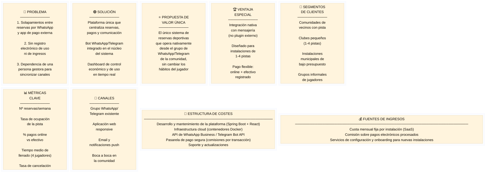
```mermaid
%%{init: {'theme': 'base', 'themeVariables': {'fontSize': '14px'}}}%%
block-beta
  columns 5

  block:problema:1
    P["🔴 PROBLEMA
    ────────────
    1. Solapamientos entre
    reservas por WhatsApp
    y app de pago externa
    
    2. Sin registro
    electrónico de uso
    ni de ingresos
    
    3. Dependencia de una
    persona gestora para
    sincronizar canales"]
  end

  block:solucion:1
    S["🟢 SOLUCIÓN
    ────────────
    Plataforma única que
    centraliza reservas,
    pagos y comunicación
    
    Bot WhatsApp/Telegram
    integrado en el núcleo
    del sistema
    
    Dashboard de control
    económico y de uso
    en tiempo real"]
  end

  block:pvunico:1
    PVU["⭐ PROPUESTA DE
    VALOR ÚNICA
    ────────────
    El único sistema de
    reservas deportivas
    que opera nativamente
    desde el grupo de
    WhatsApp/Telegram
    de la comunidad,
    sin cambiar los
    hábitos del jugador"]
  end

  block:ventaja:1
    V["🏆 VENTAJA
    ESPECIAL
    ────────────
    Integración nativa
    con mensajería
    (no plugin externo)
    
    Diseñado para
    instalaciones de
    1-4 pistas
    
    Pago flexible:
    online + efectivo
    registrado"]
  end

  block:segmentos:1
    SEG["👥 SEGMENTOS
    DE CLIENTES
    ────────────
    Comunidades de
    vecinos con pista
    
    Clubes pequeños
    (1-4 pistas)
    
    Instalaciones
    municipales de
    bajo presupuesto
    
    Grupos informales
    de jugadores"]
  end

  block:metricas:1
    M["📊 MÉTRICAS
    CLAVE
    ────────────
    Nº reservas/semana
    
    Tasa de ocupación
    de la pista
    
    % pagos online
    vs efectivo
    
    Tiempo medio de
    llenado (4 jugadores)
    
    Tasa de cancelación"]
  end

  block:canales:1
    C["📣 CANALES
    ────────────
    Grupo WhatsApp/
    Telegram existente
    
    Aplicación web
    responsive
    
    Email y
    notificaciones push
    
    Boca a boca en
    la comunidad"]
  end

  block:costes:2
    CO["💸 ESTRUCTURA DE COSTES
    ────────────────────────────────────────────────────
    Desarrollo y mantenimiento de la plataforma (Spring Boot + React)
    Infraestructura cloud (contenedores Docker)
    API de WhatsApp Business / Telegram Bot API
    Pasarela de pago segura (comisiones por transacción)
    Soporte y actualizaciones"]
  end

  block:ingresos:3
    I["💰 FUENTES DE INGRESOS
    ──────────────────────────────────────────────────────────────────────
    Cuota mensual fija por instalación (SaaS)
    Comisión sobre pagos electrónicos procesados
    Servicios de configuración y onboarding para nuevas instalaciones"]
  end
```

---

> **Nota:** Los puntos 4 a 8 del documento (Modelo de datos, Especificación de la API, Historias de usuario, Tickets de trabajo y Pull requests) se desarrollarán en las siguientes fases del proyecto.

---

## 2. PRD – Casos de Uso Principales

### 2.0 Visión General de Casos de Uso

Los tres casos de uso principales del sistema son los flujos críticos que cubren el ciclo completo de vida de una reserva: su **creación**, la posibilidad de que otros usuarios se **incorporen** a ella y su **pago**. Estos tres flujos están clasificados con cobertura de pruebas obligatoria del 100%.

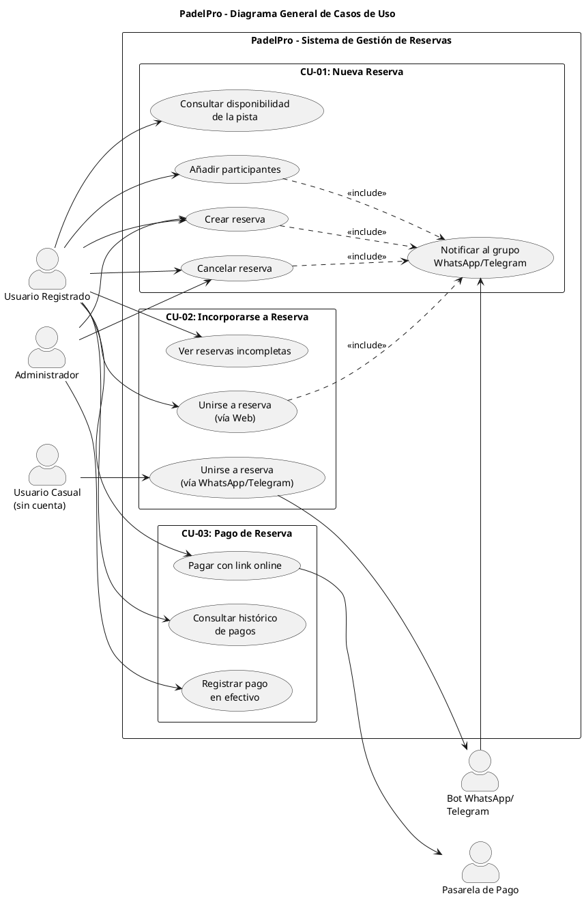
```plantuml
@startuml DiagramaGeneralCasosDeUso
title PadelPro – Diagrama General de Casos de Uso

left to right direction
skinparam packageStyle rectangle
skinparam actorStyle awesome

actor "Usuario Registrado" as U
actor "Usuario Casual\n(sin cuenta)" as UC
actor "Administrador" as A
actor "Pasarela de Pago" as PP
actor "Bot WhatsApp/\nTelegram" as BOT

rectangle "PadelPro – Sistema de Gestión de Reservas" {

  rectangle "CU-01: Nueva Reserva" {
    usecase "Consultar disponibilidad\nde la pista" as CU01a
    usecase "Crear reserva" as CU01b
    usecase "Cancelar reserva" as CU01c
    usecase "Añadir participantes" as CU01d
    usecase "Notificar al grupo\nWhatsApp/Telegram" as CU01e
  }

  rectangle "CU-02: Incorporarse a Reserva" {
    usecase "Ver reservas incompletas" as CU02a
    usecase "Unirse a reserva\n(vía Web)" as CU02b
    usecase "Unirse a reserva\n(vía WhatsApp/Telegram)" as CU02c
  }

  rectangle "CU-03: Pago de Reserva" {
    usecase "Pagar con link online" as CU03a
    usecase "Registrar pago\nen efectivo" as CU03b
    usecase "Consultar histórico\nde pagos" as CU03c
  }
}

U --> CU01a
U --> CU01b
U --> CU01c
U --> CU01d
CU01b ..> CU01e : <<include>>
CU01d ..> CU01e : <<include>>
CU01c ..> CU01e : <<include>>

U --> CU02a
U --> CU02b
UC --> CU02c
CU02b ..> CU01e : <<include>>
CU02c --> BOT

U --> CU03a
U --> CU03c
CU03a --> PP
A --> CU03b

BOT --> CU01e
A --> CU01b
A --> CU01c

@enduml
```

---

### 2.1 CU-01 – Nueva Reserva

#### 2.1.1 Descripción del Caso de Uso

| Campo | Detalle |
|---|---|
| **ID** | CU-01 |
| **Nombre** | Nueva Reserva |
| **Versión** | 1.0 |
| **Prioridad** | Alta |
| **Módulo** | Web + Mensajería (WhatsApp/Telegram) |
| **Descripción** | Permite a un usuario registrado crear una reserva de la pista seleccionando una franja horaria libre, indicando la duración y añadiendo participantes. El sistema publica automáticamente la reserva en el grupo de mensajería. |

#### 2.1.2 Actores

| Actor | Rol |
|---|---|
| **Usuario Registrado** | Actor principal. Inicia y confirma la reserva. Es el titular y responsable del pago. |
| **Administrador** | Puede crear y cancelar reservas desde el panel de administración. |
| **Sistema de Reservas** | Verifica disponibilidad, registra la reserva y gestiona el estado. |
| **Bot WhatsApp/Telegram** | Publica y actualiza el mensaje de reserva en el grupo. |

#### 2.1.3 Precondiciones

- El usuario está autenticado en la plataforma web.
- La franja horaria seleccionada está libre (sin solapamiento con otras reservas).
- La duración seleccionada está entre 1 hora y 3 horas, en intervalos de 30 minutos.

#### 2.1.4 Postcondiciones

- La reserva queda registrada en el sistema con estado **Confirmada**.
- El pago queda asignado al usuario titular de la reserva.
- Se publica un mensaje en el grupo WhatsApp/Telegram con los participantes y huecos libres.

#### 2.1.5 Flujo Principal

| Paso | Actor | Acción |
|---|---|---|
| 1 | Usuario | Accede a la sección **"Nueva Reserva"** desde su perfil. |
| 2 | Sistema | Muestra el calendario con las franjas horarias **libres** y **ocupadas** del día/semana. |
| 3 | Usuario | Selecciona la **fecha** y la **hora de inicio**. |
| 4 | Usuario | Selecciona la **duración** (mínimo 1h, intervalos de 30 min, máximo 3h). |
| 5 | Sistema | Verifica en tiempo real que la franja no está ocupada. |
| 6 | Usuario | Añade los **nombres de los participantes** (hasta 4; pueden ser externos no registrados). |
| 7 | Usuario | Pulsa **"Confirmar Reserva"**. |
| 8 | Sistema | Registra la reserva, asigna el pago al titular y genera el identificador único de reserva. |
| 9 | Sistema/Bot | Publica en el grupo WhatsApp/Telegram el mensaje de reserva con participantes y huecos vacíos. |
| 10 | Sistema | Muestra confirmación al usuario con resumen de la reserva. |

#### 2.1.6 Flujos Alternativos

| ID | Condición | Pasos alternativos |
|---|---|---|
| FA-01 | Franja horaria ocupada (paso 5) | Sistema muestra aviso de no disponibilidad y propone franjas cercanas libres. El flujo retorna al paso 3. |
| FA-02 | Menos de 4 participantes (paso 6) | La reserva se crea con huecos vacíos. El mensaje publicado en el grupo muestra los huecos sin nombre para que otros jugadores se unan. |
| FA-03 | Cancelación dentro del periodo permitido | La reserva pasa a estado **Cancelada** y el pago asignado se anula. El grupo recibe notificación de cancelación. |
| FA-04 | Cancelación fuera del periodo configurado | La reserva pasa a estado **Pendiente de Pago** y el pago no se cancela automáticamente. El administrador gestiona el caso. |
| FA-05 | Reserva vía WhatsApp/Telegram (flujo crítico) | El usuario envía al grupo: `reserva de pista DD/MM/AA HH:MM duración`. El sistema verifica disponibilidad, envía código OTP al WhatsApp personal del usuario, y tras confirmación registra la reserva. Publica el mensaje de confirmación en el grupo. |

#### 2.1.7 Reglas de Negocio

- **RN-01:** Solo se puede reservar en horas libres. No se permiten solapamientos.
- **RN-02:** Duración mínima: 1 hora. Duración máxima: 3 horas. Intervalos de 30 minutos.
- **RN-03:** Máximo 4 participantes por reserva.
- **RN-04:** El titular de la reserva es el único responsable del pago, independientemente de cuántos participantes se unan.
- **RN-05:** El periodo de cancelación sin coste es configurable por el administrador (en horas de antelación).
- **RN-06:** Toda reserva creada genera automáticamente un mensaje en el grupo de mensajería.
- **RN-07:** La confirmación de reserva vía WhatsApp requiere validación OTP.

#### 2.1.8 Requisitos No Funcionales

- El calendario de disponibilidad debe actualizarse en **tiempo real** (sin recargar página).
- La publicación en el grupo WhatsApp/Telegram debe producirse en menos de **5 segundos** tras la confirmación.
- El sistema debe soportar la confirmación OTP con un tiempo de expiración máximo de **10 minutos**.
- Todas las acciones deben quedar registradas en el **log de auditoría**.

#### 2.1.9 Diagrama UML – CU-01

**Flujo Web — Crear y Cancelar Reserva**

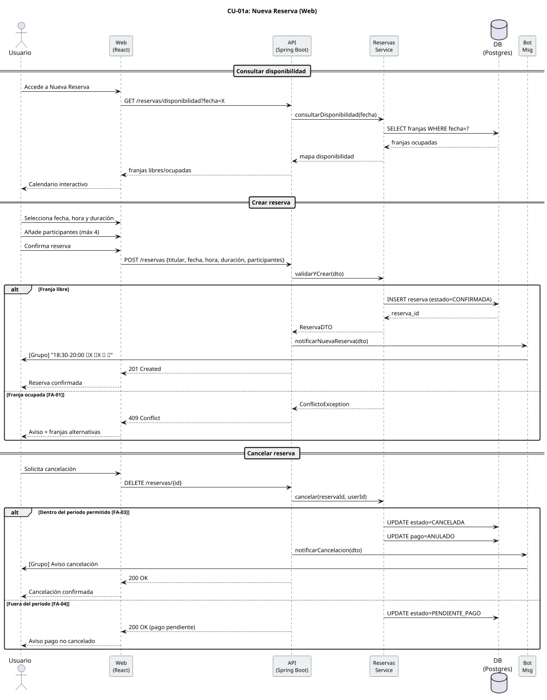
```plantuml
@startuml CU-01-Web
title CU-01a: Nueva Reserva (Web)
scale 0.85

skinparam sequenceArrowThickness 1
skinparam sequenceParticipantFontSize 12
skinparam sequenceMessageFontSize 11
skinparam roundcorner 5
skinparam sequenceParticipantBackgroundColor #ECF0F1
skinparam sequenceParticipantBorderColor #2C3E50

actor Usuario as U
participant "Web\n(React)" as W
participant "API\n(Spring Boot)" as API
participant "Reservas\nService" as SR
database "DB\n(Postgres)" as DB
participant "Bot\nMsg" as BOT

== Consultar disponibilidad ==
U -> W: Accede a Nueva Reserva
W -> API: GET /reservas/disponibilidad?fecha=X
API -> SR: consultarDisponibilidad(fecha)
SR -> DB: SELECT franjas WHERE fecha=?
DB --> SR: franjas ocupadas
SR --> API: mapa disponibilidad
API --> W: franjas libres/ocupadas
W --> U: Calendario interactivo

== Crear reserva ==
U -> W: Selecciona fecha, hora y duración
U -> W: Añade participantes (máx 4)
U -> W: Confirma reserva
W -> API: POST /reservas {titular, fecha, hora, duración, participantes}
API -> SR: validarYCrear(dto)

alt Franja libre
    SR -> DB: INSERT reserva (estado=CONFIRMADA)
    DB --> SR: reserva_id
    SR --> API: ReservaDTO
    API -> BOT: notificarNuevaReserva(dto)
    BOT -> U: [Grupo] "18:30-20:00 🎾X 🎾X 🎾 🎾"
    API --> W: 201 Created
    W --> U: Reserva confirmada
else Franja ocupada [FA-01]
    SR --> API: ConflictoException
    API --> W: 409 Conflict
    W --> U: Aviso + franjas alternativas
end

== Cancelar reserva ==
U -> W: Solicita cancelación
W -> API: DELETE /reservas/{id}
API -> SR: cancelar(reservaId, userId)

alt Dentro del periodo permitido [FA-03]
    SR -> DB: UPDATE estado=CANCELADA
    SR -> DB: UPDATE pago=ANULADO
    API -> BOT: notificarCancelacion(dto)
    BOT -> U: [Grupo] Aviso cancelación
    API --> W: 200 OK
    W --> U: Cancelación confirmada
else Fuera del periodo [FA-04]
    SR -> DB: UPDATE estado=PENDIENTE_PAGO
    API --> W: 200 OK (pago pendiente)
    W --> U: Aviso pago no cancelado
end
@enduml
```

**Flujo WhatsApp/Telegram — Reserva con OTP (Flujo Crítico)**

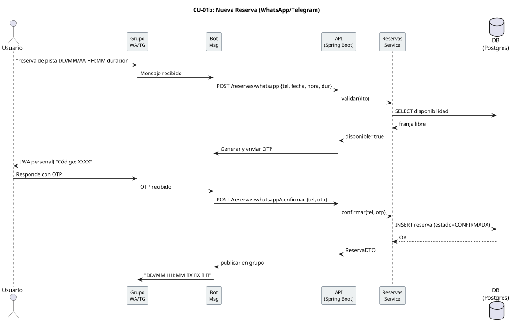
```plantuml
@startuml CU-01-WhatsApp
title CU-01b: Nueva Reserva (WhatsApp/Telegram)
scale 0.85

skinparam sequenceArrowThickness 1
skinparam sequenceParticipantFontSize 12
skinparam sequenceMessageFontSize 11
skinparam roundcorner 5
skinparam sequenceParticipantBackgroundColor #ECF0F1
skinparam sequenceParticipantBorderColor #2C3E50

actor Usuario as U
participant "Grupo\nWA/TG" as G
participant "Bot\nMsg" as BOT
participant "API\n(Spring Boot)" as API
participant "Reservas\nService" as SR
database "DB\n(Postgres)" as DB

U -> G: "reserva de pista DD/MM/AA HH:MM duración"
G -> BOT: Mensaje recibido
BOT -> API: POST /reservas/whatsapp {tel, fecha, hora, dur}
API -> SR: validar(dto)
SR -> DB: SELECT disponibilidad
DB --> SR: franja libre

SR --> API: disponible=true
API -> BOT: Generar y enviar OTP
BOT -> U: [WA personal] "Código: XXXX"

U -> G: Responde con OTP
G -> BOT: OTP recibido
BOT -> API: POST /reservas/whatsapp/confirmar {tel, otp}
API -> SR: confirmar(tel, otp)
SR -> DB: INSERT reserva (estado=CONFIRMADA)
DB --> SR: OK
SR --> API: ReservaDTO
API -> BOT: publicar en grupo
BOT -> G: "DD/MM HH:MM 🎾X 🎾X 🎾 🎾"
@enduml
```

---

### 2.2 CU-02 – Incorporarse a una Reserva Existente

#### 2.2.1 Descripción del Caso de Uso

| Campo | Detalle |
|---|---|
| **ID** | CU-02 |
| **Nombre** | Incorporarse a una Reserva Existente |
| **Versión** | 1.0 |
| **Prioridad** | Alta |
| **Módulo** | Web + Mensajería (WhatsApp/Telegram) |
| **Descripción** | Permite a un usuario (registrado o casual sin cuenta) unirse como participante a una reserva ya creada que aún tiene huecos disponibles. Puede hacerse desde la web o respondiendo al mensaje del grupo de mensajería. |

#### 2.2.2 Actores

| Actor | Rol |
|---|---|
| **Usuario Registrado** | Se une a la reserva desde la web o desde el grupo de mensajería. |
| **Usuario Casual (sin cuenta)** | Se une respondiendo al mensaje del grupo sin necesitar cuenta en la plataforma. |
| **Sistema de Reservas** | Valida la disponibilidad del hueco y actualiza la reserva. |
| **Bot WhatsApp/Telegram** | Lee la respuesta del usuario casual y actualiza el mensaje en el grupo. |

#### 2.2.3 Precondiciones

- Existe al menos una reserva en la semana actual con huecos disponibles (menos de 4 participantes).
- Para el canal web: el usuario está autenticado.
- Para el canal WhatsApp/Telegram: el usuario responde al mensaje del grupo con el formato correcto.

#### 2.2.4 Postcondiciones

- El usuario queda registrado como participante en la reserva seleccionada.
- El mensaje en el grupo WhatsApp/Telegram se actualiza reflejando el nuevo participante.

#### 2.2.5 Flujo Principal (Canal Web)

| Paso | Actor | Acción |
|---|---|---|
| 1 | Usuario | Accede a **"Incluirse en una reserva"** desde su perfil. |
| 2 | Sistema | Muestra el calendario de la semana actual con las reservas que tienen huecos disponibles. |
| 3 | Usuario | Selecciona la reserva en la que desea participar. |
| 4 | Sistema | Verifica que la reserva sigue teniendo huecos disponibles. |
| 5 | Sistema | Registra al usuario como nuevo participante en la reserva. |
| 6 | Sistema/Bot | Actualiza el mensaje en el grupo WhatsApp/Telegram con el nombre del nuevo participante. |
| 7 | Sistema | Muestra confirmación al usuario. |

#### 2.2.6 Flujo Alternativo (Canal WhatsApp/Telegram)

| Paso | Actor | Acción |
|---|---|---|
| 1 | Usuario Casual | Ve el mensaje de reserva en el grupo con huecos vacíos (🎾 sin nombre). |
| 2 | Usuario Casual | Copia el mensaje y añade su nombre en el hueco vacío. Responde en el grupo. |
| 3 | Bot | Lee el mensaje de respuesta e identifica el nombre añadido en el hueco. |
| 4 | Sistema | Valida que el hueco sigue disponible y registra al participante. |
| 5 | Bot | Actualiza el mensaje del grupo con el nombre del nuevo participante. |

#### 2.2.7 Reglas de Negocio

- **RN-08:** Solo se muestran reservas con huecos disponibles en la semana en curso.
- **RN-09:** El usuario casual (sin cuenta) solo puede incorporarse vía WhatsApp/Telegram; no tiene acceso a la web.
- **RN-10:** Si entre el paso 3 y el paso 5 otro usuario ocupa el último hueco, el sistema informa al usuario y le redirige a otras reservas disponibles.
- **RN-11:** El participante incorporado no adquiere responsabilidad de pago; este sigue siendo del titular de la reserva.

#### 2.2.8 Requisitos No Funcionales

- La lista de reservas incompletas debe mostrarse actualizada en tiempo real.
- El bot debe procesar la respuesta del usuario casual y actualizar la reserva en menos de **5 segundos**.
- El sistema debe manejar correctamente las condiciones de carrera (dos usuarios intentando ocupar el último hueco simultáneamente).

#### 2.2.9 Diagrama UML – CU-02

**Flujo Web — Unirse a una reserva con hueco**

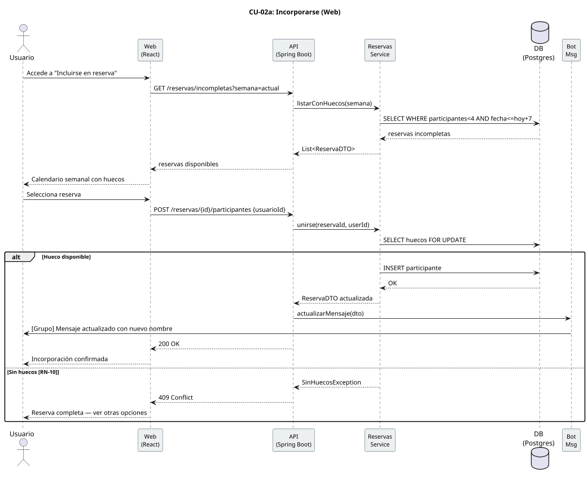
```plantuml
@startuml CU-02-Web
title CU-02a: Incorporarse (Web)
scale 0.85

skinparam sequenceArrowThickness 1
skinparam sequenceParticipantFontSize 12
skinparam sequenceMessageFontSize 11
skinparam roundcorner 5
skinparam sequenceParticipantBackgroundColor #ECF0F1
skinparam sequenceParticipantBorderColor #2C3E50

actor Usuario as U
participant "Web\n(React)" as W
participant "API\n(Spring Boot)" as API
participant "Reservas\nService" as SR
database "DB\n(Postgres)" as DB
participant "Bot\nMsg" as BOT

U -> W: Accede a "Incluirse en reserva"
W -> API: GET /reservas/incompletas?semana=actual
API -> SR: listarConHuecos(semana)
SR -> DB: SELECT WHERE participantes<4 AND fecha<=hoy+7
DB --> SR: reservas incompletas
SR --> API: List<ReservaDTO>
API --> W: reservas disponibles
W --> U: Calendario semanal con huecos

U -> W: Selecciona reserva
W -> API: POST /reservas/{id}/participantes {usuarioId}
API -> SR: unirse(reservaId, userId)
SR -> DB: SELECT huecos FOR UPDATE

alt Hueco disponible
    SR -> DB: INSERT participante
    DB --> SR: OK
    SR --> API: ReservaDTO actualizada
    API -> BOT: actualizarMensaje(dto)
    BOT -> U: [Grupo] Mensaje actualizado con nuevo nombre
    API --> W: 200 OK
    W --> U: Incorporación confirmada
else Sin huecos [RN-10]
    SR --> API: SinHuecosException
    API --> W: 409 Conflict
    W --> U: Reserva completa — ver otras opciones
end
@enduml
```

**Flujo WhatsApp/Telegram — Usuario casual sin cuenta**

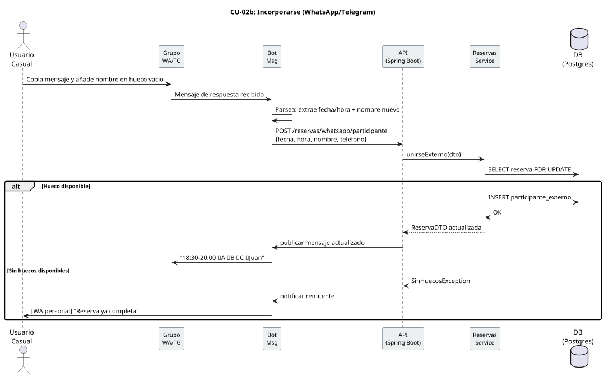
```plantuml
@startuml CU-02-WhatsApp
title CU-02b: Incorporarse (WhatsApp/Telegram)
scale 0.85

skinparam sequenceArrowThickness 1
skinparam sequenceParticipantFontSize 12
skinparam sequenceMessageFontSize 11
skinparam roundcorner 5
skinparam sequenceParticipantBackgroundColor #ECF0F1
skinparam sequenceParticipantBorderColor #2C3E50

actor "Usuario\nCasual" as UC
participant "Grupo\nWA/TG" as G
participant "Bot\nMsg" as BOT
participant "API\n(Spring Boot)" as API
participant "Reservas\nService" as SR
database "DB\n(Postgres)" as DB

UC -> G: Copia mensaje y añade nombre en hueco vacío
G -> BOT: Mensaje de respuesta recibido
BOT -> BOT: Parsea: extrae fecha/hora + nombre nuevo
BOT -> API: POST /reservas/whatsapp/participante\n{fecha, hora, nombre, telefono}
API -> SR: unirseExterno(dto)
SR -> DB: SELECT reserva FOR UPDATE

alt Hueco disponible
    SR -> DB: INSERT participante_externo
    DB --> SR: OK
    SR --> API: ReservaDTO actualizada
    API -> BOT: publicar mensaje actualizado
    BOT -> G: "18:30-20:00 🎾A 🎾B 🎾C 🎾Juan"
else Sin huecos disponibles
    SR --> API: SinHuecosException
    API -> BOT: notificar remitente
    BOT -> UC: [WA personal] "Reserva ya completa"
end
@enduml
```

---

### 2.3 CU-03 – Pago de Reserva

#### 2.3.1 Descripción del Caso de Uso

| Campo | Detalle |
|---|---|
| **ID** | CU-03 |
| **Nombre** | Pago de Reserva |
| **Versión** | 1.0 |
| **Prioridad** | Alta |
| **Módulo** | Web + Administración + Mensajería |
| **Descripción** | Permite al titular de una reserva abonar el importe correspondiente, ya sea mediante un link de pago electrónico seguro o en efectivo al administrador. El administrador puede registrar los pagos en efectivo y consultar el histórico de ingresos. |

#### 2.3.2 Actores

| Actor | Rol |
|---|---|
| **Usuario Titular** | Actor principal. Es el responsable del pago de la reserva que ha creado. |
| **Administrador** | Registra pagos en efectivo y gestiona el estado de los pagos. |
| **Pasarela de Pago** | Procesa el pago online mediante link seguro configurado por el banco. |
| **Bot WhatsApp/Telegram** | Envía el link de pago al WhatsApp personal del titular. |
| **Sistema de Reservas** | Gestiona los estados de pago y registra los ingresos. |

#### 2.3.3 Precondiciones

- Existe una reserva asociada al usuario titular con estado **Confirmada** o **Pendiente de Pago**.
- El link de pago electrónico ha sido configurado por el administrador.

#### 2.3.4 Postcondiciones

- La reserva queda en estado **Pagada**.
- El ingreso queda registrado en el sistema con fecha, importe y método de pago.
- El histórico del usuario refleja la reserva como pagada.

#### 2.3.5 Flujo Principal A – Pago Online (Link de Pago)

| Paso | Actor | Acción |
|---|---|---|
| 1 | Sistema/Bot | Tras confirmar la reserva, envía el link de pago seguro al WhatsApp personal del titular. |
| 2 | Usuario Titular | Accede al link o a la sección **"Pago de Reserva"** en la web. |
| 3 | Sistema | Muestra las reservas pendientes de pago del usuario. |
| 4 | Usuario | Selecciona la reserva y pulsa **"Pagar"**. |
| 5 | Sistema | Redirige al usuario a la pasarela de pago segura. |
| 6 | Usuario | Completa el pago en la pasarela. |
| 7 | Pasarela | Notifica al sistema la confirmación del pago (webhook). |
| 8 | Sistema | Actualiza la reserva a estado **Pagada** y registra el ingreso. |
| 9 | Sistema | Notifica al usuario la confirmación del pago. |

#### 2.3.6 Flujo Principal B – Pago en Efectivo (vía Administrador)

| Paso | Actor | Acción |
|---|---|---|
| 1 | Usuario | Entrega el pago en efectivo al administrador. |
| 2 | Administrador | Accede al panel **"Administración de Reservas"**. |
| 3 | Administrador | Busca y selecciona la reserva correspondiente. |
| 4 | Administrador | Marca la reserva como **"Pagada en efectivo"**. |
| 5 | Sistema | Actualiza el estado de la reserva a **Pagada** y registra el ingreso con método = EFECTIVO. |
| 6 | Sistema | El histórico del usuario refleja la reserva como pagada. |

#### 2.3.7 Reglas de Negocio

- **RN-12:** Solo el titular de la reserva es responsable del pago, independientemente del número de participantes.
- **RN-13:** Si la reserva se cancela dentro del periodo permitido, el pago se anula automáticamente.
- **RN-14:** Si la reserva se cancela fuera del periodo permitido, el pago permanece como **Pendiente de Pago**.
- **RN-15:** El link de pago electrónico es seguro, único por reserva y está configurado por el banco/administrador.
- **RN-16:** El pago puede realizarse en cualquier momento desde la confirmación de la reserva.
- **RN-17:** El administrador es el único que puede registrar pagos en efectivo.
- **RN-18:** Cada ingreso registrado (online o efectivo) queda auditado con usuario, fecha, importe y método.

#### 2.3.8 Requisitos No Funcionales

- El link de pago debe ser un enlace **seguro (HTTPS)** con token único e intransferible.
- El webhook de confirmación de la pasarela debe procesarse en menos de **3 segundos**.
- Todos los registros de pago deben incluir entrada en el **log de auditoría**.
- El histórico de pagos debe ser consultable por rango de fechas y por estado (pagado / pendiente).

#### 2.3.9 Diagrama UML – CU-03

**Flujo A — Pago online mediante link seguro**

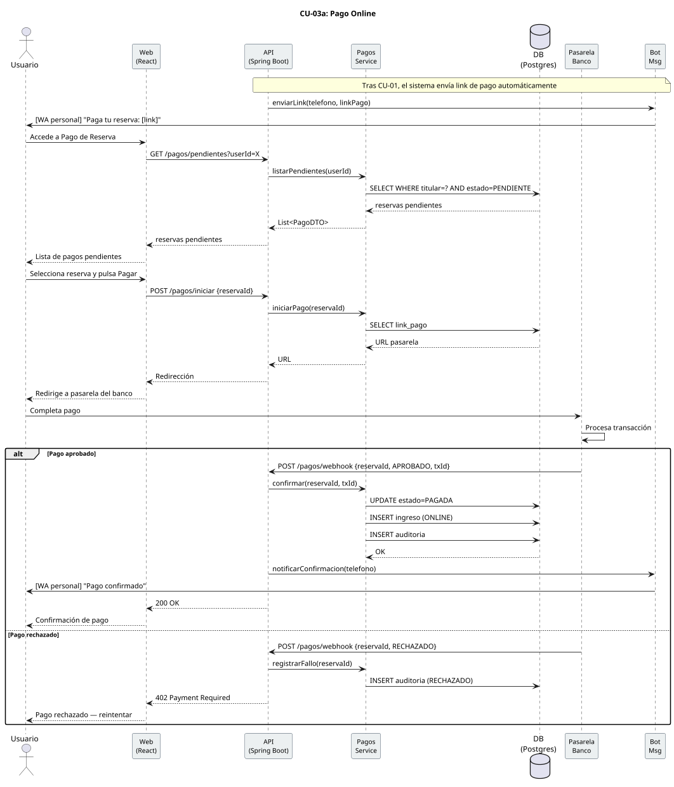
```plantuml
@startuml CU-03-Online
title CU-03a: Pago Online
scale 0.85

skinparam sequenceArrowThickness 1
skinparam sequenceParticipantFontSize 12
skinparam sequenceMessageFontSize 11
skinparam roundcorner 5
skinparam sequenceParticipantBackgroundColor #ECF0F1
skinparam sequenceParticipantBorderColor #2C3E50

actor Usuario as U
participant "Web\n(React)" as W
participant "API\n(Spring Boot)" as API
participant "Pagos\nService" as PS
database "DB\n(Postgres)" as DB
participant "Pasarela\nBanco" as PP
participant "Bot\nMsg" as BOT

note over API, BOT: Tras CU-01, el sistema envía link de pago automáticamente
API -> BOT: enviarLink(telefono, linkPago)
BOT -> U: [WA personal] "Paga tu reserva: [link]"

U -> W: Accede a Pago de Reserva
W -> API: GET /pagos/pendientes?userId=X
API -> PS: listarPendientes(userId)
PS -> DB: SELECT WHERE titular=? AND estado=PENDIENTE
DB --> PS: reservas pendientes
PS --> API: List<PagoDTO>
API --> W: reservas pendientes
W --> U: Lista de pagos pendientes

U -> W: Selecciona reserva y pulsa Pagar
W -> API: POST /pagos/iniciar {reservaId}
API -> PS: iniciarPago(reservaId)
PS -> DB: SELECT link_pago
DB --> PS: URL pasarela
PS --> API: URL
API --> W: Redirección
W --> U: Redirige a pasarela del banco

U -> PP: Completa pago
PP -> PP: Procesa transacción

alt Pago aprobado
    PP -> API: POST /pagos/webhook {reservaId, APROBADO, txId}
    API -> PS: confirmar(reservaId, txId)
    PS -> DB: UPDATE estado=PAGADA
    PS -> DB: INSERT ingreso (ONLINE)
    PS -> DB: INSERT auditoria
    DB --> PS: OK
    API -> BOT: notificarConfirmacion(telefono)
    BOT -> U: [WA personal] "Pago confirmado"
    API --> W: 200 OK
    W --> U: Confirmación de pago
else Pago rechazado
    PP -> API: POST /pagos/webhook {reservaId, RECHAZADO}
    API -> PS: registrarFallo(reservaId)
    PS -> DB: INSERT auditoria (RECHAZADO)
    API --> W: 402 Payment Required
    W --> U: Pago rechazado — reintentar
end
@enduml
```

**Flujo B — Pago en efectivo registrado por el administrador**

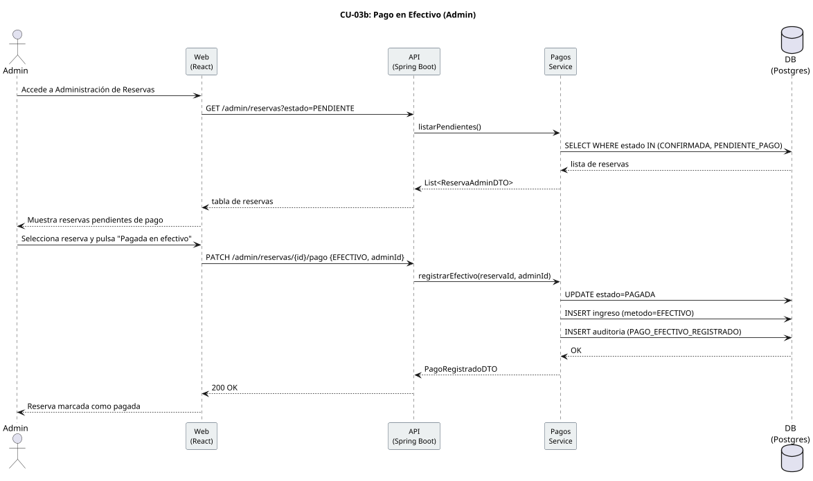
```plantuml
@startuml CU-03-Efectivo
title CU-03b: Pago en Efectivo (Admin)
scale 0.85

skinparam sequenceArrowThickness 1
skinparam sequenceParticipantFontSize 12
skinparam sequenceMessageFontSize 11
skinparam roundcorner 5
skinparam sequenceParticipantBackgroundColor #ECF0F1
skinparam sequenceParticipantBorderColor #2C3E50

actor Admin as A
participant "Web\n(React)" as W
participant "API\n(Spring Boot)" as API
participant "Pagos\nService" as PS
database "DB\n(Postgres)" as DB

A -> W: Accede a Administración de Reservas
W -> API: GET /admin/reservas?estado=PENDIENTE
API -> PS: listarPendientes()
PS -> DB: SELECT WHERE estado IN (CONFIRMADA, PENDIENTE_PAGO)
DB --> PS: lista de reservas
PS --> API: List<ReservaAdminDTO>
API --> W: tabla de reservas
W --> A: Muestra reservas pendientes de pago

A -> W: Selecciona reserva y pulsa "Pagada en efectivo"
W -> API: PATCH /admin/reservas/{id}/pago {EFECTIVO, adminId}
API -> PS: registrarEfectivo(reservaId, adminId)
PS -> DB: UPDATE estado=PAGADA
PS -> DB: INSERT ingreso (metodo=EFECTIVO)
PS -> DB: INSERT auditoria (PAGO_EFECTIVO_REGISTRADO)
DB --> PS: OK
PS --> API: PagoRegistradoDTO
API --> W: 200 OK
W --> A: Reserva marcada como pagada
@enduml
```

---

> **Nota:** Los puntos 4 a 8 del documento (Modelo de datos, Especificación de la API, Historias de usuario, Tickets de trabajo y Pull requests) se desarrollarán en las siguientes fases del proyecto.

---

## 3. Arquitectura del Sistema

### 3.1 Visión General

El backend de PadelPro se construye sobre **Arquitectura Hexagonal** (Ports & Adapters), combinada con un despliegue en **tres capas físicas** (Presentación → Backend → Datos) sobre contenedores Docker en entorno **On-Premise**. Esta decisión arquitectónica es especialmente adecuada para este sistema porque:

- Existen **múltiples canales de entrada** (API REST desde la web, Webhooks de Telegram como canal principal) que deben converger en el mismo dominio de negocio sin contaminar su lógica.
- Existen **múltiples adaptadores de salida** (PostgreSQL, Telegram Bot API, Redsys como pasarela de pago por defecto, SMTP) que deben ser intercambiables sin modificar el núcleo del negocio. La arquitectura hexagonal permite sustituir o añadir adaptadores (ej. incorporar WhatsApp Business API en una fase futura) sin tocar el dominio.
- El requisito de **cobertura de tests del 80%+** con TDD/BDD exige que el dominio sea 100% testeable de forma aislada, sin dependencias de infraestructura.

**Decisiones técnicas confirmadas para v1.0:**

| Decisión | Elección v1.0 | Notas |
|---|---|---|
| Canal de mensajería | **Telegram Bot API** | Gratuito, sin aprobaciones. WhatsApp Business API previsto para v2. |
| Pasarela de pago | **Redsys** (default) | Configurable por el administrador. Estándar bancario en España. |
| Despliegue | **On-Premise** | Servidor propio del cliente. Docker Compose sobre Linux. |
| Alcance instalaciones | **Una sola pista** | Sin multi-tenancy en v1.0. Arquitectura preparada para escalar. |

La comunicación entre el frontend y el backend es exclusivamente a través de una **API REST** documentada con OpenAPI/Swagger.

El sistema está diseñado bajo los siguientes principios:
- **Arquitectura Hexagonal:** el dominio de negocio es el centro; los adaptadores lo rodean y nunca al revés.
- **Separación de responsabilidades:** cada capa tiene un rol claro y no invade el de otra.
- **Seguridad por capas:** autenticación JWT, cifrado de contraseñas BCrypt, OTP por Telegram para operaciones críticas y registro de auditoría completo.
- **Observabilidad:** todas las acciones de usuario quedan registradas en un log de auditoría persistente en base de datos.
- **Despliegue On-Premise:** Docker Compose sobre servidor local del cliente, sin dependencia de proveedores cloud.

---

### 3.2 Diagrama de Arquitectura General

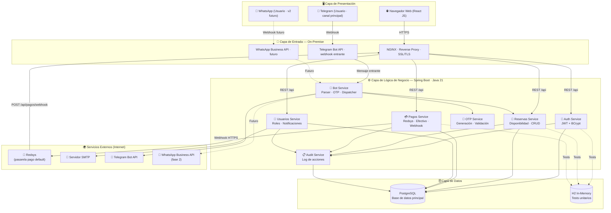
```mermaid
graph TB
    subgraph CLIENTES["🖥️ Capa de Presentación"]
        BROWSER["🌐 Navegador Web (React JS)"]
        TG["📱 Telegram (Usuario · canal principal)"]
        WA["📱 WhatsApp (Usuario · v2 futuro)"]
    end

    subgraph GATEWAY["🔀 Capa de Entrada — On-Premise"]
        NGINX["NGINX · Reverse Proxy · SSL/TLS"]
        TGAPI["Telegram Bot API · webhook entrante"]
        WAAPI["WhatsApp Business API · futuro"]
    end

    subgraph BACKEND["⚙️ Capa de Lógica de Negocio — Spring Boot · Java 21"]
        AUTH["🔐 Auth Service\nJWT + BCrypt"]
        RESERVAS["📅 Reservas Service\nDisponibilidad · CRUD"]
        PAGOS["💳 Pagos Service\nRedsys · Efectivo · Webhook"]
        USUARIOS["👤 Usuarios Service\nRoles · Notificaciones"]
        BOT["🤖 Bot Service\nParser · OTP · Dispatcher"]
        AUDIT["📋 Audit Service\nLog de acciones"]
        OTP["🔑 OTP Service\nGeneración · Validación"]
    end

    subgraph DATOS["🗄️ Capa de Datos"]
        PG[("PostgreSQL\nBase de datos principal")]
        H2[("H2 In-Memory\nTests unitarios")]
    end

    subgraph EXTERNOS["🌍 Servicios Externos (Internet)"]
        REDSYS["🏦 Redsys\n(pasarela pago default)"]
        SMTP["📧 Servidor SMTP"]
        TGEXT["📲 Telegram Bot API"]
        WAEXT["📲 WhatsApp Business API\n(fase 2)"]
    end

    BROWSER -->|HTTPS| NGINX
    TG -->|Webhook| TGAPI
    WA -.->|Webhook futuro| WAAPI

    NGINX -->|REST /api| AUTH
    NGINX -->|REST /api| RESERVAS
    NGINX -->|REST /api| PAGOS
    NGINX -->|REST /api| USUARIOS

    TGAPI -->|Mensaje entrante| BOT
    WAAPI -.->|Futuro| BOT

    AUTH --> PG
    RESERVAS --> PG
    PAGOS --> PG
    USUARIOS --> PG
    BOT --> RESERVAS
    BOT --> OTP
    AUDIT --> PG

    AUTH --> AUDIT
    RESERVAS --> AUDIT
    PAGOS --> AUDIT
    USUARIOS --> AUDIT

    PAGOS -->|Webhook HTTPS| REDSYS
    REDSYS -->|"POST /api/pagos/webhook"| NGINX
    USUARIOS --> SMTP
    BOT --> TGEXT
    BOT -.->|Futuro| WAEXT

    AUTH -.->|Tests| H2
    RESERVAS -.->|Tests| H2
    PAGOS -.->|Tests| H2
```

---

### 3.3 Arquitectura Hexagonal por Módulos

#### 3.3.1 Definición de Módulos

El backend se divide en **6 módulos** alineados con los contextos de negocio. Cada módulo es autónomo y aplica internamente la estructura hexagonal completa (dominio → puertos → adaptadores). Los módulos transversales (`auditoria`, `shared`) son consumidos por el resto sin exponer lógica de infraestructura.

| Módulo | Responsabilidad | Tipo |
|---|---|---|
| **reservas** | Gestión del ciclo de vida de reservas y participantes | Negocio core |
| **pagos** | Procesamiento de pagos online y registro de efectivo | Negocio core |
| **usuarios** | Gestión de usuarios, autenticación y autorización | Negocio core |
| **mensajeria** | Integración con WhatsApp y Telegram (entrada y salida) | Canal / Infraestructura |
| **otp** | Generación y validación de códigos OTP para operaciones críticas | Seguridad transversal |
| **auditoria** | Registro inmutable de todas las acciones del sistema | Transversal |
| **shared** | Configuración Spring, seguridad JWT, DTOs comunes | Infraestructura compartida |

**Regla de dependencias entre módulos:**
```
reservas  ──uses──▶  mensajeria · auditoria
pagos     ──uses──▶  mensajeria · auditoria
usuarios  ──uses──▶  mensajeria · auditoria · otp
mensajeria──uses──▶  otp
```
> El dominio de cada módulo solo depende de interfaces (puertos). Nunca de implementaciones de otro módulo.

---

#### 3.3.2 Mapa de Módulos

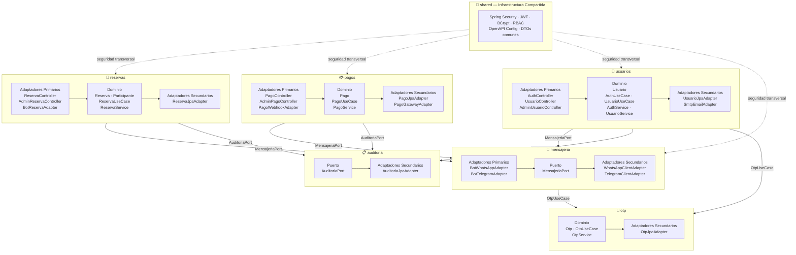
```mermaid
graph TB
    subgraph SHARED["🔧 shared — Infraestructura Compartida"]
        SEC["Spring Security · JWT · BCrypt · RBAC\nOpenAPI Config · DTOs comunes"]
    end

    subgraph MOD_R["📅 reservas"]
        direction LR
        R_IN["Adaptadores Primarios\nReservaController\nAdminReservaController\nBotReservaAdapter"]
        R_DOM["Dominio\nReserva · Participante\nReservaUseCase\nReservaService"]
        R_OUT["Adaptadores Secundarios\nReservaJpaAdapter"]
        R_IN --> R_DOM --> R_OUT
    end

    subgraph MOD_P["💳 pagos"]
        direction LR
        P_IN["Adaptadores Primarios\nPagoController\nAdminPagoController\nPagoWebhookAdapter"]
        P_DOM["Dominio\nPago\nPagoUseCase\nPagoService"]
        P_OUT["Adaptadores Secundarios\nPagoJpaAdapter\nPagoGatewayAdapter"]
        P_IN --> P_DOM --> P_OUT
    end

    subgraph MOD_U["👤 usuarios"]
        direction LR
        U_IN["Adaptadores Primarios\nAuthController\nUsuarioController\nAdminUsuarioController"]
        U_DOM["Dominio\nUsuario\nAuthUseCase · UsuarioUseCase\nAuthService · UsuarioService"]
        U_OUT["Adaptadores Secundarios\nUsuarioJpaAdapter\nSmtpEmailAdapter"]
        U_IN --> U_DOM --> U_OUT
    end

    subgraph MOD_M["📲 mensajeria"]
        direction LR
        M_IN["Adaptadores Primarios\nBotWhatsAppAdapter\nBotTelegramAdapter"]
        M_DOM["Puerto\nMensajeriaPort"]
        M_OUT["Adaptadores Secundarios\nWhatsAppClientAdapter\nTelegramClientAdapter"]
        M_IN --> M_DOM --> M_OUT
    end

    subgraph MOD_O["🔑 otp"]
        direction LR
        O_DOM["Dominio\nOtp · OtpUseCase\nOtpService"]
        O_OUT["Adaptadores Secundarios\nOtpJpaAdapter"]
        O_DOM --> O_OUT
    end

    subgraph MOD_A["📋 auditoria"]
        direction LR
        A_DOM["Puerto\nAuditoriaPort"]
        A_OUT["Adaptadores Secundarios\nAuditoriaJpaAdapter"]
        A_DOM --> A_OUT
    end

    SHARED -.->|seguridad transversal| MOD_R & MOD_P & MOD_U & MOD_M

    MOD_R -->|MensajeriaPort| MOD_M
    MOD_R -->|AuditoriaPort| MOD_A
    MOD_P -->|MensajeriaPort| MOD_M
    MOD_P -->|AuditoriaPort| MOD_A
    MOD_U -->|MensajeriaPort| MOD_M
    MOD_U -->|AuditoriaPort| MOD_A
    MOD_U -->|OtpUseCase| MOD_O
    MOD_M -->|OtpUseCase| MOD_O
```

---

#### 3.3.3 Diagrama Hexagonal por Módulo

**Módulo `reservas`**

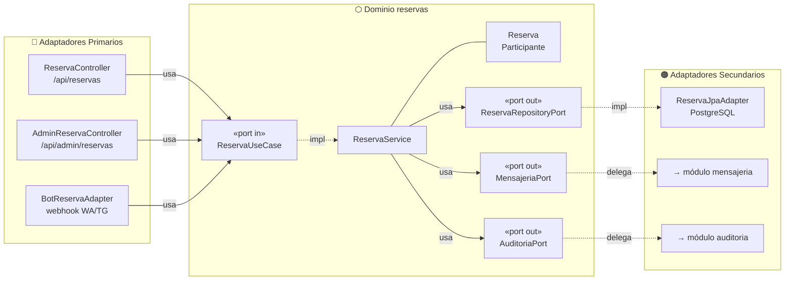
```mermaid
graph LR
    subgraph R_PA["🔵 Adaptadores Primarios"]
        RC["ReservaController\n/api/reservas"]
        ARC["AdminReservaController\n/api/admin/reservas"]
        BRA["BotReservaAdapter\nwebhook WA/TG"]
    end
    subgraph R_DOMAIN["⬡ Dominio reservas"]
        RUC["«port in»\nReservaUseCase"]
        RS["ReservaService"]
        RE["Reserva\nParticipante"]
        RRP["«port out»\nReservaRepositoryPort"]
        RMP["«port out»\nMensajeriaPort"]
        RAP["«port out»\nAuditoriaPort"]
    end
    subgraph R_SA["🟠 Adaptadores Secundarios"]
        RJPA["ReservaJpaAdapter\nPostgreSQL"]
        RMSG["→ módulo mensajeria"]
        RAUD["→ módulo auditoria"]
    end
    RC & ARC & BRA -->|usa| RUC
    RUC -.->|impl| RS
    RS --- RE
    RS -->|usa| RRP & RMP & RAP
    RRP -.->|impl| RJPA
    RMP -.->|delega| RMSG
    RAP -.->|delega| RAUD
```

**Módulo `pagos`**

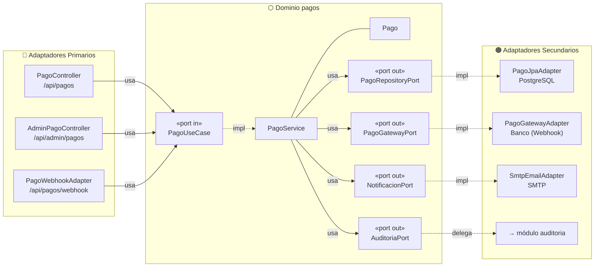
```mermaid
graph LR
    subgraph P_PA["🔵 Adaptadores Primarios"]
        PC["PagoController\n/api/pagos"]
        APC["AdminPagoController\n/api/admin/pagos"]
        PWA["PagoWebhookAdapter\n/api/pagos/webhook"]
    end
    subgraph P_DOMAIN["⬡ Dominio pagos"]
        PUC["«port in»\nPagoUseCase"]
        PS["PagoService"]
        PE["Pago"]
        PRP["«port out»\nPagoRepositoryPort"]
        PGP["«port out»\nPagoGatewayPort"]
        PNP["«port out»\nNotificacionPort"]
        PAP["«port out»\nAuditoriaPort"]
    end
    subgraph P_SA["🟠 Adaptadores Secundarios"]
        PJPA["PagoJpaAdapter\nPostgreSQL"]
        PGA["PagoGatewayAdapter\nBanco (Webhook)"]
        PSMTP["SmtpEmailAdapter\nSMTP"]
        PAUD["→ módulo auditoria"]
    end
    PC & APC & PWA -->|usa| PUC
    PUC -.->|impl| PS
    PS --- PE
    PS -->|usa| PRP & PGP & PNP & PAP
    PRP -.->|impl| PJPA
    PGP -.->|impl| PGA
    PNP -.->|impl| PSMTP
    PAP -.->|delega| PAUD
```

**Módulo `usuarios`**

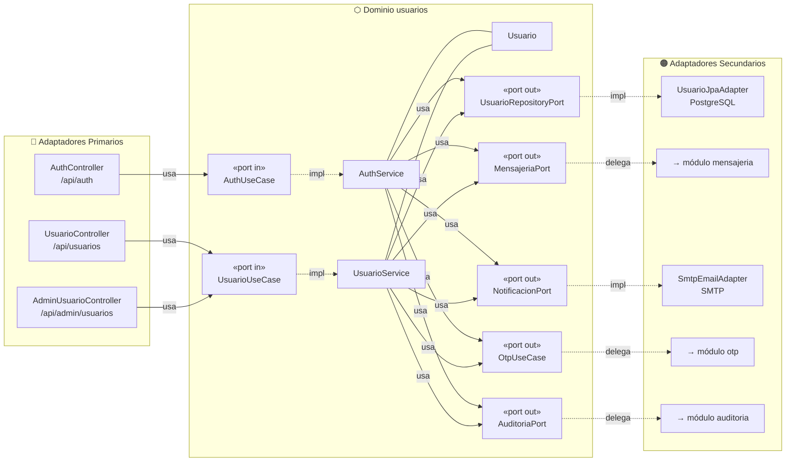
```mermaid
graph LR
    subgraph U_PA["🔵 Adaptadores Primarios"]
        AC["AuthController\n/api/auth"]
        UC["UsuarioController\n/api/usuarios"]
        AUC["AdminUsuarioController\n/api/admin/usuarios"]
    end
    subgraph U_DOMAIN["⬡ Dominio usuarios"]
        AUI["«port in»\nAuthUseCase"]
        UUI["«port in»\nUsuarioUseCase"]
        AS["AuthService"]
        US["UsuarioService"]
        UE["Usuario"]
        URP["«port out»\nUsuarioRepositoryPort"]
        UMP["«port out»\nMensajeriaPort"]
        UNP["«port out»\nNotificacionPort"]
        UOP["«port out»\nOtpUseCase"]
        UAP["«port out»\nAuditoriaPort"]
    end
    subgraph U_SA["🟠 Adaptadores Secundarios"]
        UJPA["UsuarioJpaAdapter\nPostgreSQL"]
        UMSG["→ módulo mensajeria"]
        USMTP["SmtpEmailAdapter\nSMTP"]
        UOTP["→ módulo otp"]
        UAUD["→ módulo auditoria"]
    end
    AC -->|usa| AUI
    UC & AUC -->|usa| UUI
    AUI -.->|impl| AS
    UUI -.->|impl| US
    AS & US --- UE
    AS & US -->|usa| URP & UMP & UNP & UOP & UAP
    URP -.->|impl| UJPA
    UMP -.->|delega| UMSG
    UNP -.->|impl| USMTP
    UOP -.->|delega| UOTP
    UAP -.->|delega| UAUD
```

**Módulo `mensajeria`**

> Canal principal: **Telegram Bot API**. WhatsApp Business API previsto para v2 — el puerto `MensajeriaPort` permite añadirlo sin modificar el dominio.

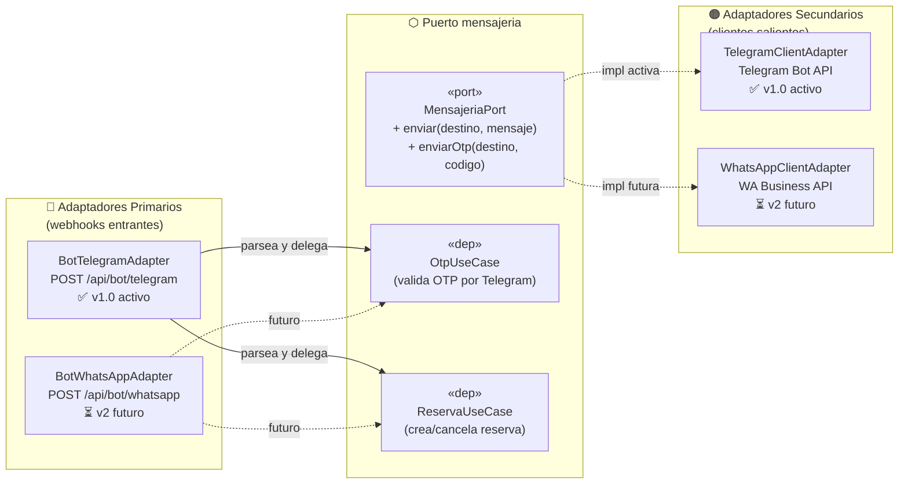
```mermaid
graph LR
    subgraph M_PA["🔵 Adaptadores Primarios\n(webhooks entrantes)"]
        BTA["BotTelegramAdapter\nPOST /api/bot/telegram\n✅ v1.0 activo"]
        BWA["BotWhatsAppAdapter\nPOST /api/bot/whatsapp\n⏳ v2 futuro"]
    end
    subgraph M_DOMAIN["⬡ Puerto mensajeria"]
        MP["«port»\nMensajeriaPort\n+ enviar(destino, mensaje)\n+ enviarOtp(destino, codigo)"]
        OUC["«dep»\nOtpUseCase\n(valida OTP por Telegram)"]
        RUC["«dep»\nReservaUseCase\n(crea/cancela reserva)"]
    end
    subgraph M_SA["🟠 Adaptadores Secundarios\n(clientes salientes)"]
        TGC["TelegramClientAdapter\nTelegram Bot API\n✅ v1.0 activo"]
        WAC["WhatsAppClientAdapter\nWA Business API\n⏳ v2 futuro"]
    end
    BTA -->|parsea y delega| RUC & OUC
    BWA -.->|futuro| RUC & OUC
    MP -.->|impl activa| TGC
    MP -.->|impl futura| WAC
```

**Módulos transversales `otp` y `auditoria`**

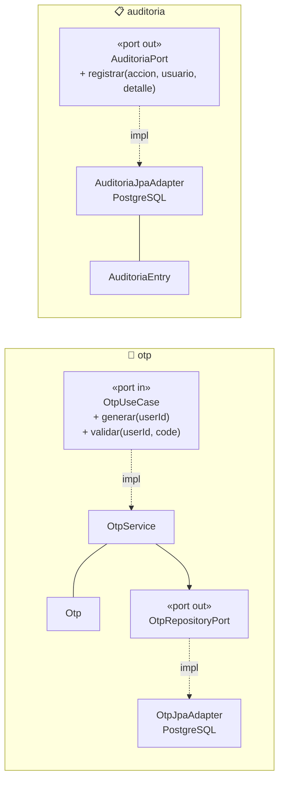
```mermaid
graph LR
    subgraph MOD_OTP["🔑 otp"]
        OPI["«port in»\nOtpUseCase\n+ generar(userId)\n+ validar(userId, code)"]
        OS["OtpService"]
        OE["Otp"]
        ORP["«port out»\nOtpRepositoryPort"]
        OJPA["OtpJpaAdapter\nPostgreSQL"]
        OPI -.->|impl| OS
        OS --- OE
        OS --> ORP
        ORP -.->|impl| OJPA
    end

    subgraph MOD_AUD["📋 auditoria"]
        API2["«port out»\nAuditoriaPort\n+ registrar(accion, usuario, detalle)"]
        AJPA["AuditoriaJpaAdapter\nPostgreSQL"]
        AE["AuditoriaEntry"]
        API2 -.->|impl| AJPA
        AJPA --- AE
    end
```

---

#### 3.3.4 Estructura de Paquetes por Módulo

```
com.padelpro
│
├── reservas/
│   ├── domain/
│   │   ├── model/
│   │   │   ├── Reserva.java
│   │   │   └── Participante.java
│   │   ├── port/
│   │   │   ├── inbound/
│   │   │   │   └── ReservaUseCase.java
│   │   │   └── outbound/
│   │   │       ├── ReservaRepositoryPort.java
│   │   │       ├── MensajeriaPort.java        ← ref al módulo mensajeria
│   │   │       └── AuditoriaPort.java         ← ref al módulo auditoria
│   │   └── service/
│   │       └── ReservaService.java
│   └── infrastructure/
│       ├── adapter/
│       │   ├── inbound/
│       │   │   ├── web/
│       │   │   │   ├── ReservaController.java
│       │   │   │   ├── AdminReservaController.java
│       │   │   │   └── dto/
│       │   │   └── messaging/
│       │   │       └── BotReservaAdapter.java
│       │   └── outbound/
│       │       └── persistence/
│       │           ├── ReservaJpaAdapter.java
│       │           └── entity/
│       │               └── ReservaEntity.java
│       └── config/
│           └── ReservaConfig.java
│
├── pagos/
│   ├── domain/
│   │   ├── model/
│   │   │   └── Pago.java
│   │   ├── port/
│   │   │   ├── inbound/
│   │   │   │   └── PagoUseCase.java
│   │   │   └── outbound/
│   │   │       ├── PagoRepositoryPort.java
│   │   │       ├── PagoGatewayPort.java
│   │   │       ├── NotificacionPort.java
│   │   │       └── AuditoriaPort.java
│   │   └── service/
│   │       └── PagoService.java
│   └── infrastructure/
│       ├── adapter/
│       │   ├── inbound/
│       │   │   ├── web/
│       │   │   │   ├── PagoController.java
│       │   │   │   └── AdminPagoController.java
│       │   │   └── webhook/
│       │   │       └── PagoWebhookAdapter.java
│       │   └── outbound/
│       │       ├── persistence/
│       │       │   ├── PagoJpaAdapter.java
│       │       │   └── entity/
│       │       │       └── PagoEntity.java
│       │       ├── payment/
│       │       │   └── PagoGatewayAdapter.java
│       │       └── email/
│       │           └── SmtpEmailAdapter.java
│       └── config/
│           └── PagoConfig.java
│
├── usuarios/
│   ├── domain/
│   │   ├── model/
│   │   │   └── Usuario.java
│   │   ├── port/
│   │   │   ├── inbound/
│   │   │   │   ├── AuthUseCase.java
│   │   │   │   └── UsuarioUseCase.java
│   │   │   └── outbound/
│   │   │       ├── UsuarioRepositoryPort.java
│   │   │       ├── MensajeriaPort.java
│   │   │       ├── NotificacionPort.java
│   │   │       ├── OtpUseCase.java            ← ref al módulo otp
│   │   │       └── AuditoriaPort.java
│   │   └── service/
│   │       ├── AuthService.java
│   │       └── UsuarioService.java
│   └── infrastructure/
│       ├── adapter/
│       │   ├── inbound/
│       │   │   └── web/
│       │   │       ├── AuthController.java
│       │   │       ├── UsuarioController.java
│       │   │       └── AdminUsuarioController.java
│       │   └── outbound/
│       │       ├── persistence/
│       │       │   ├── UsuarioJpaAdapter.java
│       │       │   └── entity/
│       │       │       └── UsuarioEntity.java
│       │       └── email/
│       │           └── SmtpEmailAdapter.java
│       └── config/
│           └── UsuarioConfig.java
│
├── mensajeria/
│   ├── domain/
│   │   └── port/
│   │       └── MensajeriaPort.java            ← puerto compartido
│   └── infrastructure/
│       ├── adapter/
│       │   ├── inbound/
│       │   │   ├── BotWhatsAppAdapter.java
│       │   │   └── BotTelegramAdapter.java
│       │   └── outbound/
│       │       ├── WhatsAppClientAdapter.java
│       │       └── TelegramClientAdapter.java
│       └── config/
│           └── MensajeriaConfig.java
│
├── otp/
│   ├── domain/
│   │   ├── model/
│   │   │   └── Otp.java
│   │   ├── port/
│   │   │   ├── inbound/
│   │   │   │   └── OtpUseCase.java
│   │   │   └── outbound/
│   │   │       └── OtpRepositoryPort.java
│   │   └── service/
│   │       └── OtpService.java
│   └── infrastructure/
│       └── adapter/
│           └── outbound/
│               ├── OtpJpaAdapter.java
│               └── entity/
│                   └── OtpEntity.java
│
├── auditoria/
│   ├── domain/
│   │   ├── model/
│   │   │   └── AuditoriaEntry.java
│   │   └── port/
│   │       └── AuditoriaPort.java
│   └── infrastructure/
│       └── adapter/
│           └── outbound/
│               ├── AuditoriaJpaAdapter.java
│               └── entity/
│                   └── AuditoriaEntity.java
│
└── shared/
    ├── config/
    │   ├── SecurityConfig.java                ← JWT, BCrypt, RBAC global
    │   └── SwaggerConfig.java
    ├── security/
    │   ├── JwtFilter.java
    │   └── JwtProvider.java
    └── exception/
        └── GlobalExceptionHandler.java
```

---

### 3.4 Diagrama de Componentes del Backend (por Módulos)

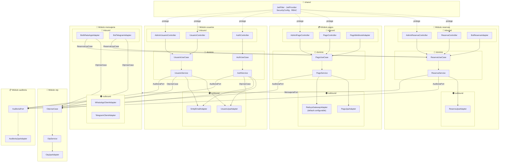
```mermaid
graph TB
    subgraph SHARED["🔧 shared"]
        JWT["JwtFilter · JwtProvider\nSecurityConfig · RBAC"]
    end

    subgraph MOD_R["📅 Módulo reservas"]
        direction LR
        subgraph R_IN2["🔵 inbound"]
            RC2["ReservaController"]
            ARC2["AdminReservaController"]
            BRA2["BotReservaAdapter"]
        end
        subgraph R_DOM2["⬡ dominio"]
            RUC2["ReservaUseCase"]
            RS2["ReservaService"]
        end
        subgraph R_OUT2["🟠 outbound"]
            RJPA2["ReservaJpaAdapter"]
        end
        RC2 & ARC2 & BRA2 --> RUC2
        RUC2 -.-> RS2
        RS2 --> RJPA2
    end

    subgraph MOD_P2["💳 Módulo pagos"]
        direction LR
        subgraph P_IN2["🔵 inbound"]
            PC2["PagoController"]
            APC2["AdminPagoController"]
            PWA2["PagoWebhookAdapter"]
        end
        subgraph P_DOM2["⬡ dominio"]
            PUC2["PagoUseCase"]
            PS2["PagoService"]
        end
        subgraph P_OUT2["🟠 outbound"]
            PJPA2["PagoJpaAdapter"]
            PGA2["RedsysGatewayAdapter\n(default configurable)"]
        end
        PC2 & APC2 & PWA2 --> PUC2
        PUC2 -.-> PS2
        PS2 --> PJPA2 & PGA2
    end

    subgraph MOD_U2["👤 Módulo usuarios"]
        direction LR
        subgraph U_IN2["🔵 inbound"]
            AC2["AuthController"]
            UC2["UsuarioController"]
            AUC2["AdminUsuarioController"]
        end
        subgraph U_DOM2["⬡ dominio"]
            AUI2["AuthUseCase"]
            UUI2["UsuarioUseCase"]
            AS2["AuthService"]
            US2["UsuarioService"]
        end
        subgraph U_OUT2["🟠 outbound"]
            UJPA2["UsuarioJpaAdapter"]
            USMTP2["SmtpEmailAdapter"]
        end
        AC2 --> AUI2
        UC2 & AUC2 --> UUI2
        AUI2 -.-> AS2
        UUI2 -.-> US2
        AS2 & US2 --> UJPA2 & USMTP2
    end

    subgraph MOD_M2["📲 Módulo mensajeria"]
        direction LR
        subgraph M_IN2["🔵 inbound"]
            BWA2["BotWhatsAppAdapter"]
            BTA2["BotTelegramAdapter"]
        end
        subgraph M_OUT2["🟠 outbound"]
            WAC2["WhatsAppClientAdapter"]
            TGC2["TelegramClientAdapter"]
        end
    end

    subgraph MOD_O2["🔑 Módulo otp"]
        OUC2["OtpUseCase"]
        OS2["OtpService"]
        OJPA2["OtpJpaAdapter"]
        OUC2 -.-> OS2 --> OJPA2
    end

    subgraph MOD_A2["📋 Módulo auditoria"]
        AP2["AuditoriaPort"]
        AJPA2["AuditoriaJpaAdapter"]
        AP2 -.-> AJPA2
    end

    JWT -.->|protege| RC2 & ARC2 & PC2 & APC2 & AC2 & UC2 & AUC2

    RS2 -->|MensajeriaPort| MOD_M2
    RS2 -->|AuditoriaPort| AP2
    PS2 -->|AuditoriaPort| AP2
    AS2 & US2 -->|OtpUseCase| OUC2
    AS2 & US2 -->|AuditoriaPort| AP2
    BWA2 & BTA2 -->|OtpUseCase| OUC2
    BWA2 & BTA2 -->|ReservaUseCase| RUC2
```

---

### 3.5 Diagrama de Despliegue — Docker Compose (On-Premise)

> El sistema se despliega **On-Premise** en un servidor propio del cliente (Linux) mediante Docker Compose. El acceso externo se gestiona a través de un router/firewall que expone únicamente el puerto 443. Los servicios externos (Telegram, Redsys, SMTP) se consumen desde la red interna del servidor hacia Internet.

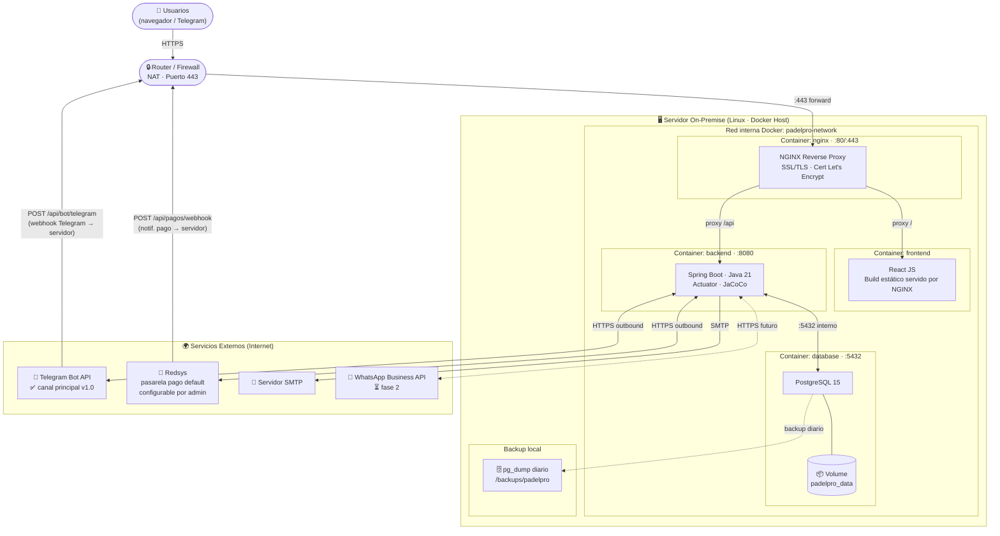
```mermaid
graph TB
    USUARIOS(["👤 Usuarios\n(navegador / Telegram)"])
    ROUTER(["🔒 Router / Firewall\nNAT · Puerto 443"])

    subgraph HOST["🖥️ Servidor On-Premise (Linux · Docker Host)"]
        subgraph NET["Red interna Docker: padelpro-network"]

            subgraph CN["Container: nginx · :80/:443"]
                NGINX_SVC["NGINX Reverse Proxy\nSSL/TLS · Cert Let's Encrypt"]
            end

            subgraph CF["Container: frontend"]
                REACT["React JS\nBuild estático servido por NGINX"]
            end

            subgraph CB["Container: backend · :8080"]
                SPRING["Spring Boot · Java 21\nActuator · JaCoCo"]
            end

            subgraph CD["Container: database · :5432"]
                POSTGRES["PostgreSQL 15"]
                VOL[("📦 Volume\npadelpro_data")]
            end
        end
        subgraph BACKUP["Backup local"]
            BKP["🗄️ pg_dump diario\n/backups/padelpro"]
        end
    end

    subgraph EXT["🌍 Servicios Externos (Internet)"]
        TGAPI_EXT["📲 Telegram Bot API\n✅ canal principal v1.0"]
        REDSYS_EXT["🏦 Redsys\npasarela pago default\nconfigurable por admin"]
        SMTP_EXT["📧 Servidor SMTP"]
        WAAPI_EXT["📲 WhatsApp Business API\n⏳ fase 2"]
    end

    USUARIOS -->|HTTPS| ROUTER
    ROUTER -->|:443 forward| NGINX_SVC
    NGINX_SVC -->|"proxy /"| REACT
    NGINX_SVC -->|"proxy /api"| SPRING
    SPRING <-->|":5432 interno"| POSTGRES
    POSTGRES --- VOL
    POSTGRES -.->|backup diario| BKP

    SPRING <-->|HTTPS outbound| TGAPI_EXT
    SPRING <-->|HTTPS outbound| REDSYS_EXT
    SPRING -->|SMTP| SMTP_EXT
    SPRING <-.->|HTTPS futuro| WAAPI_EXT

    TGAPI_EXT -->|"POST /api/bot/telegram\n(webhook Telegram → servidor)"| ROUTER
    REDSYS_EXT -->|"POST /api/pagos/webhook\n(notif. pago → servidor)"| ROUTER
```

**Requisitos de red On-Premise:**

| Requisito | Detalle |
|---|---|
| **IP pública o DDNS** | Necesaria para que Telegram y Redsys puedan hacer callback al servidor |
| **Puerto expuesto** | Solo 443 (HTTPS). El 80 redirige a 443. |
| **Certificado SSL** | Let's Encrypt (gratuito) mediante Certbot en el contenedor NGINX |
| **Firewall** | Solo tráfico entrante en :443. Tráfico saliente libre para HTTPS/SMTP |
| **Backup** | `pg_dump` diario en volumen local + copia a almacenamiento externo recomendada |

---

### 3.6 Diagrama de Seguridad — Flujo JWT y OTP

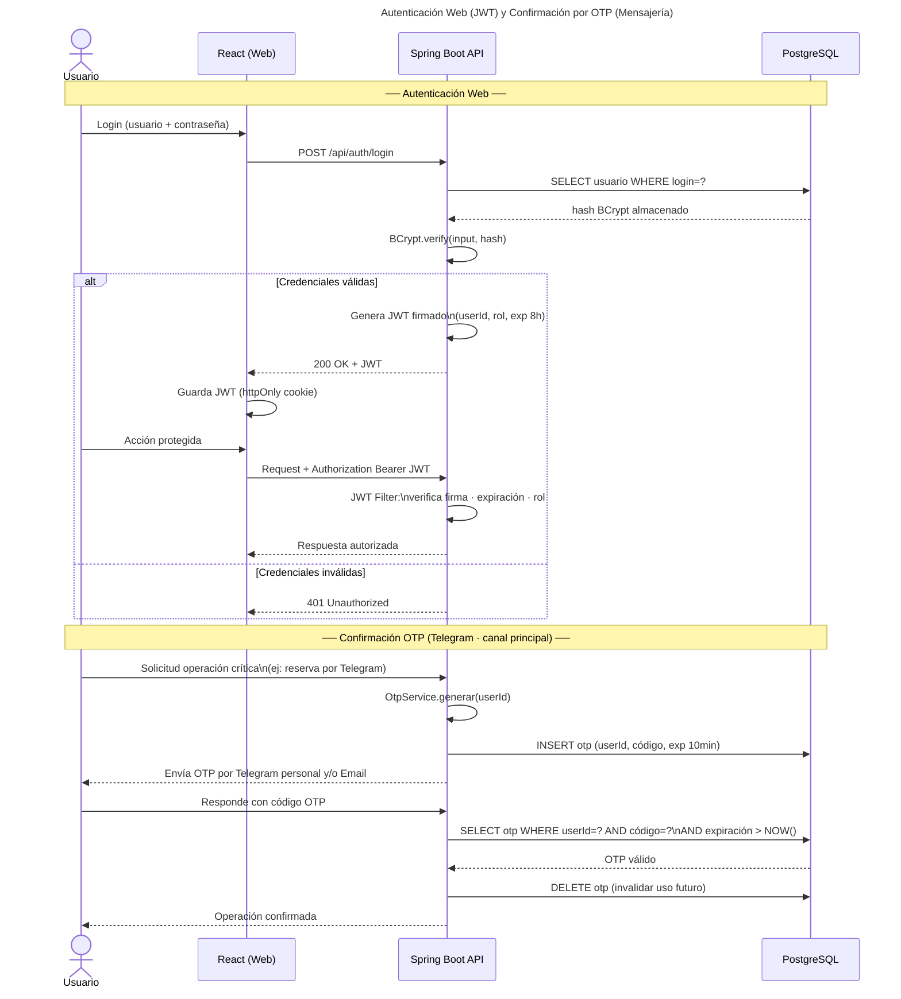
```mermaid
sequenceDiagram
    title Autenticación Web (JWT) y Confirmación por OTP (Mensajería)

    actor U as Usuario
    participant W as React (Web)
    participant API as Spring Boot API
    participant DB as PostgreSQL

    note over U,DB: ── Autenticación Web ──
    U->>W: Login (usuario + contraseña)
    W->>API: POST /api/auth/login
    API->>DB: SELECT usuario WHERE login=?
    DB-->>API: hash BCrypt almacenado
    API->>API: BCrypt.verify(input, hash)

    alt Credenciales válidas
        API->>API: Genera JWT firmado\n(userId, rol, exp 8h)
        API-->>W: 200 OK + JWT
        W->>W: Guarda JWT (httpOnly cookie)
        U->>W: Acción protegida
        W->>API: Request + Authorization Bearer JWT
        API->>API: JWT Filter:\nverifica firma · expiración · rol
        API-->>W: Respuesta autorizada
    else Credenciales inválidas
        API-->>W: 401 Unauthorized
    end

    note over U,DB: ── Confirmación OTP (Telegram · canal principal) ──
    U->>API: Solicitud operación crítica\n(ej: reserva por Telegram)
    API->>API: OtpService.generar(userId)
    API->>DB: INSERT otp (userId, código, exp 10min)
    API-->>U: Envía OTP por Telegram personal y/o Email
    U->>API: Responde con código OTP
    API->>DB: SELECT otp WHERE userId=? AND código=?\nAND expiración > NOW()
    DB-->>API: OTP válido
    API->>DB: DELETE otp (invalidar uso futuro)
    API-->>U: Operación confirmada
```

---

### 3.7 Análisis del Stack Tecnológico

#### 3.7.1 Stack Definido

| Capa | Tecnología | Versión | Notas |
|---|---|---|---|
| Frontend | React JS | 18.x | — |
| Backend | Spring Boot | 3.x | — |
| Lenguaje Backend | Java | 21 LTS | — |
| Base de Datos | PostgreSQL | 15.x | — |
| Infraestructura | Docker / Docker Compose | — | On-Premise |
| Tests Backend | JUnit 5 + Mockito + JaCoCo | — | Cobertura mín. 80% |
| Tests DB (unitarios) | H2 In-Memory | MODE=PostgreSQL | — |
| Tests Frontend | Jest + React Testing Library | — | — |
| Tests E2E | Cypress | — | Flujos críticos |
| Seguridad | Spring Security + JWT + BCrypt | — | — |
| API Specs | OpenAPI 3 / Swagger | — | — |
| Gestión de tareas | GitHub Projects + Copilot | — | — |
| Mensajería (v1.0) | **Telegram Bot API** | — | Canal principal. Gratuito. |
| Mensajería (v2) | WhatsApp Business API | — | Futuro. Requiere aprobación Meta. |
| Pasarela de pago | **Redsys** (default) | — | Configurable por administrador |
| SSL On-Premise | Let's Encrypt / Certbot | — | Certificado gratuito en NGINX |

---

#### 3.7.2 Ventajas del Stack Seleccionado

| Tecnología | Ventajas |
|---|---|
| **Spring Boot + Java 21** | Madurez empresarial probada. Virtual threads (Project Loom) para alta concurrencia. Spring Security ofrece JWT y RBAC listos para producción. Spring Data JPA reduce el boilerplate. Amplia comunidad y documentación. |
| **React JS** | Ecosistema masivo de componentes UI (calendarios, dashboards). SPA que minimiza la carga del servidor tras el login. Alta reutilización de componentes entre vistas. |
| **PostgreSQL** | ACID compliant. Row-level locking (`SELECT FOR UPDATE`) crítico para condiciones de carrera en reservas simultáneas. Funciona perfectamente en On-Premise sin coste de licencia. |
| **Docker Compose On-Premise** | Sin coste de infraestructura cloud. El cliente controla sus datos completamente. Entorno reproducible en desarrollo y producción. Fácil backup con volúmenes Docker. |
| **Telegram Bot API** | Completamente gratuita. Sin proceso de aprobación ni cuenta de empresa. SDK bien documentado. Permite envío de mensajes, OTP y recepción de webhooks sin restricciones. Ideal para comunidades pequeñas. |
| **Redsys** | Estándar de facto en España: compatible con todos los bancos españoles. Amplia documentación oficial. Soporta pagos con tarjeta, Bizum y TPV virtual. Proceso de integración conocido por la mayoría de proveedores web españoles. |
| **H2 + PostgreSQL (híbrido)** | H2 acelera tests unitarios sin I/O de red. PostgreSQL en integración garantiza fidelidad con producción. |
| **OpenAPI / Swagger** | Documentación autogenerada y siempre sincronizada con el código. Genera clientes tipados para el frontend. |

---

#### 3.7.3 Desventajas y Riesgos

| Tecnología | Desventajas / Riesgos |
|---|---|
| **Spring Boot + Java 21** | Arranque lento (~3-8s). Mayor consumo de memoria en reposo (~300-500MB). Para un servidor On-Premise modesto puede ser un factor: se recomienda mínimo 2GB RAM para el contenedor backend. |
| **React JS** | Sin SSR nativo. El bundle puede crecer sin disciplina de code-splitting. Requiere gestión explícita del estado global. |
| **PostgreSQL** | Requiere gestión manual de backups y actualizaciones en On-Premise. Sin un proceso de backup automático, existe riesgo de pérdida de datos ante fallo de hardware. |
| **Docker Compose On-Premise** | Responsabilidad de mantenimiento del servidor recae en el cliente (actualizaciones de SO, parches de seguridad, hardware). Sin alta disponibilidad nativa: si el servidor cae, el servicio cae. Requiere IP pública o DDNS para los webhooks de Telegram y Redsys. |
| **Telegram Bot API** | Dependencia de la disponibilidad de la infraestructura de Telegram (SLA no garantizado). Si Telegram cae o bloquea el bot, el canal de mensajería queda inoperativo. Migrar a WhatsApp requiere trabajo adicional. |
| **Redsys** | Integración técnicamente más compleja que Stripe o PayPal (SHA256 HMAC, formulario redirigido, entorno de pruebas separado). Exclusiva del mercado español: no sirve para internacionalización. Requiere contrato con el banco. |
| **WhatsApp Business API (v2)** | *(Riesgo diferido)* Requiere aprobación de Meta, cuenta empresa verificada y coste por mensaje. No recomendado para v1.0. |

---

#### 3.7.4 Stack Alternativo Propuesto

Dado el contexto confirmado (una sola instalación, On-Premise, Telegram como canal principal, Redsys como pasarela), se proponen las siguientes alternativas solo para fases futuras:

| Capa | v1.0 (actual) | Alternativa futura | Cuándo considerar |
|---|---|---|---|
| **Backend** | Spring Boot 3 | **Quarkus + Java 21** | Si el hardware On-Premise es muy limitado (<1GB RAM) o si los tiempos de arranque son críticos. ~50% menos memoria. |
| **Frontend** | React JS | **Next.js (React)** | Si se necesita SSR o mejorar los Core Web Vitals. Mantiene React como base. |
| **Base de Datos** | PostgreSQL | **PostgreSQL** *(mantener)* | Sin alternativa mejor para ACID + row-level locking. |
| **Mensajería** | Telegram Bot API | **+ WhatsApp Business API** | Fase 2: si los usuarios demandan WhatsApp. El puerto `MensajeriaPort` ya está preparado para añadir el adaptador sin tocar el dominio. |
| **Pasarela de pago** | Redsys (default) | **+ Stripe / PayPal** | Si se quiere ofrecer alternativas internacionales. Configurable por administrador gracias al puerto `PagoGatewayPort`. |
| **Infraestructura** | Docker Compose On-Premise | **+ Réplica en VPS** | Si se necesita alta disponibilidad o backup remoto automático. No requiere Kubernetes para una sola instalación. |
| **Autenticación** | Spring Security + JWT | **Keycloak** | Solo si se escala a múltiples instalaciones. Innecesario en v1.0. |

> **✅ Recomendación para v1.0:** El stack confirmado (Spring Boot + React + PostgreSQL + Docker Compose On-Premise + Telegram + Redsys) es la elección más ajustada al contexto real del proyecto: instalación única, sin coste de infraestructura cloud, canal de mensajería gratuito y pasarela de pago estándar en España. La arquitectura hexagonal garantiza que cualquier sustitución futura de adaptadores (WA, Stripe, VPS) se realice sin impacto en el dominio de negocio.

---

## 4. Modelo de Datos

### 4.1 Visión General de Entidades

El modelo de datos está compuesto por **8 entidades** organizadas en dos grupos:

| Grupo | Entidad | Responsabilidad | Filas estimadas |
|---|---|---|---|
| **Negocio Core** | `USERS` | Usuarios registrados de la plataforma | Decenas |
| **Negocio Core** | `RESERVATIONS` | Reservas de la pista con su estado completo | Cientos/año |
| **Negocio Core** | `PARTICIPANTS` | Participantes de cada reserva (registrados o externos) | 4× reservas |
| **Negocio Core** | `PAYMENTS` | Pago asociado a cada reserva | 1× reservas |
| **Transversal** | `OTP_CODES` | Códigos de confirmación temporales (TTL 10 min) | Baja rotación |
| **Transversal** | `AUDIT_LOG` | Registro inmutable de todas las acciones | Alta rotación |
| **Transversal** | `NOTIFICATION_LOG` | Registro de notificaciones enviadas (email/Telegram) | Alta rotación |
| **Configuración** | `SYSTEM_CONFIG` | Configuración global del sistema (singleton) | 1 fila |

**Decisiones de diseño:**
- `PAYMENTS` es una entidad separada de `RESERVATIONS` para respetar el principio de responsabilidad única y facilitar el módulo de ingresos del dashboard.
- `PARTICIPANTS` admite jugadores externos (no registrados) con `user_id = NULL` y nombre/teléfono libre, tal como describe el requisito.
- `SYSTEM_CONFIG` es un **singleton** (siempre `id = 1`). Contiene precio/hora, configuración de Redsys, Telegram y SMTP, todos los campos sensibles cifrados en base de datos.
- El número de teléfono (`phone`) en `USERS` es el identificador para mensajes directos por Telegram, ya que el usuario lo tiene configurado en su perfil.

---

### 4.2 Diagrama ER — Modelo de Negocio Core

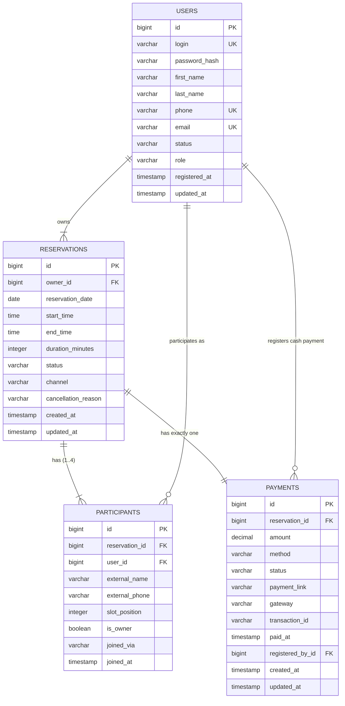
```mermaid
erDiagram
    USERS {
        bigint id PK
        varchar login UK
        varchar password_hash
        varchar first_name
        varchar last_name
        varchar phone UK
        varchar email UK
        varchar status
        varchar role
        timestamp registered_at
        timestamp updated_at
    }

    RESERVATIONS {
        bigint id PK
        bigint owner_id FK
        date reservation_date
        time start_time
        time end_time
        integer duration_minutes
        varchar status
        varchar channel
        varchar cancellation_reason
        timestamp created_at
        timestamp updated_at
    }

    PARTICIPANTS {
        bigint id PK
        bigint reservation_id FK
        bigint user_id FK
        varchar external_name
        varchar external_phone
        integer slot_position
        boolean is_owner
        varchar joined_via
        timestamp joined_at
    }

    PAYMENTS {
        bigint id PK
        bigint reservation_id FK
        decimal amount
        varchar method
        varchar status
        varchar payment_link
        varchar gateway
        varchar transaction_id
        timestamp paid_at
        bigint registered_by_id FK
        timestamp created_at
        timestamp updated_at
    }

    USERS ||--|{ RESERVATIONS : "owns"
    RESERVATIONS ||--|{ PARTICIPANTS : "has (1..4)"
    USERS ||--o{ PARTICIPANTS : "participates as"
    RESERVATIONS ||--|| PAYMENTS : "has exactly one"
    USERS ||--o{ PAYMENTS : "registers cash payment"
```

---

### 4.3 Diagrama ER — Modelo Transversal y Configuración

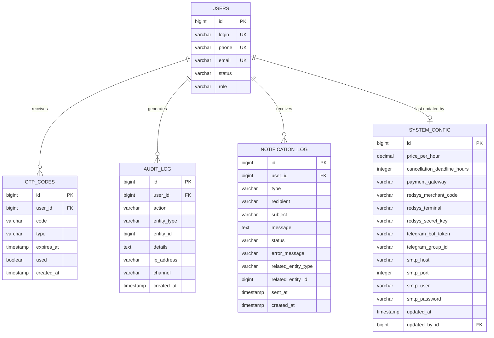
```mermaid
erDiagram
    USERS {
        bigint id PK
        varchar login UK
        varchar phone UK
        varchar email UK
        varchar status
        varchar role
    }

    OTP_CODES {
        bigint id PK
        bigint user_id FK
        varchar code
        varchar type
        timestamp expires_at
        boolean used
        timestamp created_at
    }

    AUDIT_LOG {
        bigint id PK
        bigint user_id FK
        varchar action
        varchar entity_type
        bigint entity_id
        text details
        varchar ip_address
        varchar channel
        timestamp created_at
    }

    NOTIFICATION_LOG {
        bigint id PK
        bigint user_id FK
        varchar type
        varchar recipient
        varchar subject
        text message
        varchar status
        varchar error_message
        varchar related_entity_type
        bigint related_entity_id
        timestamp sent_at
        timestamp created_at
    }

    SYSTEM_CONFIG {
        bigint id PK
        decimal price_per_hour
        integer cancellation_deadline_hours
        varchar payment_gateway
        varchar redsys_merchant_code
        varchar redsys_terminal
        varchar redsys_secret_key
        varchar telegram_bot_token
        varchar telegram_group_id
        varchar smtp_host
        integer smtp_port
        varchar smtp_user
        varchar smtp_password
        timestamp updated_at
        bigint updated_by_id FK
    }

    USERS ||--o{ OTP_CODES : "receives"
    USERS ||--o{ AUDIT_LOG : "generates"
    USERS ||--o{ NOTIFICATION_LOG : "receives"
    USERS ||--o| SYSTEM_CONFIG : "last updated by"
```

---

### 4.4 Definición Completa de Entidades

#### USERS

| Campo | Tipo | Constraints | Descripción |
|---|---|---|---|
| `id` | `BIGINT` | PK, AUTO_INCREMENT | Identificador único |
| `login` | `VARCHAR(50)` | UNIQUE, NOT NULL | Nombre de usuario para login |
| `password_hash` | `VARCHAR(255)` | NOT NULL | Contraseña cifrada con BCrypt |
| `first_name` | `VARCHAR(100)` | NOT NULL | Nombre |
| `last_name` | `VARCHAR(100)` | NOT NULL | Apellidos |
| `phone` | `VARCHAR(20)` | UNIQUE, NOT NULL | Teléfono. Usado como identificador para mensajes directos por Telegram y envío de OTP |
| `email` | `VARCHAR(150)` | UNIQUE, NOT NULL | Correo electrónico |
| `status` | `VARCHAR(10)` | NOT NULL, DEFAULT `'ACTIVE'` | `ACTIVE` \| `INACTIVE`. El usuario inactivo no puede operar |
| `role` | `VARCHAR(10)` | NOT NULL, DEFAULT `'USER'` | `ADMIN` \| `USER` |
| `registered_at` | `TIMESTAMP` | NOT NULL, DEFAULT NOW() | Fecha de alta en la plataforma |
| `updated_at` | `TIMESTAMP` | NOT NULL, DEFAULT NOW() | Última modificación |

---

#### RESERVATIONS

| Campo | Tipo | Constraints | Descripción |
|---|---|---|---|
| `id` | `BIGINT` | PK, AUTO_INCREMENT | Identificador único |
| `owner_id` | `BIGINT` | FK → USERS(id), NOT NULL | Titular de la reserva y responsable del pago |
| `reservation_date` | `DATE` | NOT NULL | Fecha de la reserva |
| `start_time` | `TIME` | NOT NULL | Hora de inicio |
| `end_time` | `TIME` | NOT NULL | Hora de fin (= start_time + duration_minutes) |
| `duration_minutes` | `INTEGER` | NOT NULL | Duración en minutos. Valores válidos: `60`, `90`, `120`, `150`, `180` |
| `status` | `VARCHAR(20)` | NOT NULL, DEFAULT `'CONFIRMED'` | `CONFIRMED` \| `CANCELLED` \| `PENDING_PAYMENT` \| `PAID` |
| `channel` | `VARCHAR(10)` | NOT NULL | `WEB` \| `TELEGRAM`. Canal por el que se creó la reserva |
| `cancellation_reason` | `VARCHAR(255)` | NULLABLE | Motivo de cancelación, si aplica |
| `created_at` | `TIMESTAMP` | NOT NULL, DEFAULT NOW() | Fecha y hora de creación |
| `updated_at` | `TIMESTAMP` | NOT NULL, DEFAULT NOW() | Última modificación |

**Regla de integridad:** No pueden existir dos reservas con el mismo `reservation_date` y franjas `start_time`/`end_time` solapadas. Se garantiza con constraint de unicidad compuesto y lock de fila en consultas de disponibilidad (`SELECT FOR UPDATE`).

---

#### PARTICIPANTS

| Campo | Tipo | Constraints | Descripción |
|---|---|---|---|
| `id` | `BIGINT` | PK, AUTO_INCREMENT | Identificador único |
| `reservation_id` | `BIGINT` | FK → RESERVATIONS(id), NOT NULL | Reserva a la que pertenece |
| `user_id` | `BIGINT` | FK → USERS(id), NULLABLE | Usuario registrado. `NULL` si es jugador externo |
| `external_name` | `VARCHAR(100)` | NULLABLE | Nombre del jugador externo (no registrado) |
| `external_phone` | `VARCHAR(20)` | NULLABLE | Teléfono del jugador externo |
| `slot_position` | `INTEGER` | NOT NULL, CHECK (1..4) | Posición en la reserva (1 = titular) |
| `is_owner` | `BOOLEAN` | NOT NULL, DEFAULT `false` | `true` solo para el titular de la reserva |
| `joined_via` | `VARCHAR(10)` | NOT NULL | `WEB` \| `TELEGRAM`. Canal por el que se incorporó |
| `joined_at` | `TIMESTAMP` | NOT NULL, DEFAULT NOW() | Momento de incorporación |

**Regla de integridad:** Por cada `reservation_id`, máximo 4 filas. `slot_position` único por reserva. Si `user_id IS NULL` entonces `external_name NOT NULL`.

---

#### PAYMENTS

| Campo | Tipo | Constraints | Descripción |
|---|---|---|---|
| `id` | `BIGINT` | PK, AUTO_INCREMENT | Identificador único |
| `reservation_id` | `BIGINT` | FK → RESERVATIONS(id), UNIQUE, NOT NULL | Una reserva tiene exactamente un pago |
| `amount` | `DECIMAL(10,2)` | NOT NULL | Importe calculado: `price_per_hour × (duration_minutes / 60)` |
| `method` | `VARCHAR(10)` | NULLABLE | `ONLINE` \| `CASH`. Nulo hasta que se selecciona método |
| `status` | `VARCHAR(10)` | NOT NULL, DEFAULT `'PENDING'` | `PENDING` \| `PAID` \| `CANCELLED` \| `REJECTED` |
| `payment_link` | `VARCHAR(500)` | NULLABLE | URL segura de Redsys generada para el pago online |
| `gateway` | `VARCHAR(10)` | NULLABLE | `REDSYS` \| `STRIPE` \| `PAYPAL` |
| `transaction_id` | `VARCHAR(100)` | NULLABLE | Referencia de la pasarela de pago |
| `paid_at` | `TIMESTAMP` | NULLABLE | Momento en que se confirmó el pago |
| `registered_by_id` | `BIGINT` | FK → USERS(id), NULLABLE | Admin que registró el pago en efectivo |
| `created_at` | `TIMESTAMP` | NOT NULL, DEFAULT NOW() | Fecha de creación del registro de pago |
| `updated_at` | `TIMESTAMP` | NOT NULL, DEFAULT NOW() | Última modificación |

---

#### OTP_CODES

| Campo | Tipo | Constraints | Descripción |
|---|---|---|---|
| `id` | `BIGINT` | PK, AUTO_INCREMENT | Identificador único |
| `user_id` | `BIGINT` | FK → USERS(id), NOT NULL | Usuario al que pertenece el código |
| `code` | `VARCHAR(10)` | NOT NULL | Código OTP generado (numérico de 6 dígitos) |
| `type` | `VARCHAR(30)` | NOT NULL | `RESERVATION_CONFIRM` \| `CANCELLATION_CONFIRM` \| `PASSWORD_RESET` |
| `expires_at` | `TIMESTAMP` | NOT NULL | Expiración: NOW() + 10 minutos |
| `used` | `BOOLEAN` | NOT NULL, DEFAULT `false` | `true` tras ser validado. Impide reutilización |
| `created_at` | `TIMESTAMP` | NOT NULL, DEFAULT NOW() | Momento de generación |

---

#### AUDIT_LOG

| Campo | Tipo | Constraints | Descripción |
|---|---|---|---|
| `id` | `BIGINT` | PK, AUTO_INCREMENT | Identificador único |
| `user_id` | `BIGINT` | FK → USERS(id), NULLABLE | Usuario que ejecutó la acción. `NULL` para acciones del sistema |
| `action` | `VARCHAR(100)` | NOT NULL | Código de acción: `RESERVATION_CREATED`, `PAYMENT_CONFIRMED`, `USER_DEACTIVATED`, `PASSWORD_RESET`... |
| `entity_type` | `VARCHAR(50)` | NOT NULL | Entidad afectada: `RESERVATION`, `PAYMENT`, `USER`, `CONFIG` |
| `entity_id` | `BIGINT` | NULLABLE | ID de la entidad afectada |
| `details` | `TEXT` | NULLABLE | JSON con información adicional (valores anteriores/nuevos) |
| `ip_address` | `VARCHAR(45)` | NULLABLE | IP del cliente (IPv4 o IPv6) |
| `channel` | `VARCHAR(10)` | NOT NULL | `WEB` \| `TELEGRAM` \| `SYSTEM` |
| `created_at` | `TIMESTAMP` | NOT NULL, DEFAULT NOW() | Momento de la acción. **Inmutable** |

---

#### NOTIFICATION_LOG

| Campo | Tipo | Constraints | Descripción |
|---|---|---|---|
| `id` | `BIGINT` | PK, AUTO_INCREMENT | Identificador único |
| `user_id` | `BIGINT` | FK → USERS(id), NULLABLE | Destinatario registrado. `NULL` para notificaciones al grupo |
| `type` | `VARCHAR(20)` | NOT NULL | `EMAIL` \| `TELEGRAM_DIRECT` \| `TELEGRAM_GROUP` |
| `recipient` | `VARCHAR(255)` | NOT NULL | Email, teléfono o `telegram_group_id` según el tipo |
| `subject` | `VARCHAR(255)` | NULLABLE | Asunto del email. Nulo para Telegram |
| `message` | `TEXT` | NOT NULL | Contenido del mensaje enviado |
| `status` | `VARCHAR(10)` | NOT NULL, DEFAULT `'PENDING'` | `PENDING` \| `SENT` \| `FAILED` |
| `error_message` | `VARCHAR(500)` | NULLABLE | Detalle del error si `status = FAILED` |
| `related_entity_type` | `VARCHAR(50)` | NULLABLE | Entidad relacionada: `RESERVATION`, `PAYMENT`, `USER` |
| `related_entity_id` | `BIGINT` | NULLABLE | ID de la entidad relacionada |
| `sent_at` | `TIMESTAMP` | NULLABLE | Momento del envío confirmado |
| `created_at` | `TIMESTAMP` | NOT NULL, DEFAULT NOW() | Momento de creación del registro |

---

#### SYSTEM_CONFIG

| Campo | Tipo | Constraints | Descripción |
|---|---|---|---|
| `id` | `BIGINT` | PK, CHECK (id = 1) | Singleton. Siempre `id = 1` |
| `price_per_hour` | `DECIMAL(10,2)` | NOT NULL | Precio por hora configurado por el administrador |
| `cancellation_deadline_hours` | `INTEGER` | NOT NULL, DEFAULT `2` | Horas de antelación mínima para cancelar sin penalización |
| `payment_gateway` | `VARCHAR(10)` | NOT NULL, DEFAULT `'REDSYS'` | `REDSYS` \| `STRIPE` \| `PAYPAL` |
| `redsys_merchant_code` | `VARCHAR(50)` | NULLABLE | Código de comercio Redsys |
| `redsys_terminal` | `VARCHAR(5)` | NULLABLE | Número de terminal Redsys |
| `redsys_secret_key` | `VARCHAR(255)` | NULLABLE | Clave HMAC SHA-256 Redsys. **Cifrada en BD** |
| `telegram_bot_token` | `VARCHAR(255)` | NULLABLE | Token del bot de Telegram. **Cifrado en BD** |
| `telegram_group_id` | `VARCHAR(50)` | NULLABLE | ID del grupo de Telegram de la comunidad |
| `smtp_host` | `VARCHAR(100)` | NULLABLE | Servidor SMTP para envío de email |
| `smtp_port` | `INTEGER` | NULLABLE | Puerto SMTP (ej. 587) |
| `smtp_user` | `VARCHAR(100)` | NULLABLE | Usuario SMTP |
| `smtp_password` | `VARCHAR(255)` | NULLABLE | Contraseña SMTP. **Cifrada en BD** |
| `updated_at` | `TIMESTAMP` | NOT NULL, DEFAULT NOW() | Última modificación |
| `updated_by_id` | `BIGINT` | FK → USERS(id), NULLABLE | Admin que realizó el último cambio |

---

### 4.5 Relaciones y Cardinalidades

| Relación | Tipo | Descripción |
|---|---|---|
| `USERS` → `RESERVATIONS` | 1 : N | Un usuario puede tener múltiples reservas como titular |
| `RESERVATIONS` → `PARTICIPANTS` | 1 : N (1..4) | Una reserva tiene entre 1 y 4 participantes |
| `USERS` → `PARTICIPANTS` | 1 : N (opcional) | Un usuario registrado puede aparecer en múltiples reservas como participante |
| `RESERVATIONS` → `PAYMENTS` | 1 : 1 | Cada reserva tiene exactamente un registro de pago |
| `USERS` → `PAYMENTS` | 1 : N (opcional) | Un admin puede registrar múltiples pagos en efectivo |
| `USERS` → `OTP_CODES` | 1 : N | Un usuario puede tener múltiples códigos OTP (distintos tipos) |
| `USERS` → `AUDIT_LOG` | 1 : N (opcional) | Un usuario genera múltiples entradas de auditoría |
| `USERS` → `NOTIFICATION_LOG` | 1 : N (opcional) | Un usuario puede recibir múltiples notificaciones |
| `USERS` → `SYSTEM_CONFIG` | 1 : 0..1 | El admin que actualizó por última vez la configuración |

---

### 4.6 Estrategia de Índices

| Tabla | Índice | Columnas | Justificación |
|---|---|---|---|
| `USERS` | `idx_users_login` | `login` | Login en cada autenticación |
| `USERS` | `idx_users_phone` | `phone` | Búsqueda por teléfono para OTP y Telegram |
| `USERS` | `idx_users_email` | `email` | Búsqueda para reset de contraseña |
| `RESERVATIONS` | `idx_res_date_time` | `reservation_date, start_time` | Consultas de disponibilidad (crítico) |
| `RESERVATIONS` | `idx_res_owner` | `owner_id` | Historial de reservas por usuario |
| `RESERVATIONS` | `idx_res_status` | `status` | Filtrado por estado en el dashboard |
| `PARTICIPANTS` | `idx_part_reservation` | `reservation_id` | Carga de participantes por reserva |
| `PARTICIPANTS` | `idx_part_user` | `user_id` | Reservas en las que participa un usuario |
| `PAYMENTS` | `idx_pay_reservation` | `reservation_id` | Acceso al pago desde la reserva (UNIQUE) |
| `PAYMENTS` | `idx_pay_status` | `status` | Listado de pagos pendientes |
| `OTP_CODES` | `idx_otp_user_type` | `user_id, type, used` | Validación de OTP por usuario y tipo |
| `OTP_CODES` | `idx_otp_expires` | `expires_at` | Limpieza periódica de códigos expirados |
| `AUDIT_LOG` | `idx_audit_user` | `user_id` | Historial de acciones por usuario |
| `AUDIT_LOG` | `idx_audit_entity` | `entity_type, entity_id` | Trazabilidad de una entidad concreta |
| `AUDIT_LOG` | `idx_audit_created` | `created_at` | Filtrado por rango de fechas en el dashboard |
| `NOTIFICATION_LOG` | `idx_notif_user` | `user_id` | Notificaciones de un usuario |
| `NOTIFICATION_LOG` | `idx_notif_status` | `status` | Detección de notificaciones fallidas |

> **Nota:** Los campos sensibles de `SYSTEM_CONFIG` (`redsys_secret_key`, `telegram_bot_token`, `smtp_password`) se almacenan cifrados mediante AES-256 a nivel de aplicación antes de persistirlos en base de datos.
