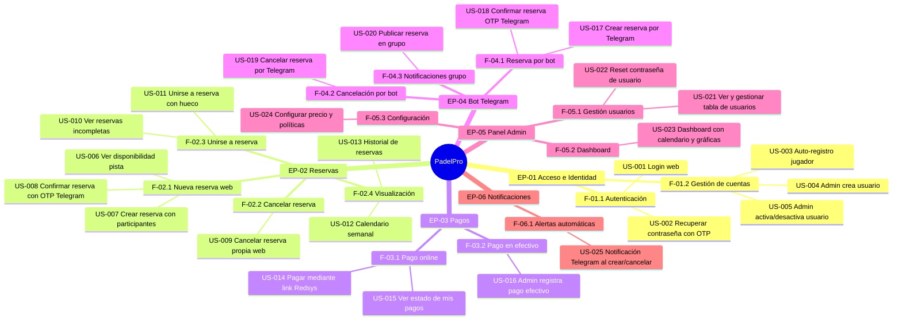
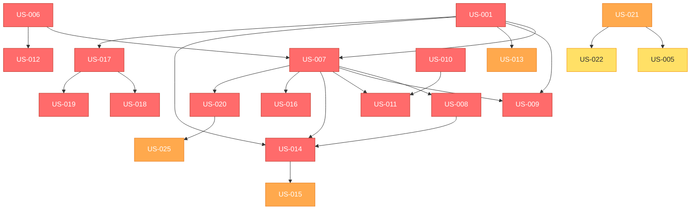
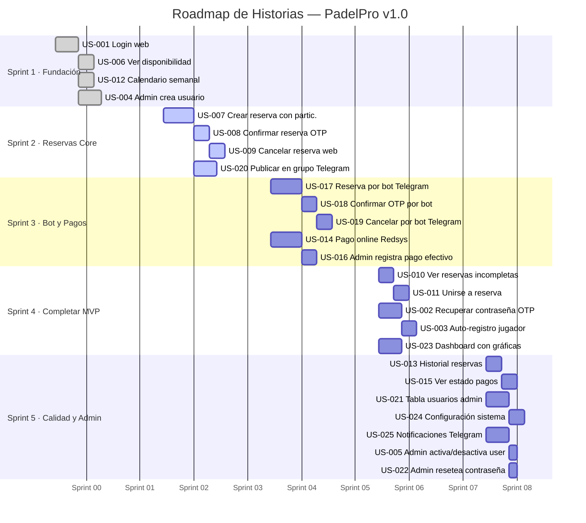
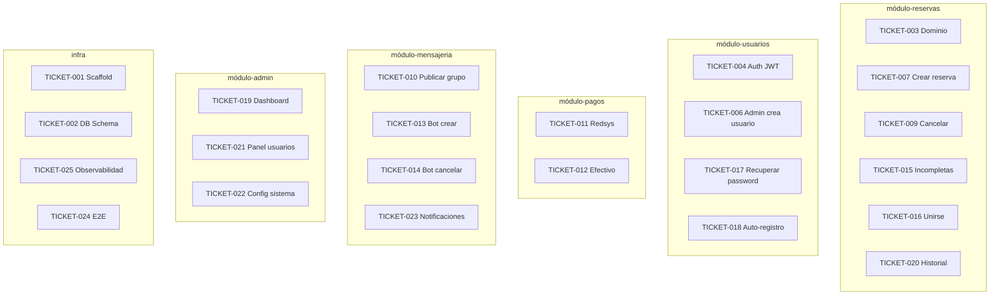
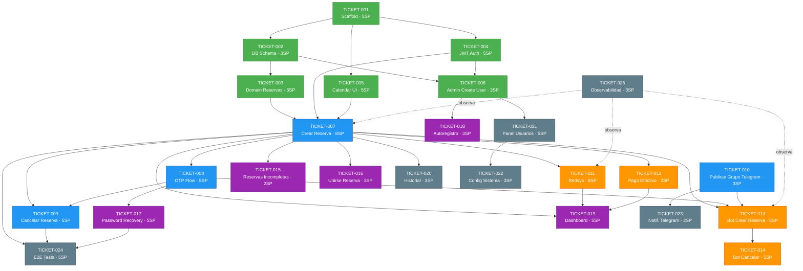
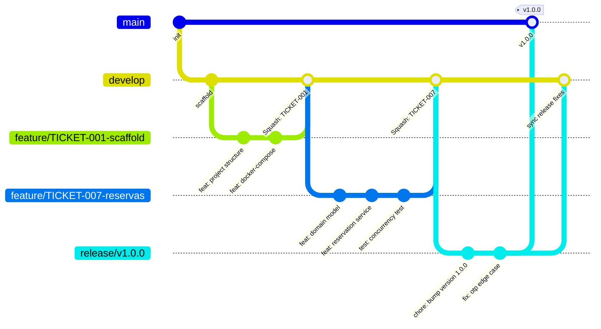
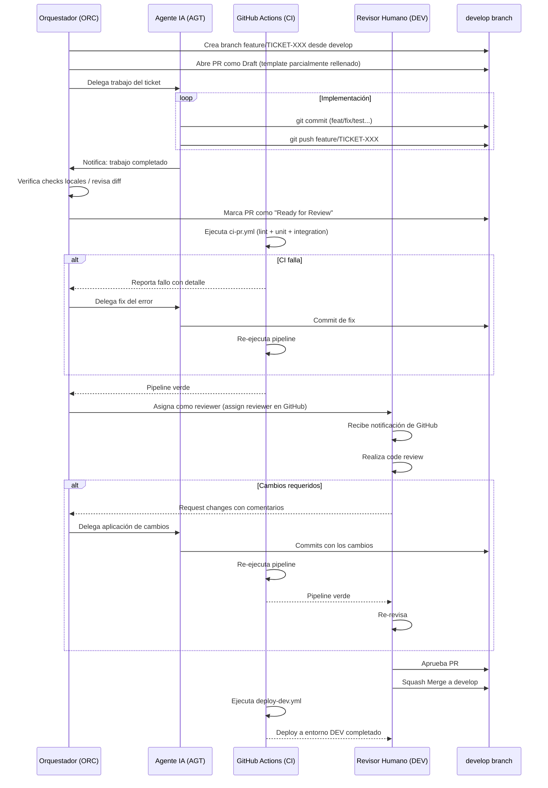
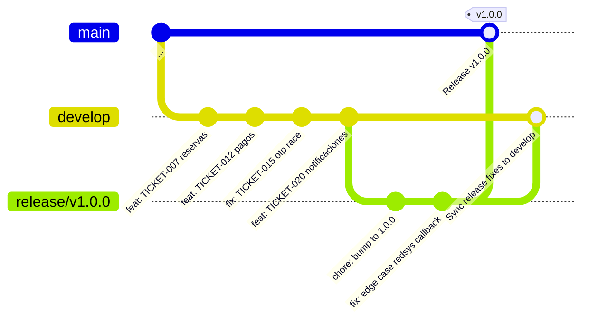

# PadelPro - Sistema de Gestión de Reservas de Pádel - Planificación y Estrategia

---

## Índice

1. [Historias de Usuario](#1-historias-de-usuario)
   - 1.1 [Criterios de Priorización](#11-criterios-de-priorización)
   - 1.2 [Escala de Story Points](#12-escala-de-story-points)
   - 1.3 [Árbol Épicas → Features → Historias](#13-árbol-épicas--features--historias)
   - 1.4 [Mapa de Dependencias entre Historias](#14-mapa-de-dependencias-entre-historias)
   - 1.5 [Riesgos Técnicos por Historia](#15-riesgos-técnicos-por-historia)
   - 1.6 [Matriz de Priorización](#16-matriz-de-priorización)
   - 1.7 [Orden de Implementación Recomendado](#17-orden-de-implementación-recomendado)
   - 1.8 [Épicas y Historias de Usuario](#18-épicas-y-historias-de-usuario)
   - 1.9 [Roadmap de Sprints](#19-roadmap-de-sprints)
   - 1.10 [Tabla Resumen de Historias](#110-tabla-resumen-de-historias)
2. [Tickets de trabajo](#2-tickets-de-trabajo)
   - 2.1 [Estructura de Tickets](#21-estructura-de-tickets)
   - 2.2 [Flujo Kanban GitHub Projects](#22-flujo-kanban-github-projects)
   - 2.3 [Tickets por Sprint](#23-tickets-por-sprint)
   - 2.6 [Dependencias entre Tickets y Ruta Crítica](#26-dependencias-entre-tickets-y-ruta-crítica)
   - 2.7 [Puntos de Integración Frontend / Backend / Base de Datos](#27-puntos-de-integración-frontend--backend--base-de-datos)
   - 2.8 [Criterios de Revisión de Código](#28-criterios-de-revisión-de-código)
   - 2.9 [Proceso de Testing Conjunto](#29-proceso-de-testing-conjunto)
   - 2.10 [Definition of Done Maestro](#210-definition-of-done-maestro)
3. [Pull Requests](#3-pull-requests)
   - 3.1 [Estrategia de Ramas](#31-estrategia-de-ramas)
   - 3.2 [Convención de Commits](#32-convención-de-commits)
   - 3.3 [Template de Pull Request](#33-template-de-pull-request)
   - 3.4 [Proceso de Revisión](#34-proceso-de-revisión)
   - 3.5 [Reglas de Revisión de Código](#35-reglas-de-revisión-de-código)
   - 3.6 [Configuración de GitHub Actions — CI Pipeline](#36-configuración-de-github-actions--ci-pipeline)
   - 3.7 [Ejemplos de PRs por Tipo](#37-ejemplos-de-prs-por-tipo)
   - 3.8 [Métricas de Calidad Objetivo](#38-métricas-de-calidad-objetivo)


## 1. Historias de Usuario

### 1.1 Criterios de Priorización

Las historias se priorizan combinando **MoSCoW** con cuatro ejes de valor objetivos extraídos directamente de la documentación:

| Eje | Descripción | Peso |
|---|---|---|
| **Valor de negocio** | ¿Resuelve directamente el problema de solapamientos y falta de registro económico? | Alto |
| **Riesgo técnico** | ¿Bloquea otras historias si no se implementa antes? (dependencias) | Alto |
| **Frecuencia de uso** | ¿Cuántas veces al día/semana ejecutará esta acción un usuario real? | Medio |
| **Cobertura de flujo crítico** | ¿Está identificada como flujo de cobertura 100% obligatoria en la descripción? | Alto |

**Escala MoSCoW aplicada:**

| Prioridad | Criterio de inclusión |
|---|---|
| 🔴 **MUST** | Sin esta historia el MVP no puede validarse ni desplegarse |
| 🟠 **SHOULD** | Aporta valor significativo; el MVP funciona sin ella pero queda incompleto |
| 🟡 **COULD** | Mejora la experiencia; se planifica si queda capacidad en el sprint |
| ⚪ **WON'T (v1.0)** | Diferido explícitamente (ej. WhatsApp Business API, multi-pista) |

**Checklist INVEST** — aplicado a cada historia antes de entrar a sprint:

| Letra | Criterio | Pregunta de validación |
|---|---|---|
| **I** | *Independent* | ¿Puede desarrollarse sin depender del estado de otra historia? |
| **N** | *Negotiable* | ¿El alcance es ajustable en la negociación de sprint? |
| **V** | *Valuable* | ¿Aporta valor observable al usuario final? |
| **E** | *Estimable* | ¿El equipo puede estimar puntos de historia con la información disponible? |
| **S** | *Small* | ¿Cabe en un sprint de dos semanas? |
| **T** | *Testable* | ¿Los criterios de aceptación son verificables automáticamente? |

---

### 1.2 Escala de Story Points

Se usa la escala **Fibonacci** (1, 2, 3, 5, 8, 13). Una historia con 13 SP es una señal de que debe partirse antes de entrar a sprint.

| SP | Significado |
|---|---|
| 1 | Cambio trivial (config, texto, estilo) |
| 2 | CRUD simple, una sola capa, sin lógica compleja |
| 3 | Funcionalidad con lógica de negocio simple + frontend básico |
| 5 | Flujo multi-paso, integración entre ≥2 módulos internos, o lógica OTP/estado |
| 8 | Integración con sistema externo (Redsys, Telegram API) + flujo crítico + tests |
| 13 | Historia demasiado grande, **debe partirse** |

**Historias de referencia (anchors):**

| SP | Historia de referencia | Justificación |
|---|---|---|
| 2 SP | US-005 — toggle estado usuario | CRUD simple, un endpoint, un botón |
| 3 SP | US-001 — login web | Formulario + JWT + BCrypt, conocido y acotado |
| 5 SP | US-008 — confirmar OTP | Multi-paso: generar OTP, enviar Telegram, validar, cambiar estado |
| 8 SP | US-014 — pago Redsys | Integración externa HMAC SHA-256 + webhook + estados |

---

### 1.3 Árbol Épicas → Features → Historias



---

### 1.4 Mapa de Dependencias entre Historias

Las flechas indican "bloquea": la historia de origen debe estar DONE antes de que la de destino entre a sprint.



---

### 1.5 Riesgos Técnicos por Historia

| Historia | Riesgo | Nivel | Mitigación |
|---|---|:---:|---|
| US-007 | Condición de carrera en creación simultánea de reserva para la misma franja | 🔴 ALTO | `SELECT FOR UPDATE` + constraint `EXCLUDE USING gist` en PostgreSQL |
| US-008 | Retraso o fallo en entrega del OTP por Telegram | 🟠 MEDIO | Timeout 5 s, reintento x1, botón "reenviar código" en el frontend |
| US-009 | Usuario cancela y no se notifica automáticamente a los participantes | 🟠 MEDIO | Notificación automática en el evento de transición a estado CANCELLED |
| US-014 | Integración Redsys: firma HMAC SHA-256 distinta entre entorno real y sandbox | 🔴 ALTO | Adapter desacoplado `PagoGatewayPort`; tests con mock firmado que replican la respuesta Redsys |
| US-017 | Parsing de lenguaje natural del comando de reserva por Telegram | 🟠 MEDIO | Regex estricta para el formato esperado + mensaje de ayuda de formato si no coincide |
| US-018 | OTP enviado correctamente pero no recibido (usuario no ha iniciado chat con el bot) | 🟠 MEDIO | Log de entrega, reintentos automáticos, instrucción "inicia chat con el bot primero" al registrarse |
| US-020 | Decidir si editar el mensaje existente o publicar uno nuevo al unirse un participante | 🟡 BAJO | Guardar `message_id` del grupo en la tabla `RESERVATIONS` para usar `editMessageText` en lugar de `sendMessage` |
| US-024 | Cambio de configuración de precio afecta reservas ya creadas | 🟠 MEDIO | El importe se congela (snapshot) en el momento de crear la reserva; la configuración solo aplica a nuevas reservas |

---

### 1.6 Matriz de Priorización

#### 1.6.1 Cuadro de Estimación de Priorización

Cada historia se evalúa en cuatro ejes: **Impacto/Valor**, **Urgencia**, **Complejidad/Esfuerzo** y **Riesgos/Dependencias**. Escala: 🔴 Alto · 🟠 Medio · 🟢 Bajo.

| ID | Historia | Impacto y Valor de Negocio | Urgencia | Complejidad y Esfuerzo | Riesgos y Dependencias | SP |
|:---:|---|:---:|:---:|:---:|:---:|:---:|
| US-001 | Login web con credenciales | 🔴 Alto | 🔴 Alta | 🟢 Baja | 🟢 Baja | 3 |
| US-002 | Recuperar contraseña OTP Telegram | 🔴 Alto | 🟠 Media | 🟠 Media | 🟠 Media | 5 |
| US-003 | Auto-registro de jugador | 🟠 Medio | 🟢 Baja | 🟢 Baja | 🟢 Baja | 3 |
| US-004 | Admin crea usuario con credenciales | 🟠 Medio | 🟠 Media | 🟢 Baja | 🟢 Baja | 3 |
| US-005 | Admin activa / desactiva usuario | 🟢 Bajo | 🟢 Baja | 🟢 Baja | 🟠 Media (dep. US-021) | 2 |
| US-006 | Ver disponibilidad de la pista | 🔴 Alto | 🔴 Alta | 🟢 Baja | 🟢 Baja | 3 |
| US-007 | Crear reserva con participantes | 🔴 Alto | 🔴 Alta | 🔴 Alta | 🔴 Alta | 8 |
| US-008 | Confirmar reserva con OTP Telegram | 🔴 Alto | 🔴 Alta | 🟠 Media | 🔴 Alta (dep. US-007) | 5 |
| US-009 | Cancelar reserva propia web | 🔴 Alto | 🔴 Alta | 🟠 Media | 🟠 Media | 5 |
| US-010 | Ver reservas incompletas de la semana | 🔴 Alto | 🟠 Media | 🟢 Baja | 🟠 Media | 2 |
| US-011 | Unirse a reserva existente | 🔴 Alto | 🟠 Media | 🟢 Baja | 🟠 Media (dep. US-010) | 3 |
| US-012 | Ver calendario semanal de reservas | 🔴 Alto | 🔴 Alta | 🟢 Baja | 🟢 Baja | 3 |
| US-013 | Ver historial propio con filtros | 🟠 Medio | 🟢 Baja | 🟢 Baja | 🟢 Baja | 3 |
| US-014 | Pagar reserva mediante link Redsys | 🔴 Alto | 🔴 Alta | 🔴 Alta | 🔴 Alta | 8 |
| US-015 | Ver estado de mis pagos | 🟠 Medio | 🟢 Baja | 🟢 Baja | 🟢 Baja | 2 |
| US-016 | Admin registra pago en efectivo | 🔴 Alto | 🔴 Alta | 🟢 Baja | 🟢 Baja | 3 |
| US-017 | Crear reserva por bot Telegram | 🔴 Alto | 🔴 Alta | 🔴 Alta | 🔴 Alta | 8 |
| US-018 | Confirmar reserva OTP por bot | 🔴 Alto | 🔴 Alta | 🟠 Media | 🔴 Alta (dep. US-017) | 5 |
| US-019 | Cancelar reserva por bot Telegram | 🔴 Alto | 🔴 Alta | 🟠 Media | 🔴 Alta | 5 |
| US-020 | Publicar reserva en grupo Telegram | 🔴 Alto | 🔴 Alta | 🟠 Media | 🟠 Media | 3 |
| US-021 | Ver y gestionar tabla de usuarios | 🟠 Medio | 🟠 Media | 🟢 Baja | 🟢 Baja | 3 |
| US-022 | Admin resetea contraseña de usuario | 🟢 Bajo | 🟢 Baja | 🟢 Baja | 🟠 Media | 2 |
| US-023 | Dashboard con calendario y gráficas | 🟠 Medio | 🟠 Media | 🟠 Media | 🟢 Baja | 5 |
| US-024 | Configurar precio, plazo y pasarela | 🟠 Medio | 🟢 Baja | 🟠 Media | 🟠 Media | 3 |
| US-025 | Notificaciones Telegram al crear/cancelar | 🟠 Medio | 🟠 Media | 🟢 Baja | 🟠 Media | 3 |

---

#### 1.6.2 Mapa Valor vs Complejidad

> Eje horizontal: Complejidad de implementación · Eje vertical: Valor de negocio.

|  | ◀ **BAJA COMPLEJIDAD** | **ALTA COMPLEJIDAD** ▶ |
|:---:|---|---|
| **▲ ALTO VALOR** | 🟢 **IMPLEMENTAR PRIMERO** | 🔴 **PLANIFICAR CON CUIDADO** |
| | `US-001` Login web · 3 SP | `US-007` Crear reserva · 8 SP |
| | `US-002` Recuperar contraseña OTP · 5 SP | `US-014` Pago Redsys · 8 SP |
| | `US-006` Ver disponibilidad · 3 SP | `US-017` Bot crear reserva · 8 SP |
| | `US-008` Confirmar OTP web · 5 SP | `US-018` Confirmar OTP bot · 5 SP |
| | `US-009` Cancelar reserva web · 5 SP | `US-019` Cancelar reserva bot · 5 SP |
| | `US-010` Ver reservas incompletas · 2 SP | |
| | `US-011` Unirse a reserva · 3 SP | |
| | `US-012` Calendario semanal · 3 SP | |
| | `US-016` Pago en efectivo · 3 SP | |
| | `US-020` Publicar en grupo Telegram · 3 SP | |
| **▼ BAJO VALOR** | ⚪ **BAJA PRIORIDAD** | 🟡 **QUICK WINS** |
| | `US-003` Auto-registro jugador · 3 SP | *(ninguna historia en v1.0)* |
| | `US-004` Admin crea usuario · 3 SP | |
| | `US-005` Toggle activo/inactivo · 2 SP | |
| | `US-013` Historial con filtros · 3 SP | |
| | `US-015` Ver estado pagos · 2 SP | |
| | `US-021` Tabla de usuarios · 3 SP | |
| | `US-022` Reset contraseña admin · 2 SP | |
| | `US-023` Dashboard y gráficas · 5 SP | |
| | `US-024` Configuración sistema · 3 SP | |
| | `US-025` Notificaciones Telegram · 3 SP | |

---

### 1.7 Orden de Implementación Recomendado

| Sprint | Objetivo | Historias | Justificación |
|---|---|---|---|
| **1 — Fundación** | Infraestructura + acceso + visualización | US-001, US-006, US-012, US-004 | Sin autenticación nada funciona. US-006 y US-012 son read-only, de bajo riesgo, validan el stack antes de escribir datos |
| **2 — Reservas core (web)** | Flujo completo de reserva + cancelación + publicación | US-007, US-008, US-009, US-020 | US-007 es el núcleo del producto. US-020 depende de US-007. Sprint más denso en SP (21 SP) pero cierra el flujo end-to-end |
| **3 — Bot + Pagos** | Canal Telegram + cobro | US-017, US-018, US-019, US-014, US-016 | Los flujos críticos de bot (100% cobertura) y el pago son los de mayor riesgo técnico; se implementan juntos para validar la integración Telegram + Redsys |
| **4 — MVP completo** | Completar reservas + acceso autónomo + dashboard | US-010, US-011, US-002, US-003, US-023 | Completa el ciclo de unirse a reservas y el autoservicio de usuarios |
| **5 — Calidad y Admin** | Historial, gestión admin, configuración | US-013, US-015, US-021, US-022, US-024, US-025, US-005 | Historias SHOULD/COULD que no bloquean el MVP pero completan la plataforma |

---

### 1.8 Épicas y Historias de Usuario

---

#### EP-01 — Gestión de Acceso e Identidad

> **Objetivo:** Garantizar que solo usuarios dados de alta pueden operar en la plataforma, con autenticación segura y gestión de cuentas por parte del administrador.

---

##### US-001 · Login web con credenciales

> 🔴 MUST · EP-01 · F-01.1

**Historia:**
> Como **jugador registrado**, quiero iniciar sesión con mi usuario y contraseña, para acceder a mis reservas y funciones de la plataforma.

**INVEST:**

| I | N | V | E | S | T |
|:---:|:---:|:---:|:---:|:---:|:---:|
| ✅ | ✅ | ✅ | ✅ | ✅ | ✅ |

**Estimación:** 3 SP — Formulario de login + BCrypt + JWT HS256, flujo conocido y perfectamente acotado.

**Criterios de aceptación (BDD):**

```gherkin
Scenario: Login correcto con credenciales válidas
  Given un usuario con login "luis" y contraseña "miPass123" dado de alta y activo
  When introduce sus credenciales en el formulario de login y pulsa "Entrar"
  Then recibe un JWT válido
  And es redirigido al Dashboard

Scenario: Login con contraseña incorrecta
  Given un usuario con login "luis" dado de alta y activo
  When introduce la contraseña incorrecta
  Then ve el mensaje de error "Usuario o contraseña incorrectos"
  And permanece en la pantalla de login

Scenario: Login de usuario inactivo
  Given un usuario con login "marcos" con estado INACTIVE
  When intenta iniciar sesión con credenciales correctas
  Then recibe el error "Tu cuenta está desactivada. Contacta con el administrador"
  And no recibe token JWT

Scenario: Login de cuenta pendiente de aprobación
  Given un usuario auto-registrado con estado PENDING
  When intenta iniciar sesión
  Then recibe el error "Tu cuenta está pendiente de aprobación por el administrador"
```

**Notas técnicas:** `POST /api/auth/login` · BCrypt password compare · JWT HS256 · Rol incluido en payload

---

##### US-002 · Recuperar contraseña olvidada con OTP por Telegram

> 🔴 MUST · EP-01 · F-01.1

**Historia:**
> Como **jugador registrado**, quiero poder recuperar mi contraseña desde la pantalla de login mediante un código OTP enviado a mi Telegram, para retomar el acceso sin depender del administrador.

**INVEST:**

| I | N | V | E | S | T |
|:---:|:---:|:---:|:---:|:---:|:---:|
| ✅ | ✅ | ✅ | ✅ | ✅ | ✅ |

**Estimación:** 5 SP — Flujo multi-paso (solicitud → OTP → validación → nueva contraseña), similar a US-008 en complejidad.

**Criterios de aceptación (BDD):**

```gherkin
Scenario: Solicitar reset de contraseña con teléfono válido
  Given un usuario registrado con teléfono "+34612345678" vinculado a Telegram
  When introduce su teléfono en el formulario "¿Olvidaste tu contraseña?"
  Then recibe un código OTP de 6 dígitos por Telegram personal
  And el código tiene una validez de 10 minutos

Scenario: Confirmar reset con OTP correcto
  Given un usuario con OTP válido recibido por Telegram
  When introduce el OTP y su nueva contraseña (mín. 8 caracteres)
  Then su contraseña queda actualizada
  And el OTP queda marcado como usado (no reutilizable)
  And es redirigido al Login

Scenario: OTP expirado
  Given un usuario con OTP generado hace más de 10 minutos
  When introduce el OTP caducado
  Then ve el mensaje "El código ha expirado. Solicita uno nuevo"

Scenario: OTP ya utilizado
  Given un usuario que ya usó su OTP para resetear la contraseña
  When intenta usar el mismo OTP de nuevo
  Then ve el mensaje "Este código ya ha sido utilizado"
```

**Notas técnicas:** `POST /api/auth/password/solicitar-reset` + `POST /api/auth/password/confirmar-reset` · OTP type: `PASSWORD_RESET` · TTL 10 min

---

##### US-003 · Auto-registro de jugador

> 🟠 SHOULD · EP-01 · F-01.2

**Historia:**
> Como **jugador sin cuenta**, quiero poder registrarme yo mismo en la plataforma, para solicitar acceso sin necesitar al administrador en ese momento.

**INVEST:**

| I | N | V | E | S | T |
|:---:|:---:|:---:|:---:|:---:|:---:|
| ✅ | ✅ | ✅ | ✅ | ✅ | ✅ |

**Estimación:** 3 SP — Formulario de alta con validaciones + creación en estado PENDING + notificación al admin; sin lógica de negocio compleja.

**Criterios de aceptación (BDD):**

```gherkin
Scenario: Auto-registro exitoso
  Given un visitante no registrado en el formulario de registro
  When rellena login, nombre, apellidos, teléfono, email y contraseña válidos
  Then se crea su cuenta con estado PENDING
  And ve el mensaje "Tu solicitud ha sido enviada. El administrador la activará en breve"
  And el administrador recibe una notificación por Telegram de nuevo usuario pendiente

Scenario: Login duplicado en el registro
  Given un visitante que intenta registrarse
  When introduce un login que ya existe en la plataforma
  Then ve el error "Este nombre de usuario ya está en uso"

Scenario: Usuario PENDING intenta operar
  Given un usuario con estado PENDING
  When intenta acceder al Dashboard
  Then se le muestra "Tu cuenta está pendiente de aprobación"
```

---

##### US-004 · Administrador crea usuario con envío de credenciales

> 🟠 SHOULD · EP-01 · F-01.2

**Historia:**
> Como **administrador**, quiero crear un usuario nuevo directamente desde el panel, para que reciba sus credenciales por Telegram y pueda acceder de inmediato.

**INVEST:**

| I | N | V | E | S | T |
|:---:|:---:|:---:|:---:|:---:|:---:|
| ✅ | ✅ | ✅ | ✅ | ✅ | ✅ |

**Estimación:** 3 SP — CRUD de usuario + generación de contraseña temporal + envío por Telegram; lógica sencilla y bien definida.

**Criterios de aceptación (BDD):**

```gherkin
Scenario: Creación exitosa de usuario por el administrador
  Given el administrador en la sección "Usuarios" del panel de administración
  When rellena el formulario con login, nombre, apellidos, teléfono, email y rol
  And pulsa "Crear usuario"
  Then se crea el usuario con estado ACTIVE
  And el sistema genera una contraseña temporal
  And envía un mensaje de Telegram al número de teléfono del nuevo usuario con sus credenciales
  And registra la acción en el log de auditoría

Scenario: Creación con teléfono duplicado
  Given el administrador creando un nuevo usuario
  When introduce un número de teléfono ya registrado
  Then ve el error "Este teléfono ya está asociado a otro usuario"
```

---

##### US-005 · Administrador activa o desactiva un usuario

> 🟡 COULD · EP-01 · F-01.2
>
> **Dependencia:** requiere US-021 (la acción se realiza desde la tabla de usuarios).

**Historia:**
> Como **administrador**, quiero activar o desactivar un usuario desde la tabla de usuarios, para controlar quién puede operar en la plataforma sin borrar datos históricos.

**INVEST:**

| I | N | V | E | S | T |
|:---:|:---:|:---:|:---:|:---:|:---:|
| ⚠️ dep. US-021 | ✅ | ✅ | ✅ | ✅ | ✅ |

**Estimación:** 2 SP — CRUD simple: un endpoint `PATCH /api/admin/usuarios/{id}/estado`, un botón/icono en la tabla. Anchor de referencia de 2 SP.

**Criterios de aceptación (BDD):**

```gherkin
Scenario: Desactivar usuario activo desde la tabla
  Given el administrador en la tabla de usuarios
  When pulsa el icono de desactivar del usuario "marcos" con estado ACTIVE
  Then el estado del usuario cambia a INACTIVE
  And si "marcos" intenta acceder recibe "Tu cuenta está desactivada"
  And la acción queda registrada en auditoría

Scenario: Activar cuenta PENDING tras auto-registro
  Given una cuenta con estado PENDING en la tabla
  When el administrador pulsa "Aprobar"
  Then el estado cambia a ACTIVE
  And el usuario recibe notificación por Telegram "Tu cuenta ha sido activada"

Scenario: El icono refleja el estado actual del usuario
  Given la tabla de usuarios cargada
  Then los usuarios con estado INACTIVE muestran el icono en estado desactivado (gris)
  And los usuarios ACTIVE muestran el icono en estado activado

Scenario: Intentar desactivar usuario con reservas CONFIRMED activas
  Given el usuario "pedro" tiene reservas futuras en estado CONFIRMED
  When el administrador pulsa "Desactivar"
  Then el sistema muestra el aviso "Este usuario tiene reservas activas. ¿Deseas desactivarlo igualmente?"
  And si el administrador confirma, el estado cambia a INACTIVE (política de negocio: el admin decide)
```

---

#### EP-02 — Gestión de Reservas

> **Objetivo:** Permitir crear, visualizar, unirse y cancelar reservas desde la web, eliminando los solapamientos actuales. Es el núcleo del producto.

---

##### US-006 · Ver disponibilidad de la pista

> 🔴 MUST · EP-02 · F-02.1

**Historia:**
> Como **jugador registrado**, quiero ver qué horas están libres y ocupadas en la pista para una fecha concreta, para elegir una franja disponible antes de reservar.

**INVEST:**

| I | N | V | E | S | T |
|:---:|:---:|:---:|:---:|:---:|:---:|
| ✅ | ✅ | ✅ | ✅ | ✅ | ✅ |

**Estimación:** 3 SP — Consulta de disponibilidad + representación visual en calendario; lógica de negocio simple, sin escritura de datos.

**Criterios de aceptación (BDD):**

```gherkin
Scenario: Ver disponibilidad de una fecha con reservas existentes
  Given el jugador en la vista "Nueva Reserva"
  When selecciona la fecha 15/06/2025
  Then ve las franjas horarias del día diferenciadas en:
    | Color   | Significado    |
    | Verde   | Hora libre     |
    | Rojo    | Hora ocupada   |
  And las franjas ocupadas no son seleccionables

Scenario: Ver disponibilidad de una fecha sin reservas
  Given el jugador selecciona una fecha sin reservas
  Then todas las franjas aparecen en verde y son seleccionables

Scenario: Intentar reservar franja ya ocupada
  Given una franja de 18:00-19:30 ya reservada
  When el jugador intenta seleccionarla
  Then el sistema no permite la selección
  And muestra "Esta franja está ocupada"
```

**Notas técnicas:** `GET /api/reservas/disponibles?fecha=2025-06-15` · Caché 30 s

---

##### US-007 · Crear nueva reserva con participantes

> 🔴 MUST · EP-02 · F-02.1

**Historia:**
> Como **jugador registrado**, quiero crear una nueva reserva eligiendo fecha, hora y duración, y añadir hasta 3 participantes adicionales (registrados o externos), para organizar el partido desde la web.

**INVEST:**

| I | N | V | E | S | T |
|:---:|:---:|:---:|:---:|:---:|:---:|
| ✅ | ✅ | ✅ | ✅ | ✅ | ✅ |

**Estimación:** 8 SP — Flujo multi-paso (selección de franja + participantes + OTP + persistencia), protección contra condición de carrera con `SELECT FOR UPDATE` + constraint GiST, integración con Telegram para envío de OTP y publicación en grupo.

**Criterios de aceptación (BDD):**

```gherkin
Scenario: Crear reserva completa con 4 participantes
  Given el jugador selecciona el 15/06/2025 a las 18:00, duración 90 min
  And añade a los participantes: "Luis" (registrado), "Marcos" (registrado), "Juan" (externo)
  When confirma la reserva con su OTP de Telegram
  Then la reserva queda en estado CONFIRMED
  And el jugador creador queda automáticamente como participante 1 (titular)
  And se publica en el grupo de Telegram el mensaje con los 4 participantes
  And se crea el registro de PAYMENT con estado PENDING

Scenario: Crear reserva parcial con 2 participantes
  Given el jugador selecciona fecha, hora y duración válidas
  And añade solo 1 participante adicional (total 2 de 4)
  When confirma la reserva
  Then la reserva queda CONFIRMED con 2 huecos libres
  And el mensaje de Telegram muestra 2 nombres y 2 huecos vacíos "🎾"

Scenario: Intentar reservar franja solapada
  Given que la franja 18:00-19:30 del 15/06/2025 ya está reservada
  When el jugador intenta crear una reserva de 17:30-19:00
  Then recibe el error "La franja seleccionada se solapa con una reserva existente"

Scenario: Duración inválida
  Given el jugador selecciona duración de 45 minutos
  Then el sistema no ofrece esa opción (solo 60, 90, 120, 150, 180 min)
```

**Notas técnicas:** `POST /api/reservas` · `SELECT FOR UPDATE` + `EXCLUDE USING gist` · OTP type `RESERVATION_CONFIRM`

---

##### US-008 · Confirmar reserva con OTP por Telegram

> 🔴 MUST · EP-02 · F-02.1
>
> **Dependencia:** requiere US-007.

**Historia:**
> Como **jugador registrado**, quiero confirmar mi reserva introduciendo un código OTP recibido en mi Telegram personal, para garantizar que soy yo quien realiza la operación.

**INVEST:**

| I | N | V | E | S | T |
|:---:|:---:|:---:|:---:|:---:|:---:|
| ⚠️ dep. US-007 | ✅ | ✅ | ✅ | ✅ | ✅ |

**Estimación:** 5 SP — Multi-paso: generar OTP, enviar por Telegram, validar en frontend, cambiar estado de reserva. Anchor de referencia de 5 SP.

**Criterios de aceptación (BDD):**

```gherkin
Scenario: Confirmación exitosa con OTP válido
  Given el jugador ha rellenado el formulario de nueva reserva
  When pulsa "Solicitar confirmación"
  Then recibe un OTP de 6 dígitos en su Telegram personal en menos de 5 segundos
  When introduce el OTP correcto en el campo de confirmación
  Then la reserva queda CONFIRMED
  And el OTP queda invalidado

Scenario: OTP incorrecto
  Given el jugador recibe su OTP por Telegram
  When introduce un código erróneo
  Then ve "Código incorrecto. Inténtalo de nuevo"
  And la reserva permanece sin confirmar

Scenario: OTP expirado (más de 10 minutos)
  Given el jugador ha esperado más de 10 minutos para introducir el OTP
  When lo introduce
  Then ve "El código ha expirado. Solicita uno nuevo"
  And puede generar un nuevo OTP sin perder los datos del formulario
```

---

##### US-009 · Cancelar reserva propia desde la web

> 🔴 MUST · EP-02 · F-02.2

**Historia:**
> Como **jugador registrado**, quiero cancelar una reserva que he creado, siempre que se haga con la antelación configurada, para liberar la franja si no voy a jugar.

**INVEST:**

| I | N | V | E | S | T |
|:---:|:---:|:---:|:---:|:---:|:---:|
| ✅ | ✅ | ✅ | ✅ | ✅ | ✅ |

**Estimación:** 5 SP — Validación de plazo de antelación, transición de estados (reserva + pago), notificación automática a participantes y publicación en grupo Telegram.

**Criterios de aceptación (BDD):**

```gherkin
Scenario: Cancelación exitosa dentro del plazo
  Given el jugador tiene una reserva para dentro de 4 horas
  And el plazo mínimo de cancelación configurado es 2 horas
  When accede a la reserva y pulsa "Cancelar reserva"
  And confirma con su OTP de Telegram
  Then la reserva pasa a estado CANCELLED
  And el pago asociado pasa a CANCELLED
  And la franja queda libre en el calendario

Scenario: Cancelación fuera de plazo
  Given el jugador tiene una reserva para dentro de 1 hora
  And el plazo mínimo configurado es 2 horas
  When intenta cancelar la reserva
  Then ve "No puedes cancelar con menos de 2 horas de antelación"
  And el botón de cancelación está deshabilitado

Scenario: Cancelación por usuario que no es el titular
  Given un jugador que participa en una reserva pero no es el titular
  When intenta cancelar esa reserva
  Then recibe el error 403 "Solo el titular puede cancelar la reserva"
```

---

##### US-010 · Ver reservas incompletas de la semana

> 🔴 MUST · EP-02 · F-02.3

**Historia:**
> Como **jugador registrado**, quiero ver las reservas de la semana que aún tienen huecos libres, para poder unirme si me interesa jugar.

**INVEST:**

| I | N | V | E | S | T |
|:---:|:---:|:---:|:---:|:---:|:---:|
| ✅ | ✅ | ✅ | ✅ | ✅ | ✅ |

**Estimación:** 2 SP — Consulta read-only con filtro de estado y huecos libres; una pantalla de lista sin lógica de escritura.

**Criterios de aceptación (BDD):**

```gherkin
Scenario: Ver lista de reservas con huecos
  Given existen reservas esta semana con menos de 4 participantes
  When el jugador accede a "Incluirse en una reserva"
  Then ve una lista con las reservas incompletas mostrando:
    fecha, hora, participantes actuales y huecos libres

Scenario: No hay reservas incompletas
  Given todas las reservas de la semana están completas o no hay reservas
  When el jugador accede a "Incluirse en una reserva"
  Then ve el mensaje "No hay reservas con huecos disponibles esta semana"

Scenario: Reservas incompletas de hoy se destacan visualmente
  Given existen reservas incompletas tanto para hoy como para días futuros
  When el jugador accede a la lista
  Then las reservas de hoy aparecen con un badge destacado ("HOY")
  And las del resto de la semana se muestran sin ese badge
```

---

##### US-011 · Unirse a una reserva existente

> 🔴 MUST · EP-02 · F-02.3
>
> **Dependencia:** requiere US-010.

**Historia:**
> Como **jugador registrado**, quiero unirme a una reserva incompleta con un clic desde la web, para completar el partido sin crear una nueva reserva.

**INVEST:**

| I | N | V | E | S | T |
|:---:|:---:|:---:|:---:|:---:|:---:|
| ⚠️ dep. US-010 | ✅ | ✅ | ✅ | ✅ | ✅ |

**Estimación:** 3 SP — Escritura de participante + actualización de estado de reserva + publicación en grupo Telegram; lógica de negocio controlada.

**Criterios de aceptación (BDD):**

```gherkin
Scenario: Unirse a reserva con hueco disponible
  Given el jugador selecciona una reserva incompleta
  When pulsa "Apuntarme"
  Then queda registrado como participante en la siguiente posición libre
  And el grupo de Telegram recibe el mensaje actualizado con su nombre en el hueco

Scenario: Intentar unirse a una reserva ya completa
  Given una reserva que acaba de completarse (condición de carrera)
  When el jugador intenta unirse
  Then recibe "Esta reserva ya está completa"

Scenario: Jugador ya participante intenta unirse de nuevo
  Given el jugador ya está en la lista de participantes de esa reserva
  When intenta volver a unirse
  Then recibe "Ya estás apuntado a esta reserva"
```

---

##### US-012 · Ver calendario semanal de reservas

> 🔴 MUST · EP-02 · F-02.4

**Historia:**
> Como **jugador registrado**, quiero ver un calendario con todas las reservas de la semana, para conocer la ocupación de la pista de un vistazo.

**INVEST:**

| I | N | V | E | S | T |
|:---:|:---:|:---:|:---:|:---:|:---:|
| ✅ | ✅ | ✅ | ✅ | ✅ | ✅ |

**Estimación:** 3 SP — Vista de calendario read-only con consulta de reservas por rango de fechas; componente frontend de calendario estándar.

**Criterios de aceptación (BDD):**

```gherkin
Scenario: Ver calendario con reservas de la semana
  Given el jugador accede al Dashboard o al Calendario
  Then ve una vista de 7 días con las reservas marcadas por franja horaria
  And cada reserva muestra: hora inicio-fin, número de participantes y estado

Scenario: Ver detalle de una reserva desde el calendario
  Given el jugador hace clic en una reserva del calendario
  Then ve el detalle: fecha, hora, participantes, estado del pago

Scenario: Navegación entre semanas
  Given el jugador está en la vista del calendario de la semana actual
  When pulsa el botón "semana siguiente >"
  Then el calendario avanza y muestra las reservas de la semana siguiente
  When pulsa "< semana anterior"
  Then el calendario retrocede a la semana anterior

Scenario: Mis reservas se destacan visualmente
  Given el jugador tiene reservas en la semana visible
  Then sus reservas aparecen en un color diferente al del resto de reservas del calendario
```

---

##### US-013 · Ver historial propio de reservas con filtros

> 🟠 SHOULD · EP-02 · F-02.4

**Historia:**
> Como **jugador registrado**, quiero consultar el histórico de mis reservas filtrando por fechas y estado de pago, para controlar mis partidos y pagos pendientes.

**INVEST:**

| I | N | V | E | S | T |
|:---:|:---:|:---:|:---:|:---:|:---:|
| ✅ | ✅ | ✅ | ✅ | ✅ | ✅ |

**Estimación:** 3 SP — Listado paginado con filtros de fecha y estado; lógica de filtrado en backend + paginación estándar Spring Data.

**Criterios de aceptación (BDD):**

```gherkin
Scenario: Ver historial completo
  Given el jugador accede a "Histórico"
  Then ve una lista paginada de sus reservas ordenadas por fecha descendente
  And cada fila muestra: fecha, hora, duración, participantes, estado reserva, importe, estado pago

Scenario: Filtrar por estado de pago pendiente
  Given el jugador aplica el filtro "Pendientes de pago"
  Then solo ve las reservas con pago en estado PENDING

Scenario: Filtrar por rango de fechas
  Given el jugador introduce fecha inicio y fecha fin
  Then solo ve las reservas comprendidas en ese rango

Scenario: Paginación del historial
  Given el jugador tiene más de 10 reservas en el histórico
  Then el historial muestra 10 resultados por página
  And el jugador puede navegar a la página siguiente y anterior
```

---

#### EP-03 — Gestión de Pagos

> **Objetivo:** Registrar electrónicamente todos los pagos, tanto online (Redsys) como en efectivo, eliminando la pérdida de trazabilidad económica actual.

---

##### US-014 · Pagar reserva mediante link seguro Redsys

> 🔴 MUST · EP-03 · F-03.1

**Historia:**
> Como **jugador registrado y titular de una reserva**, quiero pagar mi reserva mediante un link de pago seguro, para liquidar mi deuda sin necesitar llevar efectivo.

**INVEST:**

| I | N | V | E | S | T |
|:---:|:---:|:---:|:---:|:---:|:---:|
| ✅ | ✅ | ✅ | ✅ | ✅ | ✅ |

**Estimación:** 8 SP — Integración con sistema externo (Redsys), firma HMAC SHA-256, webhook entrante, gestión de estados de pago y tests con mock firmado. Anchor de referencia de 8 SP.

**Criterios de aceptación (BDD):**

```gherkin
Scenario: Pago online exitoso
  Given el jugador accede a una reserva con pago PENDING
  When pulsa "Pagar online"
  Then el sistema genera el enlace firmado HMAC SHA-256 hacia Redsys
  And redirige al jugador a la TPV virtual de Redsys
  When el banco confirma el pago (webhook POST /api/pagos/webhook)
  Then el pago pasa a estado PAID
  And la reserva pasa a estado PAID
  And el jugador recibe confirmación por Telegram

Scenario: Pago rechazado por el banco
  Given el jugador en la TPV de Redsys
  When el banco rechaza el pago
  Then el webhook actualiza el pago a REJECTED
  And el jugador ve "El pago ha sido rechazado. Inténtalo de nuevo"
  And la reserva permanece en PENDING_PAYMENT

Scenario: Solo el titular puede pagar
  Given un jugador que participa en una reserva pero no es el titular
  When accede al detalle de esa reserva
  Then no ve el botón "Pagar online"
```

**Notas técnicas:** `POST /api/pagos/iniciar` devuelve `{ redsysUrl }` · Webhook `POST /api/pagos/webhook` (interno, excluido de spec pública)

---

##### US-015 · Ver estado de mis pagos

> 🟠 SHOULD · EP-03 · F-03.1

**Historia:**
> Como **jugador registrado**, quiero ver el estado de todos mis pagos (pendiente, pagado, cancelado), para saber qué reservas tengo pendientes de abonar.

**INVEST:**

| I | N | V | E | S | T |
|:---:|:---:|:---:|:---:|:---:|:---:|
| ✅ | ✅ | ✅ | ✅ | ✅ | ✅ |

**Estimación:** 2 SP — Consulta read-only de pagos del usuario autenticado; un endpoint + una pantalla de lista.

**Criterios de aceptación (BDD):**

```gherkin
Scenario: Ver resumen de pagos propios
  Given el jugador accede a su sección de pagos
  Then ve una lista de sus pagos con: fecha reserva, importe, método y estado
  And los pagos PENDING aparecen destacados visualmente

Scenario: Filtrar pagos pendientes
  Given el jugador aplica el filtro "Solo pendientes"
  Then la lista muestra únicamente los pagos en estado PENDING

Scenario: Filtrar por rango de fechas
  Given el jugador introduce una fecha de inicio y una fecha de fin
  Then la lista muestra solo los pagos de reservas en ese rango de fechas

Scenario: Pago REJECTED muestra opción de reintentar
  Given el jugador tiene un pago en estado REJECTED
  Then ve el botón "Reintentar pago" en esa fila
  When pulsa "Reintentar pago"
  Then el sistema inicia un nuevo proceso de pago Redsys para esa reserva
```

---

##### US-016 · Administrador registra pago en efectivo

> 🔴 MUST · EP-03 · F-03.2

**Historia:**
> Como **administrador**, quiero marcar una reserva como pagada en efectivo, para registrar electrónicamente los cobros que se hacen fuera del sistema de pago online.

**INVEST:**

| I | N | V | E | S | T |
|:---:|:---:|:---:|:---:|:---:|:---:|
| ✅ | ✅ | ✅ | ✅ | ✅ | ✅ |

**Estimación:** 3 SP — PATCH de estado de pago + transición de estado de reserva + auditoría + notificación Telegram; lógica conocida.

**Criterios de aceptación (BDD):**

```gherkin
Scenario: Registrar pago en efectivo exitosamente
  Given el administrador en la sección "Administración de Reservas"
  And selecciona una reserva con pago PENDING
  When pulsa "Marcar como pagada en efectivo"
  Then el pago pasa a estado PAID con método CASH
  And la reserva pasa a estado PAID
  And queda registrado en auditoría el admin que lo procesó
  And el jugador recibe notificación por Telegram "Tu reserva del [fecha] ha sido registrada como pagada"

Scenario: Solo el administrador puede registrar pagos en efectivo
  Given un jugador con ROLE_USER
  When intenta acceder al endpoint PATCH /api/admin/pagos/{id}/efectivo
  Then recibe error 403 Forbidden
```

---

#### EP-04 — Canal Telegram Bot

> **Objetivo:** Mantener el canal de comunicación que ya usa la comunidad (grupos de mensajería) integrándolo directamente con el sistema, eliminando el paso manual de registro posterior.

---

##### US-017 · Crear reserva enviando comando al grupo de Telegram

> 🔴 MUST · EP-04 · F-04.1

**Historia:**
> Como **jugador registrado**, quiero reservar la pista enviando un comando al grupo de Telegram, para no tener que salir de la aplicación de mensajería que ya uso a diario.

**INVEST:**

| I | N | V | E | S | T |
|:---:|:---:|:---:|:---:|:---:|:---:|
| ✅ | ✅ | ✅ | ✅ | ✅ | ✅ |

**Estimación:** 8 SP — Integración con Telegram Bot API (webhook), parsing de comandos, verificación de disponibilidad, envío de OTP y respuesta al grupo; flujo crítico con cobertura 100%.

**Criterios de aceptación (BDD):**

```gherkin
Scenario: Comando de reserva correcto y franja libre
  Given el jugador escribe en el grupo "reserva de pista 15/06/25 18:00 90"
  And su número de teléfono está vinculado a un usuario activo de la plataforma
  When el bot recibe el mensaje
  Then verifica que la franja 18:00-19:30 del 15/06/25 está libre
  And envía al Telegram personal del jugador un OTP de 6 dígitos
  And responde en el grupo "✅ Reserva solicitada para 15/06 18:00-19:30. Confirma con el código enviado a tu Telegram"

Scenario: Franja no disponible
  Given el jugador envía el comando de reserva para una franja ocupada
  Then el bot responde en el grupo "❌ La franja 18:00-19:30 ya está reservada"

Scenario: Usuario no identificado por teléfono
  Given el mensaje proviene de un número de teléfono no registrado en la plataforma
  Then el bot responde "No te encuentro en la plataforma. Regístrate en [url]"

Scenario: Formato de comando incorrecto
  Given el jugador escribe un comando con formato inválido
  Then el bot responde "Formato incorrecto. Usa: reserva de pista DD/MM/AA HH:MM duración"
```

---

##### US-018 · Confirmar reserva desde Telegram con OTP

> 🔴 MUST · EP-04 · F-04.1
>
> **Dependencia:** requiere US-017.

**Historia:**
> Como **jugador registrado**, quiero confirmar la reserva solicitada por bot respondiendo con el código OTP en mi Telegram personal, para que la reserva quede registrada oficialmente.

**INVEST:**

| I | N | V | E | S | T |
|:---:|:---:|:---:|:---:|:---:|:---:|
| ⚠️ dep. US-017 | ✅ | ✅ | ✅ | ✅ | ✅ |

**Estimación:** 5 SP — Multi-paso: recibir código en bot personal, validar OTP, confirmar reserva y publicar en grupo; flujo crítico con cobertura 100%.

**Criterios de aceptación (BDD):**

```gherkin
Scenario: Confirmación exitosa por Telegram personal
  Given el jugador ha solicitado una reserva por el grupo y tiene OTP pendiente
  When responde al mensaje del bot en su Telegram personal con el código correcto
  Then la reserva queda CONFIRMED
  And el bot publica en el grupo el mensaje con los participantes y huecos libres
  And el jugador recibe "✅ Reserva confirmada para el 15/06 18:00-19:30"

Scenario: OTP incorrecto en Telegram
  Given el jugador responde con un código erróneo en su Telegram personal
  Then el bot responde "Código incorrecto. Tienes X intentos restantes"
  And la reserva permanece sin confirmar

Scenario: OTP expirado en Telegram
  Given el jugador espera más de 10 minutos para responder con el OTP
  When envía el código caducado
  Then el bot le indica "El código ha expirado. Vuelve a enviar el comando de reserva"
```

---

##### US-019 · Cancelar reserva por Telegram

> 🔴 MUST · EP-04 · F-04.2

**Historia:**
> Como **jugador registrado**, quiero cancelar mi reserva enviando un comando al grupo de Telegram, para gestionar la cancelación sin entrar en la web.

**INVEST:**

| I | N | V | E | S | T |
|:---:|:---:|:---:|:---:|:---:|:---:|
| ✅ | ✅ | ✅ | ✅ | ✅ | ✅ |

**Estimación:** 5 SP — Parsing de comando de cancelación, validación de plazo, OTP de confirmación, transición de estados y notificación en grupo; flujo crítico con cobertura 100%.

**Criterios de aceptación (BDD):**

```gherkin
Scenario: Cancelación correcta dentro del plazo
  Given el jugador escribe en el grupo "cancelación reserva de pista 15/06/25 18:00"
  And la reserva existe y el jugador es el titular
  And se cumplen las horas de antelación configuradas
  Then el bot envía OTP al Telegram personal del titular
  When el titular confirma con el OTP correcto
  Then la reserva pasa a CANCELLED
  And el bot publica en el grupo "❌ Reserva del 15/06 18:00 cancelada"

Scenario: Cancelación fuera del plazo de antelación
  Given el jugador intenta cancelar con menos antelación de la configurada
  Then el bot responde "No puedes cancelar con menos de [N] horas de antelación"

Scenario: Intento de cancelación por usuario no titular
  Given el jugador que envía el comando no es el titular de la reserva
  Then el bot responde "Solo el titular de la reserva puede cancelarla"
```

---

##### US-020 · Publicar mensaje de reserva en el grupo de Telegram

> 🔴 MUST · EP-04 · F-04.3
>
> **Dependencia:** requiere US-007.

**Historia:**
> Como **sistema**, quiero publicar automáticamente en el grupo de Telegram el estado de la reserva cada vez que se crea o se completa, para que todos los jugadores del grupo estén informados sin acción manual.

**INVEST:**

| I | N | V | E | S | T |
|:---:|:---:|:---:|:---:|:---:|:---:|
| ⚠️ dep. US-007 | ✅ | ✅ | ✅ | ✅ | ✅ |

**Estimación:** 3 SP — Evento de publicación en grupo Telegram con formato definido; la complejidad principal está en editar el mensaje existente en lugar de publicar uno nuevo.

**Criterios de aceptación (BDD):**

```gherkin
Scenario: Publicación al confirmar una nueva reserva
  Given una reserva queda CONFIRMED (por web o por bot)
  Then el bot publica en el grupo el mensaje con el formato:
    "HOY 18:30-20:00
     🎾 Alejandro
     🎾 Luis
     🎾 Marcos
     🎾 "

Scenario: El bot edita el mensaje existente al unirse un participante
  Given un jugador se une a una reserva existente con huecos
  Then el bot edita el mensaje previamente publicado en el grupo (no publica uno nuevo)
  And el mensaje actualizado muestra el nuevo nombre del participante en el hueco correspondiente

Scenario: Mensaje de cancelación en el grupo
  Given una reserva es cancelada
  Then el bot publica "❌ Cancelada: reserva del 15/06 18:00-19:30"
```

---

#### EP-05 — Panel de Administración

> **Objetivo:** Dar al administrador control total sobre la plataforma: usuarios, reservas, pagos y configuración del sistema.

---

##### US-021 · Ver y gestionar tabla de usuarios

> 🟠 SHOULD · EP-05 · F-05.1

**Historia:**
> Como **administrador**, quiero ver la tabla completa de usuarios con sus datos y estado, para gestionar altas, bajas y roles desde un único panel.

**INVEST:**

| I | N | V | E | S | T |
|:---:|:---:|:---:|:---:|:---:|:---:|
| ✅ | ✅ | ✅ | ✅ | ✅ | ✅ |

**Estimación:** 3 SP — Tabla con filtros de estado/rol + búsqueda por texto; lógica de visualización sin integración externa.

**Criterios de aceptación (BDD):**

```gherkin
Scenario: Ver tabla de usuarios
  Given el administrador accede a "Administración > Usuarios"
  Then ve una tabla con columnas: login, nombre y apellidos, teléfono, email, estado, fecha registro, rol
  And puede filtrar por estado (ACTIVE / INACTIVE / PENDING) y por rol

Scenario: Buscar usuario por nombre
  Given el administrador introduce un texto en el buscador
  Then la tabla se filtra mostrando solo los usuarios cuyo nombre o login contiene ese texto

Scenario: Desactivar usuario desde la tabla mediante el icono
  Given el administrador ve la tabla de usuarios
  When pulsa el icono de activar/desactivar junto al usuario "marcos" con estado ACTIVE
  Then el estado de "marcos" cambia a INACTIVE
  And el icono refleja el nuevo estado

Scenario: El icono aparece desactivado para usuarios ya INACTIVE
  Given la tabla incluye usuarios con estado INACTIVE
  Then el icono de activar/desactivar de esos usuarios se muestra en estado inactivo (gris)

Scenario: Paginación de la tabla si hay muchos usuarios
  Given existen más de 20 usuarios en la plataforma
  Then la tabla muestra los primeros 20 usuarios con controles de paginación
  And el administrador puede navegar a la página siguiente
```

---

##### US-022 · Administrador resetea contraseña de un usuario

> 🟡 COULD · EP-05 · F-05.1
>
> **Dependencia:** requiere US-021.

**Historia:**
> Como **administrador**, quiero resetear la contraseña de un usuario, para que pueda recuperar el acceso cuando lo haya olvidado y no pueda usar el flujo de OTP.

**INVEST:**

| I | N | V | E | S | T |
|:---:|:---:|:---:|:---:|:---:|:---:|
| ⚠️ dep. US-021 | ✅ | ✅ | ✅ | ✅ | ✅ |

**Estimación:** 2 SP — Generación de contraseña temporal + envío por Telegram y email + auditoría; CRUD simple.

**Criterios de aceptación (BDD):**

```gherkin
Scenario: Reset exitoso de contraseña por administrador
  Given el administrador selecciona un usuario en la tabla
  When pulsa "Resetear contraseña"
  Then el sistema genera una contraseña temporal
  And la envía al Telegram del usuario
  And la envía también al email del usuario
  And la acción queda registrada en auditoría con el id del admin
```

---

##### US-023 · Dashboard con calendario, últimas reservas y gráficas

> 🟠 SHOULD · EP-05 · F-05.2

**Historia:**
> Como **usuario autenticado** (jugador o administrador), quiero ver al acceder un resumen visual con las últimas reservas, el calendario de la semana y gráficas de uso, para tener todo el contexto de la pista de un vistazo.

**INVEST:**

| I | N | V | E | S | T |
|:---:|:---:|:---:|:---:|:---:|:---:|
| ✅ | ✅ | ✅ | ✅ | ✅ | ✅ |

**Estimación:** 5 SP — Múltiples consultas agregadas (últimas reservas + disponibilidad + estadísticas), tres granularidades de gráficas (semanal/mensual/anual), dos vistas diferenciadas por rol.

**Criterios de aceptación (BDD):**

```gherkin
Scenario: Carga del dashboard
  Given el usuario accede a la aplicación tras el login
  Then ve tres secciones:
    1. Listado de las últimas 5 reservas con estado y pago
    2. Calendario de hoy a 7 días con franjas ocupadas/libres
    3. Gráficas de uso: semanal, mensual y anual

Scenario: Dashboard del administrador
  Given el administrador accede al dashboard
  Then además de lo anterior ve el total de ingresos del mes y pagos pendientes

Scenario: Gráfica semanal, mensual y anual de uso de pista
  Given el usuario accede al dashboard
  Then la sección de gráficas permite alternar entre vista semanal, mensual y anual
  And cada vista muestra el número de reservas en el periodo seleccionado

Scenario: El dashboard carga en menos de 3 segundos
  Given el usuario accede al dashboard con datos reales en la base de datos
  Then todas las secciones se renderizan en un tiempo total inferior a 3 segundos
```

---

##### US-024 · Configurar precio/hora, plazo de cancelación y pasarela de pago

> 🟡 COULD · EP-05 · F-05.3

**Historia:**
> Como **administrador**, quiero configurar el precio por hora, el plazo mínimo de cancelación y los parámetros de la pasarela de pago, para adaptar el sistema a las necesidades de la instalación.

**INVEST:**

| I | N | V | E | S | T |
|:---:|:---:|:---:|:---:|:---:|:---:|
| ✅ | ✅ | ✅ | ✅ | ✅ | ✅ |

**Estimación:** 3 SP — Formulario de configuración con campos sensibles enmascarados + validaciones básicas; persistencia en tabla de configuración.

**Criterios de aceptación (BDD):**

```gherkin
Scenario: Actualizar precio por hora
  Given el administrador accede a "Configuración"
  When cambia el precio por hora a 12,00 € y guarda
  Then todas las nuevas reservas usan ese precio para calcular el importe
  And las reservas ya existentes mantienen el importe calculado en su momento (snapshot)

Scenario: Actualizar plazo de cancelación
  Given el administrador cambia el plazo de cancelación a 3 horas
  Then las cancelaciones posteriores a esa configuración aplican el nuevo plazo

Scenario: Campos sensibles (tokens, claves) se muestran enmascarados
  Given el administrador accede a la configuración de Redsys o Telegram
  Then los campos de secreto aparecen como "••••••••"
  And solo se actualizan si el administrador introduce un nuevo valor

Scenario: Precio negativo o cero es rechazado
  Given el administrador introduce un precio por hora de 0 € o negativo
  When intenta guardar
  Then el sistema muestra el error "El precio por hora debe ser mayor que cero"
  And no persiste el cambio

Scenario: Plazo de cancelación de 0 horas no está permitido
  Given el administrador introduce 0 como plazo mínimo de cancelación
  When intenta guardar
  Then el sistema muestra el error "El plazo mínimo de cancelación debe ser al menos 1 hora"
  And no persiste el cambio
```

---

#### EP-06 — Notificaciones

---

##### US-025 · Recibir notificación por Telegram al crear o cancelar reserva

> 🟠 SHOULD · EP-06 · F-06.1
>
> **Dependencia:** requiere US-020.

**Historia:**
> Como **jugador registrado**, quiero recibir una notificación en mi Telegram personal cuando creo o cancelo una reserva, para tener confirmación inmediata de la operación.

**INVEST:**

| I | N | V | E | S | T |
|:---:|:---:|:---:|:---:|:---:|:---:|
| ⚠️ dep. US-020 | ✅ | ✅ | ✅ | ✅ | ✅ |

**Estimación:** 3 SP — Envío de notificaciones Telegram personales + al grupo + lógica de reintento en fallo; reutiliza la infraestructura de bot ya creada.

**Criterios de aceptación (BDD):**

```gherkin
Scenario: Notificación de reserva confirmada
  Given el jugador confirma una reserva (web o bot)
  Then recibe en su Telegram personal:
    "✅ Reserva confirmada: 15/06/2025 18:00-19:30 (90 min) | Importe: 9,00 €"

Scenario: Notificación de reserva cancelada
  Given el jugador cancela su reserva
  Then recibe en su Telegram personal:
    "❌ Reserva cancelada: 15/06/2025 18:00-19:30"

Scenario: Los participantes de una reserva reciben notificación cuando el titular cancela
  Given una reserva CONFIRMED tiene 3 participantes además del titular
  When el titular cancela la reserva
  Then cada participante recibe una notificación en su Telegram personal:
    "❌ La reserva del 15/06/2025 18:00-19:30 ha sido cancelada por el titular"

Scenario: El administrador recibe notificación de nueva reserva creada
  Given se confirma una nueva reserva en la plataforma
  Then el administrador recibe en su Telegram una notificación con los detalles de la nueva reserva

Scenario: Fallo de entrega de notificación
  Given el bot no puede entregar el mensaje (Telegram no disponible)
  Then el fallo queda registrado en NOTIFICATION_LOG con status FAILED
  And el sistema reintenta el envío en el siguiente ciclo programado
```

---

### 1.9 Roadmap de Sprints



---

### 1.10 Tabla Resumen de Historias

| ID | Historia | Épica | Prioridad | Puntos | Sprint |
|---|---|---|---|---|---|
| US-001 | Login web con credenciales | EP-01 | 🔴 MUST | 3 | 1 |
| US-002 | Recuperar contraseña con OTP Telegram | EP-01 | 🔴 MUST | 5 | 4 |
| US-003 | Auto-registro jugador | EP-01 | 🟠 SHOULD | 3 | 4 |
| US-004 | Admin crea usuario con credenciales | EP-01 | 🟠 SHOULD | 3 | 1 |
| US-005 | Admin activa/desactiva usuario | EP-01 | 🟡 COULD | 2 | 5 |
| US-006 | Ver disponibilidad de la pista | EP-02 | 🔴 MUST | 3 | 1 |
| US-007 | Crear reserva con participantes | EP-02 | 🔴 MUST | 8 | 2 |
| US-008 | Confirmar reserva con OTP Telegram | EP-02 | 🔴 MUST | 5 | 2 |
| US-009 | Cancelar reserva propia web | EP-02 | 🔴 MUST | 5 | 2 |
| US-010 | Ver reservas incompletas de la semana | EP-02 | 🔴 MUST | 2 | 4 |
| US-011 | Unirse a reserva existente | EP-02 | 🔴 MUST | 3 | 4 |
| US-012 | Calendario semanal de reservas | EP-02 | 🔴 MUST | 3 | 1 |
| US-013 | Historial propio con filtros | EP-02 | 🟠 SHOULD | 3 | 5 |
| US-014 | Pagar reserva con link Redsys | EP-03 | 🔴 MUST | 8 | 3 |
| US-015 | Ver estado de mis pagos | EP-03 | 🟠 SHOULD | 2 | 5 |
| US-016 | Admin registra pago en efectivo | EP-03 | 🔴 MUST | 3 | 3 |
| US-017 | Crear reserva por bot Telegram | EP-04 | 🔴 MUST | 8 | 3 |
| US-018 | Confirmar reserva OTP por bot | EP-04 | 🔴 MUST | 5 | 3 |
| US-019 | Cancelar reserva por bot Telegram | EP-04 | 🔴 MUST | 5 | 3 |
| US-020 | Publicar reserva en grupo Telegram | EP-04 | 🔴 MUST | 3 | 2 |
| US-021 | Ver y gestionar tabla de usuarios | EP-05 | 🟠 SHOULD | 3 | 5 |
| US-022 | Admin resetea contraseña usuario | EP-05 | 🟡 COULD | 2 | 5 |
| US-023 | Dashboard con calendario y gráficas | EP-05 | 🟠 SHOULD | 5 | 4 |
| US-024 | Configurar precio, plazo y pasarela | EP-05 | 🟡 COULD | 3 | 5 |
| US-025 | Notificaciones Telegram al crear/cancelar | EP-06 | 🟠 SHOULD | 3 | 5 |

**Totales por prioridad:**

| Prioridad | Historias | Puntos totales |
|---|---|---|
| 🔴 MUST | 15 | 79 |
| 🟠 SHOULD | 7 | 22 |
| 🟡 COULD | 3 | 7 |

---

## 2. Tickets de trabajo

> **Rol de referencia:** Tech Lead / Engineering Manager  
> **Herramienta objetivo:** GitHub Projects (Board Kanban) + GitHub Issues + GitHub Copilot  
> **Convención de ramas:** `feature/<ticket-id>-<slug>` · `fix/<ticket-id>-<slug>` · `chore/<ticket-id>-<slug>`

---

### 2.1 Estructura de Tickets

Cada Historia de Usuario (US-XXX) se desglosa en uno o más **tickets técnicos** tipificados:

| Tipo | Prefijo | Descripción |
|---|---|---|
| Feature | `FEAT` | Implementación de nueva funcionalidad |
| Fix | `FIX` | Corrección de bug |
| Chore | `CHORE` | Infraestructura, configuración, CI/CD |
| Test | `TEST` | Tests de integración / E2E |
| Refactor | `REFAC` | Mejora interna sin cambio funcional |

**Plantilla de ticket (GitHub Issue):**

```
Título:   TIPO-NNN · Descripción corta (≤ 72 caracteres)
Tabla:    US relacionada · SP referencia · Agente · SP estimados · Sprint · Rama · Labels
Cuerpo:   ## Descripción técnica
          ## Tareas técnicas  (checklist)
          ## Criterios de aceptación
          ## Definición de hecho (DoD)
Milestone: Sprint N
Assignee:  (vacío hasta planificación)
```

---

### 2.2 Flujo Kanban GitHub Projects


**Definición de Done (DoD) global:**

- [ ] Código en rama `feature/...` con PR abierto
- [ ] Tests unitarios ≥ 80 % cobertura en clases nuevas
- [ ] Tests de integración para endpoints REST
- [ ] Revisión de PR aprobada por ≥ 1 revisor
- [ ] Pipeline CI verde (build + test + lint)
- [ ] Documentación OpenAPI actualizada si aplica
- [ ] Merge a `develop` con squash commit

---

### 2.3 Tickets por Sprint

#### Sprint 1 — Fundamentos (Semanas 1-2)

> **Objetivo:** Infraestructura base, autenticación y visualización del calendario.

---

##### TICKET-001 · Scaffolding del proyecto monorepo

| Campo | Valor |
|---|---|
| **US relacionada** | — |
| **SP referencia** | 5 SP |
| **Agente** | Infra/DevOps |
| **SP estimados** | 5 SP |
| **Sprint** | 1 |
| **Rama** | `chore/CHORE-001-project-scaffold` |
| **Labels** | chore, sprint-1, infra, must |

**Descripción técnica:**
Crear la estructura base del monorepo con el backend Spring Boot 3.2 en Java 21 organizado en módulos Maven (`domain`, `application`, `infrastructure`) siguiendo la arquitectura hexagonal documentada en el README, junto con el frontend React 18 + Vite + TypeScript. Incluye el `docker-compose.yml` con los servicios `db` (PostgreSQL 15), `backend` y `frontend`, y el pipeline de CI base con GitHub Actions. Sin esta base no es posible trabajar en ningún otro ticket.

**Tareas técnicas:**
- [ ] Inicializar proyecto Spring Boot 3.2 con Spring Initializr (Java 21, Maven multi-módulo)
- [ ] Crear módulos Maven: `domain`, `application`, `infrastructure` con dependencias correctas entre capas
- [ ] Inicializar proyecto React 18 con Vite + TypeScript en directorio `frontend/`
- [ ] Configurar `docker-compose.yml` con servicios: `db` (postgres:15), `backend`, `frontend`
- [ ] Configurar Flyway en el módulo `infrastructure` con migración placeholder `V1__baseline.sql`
- [ ] Crear archivo `.env.example` con todas las variables de entorno requeridas (DB, JWT secret, Telegram token, Redsys keys)
- [ ] Configurar workflow `ci.yml` en GitHub Actions: jobs `build`, `test`, `lint`

**Criterios de aceptación:**
- [ ] `docker-compose up` levanta los 3 servicios sin errores
- [ ] `mvn verify` pasa sin errores con proyecto vacío
- [ ] `npm run build` genera bundle sin errores
- [ ] El módulo `domain` no tiene dependencias hacia `application` ni `infrastructure` en el `pom.xml`

**Definición de hecho (DoD):**
- [ ] Código en rama `chore/CHORE-001-project-scaffold`, PR abierto contra `develop`
- [ ] Documentación actualizada (README o comentarios en ficheros de configuración)
- [ ] Variables sensibles en `.env` / secrets de GitHub Actions (nunca hardcoded)
- [ ] Pipeline CI verde en rama y en PR contra develop

**📁 Estructura de ficheros:**
```text
/
├── docker-compose.yml
├── docker-compose.test.yml
├── .env.example
├── .github/
│   └── workflows/
│       └── ci.yml
├── backend/
│   ├── pom.xml                          ← parent POM
│   ├── domain/
│   │   └── pom.xml
│   ├── application/
│   │   └── pom.xml
│   └── infrastructure/
│       ├── pom.xml
│       └── src/main/resources/
│           ├── application.yml
│           └── db/migration/
│               └── V1__baseline.sql
└── frontend/
    ├── package.json
    ├── vite.config.ts
    └── src/
        └── main.tsx
```

**📦 Dependencias (pom.xml):**
```xml
<!-- backend/pom.xml (parent) -->
<parent>
  <groupId>org.springframework.boot</groupId>
  <artifactId>spring-boot-starter-parent</artifactId>
  <version>3.2.5</version>
</parent>

<!-- infrastructure/pom.xml -->
<dependency>
  <groupId>org.springframework.boot</groupId>
  <artifactId>spring-boot-starter-web</artifactId>
</dependency>
<dependency>
  <groupId>org.springframework.boot</groupId>
  <artifactId>spring-boot-starter-data-jpa</artifactId>
</dependency>
<dependency>
  <groupId>org.springframework.boot</groupId>
  <artifactId>spring-boot-starter-security</artifactId>
</dependency>
<dependency>
  <groupId>org.postgresql</groupId>
  <artifactId>postgresql</artifactId>
  <version>42.7.3</version>
</dependency>
<dependency>
  <groupId>org.flywaydb</groupId>
  <artifactId>flyway-core</artifactId>
  <!-- version managed by Spring Boot parent -->
</dependency>
<dependency>
  <groupId>org.projectlombok</groupId>
  <artifactId>lombok</artifactId>
  <optional>true</optional>
</dependency>
<dependency>
  <groupId>org.springframework.boot</groupId>
  <artifactId>spring-boot-starter-test</artifactId>
  <scope>test</scope>
</dependency>
```

**🧪 Tests requeridos:**
```java
// infrastructure/src/test/java/com/padelpro/ScaffoldSmokeIT.java
@SpringBootTest
@AutoConfigureTestDatabase(replace = AutoConfigureTestDatabase.Replace.NONE)
class ScaffoldSmokeIT {

    @Autowired
    ApplicationContext context;

    @Test
    void should_loadApplicationContext_withoutErrors() {
        assertNotNull(context);
    }

    @Test
    void should_connectToDatabase_onStartup() throws Exception {
        // datasource bean exists and connection is valid
    }
}
```

```yaml
# .github/workflows/ci.yml — verify jobs exist
# jobs: build, test, lint
# build: mvn verify -DskipTests
# test:  mvn verify
# lint:  npm run lint
```

**⚡ Performance y calidad:**
- `docker-compose up` completa en < 60 s en entorno CI (warm Docker layer cache)
- `mvn verify` (sin tests) completa en < 3 min en CI
- `npm run build` genera bundle sin errores en < 60 s
- Pipeline CI completa (build + test + lint) en < 8 min
- Imagen Docker backend < 400 MB

---

##### TICKET-002 · Schema inicial de base de datos con Flyway

| Campo | Valor |
|---|---|
| **US relacionada** | — |
| **SP referencia** | 3 SP |
| **Agente** | Infra/DevOps |
| **SP estimados** | 3 SP |
| **Sprint** | 1 |
| **Rama** | `chore/CHORE-002-db-schema` |
| **Labels** | chore, sprint-1, database, must |

**Descripción técnica:**
Crear todas las migraciones Flyway que materializan el modelo de datos completo de PadelPro en PostgreSQL 15: tablas `USERS`, `COURTS`, `RESERVATIONS`, `PARTICIPANTS`, `PAYMENTS`, `OTP_CODES`, `AUDIT_LOG` y `SYSTEM_CONFIG`. Incluye la extensión `btree_gist` y el constraint de exclusión GiST en `RESERVATIONS` para imponer integridad de no-solapamiento a nivel de base de datos, y los índices documentados en la sección 4 del README. Depende de TICKET-001.

**Tareas técnicas:**
- [ ] Migración `V1__init_schema.sql`: tablas `USERS`, `COURTS`, `RESERVATIONS`, `PARTICIPANTS`
- [ ] Migración `V2__payments.sql`: tablas `PAYMENTS`, `OTP_CODES`
- [ ] Migración `V3__audit.sql`: tabla `AUDIT_LOG`, `SYSTEM_CONFIG`
- [ ] Activar extensión `btree_gist` y crear constraint `EXCLUDE USING gist` en `RESERVATIONS(court_id, tsrange(start_time, end_time) WITH &&)`
- [ ] Crear todos los índices: `idx_res_court_date`, `idx_res_user`, `idx_otp_user_type`, `idx_payments_reservation`
- [ ] Script de datos semilla: pista por defecto, usuario admin con password BCrypt, configuración base en `SYSTEM_CONFIG`

**Criterios de aceptación:**
- [ ] Flyway ejecuta todas las migraciones en orden sin errores al arrancar el contenedor
- [ ] Intentar insertar dos reservas solapadas en la misma pista lanza `PSQLException` con código 23P01
- [ ] `EXPLAIN ANALYZE` en consulta de disponibilidad usa el índice `idx_res_court_date`

**Definición de hecho (DoD):**
- [ ] Código en rama `chore/CHORE-002-db-schema`, PR abierto contra `develop`
- [ ] Documentación actualizada (README o comentarios en ficheros de configuración)
- [ ] Variables sensibles en `.env` / secrets de GitHub Actions (nunca hardcoded)
- [ ] Pipeline CI verde en rama y en PR contra develop

**📁 Estructura de ficheros:**
```text
backend/
└── infrastructure/
    └── src/main/resources/
        └── db/migration/
            ├── V1__init_schema.sql
            ├── V2__payments.sql
            ├── V3__audit.sql
            └── V4__seed_data.sql
└── src/test/java/com/padelpro/
    └── infrastructure/
        ├── FlywayMigrationIT.java
        └── GistConstraintIT.java
```

**📦 Dependencias (pom.xml):**
```xml
<!-- infrastructure/pom.xml — managed by Spring Boot parent -->
<dependency>
  <groupId>org.flywaydb</groupId>
  <artifactId>flyway-core</artifactId>
  <!-- version managed by Spring Boot parent -->
</dependency>
<dependency>
  <groupId>org.postgresql</groupId>
  <artifactId>postgresql</artifactId>
  <version>42.7.3</version>
</dependency>
```

**🧪 Tests requeridos:**
```java
// FlywayMigrationIT.java — verifica que todas las migraciones aplican sin errores
@SpringBootTest
@AutoConfigureTestDatabase(replace = AutoConfigureTestDatabase.Replace.NONE)
class FlywayMigrationIT {

    @Autowired
    DataSource dataSource;

    @Test
    void should_applyAllMigrations_withoutErrors() throws Exception {
        try (Connection conn = dataSource.getConnection()) {
            ResultSet rs = conn.getMetaData().getTables(null, null, "RESERVATIONS", null);
            assertTrue(rs.next(), "Tabla RESERVATIONS debe existir");
        }
    }

    @Test
    void should_createAllExpectedTables() throws Exception {
        // verificar USERS, COURTS, PARTICIPANTS, PAYMENTS, OTP_CODES, AUDIT_LOG, SYSTEM_CONFIG
    }
}

// GistConstraintIT.java — verifica que el constraint GiST rechaza solapamientos
@SpringBootTest
@AutoConfigureTestDatabase(replace = AutoConfigureTestDatabase.Replace.NONE)
class GistConstraintIT {

    @Autowired
    JdbcTemplate jdbc;

    @Test
    void should_throwPSQLException_when_overlappingReservationsInserted() {
        // insertar reserva en pista 1, 18:00–19:30
        // intentar insertar segunda reserva en pista 1, 19:00–20:30
        // esperar PSQLException con código 23P01
        assertThrows(DataIntegrityViolationException.class, () -> {
            // segundo insert solapado
        });
    }

    @Test
    void should_allowNonOverlappingReservations_onSameCourt() {
        // insertar reserva 18:00–19:30 y otra 19:30–21:00 → sin excepción
    }
}
```

```sql
-- Fragmento clave de V1__init_schema.sql
CREATE EXTENSION IF NOT EXISTS btree_gist;

ALTER TABLE reservations
  ADD CONSTRAINT no_overlap
  EXCLUDE USING gist (
    court_id WITH =,
    tsrange(start_time, end_time) WITH &&
  );

CREATE INDEX idx_res_court_date  ON reservations (court_id, start_time);
CREATE INDEX idx_res_user        ON reservations (organizer_id);
CREATE INDEX idx_otp_user_type   ON otp_codes (user_id, type);
CREATE INDEX idx_payments_res    ON payments (reservation_id);
```

**⚡ Performance y calidad:**
- Todas las migraciones Flyway completan en < 5 s en CI
- `EXPLAIN ANALYZE` en consulta de disponibilidad confirma uso de `idx_res_court_date`
- `docker-compose up` con migraciones completa en < 60 s
- Test de constraint GiST ejecuta en < 500 ms

---

##### TICKET-003 · Dominio y puertos del módulo `reservas`

| Campo | Valor |
|---|---|
| **US relacionada** | US-007 — Crear reserva |
| **SP referencia** | 5 SP |
| **Agente** | Backend |
| **SP estimados** | 5 SP |
| **Sprint** | 1 |
| **Rama** | `feature/FEAT-001-reservas-domain` |
| **Labels** | feat, sprint-1, backend, módulo-reservas, must |

**Descripción técnica:**
Implementar el núcleo de la capa `domain` del módulo `reservas` según la arquitectura hexagonal: entidades ricas con invariantes de negocio, value objects, enums de estado y las interfaces de puertos de entrada y salida. La entidad `Reserva` encapsula la lógica de transición de estado (`PENDING` → `CONFIRMED` → `COMPLETED` / `CANCELLED`) y la validación de solapamiento. Los puertos `ReservaRepositoryPort`, `MensajeriaPort` y `AuditoriaPort` son interfaces Java puras sin ningún import de Spring ni JPA, garantizando la independencia de la capa de dominio.

**Tareas técnicas:**
- [ ] Entidad `Reserva` con invariantes de negocio: máximo 4 participantes, estado máquina, validación de solapamiento temporal
- [ ] Value objects: `Participante` (userId, nombre, externo), `HorarioReserva` (fecha, horaInicio, horaFin)
- [ ] Enum `EstadoReserva`: `PENDING`, `CONFIRMED`, `CANCELLED`, `COMPLETED`
- [ ] Enum `EstadoPago`: `PENDING`, `PAID`, `CASH`, `REFUNDED`
- [ ] Puerto de entrada `ReservaUseCase` con métodos: `crearReserva`, `confirmarReserva`, `cancelarReserva`, `unirseReserva`
- [ ] Puertos de salida: `ReservaRepositoryPort`, `MensajeriaPort`, `AuditoriaPort`
- [ ] Tests unitarios de las invariantes de dominio y transiciones de estado

**Criterios de aceptación:**
- [ ] Cobertura de tests en el módulo `domain` ≥ 90 %
- [ ] Las clases en el módulo `domain` no contienen ningún import de `org.springframework` ni `javax.persistence`
- [ ] Todos los puertos son interfaces Java puras ubicadas en el paquete `domain.port`

**Definición de hecho (DoD):**
- [ ] Código en rama `feature/FEAT-001-reservas-domain`, PR abierto contra `develop`
- [ ] Tests unitarios en capa `domain` y `application` — cobertura ≥ 80 %
- [ ] Entidades de dominio sin imports de Spring/JPA
- [ ] Pipeline CI verde (build + lint + tests)
- [ ] PR revisado y aprobado por ≥ 1 revisor
- [ ] Merge a `develop` con squash commit

**📁 Estructura de ficheros:**
```text
backend/
└── src/main/java/com/padelpro/
    └── reservas/
        └── domain/
            ├── model/
            │   ├── Reserva.java
            │   ├── Participante.java
            │   ├── HorarioReserva.java
            │   ├── EstadoReserva.java
            │   └── EstadoPago.java
            └── port/
                ├── in/
                │   └── ReservaUseCase.java
                └── out/
                    ├── ReservaRepositoryPort.java
                    ├── MensajeriaPort.java
                    └── AuditoriaPort.java
└── src/test/java/com/padelpro/
    └── reservas/
        └── domain/
            └── ReservaTest.java
```

**📦 Dependencias (pom.xml):**
```xml
<!-- domain/pom.xml — sin dependencias de framework -->
<!-- Solo Java 21 puro; ninguna dependencia de Spring ni JPA -->
<dependency>
  <groupId>org.projectlombok</groupId>
  <artifactId>lombok</artifactId>
  <optional>true</optional>
</dependency>

<!-- domain/pom.xml — test scope únicamente -->
<dependency>
  <groupId>org.junit.jupiter</groupId>
  <artifactId>junit-jupiter</artifactId>
  <scope>test</scope>
</dependency>
```

**🧪 Tests requeridos:**
```java
// ReservaTest.java — tests unitarios de dominio (zero Spring imports)
class ReservaTest {

    @Test
    void should_throwException_when_participantsExceedFour() {
        Reserva reserva = Reserva.crear(/* horario, pista */);
        reserva.agregarParticipante(new Participante(/* ... */));
        reserva.agregarParticipante(new Participante(/* ... */));
        reserva.agregarParticipante(new Participante(/* ... */));
        reserva.agregarParticipante(new Participante(/* ... */));
        assertThrows(ReservaCompletaException.class,
            () -> reserva.agregarParticipante(new Participante(/* ... */)));
    }

    @Test
    void should_transitionToConfirmed_when_validOtpProvided() {
        Reserva reserva = Reserva.crear(/* ... */);
        assertEquals(EstadoReserva.PENDING, reserva.getEstado());
        reserva.confirmar();
        assertEquals(EstadoReserva.CONFIRMED, reserva.getEstado());
    }

    @Test
    void should_throwException_when_cancellingFromCompletedState() {
        Reserva reserva = Reserva.crear(/* ... */);
        reserva.confirmar();
        reserva.completar();
        assertThrows(TransicionEstadoInvalidaException.class, reserva::cancelar);
    }

    @Test
    void should_throwException_when_overlappingHorarioReserva() {
        HorarioReserva h1 = new HorarioReserva(LocalDate.now(), LocalTime.of(18, 0), LocalTime.of(19, 30));
        HorarioReserva h2 = new HorarioReserva(LocalDate.now(), LocalTime.of(19, 0), LocalTime.of(20, 30));
        assertTrue(h1.solapaConr(h2));
    }
}
```

**⚡ Performance y calidad:**
- Cobertura JaCoCo en capa `domain`: ≥ 90 % líneas, ≥ 85 % ramas
- Cobertura JaCoCo global del módulo: ≥ 80 % líneas, ≥ 75 % ramas
- Ningún import de `org.springframework` ni `javax.persistence` en paquete `domain` (verificado por ArchUnit en CI)
- Suite de tests unitarios completa en < 5 s

---

##### TICKET-004 · Autenticación JWT — Login, refresh y logout

| Campo | Valor |
|---|---|
| **US relacionada** | US-001 — Login con usuario y contraseña |
| **SP referencia** | 5 SP |
| **Agente** | Backend |
| **SP estimados** | 5 SP |
| **Sprint** | 1 |
| **Rama** | `feature/FEAT-002-jwt-auth` |
| **Labels** | feat, sprint-1, backend, módulo-usuarios, security, must |

**Descripción técnica:**
Implementar el flujo completo de autenticación en la capa `infrastructure` usando Spring Security 6 con JWT HS256 y BCrypt. El `JwtAuthenticationFilter` (extiende `OncePerRequestFilter`) intercepta cada petición para validar el token antes de que llegue a los controladores. Los refresh tokens se almacenan en la tabla `USERS` (campo `refresh_token`) para soportar la invalidación en logout. La configuración `SecurityFilterChain` expone las rutas públicas (`/api/v1/auth/**`) y protege el resto por rol.

**Tareas técnicas:**
- [ ] Entidad `User` con campos: `id`, `username`, `email`, `phone`, `passwordHash`, `role` (`ROLE_ADMIN` / `ROLE_USER`), `enabled`, `refreshToken`
- [ ] `JwtTokenProvider`: generación HS256, validación, extracción de claims (`userId`, `role`)
- [ ] `JwtAuthenticationFilter` como `OncePerRequestFilter` integrado en `SecurityFilterChain`
- [ ] `POST /api/v1/auth/login` → devuelve `{ access_token, refresh_token, expires_in }`
- [ ] `POST /api/v1/auth/refresh` → valida refresh token y renueva access token
- [ ] `POST /api/v1/auth/logout` → invalida refresh token (set null en BD)
- [ ] Configuración `SecurityFilterChain`: rutas públicas vs. protegidas por rol
- [ ] Tests de integración con `@SpringBootTest` + `MockMvc` para los 3 endpoints

**Criterios de aceptación:**
- [ ] Login con credenciales válidas devuelve HTTP 200 con `access_token` y `refresh_token`
- [ ] Login con credenciales inválidas devuelve HTTP 401
- [ ] Endpoint protegido sin token devuelve HTTP 403
- [ ] Token expirado devuelve HTTP 401 con código de error `TOKEN_EXPIRED`
- [ ] Refresh token inválido o revocado devuelve HTTP 401

**Definición de hecho (DoD):**
- [ ] Código en rama `feature/FEAT-002-jwt-auth`, PR abierto contra `develop`
- [ ] Tests unitarios en capa `domain` y `application` — cobertura ≥ 80 %
- [ ] Tests de integración con `@SpringBootTest` + `MockMvc` para cada endpoint nuevo
- [ ] Especificación OpenAPI actualizada en `openapi.yaml` con los endpoints de auth
- [ ] Pipeline CI verde (build + lint + tests)
- [ ] PR revisado y aprobado por ≥ 1 revisor
- [ ] Merge a `develop` con squash commit

**📁 Estructura de ficheros:**
```text
backend/
└── src/main/java/com/padelpro/
    └── usuarios/
        ├── domain/
        │   └── model/
        │       └── User.java
        └── infrastructure/
            └── adapter/
                ├── in/rest/
                │   └── AuthController.java
                └── out/jpa/
                    ├── UserJpaRepository.java
                    └── UserJpaAdapter.java
└── shared/
    └── src/main/java/com/padelpro/shared/
        └── security/
            ├── JwtTokenProvider.java
            ├── JwtAuthenticationFilter.java
            ├── SecurityConfig.java
            └── dto/
                ├── LoginRequestDto.java
                └── LoginResponseDto.java
└── src/test/java/com/padelpro/
    └── usuarios/
        ├── security/
        │   └── JwtTokenProviderTest.java
        └── infrastructure/adapter/in/rest/
            └── AuthControllerIT.java
```

**📦 Dependencias (pom.xml):**
```xml
<!-- infrastructure/pom.xml -->
<dependency>
  <groupId>io.jsonwebtoken</groupId>
  <artifactId>jjwt-api</artifactId>
  <version>0.12.5</version>
</dependency>
<dependency>
  <groupId>io.jsonwebtoken</groupId>
  <artifactId>jjwt-impl</artifactId>
  <version>0.12.5</version>
  <scope>runtime</scope>
</dependency>
<dependency>
  <groupId>io.jsonwebtoken</groupId>
  <artifactId>jjwt-jackson</artifactId>
  <version>0.12.5</version>
  <scope>runtime</scope>
</dependency>
<dependency>
  <groupId>org.springframework.security</groupId>
  <artifactId>spring-security-test</artifactId>
  <scope>test</scope>
  <!-- version managed by Spring Boot parent -->
</dependency>
```

**🧪 Tests requeridos:**
```java
// JwtTokenProviderTest.java — tests unitarios (sin Spring context)
class JwtTokenProviderTest {

    private JwtTokenProvider provider;

    @BeforeEach
    void setUp() {
        provider = new JwtTokenProvider("test-secret-key-minimum-256-bits-long!!", 3600L);
    }

    @Test
    void should_generateValidToken_when_userIdAndRoleProvided() {
        String token = provider.generateToken(1L, "ROLE_USER");
        assertNotNull(token);
        assertTrue(provider.validateToken(token));
    }

    @Test
    void should_extractCorrectUserId_from_token() {
        String token = provider.generateToken(42L, "ROLE_ADMIN");
        assertEquals(42L, provider.extractUserId(token));
    }

    @Test
    void should_returnFalse_when_tokenIsExpired() {
        JwtTokenProvider shortLivedProvider = new JwtTokenProvider("test-secret-key-minimum-256-bits-long!!", -1L);
        String expiredToken = shortLivedProvider.generateToken(1L, "ROLE_USER");
        assertFalse(provider.validateToken(expiredToken));
    }
}

// AuthControllerIT.java — tests de integración con MockMvc
@SpringBootTest
@AutoConfigureMockMvc
class AuthControllerIT {

    @Autowired MockMvc mockMvc;

    @Test
    void should_return200WithTokens_when_validCredentials() throws Exception {
        mockMvc.perform(post("/api/v1/auth/login")
            .contentType(APPLICATION_JSON)
            .content("""{"username":"admin","password":"password"}"""))
            .andExpect(status().isOk())
            .andExpect(jsonPath("$.access_token").isNotEmpty())
            .andExpect(jsonPath("$.refresh_token").isNotEmpty());
    }

    @Test
    void should_return401_when_invalidCredentials() throws Exception {
        mockMvc.perform(post("/api/v1/auth/login")
            .contentType(APPLICATION_JSON)
            .content("""{"username":"admin","password":"wrong"}"""))
            .andExpect(status().isUnauthorized());
    }

    @Test
    void should_return403_when_protectedEndpointAccessedWithoutToken() throws Exception {
        mockMvc.perform(get("/api/v1/reservations"))
            .andExpect(status().isForbidden());
    }
}
```

**⚡ Performance y calidad:**
- Generación y validación de JWT en < 5 ms (p99)
- Endpoint `/api/v1/auth/login` responde en < 200 ms (p95) bajo carga normal
- Cobertura JaCoCo en clases de seguridad: ≥ 80 % líneas
- Ningún secreto JWT hardcoded en código (verificado por CI — grep en PR)
- Refresh token invalidado en BD tras logout (verificar con test de integración)

---

##### TICKET-005 · Calendario semanal de reservas (frontend)

| Campo | Valor |
|---|---|
| **US relacionada** | US-006 — Ver calendario semanal / US-012 — Ver disponibilidad |
| **SP referencia** | 5 SP |
| **Agente** | Frontend |
| **SP estimados** | 5 SP |
| **Sprint** | 1 |
| **Rama** | `feature/FEAT-003-weekly-calendar` |
| **Labels** | feat, sprint-1, frontend, módulo-reservas, must |

**Descripción técnica:**
Implementar la página principal del calendario en React 18 + TypeScript que consume `GET /api/v1/reservations/availability?date=YYYY-MM-DD` y renderiza una cuadrícula de días × franjas horarias. El componente `WeeklyCalendar` aplica color coding por estado (disponible, ocupado, propio) y el componente `ReservationSlotCard` muestra los participantes y el estado de pago. La vista móvil (375 px) colapsa el grid en una lista por día.

**Tareas técnicas:**
- [ ] Componente `WeeklyCalendar` con grid días × franjas horarias (slots de 1.5 h)
- [ ] Hook `useAvailability(date)` que llama a `GET /api/v1/reservations/availability?date=YYYY-MM-DD`
- [ ] Color coding: disponible (verde), ocupado (rojo), reserva propia (azul)
- [ ] Navegación semana anterior / siguiente sin recarga de página
- [ ] Componente `ReservationSlotCard` con nombre del organizador, participantes y estado de pago
- [ ] Vista responsive: grid completo en ≥ 768 px, lista compacta por día en < 768 px
- [ ] Tests de componente con Vitest + React Testing Library

**Criterios de aceptación:**
- [ ] El calendario se carga en < 2 s en red 4G simulada (Chrome DevTools)
- [ ] Los slots marcados como ocupados no disparan el flujo de nueva reserva al hacer click
- [ ] La navegación entre semanas actualiza los datos sin recargar la página completa
- [ ] La vista en 375 px no produce scroll horizontal

**Definición de hecho (DoD):**
- [ ] Código en rama `feature/FEAT-003-weekly-calendar`, PR abierto contra `develop`
- [ ] Tests de componente con Vitest + React Testing Library — cobertura ≥ 80 %
- [ ] Validación de formularios con mensajes de error visibles
- [ ] Responsive verificado en viewport 375 px (móvil) y 1280 px (escritorio)
- [ ] Sin console.error ni warnings en browser en flujo nominal
- [ ] Pipeline CI verde (build + lint + tests)
- [ ] PR revisado y aprobado por ≥ 1 revisor
- [ ] Merge a `develop` con squash commit

**📁 Estructura de ficheros:**
```text
frontend/src/
├── components/
│   ├── WeeklyCalendar/
│   │   ├── WeeklyCalendar.tsx
│   │   ├── WeeklyCalendar.test.tsx
│   │   └── index.ts
│   └── ReservationSlotCard/
│       ├── ReservationSlotCard.tsx
│       ├── ReservationSlotCard.test.tsx
│       └── index.ts
├── hooks/
│   └── useAvailability.ts
├── services/
│   └── reservationService.ts
├── types/
│   └── reservation.types.ts
└── mocks/
    └── handlers.ts
```

**📦 Dependencias (package.json):**
```json
{
  "dependencies": {
    "react": "^18.2.0",
    "react-dom": "^18.2.0",
    "typescript": "^5.3.0",
    "@tanstack/react-query": "^5.0.0",
    "axios": "^1.6.0",
    "react-router-dom": "^6.0.0"
  },
  "devDependencies": {
    "vite": "^5.0.0",
    "vitest": "^1.0.0",
    "@testing-library/react": "^14.0.0",
    "@testing-library/user-event": "^14.0.0",
    "msw": "^2.0.0"
  }
}
```

**🧪 Tests requeridos:**
```typescript
// WeeklyCalendar.test.tsx
import { render, screen } from '@testing-library/react'
import userEvent from '@testing-library/user-event'
import { WeeklyCalendar } from './WeeklyCalendar'

describe('WeeklyCalendar', () => {
  it('should render 7 days with time slot headers', () => {
    render(<WeeklyCalendar />)
    expect(screen.getAllByRole('columnheader')).toHaveLength(7)
  })

  it('should disable occupied slots and prevent click', async () => {
    // render con slot ocupado mockeado
    // verificar que el slot tiene aria-disabled="true"
  })

  it('should navigate to next week on button click', async () => {
    const user = userEvent.setup()
    render(<WeeklyCalendar />)
    await user.click(screen.getByLabelText('Semana siguiente'))
    // verificar que las fechas mostradas avanzan 7 días
  })
})

// ReservationSlotCard.test.tsx
describe('ReservationSlotCard', () => {
  it('should show participant count badge', () => { })
  it('should show cancel button only for reservation owner', () => { })
})

// src/mocks/handlers.ts — MSW handler
import { http, HttpResponse } from 'msw'

export const handlers = [
  http.get('/api/v1/reservations/availability', () =>
    HttpResponse.json({
      slots: [
        { date: '2025-06-16', startTime: '18:00', endTime: '19:30', status: 'AVAILABLE' },
        { date: '2025-06-16', startTime: '19:30', endTime: '21:00', status: 'OCCUPIED' }
      ]
    })
  )
]
```

**⚡ Performance y calidad:**
- First Contentful Paint < 1.5 s en red 4G simulada (Lighthouse CI)
- Bundle size del componente `WeeklyCalendar` < 50 KB gzipped
- Sin re-renders innecesarios verificados con React DevTools Profiler
- Cobertura Vitest: ≥ 80 % en `WeeklyCalendar` y `ReservationSlotCard`
- No scroll horizontal en viewport 375 px (verificado con Playwright)

---

##### TICKET-006 · Admin crea usuario manualmente

| Campo | Valor |
|---|---|
| **US relacionada** | US-004 — Admin crea usuario |
| **SP referencia** | 3 SP |
| **Agente** | Full-stack |
| **SP estimados** | 3 SP |
| **Sprint** | 1 |
| **Rama** | `feature/FEAT-004-admin-create-user` |
| **Labels** | feat, sprint-1, backend, frontend, módulo-usuarios, should |

**Descripción técnica:**
Implementar el endpoint `POST /api/v1/admin/users` protegido con `@PreAuthorize("hasRole('ROLE_ADMIN')")` que crea un usuario con contraseña temporal hasheada con BCrypt y envía las credenciales por Telegram vía `MensajeriaPort`. El formulario React en el panel de administración valida los campos en frontend antes de la llamada a la API y muestra los errores de validación del backend (email duplicado, teléfono inválido).

**Tareas técnicas:**
- [ ] `POST /api/v1/admin/users` con body `{ username, email, phone, role }` y `@PreAuthorize("ROLE_ADMIN")`
- [ ] `AdminUserService.crearUsuario()`: genera contraseña temporal aleatoria, BCrypt hash, persiste en `USERS`
- [ ] Envío de mensaje Telegram al nuevo usuario con credenciales temporales vía `MensajeriaPort`
- [ ] Registro en `AUDIT_LOG` de la creación
- [ ] Formulario React `CreateUserForm` con validación de campos y visualización de errores de API
- [ ] Tests de integración del endpoint (admin autorizado, usuario sin rol admin, email duplicado)

**Criterios de aceptación:**
- [ ] Admin puede crear usuario con rol `ROLE_USER` o `ROLE_ADMIN`
- [ ] El nuevo usuario recibe mensaje Telegram con las credenciales temporales
- [ ] Intentar crear usuario con email duplicado devuelve HTTP 409 con código `EMAIL_ALREADY_EXISTS`
- [ ] Usuario sin rol admin recibe HTTP 403

**Definición de hecho (DoD):**
- [ ] Código en rama `feature/FEAT-004-admin-create-user`, PR abierto contra `develop`
- [ ] Tests unitarios en capa `domain` y `application` — cobertura ≥ 80 %
- [ ] Tests de integración con `@SpringBootTest` + `MockMvc` para cada endpoint nuevo
- [ ] Especificación OpenAPI actualizada en `openapi.yaml`
- [ ] Registro en `AUDIT_LOG` para operaciones que modifican datos
- [ ] Tests de componente con Vitest + React Testing Library — cobertura ≥ 80 %
- [ ] Validación de formularios con mensajes de error visibles
- [ ] Responsive verificado en viewport 375 px (móvil) y 1280 px (escritorio)
- [ ] Sin console.error ni warnings en browser en flujo nominal
- [ ] Pipeline CI verde (build + lint + tests)
- [ ] PR revisado y aprobado por ≥ 1 revisor
- [ ] Merge a `develop` con squash commit

**📁 Estructura de ficheros:**
```text
backend/
└── src/main/java/com/padelpro/
    └── admin/
        ├── application/
        │   ├── service/
        │   │   ├── AdminUserService.java
        │   │   └── AdminUserServiceImpl.java
        │   └── dto/
        │       ├── CreateUserRequestDto.java
        │       └── UserResponseDto.java
        └── infrastructure/
            └── adapter/in/rest/
                └── AdminUserController.java
└── src/test/java/com/padelpro/
    └── admin/
        ├── application/
        │   └── AdminUserServiceTest.java
        └── infrastructure/adapter/in/rest/
            └── AdminUserControllerIT.java

frontend/src/
├── components/
│   └── CreateUserForm/
│       ├── CreateUserForm.tsx
│       ├── CreateUserForm.test.tsx
│       └── index.ts
├── hooks/
│   └── useCreateUser.ts
└── services/
    └── adminUserService.ts
```

**📦 Dependencias backend (pom.xml):**
```xml
<!-- infrastructure/pom.xml -->
<dependency>
  <groupId>org.springframework.security</groupId>
  <artifactId>spring-security-test</artifactId>
  <scope>test</scope>
</dependency>
```

**📦 Dependencias frontend (package.json):**
```json
{
  "dependencies": {
    "@tanstack/react-query": "^5.0.0",
    "axios": "^1.6.0"
  },
  "devDependencies": {
    "msw": "^2.0.0",
    "@testing-library/react": "^14.0.0",
    "@testing-library/user-event": "^14.0.0"
  }
}
```

**🧪 Tests requeridos:**
```java
// AdminUserServiceTest.java — tests unitarios con Mockito
@ExtendWith(MockitoExtension.class)
class AdminUserServiceTest {

    @Mock UserRepositoryPort userRepository;
    @Mock MensajeriaPort mensajeria;
    @Mock AuditoriaPort auditoria;
    @InjectMocks AdminUserServiceImpl service;

    @Test
    void should_createUser_and_sendTelegramCredentials() {
        // given: CreateUserRequestDto válido
        // when: service.crearUsuario(request)
        // then: verify userRepository.save(), mensajeria.enviarMensaje()
    }

    @Test
    void should_throwException_when_emailAlreadyExists() {
        when(userRepository.existsByEmail(anyString())).thenReturn(true);
        assertThrows(EmailDuplicadoException.class,
            () -> service.crearUsuario(new CreateUserRequestDto(/* ... */)));
    }
}

// AdminUserControllerIT.java — tests de integración
@SpringBootTest
@AutoConfigureMockMvc
class AdminUserControllerIT {

    @Autowired MockMvc mockMvc;

    @Test
    @WithMockUser(roles = "ADMIN")
    void should_return201_when_adminCreatesUser() throws Exception {
        mockMvc.perform(post("/api/v1/admin/users")
            .contentType(APPLICATION_JSON)
            .content("""{"username":"john","email":"john@test.com","phone":"+34600000001","role":"ROLE_USER"}"""))
            .andExpect(status().isCreated())
            .andExpect(jsonPath("$.id").isNotEmpty());
    }

    @Test
    @WithMockUser(roles = "USER")
    void should_return403_when_nonAdminTriesToCreateUser() throws Exception {
        mockMvc.perform(post("/api/v1/admin/users")
            .contentType(APPLICATION_JSON)
            .content("""{"username":"john","email":"john@test.com"}"""))
            .andExpect(status().isForbidden());
    }

    @Test
    @WithMockUser(roles = "ADMIN")
    void should_return409_when_emailAlreadyExists() throws Exception {
        // primer create exitoso, segundo con mismo email → 409
    }
}
```

```typescript
// CreateUserForm.test.tsx
describe('CreateUserForm', () => {
  it('should show validation error when email is invalid', async () => { })
  it('should call createUser API on valid submit', async () => { })
  it('should display API error message on 409 response', async () => { })
})
```

**⚡ Performance y calidad:**
- Endpoint `POST /api/v1/admin/users` responde en < 300 ms (p95) incluyendo envío Telegram mock
- Cobertura JaCoCo en módulo `admin`: ≥ 80 % líneas
- Cobertura Vitest en `CreateUserForm`: ≥ 80 %
- Sin queries N+1 (verificar con `spring.jpa.show-sql=true` en tests de integración)

---

#### Sprint 2 — Reservas Core (Semanas 3-4)

> **Objetivo:** Flujo completo de creación, confirmación OTP y cancelación de reservas vía web.

---

##### TICKET-007 · Crear reserva con participantes

| Campo | Valor |
|---|---|
| **US relacionada** | US-007 — Crear reserva |
| **SP referencia** | 8 SP |
| **Agente** | Backend |
| **SP estimados** | 8 SP |
| **Sprint** | 2 |
| **Rama** | `feature/FEAT-005-create-reservation` |
| **Labels** | feat, sprint-2, backend, módulo-reservas, must |

**Descripción técnica:**
Implementar el caso de uso `crearReserva` en `ReservaApplicationService` con transacción `@Transactional` y bloqueo optimista `SELECT FOR UPDATE` para garantizar la integridad ante peticiones concurrentes, complementado con el constraint GiST de la base de datos (TICKET-002). El servicio persiste la reserva y sus participantes, aplica `@CacheEvict` sobre las cachés `available-slots` y `weekly-calendar` (Caffeine), y emite el evento de dominio que desencadena el envío del OTP de confirmación vía Telegram.

**Tareas técnicas:**
- [ ] `POST /api/v1/reservations` con body `{ courtId, startTime, endTime, participants[] }`
- [ ] `ReservaApplicationService.crearReserva()` con `@Transactional` y `SELECT FOR UPDATE` sobre el slot solicitado
- [ ] Persistencia de filas en `PARTICIPANTS` vinculadas a la nueva reserva
- [ ] `@CacheEvict` de cachés `available-slots` y `weekly-calendar` tras creación exitosa
- [ ] Emisión de evento de dominio → invocación de `OtpService.generarOtp(userId, RESERVATION_CONFIRM)` y envío Telegram
- [ ] Registro de la operación en `AUDIT_LOG`
- [ ] Tests de integración incluyendo escenario de concurrencia con 2 requests simultáneos al mismo slot

**Criterios de aceptación:**
- [ ] Reserva creada correctamente devuelve HTTP 201 con `{ reservationId, status: "PENDING" }`
- [ ] Dos requests simultáneos para el mismo slot: el primero devuelve 201, el segundo 409 (`SLOT_CONFLICT`)
- [ ] El OTP de confirmación se envía al creador por Telegram en < 5 s
- [ ] La reserva aparece en el calendario con estado `PENDING` tras la creación

**Definición de hecho (DoD):**
- [ ] Código en rama `feature/FEAT-005-create-reservation`, PR abierto contra `develop`
- [ ] Tests unitarios en capa `domain` y `application` — cobertura ≥ 80 %
- [ ] Tests de integración con `@SpringBootTest` + `MockMvc` para cada endpoint nuevo
- [ ] Especificación OpenAPI actualizada en `openapi.yaml`
- [ ] Registro en `AUDIT_LOG` para operaciones que modifican datos
- [ ] Pipeline CI verde (build + lint + tests)
- [ ] PR revisado y aprobado por ≥ 1 revisor
- [ ] Merge a `develop` con squash commit

**📁 Estructura de ficheros:**
```text
backend/
└── src/main/java/com/padelpro/
    └── reservas/
        ├── application/
        │   ├── service/
        │   │   └── ReservaApplicationService.java
        │   └── dto/
        │       ├── CrearReservaCommand.java
        │       └── ReservaResponseDto.java
        └── infrastructure/
            └── adapter/
                ├── in/rest/
                │   └── ReservaController.java
                └── out/jpa/
                    ├── ReservaJpaAdapter.java
                    ├── ReservaJpaRepository.java
                    └── ParticipanteJpaAdapter.java
└── src/test/java/com/padelpro/
    └── reservas/
        ├── application/
        │   └── ReservaApplicationServiceTest.java
        └── infrastructure/adapter/in/rest/
            ├── ReservaControllerIT.java
            └── ReservaConcurrencyIT.java
```

**📦 Dependencias (pom.xml):**
```xml
<!-- infrastructure/pom.xml -->
<dependency>
  <groupId>com.github.ben-manes.caffeine</groupId>
  <artifactId>caffeine</artifactId>
  <version>3.1.8</version>
</dependency>
<dependency>
  <groupId>org.springframework.boot</groupId>
  <artifactId>spring-boot-starter-cache</artifactId>
</dependency>
```

**🧪 Tests requeridos:**
```java
// ReservaApplicationServiceTest.java — tests unitarios con Mockito
@ExtendWith(MockitoExtension.class)
class ReservaApplicationServiceTest {

    @Mock ReservaRepositoryPort repository;
    @Mock MensajeriaPort mensajeria;
    @Mock OtpService otpService;
    @Mock AuditoriaPort auditoria;
    @InjectMocks ReservaApplicationService service;

    @Test
    void should_createReservation_and_emitOtp_when_slotIsAvailable() {
        when(repository.existeConflicto(any(), any(), any())).thenReturn(false);
        ReservaResponseDto response = service.crearReserva(new CrearReservaCommand(/* ... */));
        assertEquals(EstadoReserva.PENDING, response.getEstado());
        verify(otpService).generarOtp(any(), eq(OtpType.RESERVATION_CONFIRM), any());
    }

    @Test
    void should_throwSlotConflictException_when_slotAlreadyBooked() {
        when(repository.existeConflicto(any(), any(), any())).thenReturn(true);
        assertThrows(SlotConflictException.class,
            () -> service.crearReserva(new CrearReservaCommand(/* ... */)));
    }
}

// ReservaControllerIT.java — tests de integración
@SpringBootTest
@AutoConfigureMockMvc
class ReservaControllerIT {

    @Autowired MockMvc mockMvc;

    @Test
    @WithMockUser(roles = "USER")
    void should_return201_when_reservationCreatedSuccessfully() throws Exception {
        mockMvc.perform(post("/api/v1/reservations")
            .contentType(APPLICATION_JSON)
            .content("""{"courtId":1,"startTime":"18:00","endTime":"19:30","date":"2025-06-15","participants":[]}"""))
            .andExpect(status().isCreated())
            .andExpect(jsonPath("$.reservationId").isNotEmpty())
            .andExpect(jsonPath("$.status").value("PENDING"));
    }

    @Test
    @WithMockUser(roles = "USER")
    void should_return409_when_slotAlreadyBooked() throws Exception {
        // crear reserva primero, luego intentar crear otra en el mismo slot
    }
}

// ReservaConcurrencyIT.java — test de concurrencia con 2 threads
@SpringBootTest
class ReservaConcurrencyIT {

    @Autowired ReservaUseCase reservaUseCase;

    @Test
    void should_allowOnlyOneReservation_when_twoThreadsRaceForSameSlot() throws Exception {
        ExecutorService executor = Executors.newFixedThreadPool(2);
        // lanzar 2 requests simultáneos al mismo slot
        // verificar que exactamente 1 tiene éxito y el otro recibe SlotConflictException
    }
}
```

**⚡ Performance y calidad:**
- Endpoint `POST /api/v1/reservations` responde en < 200 ms (p95) bajo carga normal
- `@Lock(LockModeType.PESSIMISTIC_WRITE)` verificado en `ReservaJpaRepository.findByCourtAndSlot()`
- Cobertura JaCoCo en módulo `reservas`: ≥ 80 % líneas, ≥ 75 % ramas
- Sin queries N+1 (verificar con `spring.jpa.show-sql=true` en tests)
- `@CacheEvict` en `available-slots` y `weekly-calendar` verificado mediante test de caché

---

##### TICKET-008 · Flujo OTP — Generación y validación

| Campo | Valor |
|---|---|
| **US relacionada** | US-008 — Confirmar reserva con OTP |
| **SP referencia** | 5 SP |
| **Agente** | Backend |
| **SP estimados** | 5 SP |
| **Sprint** | 2 |
| **Rama** | `feature/FEAT-006-otp-flow` |
| **Labels** | feat, sprint-2, backend, módulo-otp, must |

**Descripción técnica:**
Implementar el servicio `OtpService` en la capa `application` que gestiona el ciclo de vida de los códigos OTP de 6 dígitos con TTL de 10 minutos almacenados en la tabla `OTP_CODES`. Los tipos soportados (`RESERVATION_CONFIRM`, `CANCELLATION_CONFIRM`, `PASSWORD_RESET`) determinan la semántica de validación. El endpoint `POST /api/v1/reservations/{id}/confirm` consume el OTP y transiciona la reserva de `PENDING` a `CONFIRMED`. Un job `@Scheduled` limpia periódicamente los OTPs expirados.

**Tareas técnicas:**
- [ ] Entidad `OtpCode` con campos: `code` (6 dígitos), `type` (enum), `userId`, `reservationId`, `expiresAt`, `used`
- [ ] `OtpService.generarOtp(userId, type, reservationId)` → genera código aleatorio, TTL 10 min, persiste en `OTP_CODES`
- [ ] `OtpService.validarOtp(userId, code, type)` → verifica vigencia, marca `used = true` atómicamente
- [ ] `POST /api/v1/reservations/{id}/confirm` con body `{ otpCode }` → llama `validarOtp` y confirma reserva
- [ ] Job `@Scheduled(cron = "0 */5 * * * *")` para limpiar `OTP_CODES` con `expiresAt < now()`
- [ ] Tests unitarios: OTP expirado, OTP reutilizado, OTP de tipo incorrecto

**Criterios de aceptación:**
- [ ] OTP válido dentro de los 10 min confirma la reserva → HTTP 200, estado `CONFIRMED`
- [ ] OTP expirado devuelve HTTP 410 con código `OTP_EXPIRED`
- [ ] OTP ya usado devuelve HTTP 409 con código `OTP_ALREADY_USED`
- [ ] El mismo código OTP no puede usarse dos veces aunque no haya expirado

**Definición de hecho (DoD):**
- [ ] Código en rama `feature/FEAT-006-otp-flow`, PR abierto contra `develop`
- [ ] Tests unitarios en capa `domain` y `application` — cobertura ≥ 80 %
- [ ] Tests de integración con `@SpringBootTest` + `MockMvc` para cada endpoint nuevo
- [ ] Especificación OpenAPI actualizada en `openapi.yaml`
- [ ] Pipeline CI verde (build + lint + tests)
- [ ] PR revisado y aprobado por ≥ 1 revisor
- [ ] Merge a `develop` con squash commit

**📁 Estructura de ficheros:**
```text
backend/
└── src/main/java/com/padelpro/
    └── otp/
        ├── domain/
        │   └── model/
        │       ├── OtpCode.java
        │       └── OtpType.java          ← enum: RESERVATION_CONFIRM, CANCELLATION_CONFIRM, PASSWORD_RESET
        ├── application/
        │   └── service/
        │       ├── OtpService.java        ← interfaz (puerto de entrada)
        │       └── OtpServiceImpl.java
        └── infrastructure/
            └── adapter/
                ├── in/rest/
                │   └── ReservaConfirmController.java
                └── out/jpa/
                    └── OtpJpaRepository.java
└── src/test/java/com/padelpro/
    └── otp/
        ├── application/
        │   └── OtpServiceTest.java
        └── infrastructure/adapter/in/rest/
            └── OtpControllerIT.java
```

**📦 Dependencias (pom.xml):**
```xml
<!-- infrastructure/pom.xml — sin dependencias adicionales -->
<!-- SecureRandom es parte de java.security (JDK estándar) -->
<dependency>
  <groupId>org.springframework.boot</groupId>
  <artifactId>spring-boot-starter-data-jpa</artifactId>
</dependency>
```

**🧪 Tests requeridos:**
```java
// OtpServiceTest.java — tests unitarios con Mockito
@ExtendWith(MockitoExtension.class)
class OtpServiceTest {

    @Mock OtpJpaRepository otpRepository;
    @InjectMocks OtpServiceImpl otpService;

    @Test
    void should_generateSixDigitCode_using_SecureRandom() {
        when(otpRepository.save(any())).thenAnswer(inv -> inv.getArgument(0));
        String code = otpService.generarOtp(1L, OtpType.RESERVATION_CONFIRM, 10L);
        assertTrue(code.matches("\\d{6}"), "El código debe ser de 6 dígitos numéricos");
    }

    @Test
    void should_throwOtpExpiredException_when_otpIsExpired() {
        OtpCode expiredOtp = new OtpCode(/* expiresAt = now() - 1 min */);
        when(otpRepository.findByUserIdAndCodeAndType(any(), any(), any()))
            .thenReturn(Optional.of(expiredOtp));
        assertThrows(OtpExpiredException.class,
            () -> otpService.validarOtp(1L, "123456", OtpType.RESERVATION_CONFIRM));
    }

    @Test
    void should_throwOtpAlreadyUsedException_when_otpAlreadyUsed() {
        OtpCode usedOtp = new OtpCode(/* used = true, expiresAt = now() + 5 min */);
        when(otpRepository.findByUserIdAndCodeAndType(any(), any(), any()))
            .thenReturn(Optional.of(usedOtp));
        assertThrows(OtpAlreadyUsedException.class,
            () -> otpService.validarOtp(1L, "123456", OtpType.RESERVATION_CONFIRM));
    }
}

// OtpControllerIT.java — tests de integración
@SpringBootTest
@AutoConfigureMockMvc
class OtpControllerIT {

    @Autowired MockMvc mockMvc;

    @Test
    @WithMockUser(roles = "USER")
    void should_return200_and_confirmReservation_when_validOtp() throws Exception {
        mockMvc.perform(post("/api/v1/reservations/1/confirm")
            .contentType(APPLICATION_JSON)
            .content("""{"otpCode":"123456"}"""))
            .andExpect(status().isOk())
            .andExpect(jsonPath("$.status").value("CONFIRMED"));
    }

    @Test
    @WithMockUser(roles = "USER")
    void should_return410_when_otpIsExpired() throws Exception {
        mockMvc.perform(post("/api/v1/reservations/1/confirm")
            .contentType(APPLICATION_JSON)
            .content("""{"otpCode":"000000"}"""))
            .andExpect(status().isGone())
            .andExpect(jsonPath("$.code").value("OTP_EXPIRED"));
    }
}
```

**⚡ Performance y calidad:**
- Generación y validación de OTP en < 50 ms (p95)
- `validarOtp` actualiza `used = true` de forma atómica en `@Transactional` (verificado con test de concurrencia)
- Job `@Scheduled` de limpieza ejecuta en < 100 ms para 1000 registros expirados
- Cobertura JaCoCo en módulo `otp`: ≥ 80 % líneas
- Código OTP generado con `SecureRandom` (verificado — no usar `Math.random()`)

---

##### TICKET-009 · Cancelar reserva desde la web

| Campo | Valor |
|---|---|
| **US relacionada** | US-009 — Cancelar reserva |
| **SP referencia** | 5 SP |
| **Agente** | Full-stack |
| **SP estimados** | 5 SP |
| **Sprint** | 2 |
| **Rama** | `feature/FEAT-007-cancel-reservation` |
| **Labels** | feat, sprint-2, backend, frontend, módulo-reservas, must |

**Descripción técnica:**
Implementar el caso de uso `cancelarReserva` que aplica la regla de negocio de cancelación con al menos 2 horas de antelación, transiciona la reserva a `CANCELLED` y notifica a todos los participantes vía `MensajeriaPort`. En el frontend, el botón "Cancelar" aparece en `ReservationSlotCard` únicamente para el propietario de la reserva; al pulsarlo se muestra un modal de confirmación con el tiempo restante hasta el límite de cancelación.

**Tareas técnicas:**
- [ ] `DELETE /api/v1/reservations/{id}` con validación de propietario (`@PreAuthorize` + comprobación de userId en servicio)
- [ ] Regla de negocio en `ReservaApplicationService`: lanzar `CancellationTooLateException` si `startTime - now() < 2h`
- [ ] Transición de estado → `CANCELLED`, notificación Telegram a todos los participantes vía `MensajeriaPort`
- [ ] Registro en `AUDIT_LOG` de la cancelación
- [ ] Botón "Cancelar" en `ReservationSlotCard` visible solo si `currentUser.id === reservation.organizerId`
- [ ] Modal de confirmación con indicación del tiempo restante hasta el límite
- [ ] Tests de integración: propietario cancela OK, otro usuario cancela (403), cancelación tardía (422)

**Criterios de aceptación:**
- [ ] Propietario cancela su reserva → HTTP 200, estado `CANCELLED`
- [ ] Otro usuario intenta cancelar → HTTP 403 (`FORBIDDEN`)
- [ ] Cancelación con < 2 h antes del inicio → HTTP 422 (`CANCELLATION_TOO_LATE`)
- [ ] Todos los participantes reciben notificación Telegram de cancelación

**Definición de hecho (DoD):**
- [ ] Código en rama `feature/FEAT-007-cancel-reservation`, PR abierto contra `develop`
- [ ] Tests unitarios en capa `domain` y `application` — cobertura ≥ 80 %
- [ ] Tests de integración con `@SpringBootTest` + `MockMvc` para cada endpoint nuevo
- [ ] Especificación OpenAPI actualizada en `openapi.yaml`
- [ ] Registro en `AUDIT_LOG` para operaciones que modifican datos
- [ ] Tests de componente con Vitest + React Testing Library — cobertura ≥ 80 %
- [ ] Responsive verificado en viewport 375 px (móvil) y 1280 px (escritorio)
- [ ] Sin console.error ni warnings en browser en flujo nominal
- [ ] Pipeline CI verde (build + lint + tests)
- [ ] PR revisado y aprobado por ≥ 1 revisor
- [ ] Merge a `develop` con squash commit

**📁 Estructura de ficheros:**
```text
backend/
└── src/main/java/com/padelpro/
    └── reservas/
        ├── application/
        │   ├── service/
        │   │   └── ReservaApplicationService.java  ← añadir cancelarReserva()
        │   └── dto/
        │       └── CancelReservaCommand.java
        └── infrastructure/
            └── adapter/in/rest/
                └── GlobalExceptionHandler.java     ← mapear CancellationTooLateException → 422
└── src/test/java/com/padelpro/
    └── reservas/
        └── infrastructure/adapter/in/rest/
            └── CancelReservaIT.java

frontend/src/
├── components/
│   ├── CancelConfirmModal/
│   │   ├── CancelConfirmModal.tsx
│   │   ├── CancelConfirmModal.test.tsx
│   │   └── index.ts
│   └── ReservationSlotCard/
│       └── ReservationSlotCard.tsx   ← añadir botón Cancelar condicional
```

**📦 Dependencias backend (pom.xml):**
```xml
<!-- infrastructure/pom.xml — sin dependencias adicionales nuevas -->
<!-- spring-boot-starter-web ya incluye @ExceptionHandler y ResponseEntityExceptionHandler -->
```

**📦 Dependencias frontend (package.json):**
```json
{
  "dependencies": {
    "@tanstack/react-query": "^5.0.0"
  },
  "devDependencies": {
    "msw": "^2.0.0",
    "@testing-library/react": "^14.0.0"
  }
}
```

**🧪 Tests requeridos:**
```java
// CancelReservaIT.java — 3 escenarios de integración
@SpringBootTest
@AutoConfigureMockMvc
class CancelReservaIT {

    @Autowired MockMvc mockMvc;

    @Test
    @WithMockUser(username = "owner", roles = "USER")
    void should_return200_when_ownerCancelsReservation() throws Exception {
        mockMvc.perform(delete("/api/v1/reservations/1"))
            .andExpect(status().isOk())
            .andExpect(jsonPath("$.status").value("CANCELLED"));
    }

    @Test
    @WithMockUser(username = "otherUser", roles = "USER")
    void should_return403_when_nonOwnerTriesToCancel() throws Exception {
        mockMvc.perform(delete("/api/v1/reservations/1"))
            .andExpect(status().isForbidden());
    }

    @Test
    @WithMockUser(username = "owner", roles = "USER")
    void should_return422_when_cancellationTooLate() throws Exception {
        // reserva con startTime = now() + 1h
        mockMvc.perform(delete("/api/v1/reservations/2"))
            .andExpect(status().isUnprocessableEntity())
            .andExpect(jsonPath("$.code").value("CANCELLATION_TOO_LATE"));
    }
}
```

```typescript
// CancelConfirmModal.test.tsx
describe('CancelConfirmModal', () => {
  it('should show time remaining until cancellation deadline', () => { })
  it('should call cancel API on confirm click', async () => { })
  it('should close modal on cancel click without API call', async () => { })
})
```

**⚡ Performance y calidad:**
- Endpoint `DELETE /api/v1/reservations/{id}` responde en < 200 ms (p95)
- Notificaciones Telegram a participantes enviadas en < 5 s tras cancelación
- Cobertura JaCoCo en `cancelarReserva`: ≥ 80 % ramas (cubrir los 3 escenarios de test)
- Cobertura Vitest en `CancelConfirmModal`: ≥ 80 %

---

##### TICKET-010 · Publicar reserva en grupo Telegram

| Campo | Valor |
|---|---|
| **US relacionada** | US-020 — Publicar reserva en grupo Telegram |
| **SP referencia** | 3 SP |
| **Agente** | Backend |
| **SP estimados** | 3 SP |
| **Sprint** | 2 |
| **Rama** | `feature/FEAT-008-telegram-publish` |
| **Labels** | feat, sprint-2, backend, módulo-mensajeria, must |

**Descripción técnica:**
Implementar el método `publicarReservaGrupo()` en `TelegramBotAdapter` que implementa `MensajeriaPort`, y exponerlo mediante `POST /api/v1/reservations/{id}/publish` accesible solo al admin o al propietario de la reserva. El mensaje publicado en el grupo de Telegram incluye fecha, hora, pista, jugadores confirmados y plazas libres, con un botón inline "Unirse" que lleva a un deep link del bot con el contexto de la reserva.

**Tareas técnicas:**
- [ ] Método `TelegramBotAdapter.publicarReservaGrupo(reservaId)` que formatea y envía mensaje al grupo configurado
- [ ] `POST /api/v1/reservations/{id}/publish` con autorización: `ROLE_ADMIN` o propietario
- [ ] Template de mensaje: fecha, hora, pista, lista de participantes confirmados, número de plazas libres
- [ ] Botón inline Telegram "Unirse" con deep link `https://t.me/BOT_USERNAME?start=join_{reservaId}`
- [ ] Tests de integración con mock de `TelegramBotAdapter`

**Criterios de aceptación:**
- [ ] Mensaje publicado en el grupo de Telegram con el formato correcto
- [ ] El botón "Unirse" genera el deep link correcto con el `reservaId`
- [ ] Usuario que no es ni admin ni propietario recibe HTTP 403

**Definición de hecho (DoD):**
- [ ] Código en rama `feature/FEAT-008-telegram-publish`, PR abierto contra `develop`
- [ ] Tests unitarios en capa `domain` y `application` — cobertura ≥ 80 %
- [ ] Tests de integración con `@SpringBootTest` + `MockMvc` para cada endpoint nuevo
- [ ] Especificación OpenAPI actualizada en `openapi.yaml`
- [ ] Pipeline CI verde (build + lint + tests)
- [ ] PR revisado y aprobado por ≥ 1 revisor
- [ ] Merge a `develop` con squash commit

**📁 Estructura de ficheros:**
```text
backend/
└── src/main/java/com/padelpro/
    └── mensajeria/
        ├── domain/
        │   └── model/
        │       └── ReservaPublicadaEvent.java
        └── infrastructure/
            └── adapter/out/telegram/
                ├── TelegramBotAdapter.java       ← implements MensajeriaPort
                ├── TelegramConfig.java
                └── TelegramMessageTemplate.java
└── src/test/java/com/padelpro/
    └── mensajeria/
        ├── infrastructure/adapter/out/telegram/
        │   └── TelegramBotAdapterTest.java
        └── PublishReservaIT.java
```

**📦 Dependencias (pom.xml):**
```xml
<!-- infrastructure/pom.xml -->
<dependency>
  <groupId>org.telegram</groupId>
  <artifactId>telegrambots-spring-boot-starter</artifactId>
  <version>6.9.7.1</version>
</dependency>
```

**🧪 Tests requeridos:**
```java
// TelegramBotAdapterTest.java — mock de TelegramBotsApi
@ExtendWith(MockitoExtension.class)
class TelegramBotAdapterTest {

    @Mock TelegramBotsApi telegramBotsApi;
    @InjectMocks TelegramBotAdapter adapter;

    @Test
    void should_sendMessageToGroup_when_publicarReservaGrupo_called() {
        // given: reserva con datos válidos
        // when: adapter.publicarReservaGrupo(reservaId)
        // then: verify sendMessage() called with correct chatId and formatted text
    }

    @Test
    void should_includeJoinDeepLink_in_publishedMessage() {
        // verificar que el botón inline contiene: https://t.me/BOT_USERNAME?start=join_{reservaId}
    }
}

// PublishReservaIT.java — test de integración con mock de TelegramBotsApi
@SpringBootTest
@AutoConfigureMockMvc
class PublishReservaIT {

    @Autowired MockMvc mockMvc;
    @MockBean TelegramBotsApi telegramBotsApi;

    @Test
    @WithMockUser(username = "owner", roles = "USER")
    void should_return200_when_ownerPublishesReservation() throws Exception {
        mockMvc.perform(post("/api/v1/reservations/1/publish"))
            .andExpect(status().isOk());
        // verify telegramBotsApi.sendMessage() was called
    }

    @Test
    @WithMockUser(username = "other", roles = "USER")
    void should_return403_when_nonOwnerNonAdminTriesToPublish() throws Exception {
        mockMvc.perform(post("/api/v1/reservations/1/publish"))
            .andExpect(status().isForbidden());
    }
}
```

**⚡ Performance y calidad:**
- Publicación en grupo Telegram completa en < 2 s (p95) usando mock en tests, < 5 s en staging
- Cobertura JaCoCo en módulo `mensajeria`: ≥ 80 % líneas
- El deep link generado sigue el formato exacto `https://t.me/{BOT_USERNAME}?start=join_{reservaId}`
- Token de Telegram nunca logueado en nivel INFO o superior

---

#### Sprint 3 — Pagos y Bot Telegram (Semanas 5-6)

> **Objetivo:** Integración Redsys y flujo completo de reservas por bot Telegram.

---

##### TICKET-011 · Integración Redsys — Link de pago y webhook

| Campo | Valor |
|---|---|
| **US relacionada** | US-014 — Pago online con Redsys |
| **SP referencia** | 8 SP |
| **Agente** | Backend |
| **SP estimados** | 8 SP |
| **Sprint** | 3 |
| **Rama** | `feature/FEAT-009-redsys-payment` |
| **Labels** | feat, sprint-3, backend, módulo-pagos, must |

**Descripción técnica:**
Implementar `RedsysAdapter` que implementa `PagoGatewayPort` con firma HMAC SHA-256 de los parámetros `Ds_MerchantParameters` para generar el enlace al TPV virtual. El webhook `POST /api/v1/payments/webhook/redsys` recibe la notificación de pago de Redsys, verifica la firma entrante, y actualiza `PAYMENTS.status` y `RESERVATIONS.payment_status`. Un pago confirmado dispara una notificación Telegram al organizador.

**Tareas técnicas:**
- [ ] `RedsysAdapter` implementando `PagoGatewayPort`: generación de `Ds_MerchantParameters` codificado en Base64 + firma HMAC SHA-256
- [ ] `POST /api/v1/payments/initiate/{reservationId}` → devuelve `{ paymentUrl }` con enlace al TPV virtual de Redsys
- [ ] `POST /api/v1/payments/webhook/redsys` → endpoint público que recibe notificación POST de Redsys
- [ ] Verificación de firma `Ds_Signature` en el webhook; rechazar con HTTP 400 si inválida
- [ ] Actualización de `PAYMENTS` (insert) y `RESERVATIONS.payment_status` (`PAID`) en transacción
- [ ] Notificación Telegram al organizador tras pago confirmado
- [ ] Registro en `AUDIT_LOG`
- [ ] Tests de integración con mock de Redsys: firma válida, firma inválida, pago denegado

**Criterios de aceptación:**
- [ ] `POST /api/v1/payments/initiate/{id}` devuelve URL correcta que redirige al TPV virtual de Redsys
- [ ] Webhook con firma válida actualiza `payment_status` → HTTP 200
- [ ] Webhook con firma inválida → HTTP 400 (`INVALID_SIGNATURE`)
- [ ] Pago confirmado → el organizador recibe notificación Telegram

**Definición de hecho (DoD):**
- [ ] Código en rama `feature/FEAT-009-redsys-payment`, PR abierto contra `develop`
- [ ] Tests unitarios en capa `domain` y `application` — cobertura ≥ 80 %
- [ ] Tests de integración con `@SpringBootTest` + `MockMvc` para cada endpoint nuevo
- [ ] Especificación OpenAPI actualizada en `openapi.yaml`
- [ ] Registro en `AUDIT_LOG` para operaciones que modifican datos
- [ ] Variables sensibles (claves Redsys) en `.env` / secrets de GitHub Actions
- [ ] Pipeline CI verde (build + lint + tests)
- [ ] PR revisado y aprobado por ≥ 1 revisor
- [ ] Merge a `develop` con squash commit

**📁 Estructura de ficheros:**
```text
backend/
└── src/main/java/com/padelpro/
    └── pagos/
        ├── domain/
        │   └── port/out/
        │       └── PagoGatewayPort.java
        ├── application/
        │   └── service/
        │       └── PagoApplicationService.java
        └── infrastructure/
            └── adapter/
                ├── in/rest/
                │   ├── PagoController.java
                │   └── PagoWebhookController.java
                └── out/redsys/
                    ├── RedsysAdapter.java          ← implements PagoGatewayPort
                    ├── RedsysConfig.java
                    └── RedsysSignatureUtil.java
└── src/test/java/com/padelpro/
    └── pagos/
        ├── infrastructure/adapter/out/redsys/
        │   └── RedsysSignatureUtilTest.java
        └── infrastructure/adapter/in/rest/
            └── PagoWebhookControllerIT.java
```

**📦 Dependencias (pom.xml):**
```xml
<!-- infrastructure/pom.xml -->
<!-- HMAC SHA-256 usa javax.crypto.Mac del JDK estándar — sin dependencias adicionales -->
<dependency>
  <groupId>org.springframework.boot</groupId>
  <artifactId>spring-boot-starter-web</artifactId>
</dependency>
```

**🧪 Tests requeridos:**
```java
// RedsysSignatureUtilTest.java — test con vector de prueba conocido
class RedsysSignatureUtilTest {

    @Test
    void should_generateCorrectHmac_when_knownInputProvided() {
        // Vector de prueba oficial Redsys
        String merchantParams = "eyJEc19BbW91bnQiOiIxMDAwIn0="; // ejemplo Base64
        String secretKey = "sq7HjrUOBfKmC576ILgskD5srU870gJ7";
        String expected = "KNOWN_EXPECTED_SIGNATURE";

        String actual = RedsysSignatureUtil.sign(merchantParams, secretKey);
        assertEquals(expected, actual);
    }

    @Test
    void should_returnFalse_when_signatureDoesNotMatch() {
        assertFalse(RedsysSignatureUtil.verify("params", "wrongSig", "key"));
    }
}

// PagoWebhookControllerIT.java — tests con firma válida e inválida
@SpringBootTest
@AutoConfigureMockMvc
class PagoWebhookControllerIT {

    @Autowired MockMvc mockMvc;

    @Test
    void should_return200_when_webhookHasValidRedsysSignature() throws Exception {
        String validParams = "/* Base64 encoded Redsys params */";
        String validSig = "/* HMAC calculado correctamente */";
        mockMvc.perform(post("/api/v1/payments/webhook/redsys")
            .param("Ds_MerchantParameters", validParams)
            .param("Ds_Signature", validSig))
            .andExpect(status().isOk());
    }

    @Test
    void should_return400_when_webhookHasInvalidSignature() throws Exception {
        mockMvc.perform(post("/api/v1/payments/webhook/redsys")
            .param("Ds_MerchantParameters", "params")
            .param("Ds_Signature", "badSignature"))
            .andExpect(status().isBadRequest())
            .andExpect(jsonPath("$.code").value("INVALID_SIGNATURE"));
    }
}
```

**⚡ Performance y calidad:**
- Generación de URL de pago (firma HMAC) en < 20 ms (p99)
- Procesamiento de webhook en < 100 ms (p95)
- Cobertura JaCoCo en `RedsysSignatureUtil`: 100 % (crítico para seguridad)
- Cobertura JaCoCo en módulo `pagos`: ≥ 80 % líneas
- Claves Redsys únicamente en variables de entorno — CI verifica ausencia en código fuente

---

##### TICKET-012 · Pago en efectivo (admin)

| Campo | Valor |
|---|---|
| **US relacionada** | US-016 — Registrar pago en efectivo |
| **SP referencia** | 2 SP |
| **Agente** | Full-stack |
| **SP estimados** | 2 SP |
| **Sprint** | 3 |
| **Rama** | `feature/FEAT-010-cash-payment` |
| **Labels** | feat, sprint-3, backend, frontend, módulo-pagos, must |

**Descripción técnica:**
Implementar el endpoint `PATCH /api/v1/admin/payments/{reservationId}/cash` protegido con `@PreAuthorize("hasRole('ROLE_ADMIN')")` que registra un pago en efectivo creando una fila en `PAYMENTS` con `method: CASH` y `paidAt: now()`, y actualiza el `payment_status` de la reserva a `PAID`. En el frontend, el panel de administración de reservas incluye un botón "Registrar efectivo" que llama a este endpoint.

**Tareas técnicas:**
- [ ] `PATCH /api/v1/admin/payments/{reservationId}/cash` con `@PreAuthorize("hasRole('ROLE_ADMIN')")`
- [ ] `AdminPaymentService.registrarEfectivo(reservationId)`: insert en `PAYMENTS` con `method = CASH`, update `payment_status = PAID`
- [ ] Registro en `AUDIT_LOG` del adminId que registra el pago
- [ ] Botón "Registrar efectivo" en panel admin de reservas con modal de confirmación
- [ ] Tests de integración: admin autorizado, usuario sin rol admin

**Criterios de aceptación:**
- [ ] Admin registra pago en efectivo → `PAYMENTS.method = CASH`, `RESERVATIONS.payment_status = PAID`
- [ ] Usuario sin rol admin recibe HTTP 403
- [ ] La operación queda registrada en `AUDIT_LOG` con el `adminId`

**Definición de hecho (DoD):**
- [ ] Código en rama `feature/FEAT-010-cash-payment`, PR abierto contra `develop`
- [ ] Tests unitarios en capa `domain` y `application` — cobertura ≥ 80 %
- [ ] Tests de integración con `@SpringBootTest` + `MockMvc` para cada endpoint nuevo
- [ ] Especificación OpenAPI actualizada en `openapi.yaml`
- [ ] Registro en `AUDIT_LOG` para operaciones que modifican datos
- [ ] Tests de componente con Vitest + React Testing Library — cobertura ≥ 80 %
- [ ] Sin console.error ni warnings en browser en flujo nominal
- [ ] Pipeline CI verde (build + lint + tests)
- [ ] PR revisado y aprobado por ≥ 1 revisor
- [ ] Merge a `develop` con squash commit

**📁 Estructura de ficheros:**
```text
backend/
└── src/main/java/com/padelpro/
    └── pagos/
        ├── application/
        │   ├── service/
        │   │   └── PagoApplicationService.java   ← añadir registrarEfectivo()
        │   └── dto/
        │       └── RegistrarPagoEfectivoCommand.java
        └── infrastructure/
            └── adapter/in/rest/
                └── AdminPagoController.java
└── src/test/java/com/padelpro/
    └── pagos/
        └── infrastructure/adapter/in/rest/
            └── AdminPagoControllerIT.java

frontend/src/
└── components/
    └── CashPaymentButton/
        ├── CashPaymentButton.tsx
        ├── CashPaymentButton.test.tsx
        └── index.ts
```

**📦 Dependencias backend (pom.xml):**
```xml
<!-- Sin dependencias adicionales — reutiliza spring-boot-starter-web y spring-security -->
```

**📦 Dependencias frontend (package.json):**
```json
{
  "dependencies": {
    "@tanstack/react-query": "^5.0.0",
    "axios": "^1.6.0"
  },
  "devDependencies": {
    "msw": "^2.0.0",
    "@testing-library/react": "^14.0.0"
  }
}
```

**🧪 Tests requeridos:**
```java
// AdminPagoControllerIT.java — tests de integración
@SpringBootTest
@AutoConfigureMockMvc
class AdminPagoControllerIT {

    @Autowired MockMvc mockMvc;

    @Test
    @WithMockUser(roles = "ADMIN")
    void should_return200_and_updatePaymentStatus_when_adminRegistersCashPayment() throws Exception {
        mockMvc.perform(patch("/api/v1/admin/payments/1/cash"))
            .andExpect(status().isOk())
            .andExpect(jsonPath("$.paymentStatus").value("PAID"))
            .andExpect(jsonPath("$.method").value("CASH"));
    }

    @Test
    @WithMockUser(roles = "USER")
    void should_return403_when_nonAdminTriesToRegisterCashPayment() throws Exception {
        mockMvc.perform(patch("/api/v1/admin/payments/1/cash"))
            .andExpect(status().isForbidden());
    }
}
```

```typescript
// CashPaymentButton.test.tsx
describe('CashPaymentButton', () => {
  it('should show confirmation modal before calling API', async () => { })
  it('should call PATCH cash endpoint on confirm', async () => { })
  it('should show success feedback after registration', async () => { })
})
```

**⚡ Performance y calidad:**
- Endpoint `PATCH /api/v1/admin/payments/{id}/cash` responde en < 150 ms (p95)
- Cobertura JaCoCo en `AdminPagoController` y `PagoApplicationService`: ≥ 80 % líneas
- Cobertura Vitest en `CashPaymentButton`: ≥ 80 %
- `AUDIT_LOG` insertado en misma transacción que el pago (atomicidad verificada en test)

---

##### TICKET-013 · Bot Telegram — Crear reserva

| Campo | Valor |
|---|---|
| **US relacionada** | US-017 — Reservar por bot Telegram / US-018 — Confirmar reserva por bot |
| **SP referencia** | 8 SP |
| **Agente** | Backend |
| **SP estimados** | 8 SP |
| **Sprint** | 3 |
| **Rama** | `feature/FEAT-011-bot-create-reservation` |
| **Labels** | feat, sprint-3, backend, módulo-mensajeria, must |

**Descripción técnica:**
Implementar el flujo conversacional del bot Telegram para crear una reserva mediante el comando `/reservar`. El `TelegramBotAdapter` gestiona el estado de la conversación en memoria (o cache Caffeine) con timeout de 30 minutos, presenta selectores inline para fecha y franja horaria disponible, y al confirmar llama a `OtpService` para enviar el OTP. El callback `confirm_otp_{code}` delega en `ReservaUseCase.crearReserva()` cerrando el flujo completo dentro de la capa `application`.

**Tareas técnicas:**
- [ ] Comando `/reservar` → inicia sesión de conversación con estado (`SELECTING_DATE` → `SELECTING_TIME` → `AWAITING_OTP`)
- [ ] Paso 1: teclado inline con los 7 días próximos disponibles
- [ ] Paso 2: teclado inline con las franjas horarias libres para el día seleccionado
- [ ] Paso 3: mensaje de resumen + llamada a `OtpService.generarOtp(userId, RESERVATION_CONFIRM)` y envío del OTP
- [ ] Callback `confirm_otp_{code}` → llama `OtpService.validarOtp` y `ReservaUseCase.crearReserva()`
- [ ] Gestión de timeout de conversación a los 30 min con mensaje de expiración
- [ ] Tests de integración con `TelegramBotTestUtils` (mock del API de Telegram)

**Criterios de aceptación:**
- [ ] Flujo completo `/reservar` → selección fecha → selección hora → OTP → confirmación en ≤ 5 interacciones
- [ ] Si la franja elegida ya no está disponible al confirmar, el bot muestra mensaje amigable y regresa al selector de franjas
- [ ] Una conversación sin actividad durante 30 min muestra mensaje de reinicio y borra el estado

**Definición de hecho (DoD):**
- [ ] Código en rama `feature/FEAT-011-bot-create-reservation`, PR abierto contra `develop`
- [ ] Tests unitarios en capa `domain` y `application` — cobertura ≥ 80 %
- [ ] Tests de integración con `@SpringBootTest` + `MockMvc` para cada endpoint nuevo
- [ ] Pipeline CI verde (build + lint + tests)
- [ ] PR revisado y aprobado por ≥ 1 revisor
- [ ] Merge a `develop` con squash commit

**📁 Estructura de ficheros:**
```text
backend/
└── src/main/java/com/padelpro/
    └── mensajeria/
        └── infrastructure/
            └── adapter/out/telegram/
                ├── BotReservaAdapter.java
                ├── BotConversationState.java    ← enum: WAITING_DATE, WAITING_TIME, WAITING_CONFIRM
                ├── BotSessionManager.java       ← Map<Long, BotSession> con TTL 30 min (Caffeine)
                └── BotCommandParser.java
└── src/test/java/com/padelpro/
    └── mensajeria/
        ├── BotCommandParserTest.java
        └── BotReservaAdapterIT.java
```

**📦 Dependencias (pom.xml):**
```xml
<!-- infrastructure/pom.xml -->
<dependency>
  <groupId>org.telegram</groupId>
  <artifactId>telegrambots-spring-boot-starter</artifactId>
  <version>6.9.7.1</version>
</dependency>
<dependency>
  <groupId>com.github.ben-manes.caffeine</groupId>
  <artifactId>caffeine</artifactId>
  <version>3.1.8</version>
</dependency>
```

**🧪 Tests requeridos:**
```java
// BotCommandParserTest.java — tests unitarios (sin Spring context)
class BotCommandParserTest {

    private static final String REGEX = "^reserva de pista (\\d{2}/\\d{2}/\\d{2}) (\\d{2}:\\d{2}) (\\d+)$";

    @Test
    void should_parseValidCommand_when_correctFormatProvided() {
        String cmd = "reserva de pista 15/06/25 18:00 90";
        BotCommandParser parser = new BotCommandParser();
        BotReservaCommand result = parser.parse(cmd);
        assertEquals("15/06/25", result.getFecha());
        assertEquals("18:00", result.getHora());
        assertEquals(90, result.getDuracion());
    }

    @Test
    void should_throwParseException_when_invalidDateFormat() {
        assertThrows(BotCommandParseException.class,
            () -> new BotCommandParser().parse("reserva de pista 2025-06-15 18:00 90"));
    }

    @Test
    void should_throwParseException_when_commandIsNull() {
        assertThrows(BotCommandParseException.class,
            () -> new BotCommandParser().parse(null));
    }
}

// BotReservaAdapterIT.java — mock de TelegramBotsApi
@SpringBootTest
class BotReservaAdapterIT {

    @MockBean TelegramBotsApi telegramBotsApi;
    @Autowired BotReservaAdapter adapter;

    @Test
    void should_initiateConversation_when_reservaCommandReceived() {
        // simular mensaje entrante "/reservar"
        // verificar que BotSessionManager crea sesión con estado WAITING_DATE
    }

    @Test
    void should_expireSession_after_30min_inactivity() {
        // verificar que Caffeine TTL expira la sesión y adapter envía mensaje de expiración
    }
}
```

**⚡ Performance y calidad:**
- Parseo de comando con regex en < 1 ms (p99)
- Flujo completo de conversación (5 interacciones) en < 10 s end-to-end
- `BotSessionManager` usa Caffeine con `expireAfterWrite(30, TimeUnit.MINUTES)`
- Cobertura JaCoCo en `BotCommandParser`: ≥ 90 % (lógica crítica de parsing)
- Cobertura JaCoCo en módulo `mensajeria`: ≥ 80 % líneas

---

##### TICKET-014 · Bot Telegram — Cancelar reserva

| Campo | Valor |
|---|---|
| **US relacionada** | US-019 — Cancelar reserva por bot Telegram |
| **SP referencia** | 5 SP |
| **Agente** | Backend |
| **SP estimados** | 5 SP |
| **Sprint** | 3 |
| **Rama** | `feature/FEAT-012-bot-cancel-reservation` |
| **Labels** | feat, sprint-3, backend, módulo-mensajeria, must |

**Descripción técnica:**
Implementar el flujo de cancelación por bot Telegram mediante el comando `/cancelar`. El `TelegramBotAdapter` lista las reservas activas del usuario con botones inline, solicita confirmación con OTP de tipo `CANCELLATION_CONFIRM` y, al validarlo, delega en `ReservaUseCase.cancelarReserva()`. Si la reserva está a menos de 2 horas de su inicio, el bot muestra una advertencia antes de proceder (la regla de negocio se sigue aplicando en el dominio).

**Tareas técnicas:**
- [ ] Comando `/cancelar` → lista reservas activas del usuario como botones inline
- [ ] Selector de reserva → comprobación de tiempo restante; mostrar advertencia si < 2 h
- [ ] Generación y envío de OTP tipo `CANCELLATION_CONFIRM` para la reserva seleccionada
- [ ] Callback con OTP → `OtpService.validarOtp` + `ReservaUseCase.cancelarReserva()`
- [ ] Notificación Telegram a todos los participantes de la reserva cancelada
- [ ] Tests de integración del flujo completo con mock de Telegram API

**Criterios de aceptación:**
- [ ] Usuario puede cancelar su reserva desde Telegram completando el flujo de OTP
- [ ] Todos los participantes reciben notificación de cancelación
- [ ] Si la reserva está a < 2 h el bot muestra advertencia; el dominio rechaza con `CANCELLATION_TOO_LATE` si corresponde

**Definición de hecho (DoD):**
- [ ] Código en rama `feature/FEAT-012-bot-cancel-reservation`, PR abierto contra `develop`
- [ ] Tests unitarios en capa `domain` y `application` — cobertura ≥ 80 %
- [ ] Tests de integración con `@SpringBootTest` + `MockMvc` para cada endpoint nuevo
- [ ] Pipeline CI verde (build + lint + tests)
- [ ] PR revisado y aprobado por ≥ 1 revisor
- [ ] Merge a `develop` con squash commit

**📁 Estructura de ficheros:**
```text
backend/
└── src/main/java/com/padelpro/
    └── mensajeria/
        └── infrastructure/
            └── adapter/out/telegram/
                ├── BotReservaAdapter.java          ← añadir flujo /cancelar
                └── BotCancelCommandHandler.java
└── src/test/java/com/padelpro/
    └── mensajeria/
        └── BotCancelCommandHandlerTest.java
```

**📦 Dependencias (pom.xml):**
```xml
<!-- infrastructure/pom.xml — reutiliza telegrambots-spring-boot-starter ya declarado en TICKET-013 -->
<dependency>
  <groupId>org.telegram</groupId>
  <artifactId>telegrambots-spring-boot-starter</artifactId>
  <version>6.9.7.1</version>
</dependency>
```

**🧪 Tests requeridos:**
```java
// BotCancelCommandHandlerTest.java — tests unitarios
class BotCancelCommandHandlerTest {

    private static final String CANCEL_REGEX =
        "^cancelación reserva de pista (\\d{2}/\\d{2}/\\d{2}) (\\d{2}:\\d{2})$";

    @Test
    void should_parseCancelCommand_when_validFormatProvided() {
        String cmd = "cancelación reserva de pista 15/06/25 18:00";
        BotCancelCommandHandler handler = new BotCancelCommandHandler();
        BotCancelCommand result = handler.parse(cmd);
        assertEquals("15/06/25", result.getFecha());
        assertEquals("18:00", result.getHora());
    }

    @Test
    void should_throwParseException_when_invalidCancelCommand() {
        assertThrows(BotCommandParseException.class,
            () -> new BotCancelCommandHandler().parse("cancelar reserva"));
    }
}

// BotReservaAdapterIT.java (actualizar) — test de flujo cancelación
@SpringBootTest
class BotCancelFlowIT {

    @MockBean TelegramBotsApi telegramBotsApi;
    @Autowired BotReservaAdapter adapter;

    @Test
    void should_listActiveReservations_when_cancelCommandReceived() {
        // simular mensaje "/cancelar"
        // verificar que bot responde con lista de reservas del usuario como botones inline
    }

    @Test
    void should_showWarning_when_reservationStartsInLessThan2Hours() {
        // simular selección de reserva con startTime = now() + 1h
        // verificar mensaje de advertencia en respuesta del bot
    }
}
```

**⚡ Performance y calidad:**
- Parseo del comando de cancelación con regex en < 1 ms (p99)
- Flujo completo de cancelación por bot en ≤ 4 interacciones
- Cobertura JaCoCo en `BotCancelCommandHandler`: ≥ 90 %
- Notificación a todos los participantes enviada en < 5 s tras cancelación

---

#### Sprint 4 — Experiencia Usuario (Semanas 7-8)

> **Objetivo:** Reservas incompletas, unirse a reservas, recuperación de contraseña y registro.

---

##### TICKET-015 · Ver reservas incompletas de la semana

| Campo | Valor |
|---|---|
| **US relacionada** | US-010 — Ver reservas incompletas |
| **SP referencia** | 2 SP |
| **Agente** | Full-stack |
| **SP estimados** | 2 SP |
| **Sprint** | 4 |
| **Rama** | `feature/FEAT-013-incomplete-reservations` |
| **Labels** | feat, sprint-4, backend, frontend, módulo-reservas, must |

**Descripción técnica:**
Implementar el endpoint `GET /api/v1/reservations/incomplete?weekStart=YYYY-MM-DD` que devuelve las reservas con menos de 4 participantes y estado `PENDING` o `CONFIRMED` para la semana indicada. El resultado se almacena en la caché Caffeine `incomplete-reservations` con TTL corto. El componente React `IncompleteReservationsList` muestra esta lista en la página principal con un badge de plazas disponibles y el botón "Unirse" (implementado en TICKET-016).

**Tareas técnicas:**
- [ ] `GET /api/v1/reservations/incomplete?weekStart=YYYY-MM-DD` con `@Cacheable("incomplete-reservations")`
- [ ] Consulta: `SELECT * FROM RESERVATIONS WHERE start_time BETWEEN weekStart AND weekStart+7d AND status IN ('PENDING','CONFIRMED') AND participant_count < 4`
- [ ] Componente React `IncompleteReservationsList` con tarjeta por reserva: organizador, hora, plazas libres (badge)
- [ ] Invalidación de caché `incomplete-reservations` tras unirse o cancelar participante
- [ ] Tests de integración del endpoint y tests del componente

**Criterios de aceptación:**
- [ ] La lista muestra únicamente reservas de la semana actual con plazas disponibles
- [ ] Al unirse un participante, la lista refleja el cambio sin recargar la página manualmente
- [ ] Reservas con 4 participantes no aparecen en la lista

**Definición de hecho (DoD):**
- [ ] Código en rama `feature/FEAT-013-incomplete-reservations`, PR abierto contra `develop`
- [ ] Tests unitarios en capa `domain` y `application` — cobertura ≥ 80 %
- [ ] Tests de integración con `@SpringBootTest` + `MockMvc` para cada endpoint nuevo
- [ ] Especificación OpenAPI actualizada en `openapi.yaml`
- [ ] Tests de componente con Vitest + React Testing Library — cobertura ≥ 80 %
- [ ] Responsive verificado en viewport 375 px (móvil) y 1280 px (escritorio)
- [ ] Sin console.error ni warnings en browser en flujo nominal
- [ ] Pipeline CI verde (build + lint + tests)
- [ ] PR revisado y aprobado por ≥ 1 revisor
- [ ] Merge a `develop` con squash commit

**📁 Estructura de ficheros:**
```text
backend/
└── src/main/java/com/padelpro/
    └── reservas/
        └── infrastructure/
            └── adapter/in/rest/
                └── ReservaController.java      ← añadir GET /incomplete
└── src/test/java/com/padelpro/
    └── reservas/
        └── infrastructure/adapter/in/rest/
            └── IncompleteReservationsIT.java

frontend/src/
├── components/
│   └── IncompleteReservationsList/
│       ├── IncompleteReservationsList.tsx
│       ├── IncompleteReservationsList.test.tsx
│       └── index.ts
└── hooks/
    └── useIncompleteReservations.ts
```

**📦 Dependencias backend (pom.xml):**
```xml
<!-- Sin dependencias adicionales — Caffeine ya declarado en TICKET-007 -->
```

**📦 Dependencias frontend (package.json):**
```json
{
  "dependencies": {
    "@tanstack/react-query": "^5.0.0",
    "axios": "^1.6.0"
  },
  "devDependencies": {
    "msw": "^2.0.0",
    "@testing-library/react": "^14.0.0"
  }
}
```

**🧪 Tests requeridos:**
```java
// IncompleteReservationsIT.java — tests de integración
@SpringBootTest
@AutoConfigureMockMvc
class IncompleteReservationsIT {

    @Autowired MockMvc mockMvc;

    @Test
    @WithMockUser(roles = "USER")
    void should_returnOnlyIncompleteReservations_for_currentWeek() throws Exception {
        mockMvc.perform(get("/api/v1/reservations/incomplete")
            .param("weekStart", "2025-06-16"))
            .andExpect(status().isOk())
            .andExpect(jsonPath("$[*].participantCount").value(everyItem(lessThan(4))))
            .andExpect(jsonPath("$[*].status").value(everyItem(in(List.of("PENDING", "CONFIRMED")))));
    }

    @Test
    @WithMockUser(roles = "USER")
    void should_notReturnFullReservations_in_incompleteList() throws Exception {
        // crear reserva con 4 participantes, verificar que no aparece
    }
}
```

```typescript
// IncompleteReservationsList.test.tsx
describe('IncompleteReservationsList', () => {
  it('should render reservation cards with available slots badge', () => { })
  it('should show empty state when no incomplete reservations', () => { })
  it('should display join button on each card', () => { })
})

// MSW handler
http.get('/api/v1/reservations/incomplete', () =>
  HttpResponse.json([
    { id: 1, organizer: 'Ana', startTime: '18:00', participantCount: 2 }
  ])
)
```

**⚡ Performance y calidad:**
- Endpoint `GET /api/v1/reservations/incomplete` responde en < 100 ms (p95) con caché Caffeine activa
- TTL de caché `incomplete-reservations` configurado en ≤ 30 s (balance entre frescura y rendimiento)
- Cobertura Vitest en `IncompleteReservationsList`: ≥ 80 %
- Sin scroll horizontal en viewport 375 px

---

##### TICKET-016 · Unirse a reserva existente

| Campo | Valor |
|---|---|
| **US relacionada** | US-011 — Unirse a reserva |
| **SP referencia** | 3 SP |
| **Agente** | Full-stack |
| **SP estimados** | 3 SP |
| **Sprint** | 4 |
| **Rama** | `feature/FEAT-014-join-reservation` |
| **Labels** | feat, sprint-4, backend, frontend, módulo-reservas, must |

**Descripción técnica:**
Implementar el caso de uso `unirseReserva` en `ReservaApplicationService` que valida que la reserva no esté completa (< 4 participantes) y que el usuario no esté ya inscrito, añade el participante a `PARTICIPANTS` y notifica al organizador vía `MensajeriaPort`. El botón "Unirse" aparece tanto en `IncompleteReservationsList` (web) como en el mensaje Telegram publicado en el grupo (deep link del bot).

**Tareas técnicas:**
- [ ] `POST /api/v1/reservations/{id}/join` sin body adicional (userId extraído del JWT)
- [ ] Validaciones en `ReservaApplicationService`: `participant_count < 4`, usuario no ya inscrito
- [ ] Insert en `PARTICIPANTS`, update de `participant_count`, `@CacheEvict` de `incomplete-reservations`
- [ ] Notificación Telegram al organizador: "[nombre] se ha unido a tu reserva"
- [ ] Botón "Unirse" en `IncompleteReservationsList` que llama al endpoint y actualiza la UI
- [ ] Tests de integración: unirse OK, reserva llena (409), ya participante (409)

**Criterios de aceptación:**
- [ ] Usuario se une correctamente → HTTP 200, aparece en la lista de participantes
- [ ] Reserva con 4 participantes → HTTP 409 (`RESERVATION_FULL`)
- [ ] Usuario ya inscrito → HTTP 409 (`ALREADY_PARTICIPANT`)
- [ ] El organizador recibe notificación Telegram

**Definición de hecho (DoD):**
- [ ] Código en rama `feature/FEAT-014-join-reservation`, PR abierto contra `develop`
- [ ] Tests unitarios en capa `domain` y `application` — cobertura ≥ 80 %
- [ ] Tests de integración con `@SpringBootTest` + `MockMvc` para cada endpoint nuevo
- [ ] Especificación OpenAPI actualizada en `openapi.yaml`
- [ ] Tests de componente con Vitest + React Testing Library — cobertura ≥ 80 %
- [ ] Sin console.error ni warnings en browser en flujo nominal
- [ ] Pipeline CI verde (build + lint + tests)
- [ ] PR revisado y aprobado por ≥ 1 revisor
- [ ] Merge a `develop` con squash commit

**📁 Estructura de ficheros:**
```text
backend/
└── src/main/java/com/padelpro/
    └── reservas/
        ├── application/
        │   ├── service/
        │   │   └── ReservaApplicationService.java   ← añadir unirseReserva()
        │   └── dto/
        │       └── UnirseReservaCommand.java
        └── infrastructure/
            └── adapter/in/rest/
                └── ReservaController.java           ← añadir POST /{id}/join
└── src/test/java/com/padelpro/
    └── reservas/
        └── infrastructure/adapter/in/rest/
            ├── JoinReservaIT.java
            └── JoinReservaConcurrencyIT.java

frontend/src/
└── components/
    └── JoinReservationButton/
        ├── JoinReservationButton.tsx
        ├── JoinReservationButton.test.tsx
        └── index.ts
```

**📦 Dependencias backend (pom.xml):**
```xml
<!-- Sin dependencias adicionales nuevas -->
```

**📦 Dependencias frontend (package.json):**
```json
{
  "dependencies": {
    "@tanstack/react-query": "^5.0.0",
    "axios": "^1.6.0"
  },
  "devDependencies": {
    "msw": "^2.0.0",
    "@testing-library/react": "^14.0.0"
  }
}
```

**🧪 Tests requeridos:**
```java
// JoinReservaIT.java — tests de integración
@SpringBootTest
@AutoConfigureMockMvc
class JoinReservaIT {

    @Autowired MockMvc mockMvc;

    @Test
    @WithMockUser(username = "newPlayer", roles = "USER")
    void should_return200_when_userJoinsIncompleteReservation() throws Exception {
        mockMvc.perform(post("/api/v1/reservations/1/join"))
            .andExpect(status().isOk())
            .andExpect(jsonPath("$.participantCount").value(greaterThan(0)));
    }

    @Test
    @WithMockUser(username = "player", roles = "USER")
    void should_return409_when_reservationIsFull() throws Exception {
        // reserva con 4 participantes
        mockMvc.perform(post("/api/v1/reservations/2/join"))
            .andExpect(status().isConflict())
            .andExpect(jsonPath("$.code").value("RESERVATION_FULL"));
    }

    @Test
    @WithMockUser(username = "existingPlayer", roles = "USER")
    void should_return409_when_userAlreadyParticipant() throws Exception {
        mockMvc.perform(post("/api/v1/reservations/1/join"))
            .andExpect(status().isConflict())
            .andExpect(jsonPath("$.code").value("ALREADY_PARTICIPANT"));
    }
}

// JoinReservaConcurrencyIT.java — test con 2 threads y 1 plaza restante
@SpringBootTest
class JoinReservaConcurrencyIT {

    @Autowired ReservaUseCase reservaUseCase;

    @Test
    void should_allowOnlyOneJoin_when_twoThreadsRaceForLastSlot() throws Exception {
        ExecutorService executor = Executors.newFixedThreadPool(2);
        // reserva con 3 participantes (1 plaza libre)
        // 2 threads intentan unirse simultáneamente
        // exactamente 1 tiene éxito, el otro recibe ReservaCompletaException
    }
}
```

**⚡ Performance y calidad:**
- Endpoint `POST /api/v1/reservations/{id}/join` responde en < 150 ms (p95)
- Test de concurrencia verifica que exactamente 1 de 2 threads tiene éxito en la última plaza
- `@CacheEvict` de `incomplete-reservations` verificado mediante test de caché
- Cobertura JaCoCo en `unirseReserva`: ≥ 80 % ramas

---

##### TICKET-017 · Recuperar contraseña con OTP Telegram

| Campo | Valor |
|---|---|
| **US relacionada** | US-002 — Recuperar contraseña |
| **SP referencia** | 5 SP |
| **Agente** | Full-stack |
| **SP estimados** | 5 SP |
| **Sprint** | 4 |
| **Rama** | `feature/FEAT-015-password-recovery` |
| **Labels** | feat, sprint-4, backend, frontend, módulo-usuarios, must |

**Descripción técnica:**
Implementar el flujo de recuperación de contraseña en dos pasos usando OTP de tipo `PASSWORD_RESET` enviado por Telegram. El endpoint `POST /api/v1/auth/forgot-password` acepta el `telegramHandle` del usuario, localiza la cuenta y envía el OTP. El endpoint `POST /api/v1/auth/reset-password` valida el OTP y actualiza la contraseña con BCrypt previo chequeo de fortaleza. El formulario React en dos pasos guía al usuario por el flujo.

**Tareas técnicas:**
- [ ] `POST /api/v1/auth/forgot-password` con body `{ telegramHandle }` → busca usuario, genera OTP tipo `PASSWORD_RESET`, envía por Telegram
- [ ] `POST /api/v1/auth/reset-password` con body `{ telegramHandle, otpCode, newPassword }` → valida OTP, valida fortaleza, actualiza `passwordHash`
- [ ] Regla de fortaleza: ≥ 8 caracteres, al menos 1 mayúscula, al menos 1 dígito
- [ ] Invalidación del refresh token activo tras cambio de contraseña
- [ ] Formulario React en 2 pasos: paso 1 (introduce handle), paso 2 (introduce OTP + nueva contraseña)
- [ ] Tests de integración: OTP válido, OTP expirado, contraseña débil

**Criterios de aceptación:**
- [ ] OTP válido permite cambiar la contraseña → HTTP 200
- [ ] Contraseña débil → HTTP 422 con detalle de las reglas incumplidas
- [ ] OTP expirado → HTTP 410 (`OTP_EXPIRED`)
- [ ] Handle de Telegram no registrado → HTTP 404

**Definición de hecho (DoD):**
- [ ] Código en rama `feature/FEAT-015-password-recovery`, PR abierto contra `develop`
- [ ] Tests unitarios en capa `domain` y `application` — cobertura ≥ 80 %
- [ ] Tests de integración con `@SpringBootTest` + `MockMvc` para cada endpoint nuevo
- [ ] Especificación OpenAPI actualizada en `openapi.yaml`
- [ ] Tests de componente con Vitest + React Testing Library — cobertura ≥ 80 %
- [ ] Validación de formularios con mensajes de error visibles
- [ ] Responsive verificado en viewport 375 px (móvil) y 1280 px (escritorio)
- [ ] Sin console.error ni warnings en browser en flujo nominal
- [ ] Pipeline CI verde (build + lint + tests)
- [ ] PR revisado y aprobado por ≥ 1 revisor
- [ ] Merge a `develop` con squash commit

**📁 Estructura de ficheros:**
```text
backend/
└── src/main/java/com/padelpro/
    └── usuarios/
        ├── application/
        │   ├── service/
        │   │   └── PasswordResetService.java
        │   └── dto/
        │       ├── PasswordResetRequestDto.java
        │       └── ConfirmResetDto.java
        └── infrastructure/
            └── adapter/in/rest/
                └── PasswordResetController.java
└── src/test/java/com/padelpro/
    └── usuarios/
        └── infrastructure/adapter/in/rest/
            └── PasswordResetControllerIT.java

frontend/src/
├── components/
│   ├── ForgotPasswordForm/
│   │   ├── ForgotPasswordForm.tsx
│   │   ├── ForgotPasswordForm.test.tsx
│   │   └── index.ts
│   └── ResetPasswordForm/
│       ├── ResetPasswordForm.tsx
│       ├── ResetPasswordForm.test.tsx
│       └── index.ts
```

**📦 Dependencias backend (pom.xml):**
```xml
<!-- Sin dependencias adicionales — reutiliza OtpService (TICKET-008) y MensajeriaPort (TICKET-010) -->
```

**📦 Dependencias frontend (package.json):**
```json
{
  "dependencies": {
    "@tanstack/react-query": "^5.0.0",
    "axios": "^1.6.0",
    "react-router-dom": "^6.0.0"
  },
  "devDependencies": {
    "msw": "^2.0.0",
    "@testing-library/react": "^14.0.0",
    "@testing-library/user-event": "^14.0.0"
  }
}
```

**🧪 Tests requeridos:**
```java
// PasswordResetControllerIT.java — tests de integración
@SpringBootTest
@AutoConfigureMockMvc
class PasswordResetControllerIT {

    @Autowired MockMvc mockMvc;

    @Test
    void should_return200_and_sendOtp_when_validTelegramHandle() throws Exception {
        mockMvc.perform(post("/api/v1/auth/forgot-password")
            .contentType(APPLICATION_JSON)
            .content("""{"telegramHandle":"@uservalid"}"""))
            .andExpect(status().isOk());
    }

    @Test
    void should_return404_when_telegramHandleNotRegistered() throws Exception {
        mockMvc.perform(post("/api/v1/auth/forgot-password")
            .contentType(APPLICATION_JSON)
            .content("""{"telegramHandle":"@unknown"}"""))
            .andExpect(status().isNotFound());
    }

    @Test
    void should_return422_when_newPasswordIsWeak() throws Exception {
        mockMvc.perform(post("/api/v1/auth/reset-password")
            .contentType(APPLICATION_JSON)
            .content("""{"telegramHandle":"@user","otpCode":"123456","newPassword":"weak"}"""))
            .andExpect(status().isUnprocessableEntity())
            .andExpect(jsonPath("$.details").isNotEmpty());
    }
}
```

```typescript
// ForgotPasswordForm.test.tsx
describe('ForgotPasswordForm', () => {
  it('should show success message after submitting valid handle', async () => { })
  it('should show error when handle not found (404)', async () => { })
})

// ResetPasswordForm.test.tsx
describe('ResetPasswordForm', () => {
  it('should show password strength indicator', () => { })
  it('should show validation error for weak password on submit', async () => { })
  it('should redirect to login on successful reset', async () => { })
})
```

**⚡ Performance y calidad:**
- Endpoint `POST /api/v1/auth/forgot-password` responde en < 300 ms (p95) incluyendo envío Telegram mock
- Endpoint `POST /api/v1/auth/reset-password` responde en < 200 ms (p95)
- Refresh token invalidado atómicamente junto al cambio de contraseña (misma transacción)
- Cobertura Vitest en `ForgotPasswordForm` y `ResetPasswordForm`: ≥ 80 %
- Cobertura JaCoCo en `PasswordResetService`: ≥ 80 % líneas

---

##### TICKET-018 · Auto-registro de jugador

| Campo | Valor |
|---|---|
| **US relacionada** | US-003 — Auto-registro |
| **SP referencia** | 3 SP |
| **Agente** | Full-stack |
| **SP estimados** | 3 SP |
| **Sprint** | 4 |
| **Rama** | `feature/FEAT-016-self-registration` |
| **Labels** | feat, sprint-4, backend, frontend, módulo-usuarios, should |

**Descripción técnica:**
Implementar el endpoint público `POST /api/v1/auth/register` que crea un usuario con `ROLE_USER` y `enabled: false`, pendiente de aprobación del administrador. Tras el registro, se notifica al admin por Telegram vía `MensajeriaPort`. El usuario no puede hacer login hasta que el admin active su cuenta (comprobación de `enabled` en `JwtAuthenticationFilter`). El formulario React de registro incluye validación de todos los campos.

**Tareas técnicas:**
- [ ] `POST /api/v1/auth/register` público con body `{ username, email, phone, telegramHandle, password }`
- [ ] Crea usuario con `role = ROLE_USER`, `enabled = false`, `passwordHash` BCrypt
- [ ] Notificación Telegram al admin: "Nuevo registro pendiente de aprobación: [username]"
- [ ] Comprobación de `enabled` en `UserDetailsService` al autenticar (HTTP 403 si `enabled = false`)
- [ ] Formulario React `RegisterForm` con validación de todos los campos
- [ ] Tests de integración: registro exitoso, email duplicado, login con cuenta desactivada

**Criterios de aceptación:**
- [ ] Registro exitoso → HTTP 201 con `{ status: "PENDING_APPROVAL" }`
- [ ] Admin recibe notificación Telegram inmediatamente tras el registro
- [ ] Usuario intenta login sin haber sido activado → HTTP 403 (`ACCOUNT_DISABLED`)
- [ ] Email duplicado → HTTP 409 (`EMAIL_ALREADY_EXISTS`)

**Definición de hecho (DoD):**
- [ ] Código en rama `feature/FEAT-016-self-registration`, PR abierto contra `develop`
- [ ] Tests unitarios en capa `domain` y `application` — cobertura ≥ 80 %
- [ ] Tests de integración con `@SpringBootTest` + `MockMvc` para cada endpoint nuevo
- [ ] Especificación OpenAPI actualizada en `openapi.yaml`
- [ ] Tests de componente con Vitest + React Testing Library — cobertura ≥ 80 %
- [ ] Validación de formularios con mensajes de error visibles
- [ ] Responsive verificado en viewport 375 px (móvil) y 1280 px (escritorio)
- [ ] Sin console.error ni warnings en browser en flujo nominal
- [ ] Pipeline CI verde (build + lint + tests)
- [ ] PR revisado y aprobado por ≥ 1 revisor
- [ ] Merge a `develop` con squash commit

**📁 Estructura de ficheros:**
```text
backend/
└── src/main/java/com/padelpro/
    └── usuarios/
        ├── application/
        │   ├── service/
        │   │   └── RegistroService.java
        │   └── dto/
        │       └── RegistroRequestDto.java
        └── infrastructure/
            └── adapter/in/rest/
                └── RegistroController.java
└── src/test/java/com/padelpro/
    └── usuarios/
        └── infrastructure/adapter/in/rest/
            └── RegistroControllerIT.java

frontend/src/
├── components/
│   └── RegisterForm/
│       ├── RegisterForm.tsx
│       ├── RegisterForm.test.tsx
│       └── index.ts
└── pages/
    └── Register.tsx
```

**📦 Dependencias backend (pom.xml):**
```xml
<!-- Sin dependencias adicionales — reutiliza spring-security para BCrypt y MensajeriaPort -->
```

**📦 Dependencias frontend (package.json):**
```json
{
  "dependencies": {
    "@tanstack/react-query": "^5.0.0",
    "axios": "^1.6.0",
    "react-router-dom": "^6.0.0"
  },
  "devDependencies": {
    "msw": "^2.0.0",
    "@testing-library/react": "^14.0.0",
    "@testing-library/user-event": "^14.0.0"
  }
}
```

**🧪 Tests requeridos:**
```java
// RegistroControllerIT.java — tests de integración
@SpringBootTest
@AutoConfigureMockMvc
class RegistroControllerIT {

    @Autowired MockMvc mockMvc;

    @Test
    void should_return201_and_pendingApproval_when_validRegistration() throws Exception {
        mockMvc.perform(post("/api/v1/auth/register")
            .contentType(APPLICATION_JSON)
            .content("""{"username":"newPlayer","email":"new@test.com","phone":"+34600000002",
                         "telegramHandle":"@newplayer","password":"Passw0rd!"}"""))
            .andExpect(status().isCreated())
            .andExpect(jsonPath("$.status").value("PENDING_APPROVAL"));
    }

    @Test
    void should_return409_when_emailAlreadyExists() throws Exception {
        mockMvc.perform(post("/api/v1/auth/register")
            .contentType(APPLICATION_JSON)
            .content("""{"email":"existing@test.com","password":"Passw0rd!"}"""))
            .andExpect(status().isConflict())
            .andExpect(jsonPath("$.code").value("EMAIL_ALREADY_EXISTS"));
    }

    @Test
    void should_return403_when_disabledUserTriesToLogin() throws Exception {
        // registrar usuario (enabled=false), intentar login
        mockMvc.perform(post("/api/v1/auth/login")
            .contentType(APPLICATION_JSON)
            .content("""{"username":"newPlayer","password":"Passw0rd!"}"""))
            .andExpect(status().isForbidden())
            .andExpect(jsonPath("$.code").value("ACCOUNT_DISABLED"));
    }
}
```

```typescript
// RegisterForm.test.tsx
describe('RegisterForm', () => {
  it('should validate all required fields before submit', async () => { })
  it('should show duplicate email error from API (409)', async () => { })
  it('should show pending approval message on successful registration', async () => { })
})
```

**⚡ Performance y calidad:**
- Endpoint `POST /api/v1/auth/register` responde en < 400 ms (p95) incluyendo BCrypt hash y Telegram mock
- BCrypt strength factor ≥ 10 (configurado en `application.yml`)
- Cobertura Vitest en `RegisterForm`: ≥ 80 %
- Cobertura JaCoCo en `RegistroService`: ≥ 80 % líneas

---

##### TICKET-019 · Dashboard admin con KPIs y gráficas

| Campo | Valor |
|---|---|
| **US relacionada** | US-023 — Dashboard admin |
| **SP referencia** | 5 SP |
| **Agente** | Full-stack |
| **SP estimados** | 5 SP |
| **Sprint** | 4 |
| **Rama** | `feature/FEAT-017-admin-dashboard` |
| **Labels** | feat, sprint-4, backend, frontend, módulo-admin, should |

**Descripción técnica:**
Implementar los endpoints de estadísticas agregadas y el dashboard React con Chart.js para el panel de administración. Los endpoints `GET /api/v1/admin/stats/weekly` y `/monthly` están cacheados con `@Cacheable("system-stats")` y TTL de 5 minutos (Caffeine) para evitar consultas costosas. El frontend muestra widgets de KPIs (ocupación, ingresos, reservas activas), una gráfica de barras de reservas por semana y una donut de métodos de pago.

**Tareas técnicas:**
- [ ] `GET /api/v1/admin/stats/weekly` → `{ reservations, revenue, occupancyPct }` con `@Cacheable("system-stats")`
- [ ] `GET /api/v1/admin/stats/monthly` → resumen mensual con mismos campos
- [ ] Componente `AdminDashboard` con widget KPIs: ocupación semanal %, ingresos del mes, reservas activas
- [ ] Gráfica de barras Chart.js: número de reservas por semana (últimas 8 semanas)
- [ ] Gráfica donut Chart.js: distribución por método de pago (ONLINE vs. CASH)
- [ ] Widget "Próximas reservas del día" con lista de reservas ordenadas por hora
- [ ] Tests de integración de los endpoints y tests de componente del dashboard

**Criterios de aceptación:**
- [ ] El dashboard carga en < 3 s
- [ ] Los datos de los widgets se refrescan automáticamente tras 5 min (TTL de caché)
- [ ] Las gráficas se renderizan sin errores con datos vacíos

**Definición de hecho (DoD):**
- [ ] Código en rama `feature/FEAT-017-admin-dashboard`, PR abierto contra `develop`
- [ ] Tests unitarios en capa `domain` y `application` — cobertura ≥ 80 %
- [ ] Tests de integración con `@SpringBootTest` + `MockMvc` para cada endpoint nuevo
- [ ] Especificación OpenAPI actualizada en `openapi.yaml`
- [ ] Tests de componente con Vitest + React Testing Library — cobertura ≥ 80 %
- [ ] Responsive verificado en viewport 375 px (móvil) y 1280 px (escritorio)
- [ ] Sin console.error ni warnings en browser en flujo nominal
- [ ] Pipeline CI verde (build + lint + tests)
- [ ] PR revisado y aprobado por ≥ 1 revisor
- [ ] Merge a `develop` con squash commit

**📁 Estructura de ficheros:**
```text
backend/
└── src/main/java/com/padelpro/
    └── admin/
        ├── application/
        │   ├── service/
        │   │   └── StatsService.java
        │   └── dto/
        │       ├── WeeklyStatsDto.java
        │       └── MonthlyStatsDto.java
        └── infrastructure/
            └── adapter/in/rest/
                └── AdminStatsController.java
└── src/test/java/com/padelpro/
    └── admin/
        └── infrastructure/adapter/in/rest/
            └── AdminStatsControllerIT.java

frontend/src/
├── pages/
│   └── Dashboard.tsx
└── components/
    ├── OccupancyBarChart/
    │   ├── OccupancyBarChart.tsx
    │   ├── OccupancyBarChart.test.tsx
    │   └── index.ts
    ├── PaymentMethodDonutChart/
    │   ├── PaymentMethodDonutChart.tsx
    │   ├── PaymentMethodDonutChart.test.tsx
    │   └── index.ts
    └── KpiWidget/
        ├── KpiWidget.tsx
        ├── KpiWidget.test.tsx
        └── index.ts
```

**📦 Dependencias backend (pom.xml):**
```xml
<!-- infrastructure/pom.xml — Caffeine ya declarado en TICKET-007 -->
<dependency>
  <groupId>org.springframework.boot</groupId>
  <artifactId>spring-boot-starter-cache</artifactId>
</dependency>
```

**📦 Dependencias frontend (package.json):**
```json
{
  "dependencies": {
    "chart.js": "^4.0.0",
    "react-chartjs-2": "^5.0.0",
    "@tanstack/react-query": "^5.0.0",
    "axios": "^1.6.0"
  },
  "devDependencies": {
    "msw": "^2.0.0",
    "@testing-library/react": "^14.0.0",
    "vitest": "^1.0.0"
  }
}
```

**🧪 Tests requeridos:**
```java
// AdminStatsControllerIT.java — tests de integración
@SpringBootTest
@AutoConfigureMockMvc
class AdminStatsControllerIT {

    @Autowired MockMvc mockMvc;

    @Test
    @WithMockUser(roles = "ADMIN")
    void should_return200_with_weeklyStats() throws Exception {
        mockMvc.perform(get("/api/v1/admin/stats/weekly"))
            .andExpect(status().isOk())
            .andExpect(jsonPath("$.reservations").isNumber())
            .andExpect(jsonPath("$.revenue").isNumber())
            .andExpect(jsonPath("$.occupancyPct").isNumber());
    }

    @Test
    @WithMockUser(roles = "ADMIN")
    void should_returnCachedData_on_secondRequest() throws Exception {
        // verificar que el segundo request no genera nueva query SQL (@Cacheable)
    }
}
```

```typescript
// KpiWidget.test.tsx
describe('KpiWidget', () => {
  it('should render label and value correctly', () => { })
  it('should show skeleton loader while data is loading', () => { })
})

// OccupancyBarChart.test.tsx
describe('OccupancyBarChart', () => {
  it('should render chart without errors when data is empty', () => { })
  it('should render 8 bars for last 8 weeks', () => { })
})
```

**⚡ Performance y calidad:**
- Endpoints de estadísticas responden en < 100 ms (p95) con caché activa (`@Cacheable(value="system-stats")`)
- TTL de caché `system-stats` configurado en 5 min (Caffeine)
- Dashboard completo carga en < 3 s (FCP en Lighthouse con datos reales)
- Bundle size de Chart.js + react-chartjs-2 < 100 KB gzipped (tree-shaking activado)
- Cobertura Vitest en componentes del dashboard: ≥ 80 %

---

#### Sprint 5 — Calidad y Configuración (Semanas 9-10)

> **Objetivo:** Panel admin completo, historial, notificaciones y configuración del sistema.

---

##### TICKET-020 · Historial de reservas con filtros y paginación

| Campo | Valor |
|---|---|
| **US relacionada** | US-013 — Historial de reservas |
| **SP referencia** | 3 SP |
| **Agente** | Full-stack |
| **SP estimados** | 3 SP |
| **Sprint** | 5 |
| **Rama** | `feature/FEAT-018-reservation-history` |
| **Labels** | feat, sprint-5, backend, frontend, módulo-reservas, should |

**Descripción técnica:**
Implementar el endpoint `GET /api/v1/reservations/my` con paginación Spring Data (`Pageable`) y filtros por rango de fechas y estado. El resultado se mapea al DTO `ReservationHistoryDto` en la capa `application`. El componente React `ReservationHistory` muestra una tabla paginada con los controles de filtro; el tamaño de página es configurable (10 / 25 / 50).

**Tareas técnicas:**
- [ ] `GET /api/v1/reservations/my?from=&to=&status=&page=&size=` con `Pageable` y extracción del `userId` del JWT
- [ ] Proyección `ReservationHistoryDto`: `{ id, date, startTime, endTime, status, paymentStatus, participants[] }`
- [ ] Componente React `ReservationHistory` con tabla paginada y filtros de fecha y estado
- [ ] Selector de page size (10 / 25 / 50) y componente de paginación
- [ ] Tests de integración del endpoint y tests del componente

**Criterios de aceptación:**
- [ ] El endpoint devuelve resultado paginado con `{ content, totalElements, totalPages }`
- [ ] Filtro por rango de fechas excluye reservas fuera del rango
- [ ] Cambio de page size actualiza la tabla sin recargar la página

**Definición de hecho (DoD):**
- [ ] Código en rama `feature/FEAT-018-reservation-history`, PR abierto contra `develop`
- [ ] Tests unitarios en capa `domain` y `application` — cobertura ≥ 80 %
- [ ] Tests de integración con `@SpringBootTest` + `MockMvc` para cada endpoint nuevo
- [ ] Especificación OpenAPI actualizada en `openapi.yaml`
- [ ] Tests de componente con Vitest + React Testing Library — cobertura ≥ 80 %
- [ ] Responsive verificado en viewport 375 px (móvil) y 1280 px (escritorio)
- [ ] Sin console.error ni warnings en browser en flujo nominal
- [ ] Pipeline CI verde (build + lint + tests)
- [ ] PR revisado y aprobado por ≥ 1 revisor
- [ ] Merge a `develop` con squash commit

**📁 Estructura de ficheros:**
```text
backend/
└── src/main/java/com/padelpro/
    └── reservas/
        └── infrastructure/
            └── adapter/in/rest/
                └── ReservaController.java   ← añadir GET /my con Pageable
└── src/test/java/com/padelpro/
    └── reservas/
        └── infrastructure/adapter/in/rest/
            └── ReservationHistoryIT.java

frontend/src/
├── pages/
│   └── ReservationHistoryPage.tsx
└── components/
    ├── HistoryFilters/
    │   ├── HistoryFilters.tsx
    │   ├── HistoryFilters.test.tsx
    │   └── index.ts
    └── HistoryTable/
        ├── HistoryTable.tsx
        ├── HistoryTable.test.tsx
        └── index.ts
```

**📦 Dependencias backend (pom.xml):**
```xml
<!-- Sin dependencias adicionales — Spring Data JPA Pageable ya disponible -->
```

**📦 Dependencias frontend (package.json):**
```json
{
  "dependencies": {
    "@tanstack/react-query": "^5.0.0",
    "axios": "^1.6.0",
    "react-router-dom": "^6.0.0"
  },
  "devDependencies": {
    "msw": "^2.0.0",
    "@testing-library/react": "^14.0.0",
    "@testing-library/user-event": "^14.0.0"
  }
}
```

**🧪 Tests requeridos:**
```java
// ReservationHistoryIT.java — tests de integración
@SpringBootTest
@AutoConfigureMockMvc
class ReservationHistoryIT {

    @Autowired MockMvc mockMvc;

    @Test
    @WithMockUser(username = "player", roles = "USER")
    void should_returnPaginatedHistory_with_metadata() throws Exception {
        mockMvc.perform(get("/api/v1/reservations/my")
            .param("page", "0")
            .param("size", "10"))
            .andExpect(status().isOk())
            .andExpect(jsonPath("$.content").isArray())
            .andExpect(jsonPath("$.totalElements").isNumber())
            .andExpect(jsonPath("$.totalPages").isNumber());
    }

    @Test
    @WithMockUser(username = "player", roles = "USER")
    void should_filterByDateRange_when_fromAndToProvided() throws Exception {
        mockMvc.perform(get("/api/v1/reservations/my")
            .param("from", "2025-06-01")
            .param("to", "2025-06-30"))
            .andExpect(status().isOk())
            .andExpect(jsonPath("$.content[*].date",
                everyItem(greaterThanOrEqualTo("2025-06-01"))));
    }
}
```

```typescript
// HistoryTable.test.tsx
describe('HistoryTable', () => {
  it('should render table rows with reservation data', () => { })
  it('should update page on pagination control click', async () => { })
  it('should show empty state when no reservations found', () => { })
})

// HistoryFilters.test.tsx
describe('HistoryFilters', () => {
  it('should call onFilterChange when date range is updated', async () => { })
  it('should reset filters on clear button click', async () => { })
})
```

**⚡ Performance y calidad:**
- Endpoint `GET /api/v1/reservations/my` responde en < 200 ms (p95) para páginas de 25 registros
- Query paginada usa índice `idx_res_user` (verificar con `EXPLAIN ANALYZE`)
- Sin queries N+1 — participants cargados con `JOIN FETCH` o proyección dedicada
- Cobertura Vitest en `HistoryTable` y `HistoryFilters`: ≥ 80 %

---

##### TICKET-021 · Panel admin de gestión de usuarios

| Campo | Valor |
|---|---|
| **US relacionada** | US-021 — Listar usuarios / US-022 — Activar/desactivar usuario / US-005 — Reset contraseña |
| **SP referencia** | 5 SP |
| **Agente** | Full-stack |
| **SP estimados** | 5 SP |
| **Sprint** | 5 |
| **Rama** | `feature/FEAT-019-admin-users-panel` |
| **Labels** | feat, sprint-5, backend, frontend, módulo-admin, should |

**Descripción técnica:**
Implementar los endpoints de gestión de usuarios para el panel de administración y la tabla React correspondiente. El endpoint `GET /api/v1/admin/users` soporta búsqueda por nombre, email o estado y paginación. `PATCH /api/v1/admin/users/{id}/toggle` activa o desactiva la cuenta (campo `enabled`) y `POST /api/v1/admin/users/{id}/reset-password` genera una contraseña temporal y la envía por Telegram. Todas las operaciones quedan registradas en `AUDIT_LOG`.

**Tareas técnicas:**
- [ ] `GET /api/v1/admin/users?search=&status=&page=&size=` con `@PreAuthorize("ROLE_ADMIN")`
- [ ] `PATCH /api/v1/admin/users/{id}/toggle` → invierte el campo `enabled`, registro en `AUDIT_LOG`
- [ ] `POST /api/v1/admin/users/{id}/reset-password` → genera contraseña temporal BCrypt, envía por Telegram, registro en `AUDIT_LOG`
- [ ] Tabla React `AdminUsersTable` con columnas: nombre, email, teléfono, rol, estado, acciones
- [ ] Acciones inline: botón activar/desactivar con modal de confirmación, botón resetear contraseña
- [ ] Tests de integración de los 3 endpoints y tests del componente

**Criterios de aceptación:**
- [ ] Admin puede filtrar usuarios por nombre, email o estado (`enabled` / `disabled`)
- [ ] Activar/desactivar requiere confirmación modal antes de ejecutar
- [ ] Reset de contraseña envía credenciales temporales al usuario por Telegram
- [ ] Todas las acciones quedan registradas en `AUDIT_LOG`

**Definición de hecho (DoD):**
- [ ] Código en rama `feature/FEAT-019-admin-users-panel`, PR abierto contra `develop`
- [ ] Tests unitarios en capa `domain` y `application` — cobertura ≥ 80 %
- [ ] Tests de integración con `@SpringBootTest` + `MockMvc` para cada endpoint nuevo
- [ ] Especificación OpenAPI actualizada en `openapi.yaml`
- [ ] Registro en `AUDIT_LOG` para operaciones que modifican datos
- [ ] Tests de componente con Vitest + React Testing Library — cobertura ≥ 80 %
- [ ] Responsive verificado en viewport 375 px (móvil) y 1280 px (escritorio)
- [ ] Sin console.error ni warnings en browser en flujo nominal
- [ ] Pipeline CI verde (build + lint + tests)
- [ ] PR revisado y aprobado por ≥ 1 revisor
- [ ] Merge a `develop` con squash commit

**📁 Estructura de ficheros:**
```text
backend/
└── src/main/java/com/padelpro/
    └── admin/
        └── infrastructure/
            └── adapter/in/rest/
                └── AdminUserController.java   ← añadir PATCH toggle, POST reset-password
└── src/test/java/com/padelpro/
    └── admin/
        └── infrastructure/adapter/in/rest/
            └── AdminUserPanelIT.java

frontend/src/
├── pages/
│   └── Admin/
│       └── UsersAdminPage.tsx
└── components/
    ├── UserTableRow/
    │   ├── UserTableRow.tsx
    │   ├── UserTableRow.test.tsx
    │   └── index.ts
    └── ToggleUserModal/
        ├── ToggleUserModal.tsx
        ├── ToggleUserModal.test.tsx
        └── index.ts
```

**📦 Dependencias backend (pom.xml):**
```xml
<!-- Sin dependencias adicionales — reutiliza spring-security y spring-data-jpa -->
```

**📦 Dependencias frontend (package.json):**
```json
{
  "dependencies": {
    "@tanstack/react-query": "^5.0.0",
    "axios": "^1.6.0"
  },
  "devDependencies": {
    "msw": "^2.0.0",
    "@testing-library/react": "^14.0.0",
    "@testing-library/user-event": "^14.0.0"
  }
}
```

**🧪 Tests requeridos:**
```java
// AdminUserPanelIT.java — tests de los 3 endpoints admin
@SpringBootTest
@AutoConfigureMockMvc
class AdminUserPanelIT {

    @Autowired MockMvc mockMvc;

    @Test
    @WithMockUser(roles = "ADMIN")
    void should_returnPaginatedUsers_when_searchByName() throws Exception {
        mockMvc.perform(get("/api/v1/admin/users")
            .param("search", "john")
            .param("page", "0").param("size", "10"))
            .andExpect(status().isOk())
            .andExpect(jsonPath("$.content").isArray());
    }

    @Test
    @WithMockUser(roles = "ADMIN")
    void should_toggleUserEnabled_and_logToAudit() throws Exception {
        mockMvc.perform(patch("/api/v1/admin/users/1/toggle"))
            .andExpect(status().isOk())
            .andExpect(jsonPath("$.enabled").isBoolean());
        // verificar entrada en AUDIT_LOG
    }

    @Test
    @WithMockUser(roles = "ADMIN")
    void should_resetPassword_and_sendTelegram() throws Exception {
        mockMvc.perform(post("/api/v1/admin/users/1/reset-password"))
            .andExpect(status().isOk());
        // verify mensajeriaPort.enviarMensaje() called
    }
}
```

```typescript
// ToggleUserModal.test.tsx
describe('ToggleUserModal', () => {
  it('should show confirmation text with username', () => { })
  it('should call toggle API on confirm', async () => { })
  it('should close without API call on cancel', async () => { })
})

// UserTableRow.test.tsx
describe('UserTableRow', () => {
  it('should show enabled/disabled badge correctly', () => { })
  it('should show action buttons for admin role', () => { })
})
```

**⚡ Performance y calidad:**
- Endpoint `GET /api/v1/admin/users` con búsqueda y paginación en < 200 ms (p95)
- Cobertura JaCoCo en endpoints admin: ≥ 80 % líneas
- Cobertura Vitest en `UserTableRow` y `ToggleUserModal`: ≥ 80 %
- `AUDIT_LOG` insertado en misma transacción que el toggle/reset (atomicidad)

---

##### TICKET-022 · Configuración del sistema

| Campo | Valor |
|---|---|
| **US relacionada** | US-024 — Configurar sistema |
| **SP referencia** | 3 SP |
| **Agente** | Full-stack |
| **SP estimados** | 3 SP |
| **Sprint** | 5 |
| **Rama** | `feature/FEAT-020-system-config` |
| **Labels** | feat, sprint-5, backend, frontend, módulo-admin, could |

**Descripción técnica:**
Implementar el endpoint `GET /PUT /api/v1/admin/config` que lee y escribe la tabla `SYSTEM_CONFIG` con los parámetros configurables del sistema. El servicio usa `@Cacheable("system-config")` / `@CacheEvict` (Caffeine) para que los cambios sean efectivos inmediatamente sin reiniciar la aplicación. El formulario React permite al admin editar los parámetros con validación de rangos.

**Tareas técnicas:**
- [ ] `GET /api/v1/admin/config` → devuelve `{ pricePerHour, maxAdvanceDays, cancellationHoursLimit, paymentGateway }` con `@Cacheable("system-config")`
- [ ] `PUT /api/v1/admin/config` → actualiza `SYSTEM_CONFIG`, aplica `@CacheEvict("system-config")`, registro en `AUDIT_LOG`
- [ ] Validaciones: `pricePerHour > 0`, `maxAdvanceDays ∈ [1,90]`, `cancellationHoursLimit ∈ [0,48]`
- [ ] `paymentGateway` determina el adaptador activo (`RedsysAdapter` o `CashAdapter`)
- [ ] Formulario React `SystemConfigForm` con validación de rangos y feedback de guardado
- [ ] Tests de integración y tests del formulario

**Criterios de aceptación:**
- [ ] Cambio de `pricePerHour` se refleja en el cálculo del coste de nuevas reservas sin reiniciar
- [ ] Cambio de `paymentGateway` activa el adaptador correcto en la siguiente petición de pago
- [ ] Valores fuera de rango devuelven HTTP 422 con detalle del campo inválido

**Definición de hecho (DoD):**
- [ ] Código en rama `feature/FEAT-020-system-config`, PR abierto contra `develop`
- [ ] Tests unitarios en capa `domain` y `application` — cobertura ≥ 80 %
- [ ] Tests de integración con `@SpringBootTest` + `MockMvc` para cada endpoint nuevo
- [ ] Especificación OpenAPI actualizada en `openapi.yaml`
- [ ] Registro en `AUDIT_LOG` para operaciones que modifican datos
- [ ] Tests de componente con Vitest + React Testing Library — cobertura ≥ 80 %
- [ ] Validación de formularios con mensajes de error visibles
- [ ] Sin console.error ni warnings en browser en flujo nominal
- [ ] Pipeline CI verde (build + lint + tests)
- [ ] PR revisado y aprobado por ≥ 1 revisor
- [ ] Merge a `develop` con squash commit

**📁 Estructura de ficheros:**
```text
backend/
└── src/main/java/com/padelpro/
    └── admin/
        ├── application/
        │   ├── service/
        │   │   └── SystemConfigService.java
        │   └── dto/
        │       └── SystemConfigDto.java
        └── infrastructure/
            └── adapter/
                ├── in/rest/
                │   └── AdminConfigController.java
                └── out/jpa/
                    └── SystemConfigJpaAdapter.java
└── src/test/java/com/padelpro/
    └── admin/
        └── infrastructure/adapter/in/rest/
            └── SystemConfigControllerIT.java

frontend/src/
└── components/
    └── SystemConfigForm/
        ├── SystemConfigForm.tsx
        ├── SystemConfigForm.test.tsx
        └── index.ts
```

**📦 Dependencias backend (pom.xml):**
```xml
<!-- Caffeine ya declarado en TICKET-007 para @Cacheable / @CacheEvict -->
<dependency>
  <groupId>org.springframework.boot</groupId>
  <artifactId>spring-boot-starter-cache</artifactId>
</dependency>
```

**📦 Dependencias frontend (package.json):**
```json
{
  "dependencies": {
    "@tanstack/react-query": "^5.0.0",
    "axios": "^1.6.0"
  },
  "devDependencies": {
    "msw": "^2.0.0",
    "@testing-library/react": "^14.0.0",
    "@testing-library/user-event": "^14.0.0"
  }
}
```

**🧪 Tests requeridos:**
```java
// SystemConfigControllerIT.java — tests de integración
@SpringBootTest
@AutoConfigureMockMvc
class SystemConfigControllerIT {

    @Autowired MockMvc mockMvc;

    @Test
    @WithMockUser(roles = "ADMIN")
    void should_return200_with_currentConfig() throws Exception {
        mockMvc.perform(get("/api/v1/admin/config"))
            .andExpect(status().isOk())
            .andExpect(jsonPath("$.pricePerHour").isNumber())
            .andExpect(jsonPath("$.maxAdvanceDays").isNumber());
    }

    @Test
    @WithMockUser(roles = "ADMIN")
    void should_updateConfig_and_evictCache() throws Exception {
        mockMvc.perform(put("/api/v1/admin/config")
            .contentType(APPLICATION_JSON)
            .content("""{"pricePerHour":15.0,"maxAdvanceDays":30,"cancellationHoursLimit":2,"paymentGateway":"REDSYS"}"""))
            .andExpect(status().isOk());
        // segundo GET debe reflejar nuevo valor (caché evicted)
    }

    @Test
    @WithMockUser(roles = "ADMIN")
    void should_return422_when_pricePerHourIsZero() throws Exception {
        mockMvc.perform(put("/api/v1/admin/config")
            .contentType(APPLICATION_JSON)
            .content("""{"pricePerHour":0}"""))
            .andExpect(status().isUnprocessableEntity())
            .andExpect(jsonPath("$.details.pricePerHour").isNotEmpty());
    }
}
```

```typescript
// SystemConfigForm.test.tsx
describe('SystemConfigForm', () => {
  it('should load current config on mount', async () => { })
  it('should show validation error for out-of-range maxAdvanceDays', async () => { })
  it('should show success toast after save', async () => { })
})
```

**⚡ Performance y calidad:**
- `GET /api/v1/admin/config` responde en < 50 ms (p95) con caché activa
- `@CacheEvict(value="system-config", allEntries=true)` verificado — cambios efectivos en siguiente petición sin reinicio
- Cambio de `paymentGateway` refleja el adaptador correcto en la siguiente petición de pago (test de integración)
- Cobertura JaCoCo en `SystemConfigService`: ≥ 80 % líneas

---

##### TICKET-023 · Notificaciones Telegram automáticas

| Campo | Valor |
|---|---|
| **US relacionada** | US-025 — Notificaciones Telegram |
| **SP referencia** | 3 SP |
| **Agente** | Backend |
| **SP estimados** | 3 SP |
| **Sprint** | 5 |
| **Rama** | `feature/FEAT-021-telegram-notifications` |
| **Labels** | feat, sprint-5, backend, módulo-mensajeria, should |

**Descripción técnica:**
Consolidar y completar el conjunto de notificaciones automáticas que `TelegramBotAdapter` envía durante el ciclo de vida de una reserva: confirmación de creación, cancelación con información de devolución si aplica, y recordatorio 2 horas antes del inicio. Las notificaciones se disparan desde `ReservaApplicationService` a través de `MensajeriaPort`; el recordatorio se implementa con un job `@Scheduled`. Los templates son configurables vía `SYSTEM_CONFIG`.

**Tareas técnicas:**
- [ ] Notificación de creación: mensaje al creador con resumen de la reserva (fecha, hora, pista, participantes)
- [ ] Notificación de cancelación: mensaje a todos los participantes con motivo y estado de devolución si `payment_status = PAID`
- [ ] Job `@Scheduled(cron = "0 * * * * *")`: consulta reservas que comienzan en 2 h ± 1 min y envía recordatorio si no se envió ya
- [ ] Campo `reminderSent` (boolean) en `RESERVATIONS` para evitar duplicados
- [ ] Templates de mensajes configurables (almacenados en `SYSTEM_CONFIG` o fichero de propiedades)
- [ ] Tests unitarios del scheduler con tiempo simulado y tests de integración con mock de Telegram

**Criterios de aceptación:**
- [ ] Notificación de creación entregada al creador en < 10 s tras el evento
- [ ] Recordatorio enviado con precisión de ±5 min respecto a las 2 h antes del inicio
- [ ] El recordatorio no se envía más de una vez por reserva (`reminderSent = true`)

**Definición de hecho (DoD):**
- [ ] Código en rama `feature/FEAT-021-telegram-notifications`, PR abierto contra `develop`
- [ ] Tests unitarios en capa `domain` y `application` — cobertura ≥ 80 %
- [ ] Tests de integración con `@SpringBootTest` + `MockMvc` para cada endpoint nuevo
- [ ] Pipeline CI verde (build + lint + tests)
- [ ] PR revisado y aprobado por ≥ 1 revisor
- [ ] Merge a `develop` con squash commit

**📁 Estructura de ficheros:**
```text
backend/
└── src/main/java/com/padelpro/
    └── mensajeria/
        ├── application/
        │   └── service/
        │       └── NotificacionService.java
        └── infrastructure/
            ├── NotificacionTelegramListener.java   ← @EventListener
            └── adapter/out/telegram/
                └── TelegramBotAdapter.java          ← ampliar con notificaciones
└── src/test/java/com/padelpro/
    └── mensajeria/
        └── application/
            └── NotificacionServiceTest.java
```

**📦 Dependencias (pom.xml):**
```xml
<!-- telegrambots-spring-boot-starter ya declarado en TICKET-010 -->
<!-- @EventListener y @Scheduled son parte de spring-context (incluido en spring-boot-starter) -->
```

**🧪 Tests requeridos:**
```java
// NotificacionServiceTest.java — tests unitarios con Mockito
@ExtendWith(MockitoExtension.class)
class NotificacionServiceTest {

    @Mock MensajeriaPort mensajeriaPort;
    @Mock ReservaRepositoryPort reservaRepository;
    @InjectMocks NotificacionService notificacionService;

    @Test
    void should_sendCreationNotification_when_reservaCreada() {
        Reserva reserva = /* mock de reserva */;
        notificacionService.notificarCreacion(reserva);
        verify(mensajeriaPort).enviarMensaje(
            eq(reserva.getOrganizador().getTelegramId()),
            argThat(msg -> msg.contains(reserva.getHorario().toString()))
        );
    }

    @Test
    void should_sendReminderOnce_when_reservaStartsIn2Hours() {
        // preparar reserva con startTime = now() + 2h, reminderSent = false
        notificacionService.enviarRecordatorios();
        verify(mensajeriaPort, times(1)).enviarMensaje(any(), any());
        // verificar que reserva.reminderSent = true tras la llamada
    }

    @Test
    void should_notSendReminderAgain_when_reminderAlreadySent() {
        // reserva con reminderSent = true
        notificacionService.enviarRecordatorios();
        verify(mensajeriaPort, never()).enviarMensaje(any(), any());
    }
}
```

**⚡ Performance y calidad:**
- Notificación de creación entregada en < 10 s tras el evento (verificado en test de integración con mock)
- Job `@Scheduled` procesa hasta 100 recordatorios pendientes en < 5 s
- `reminderSent` actualizado atómicamente con envío del mensaje (`@Transactional`)
- Cobertura JaCoCo en `NotificacionService`: ≥ 80 % líneas y ≥ 75 % ramas

---

##### TICKET-024 · Tests E2E — Flujos críticos

| Campo | Valor |
|---|---|
| **US relacionada** | — (flujos críticos transversales) |
| **SP referencia** | 5 SP |
| **Agente** | Tester |
| **SP estimados** | 5 SP |
| **Sprint** | 5 |
| **Rama** | `test/TEST-001-critical-e2e` |
| **Labels** | test, sprint-5, e2e, must |

**Descripción técnica:**
Configurar Playwright con un entorno Docker aislado (contenedores `db`, `backend`, `frontend` levantados por el job CI) y escribir los 3 suites E2E que cubren los flujos críticos del sistema: reserva por bot Telegram, cancelación por bot con OTP y pago Redsys. El job `e2e` en GitHub Actions se ejecuta post-deploy de staging y bloquea el merge a `main` si algún test falla. Los reports de Playwright se publican como artefacto CI.

**Tareas técnicas:**
- [ ] Configurar `playwright.config.ts` con baseURL del entorno staging Docker y timeouts adecuados
- [ ] Suite E2E `bot-reservation.spec.ts`: flujo `/reservar` → selección fecha/hora → OTP → confirmación (con mock del API de Telegram)
- [ ] Suite E2E `bot-cancellation.spec.ts`: flujo `/cancelar` → selección reserva → OTP de cancelación (con mock del API de Telegram)
- [ ] Suite E2E `redsys-payment.spec.ts`: flujo de pago con mock TPV virtual de Redsys
- [ ] Job `e2e` en `ci.yml` con `needs: [build, test]`, ejecuta `docker-compose -f docker-compose.test.yml up -d` y `npx playwright test`
- [ ] Upload de report Playwright como artefacto GitHub Actions en caso de fallo

**Criterios de aceptación:**
- [ ] Los 3 flujos críticos tienen cobertura E2E completa (sin pasos manuales)
- [ ] Suite completa se ejecuta en < 5 min en CI
- [ ] Fallo en cualquier flujo crítico bloquea el merge a `main`
- [ ] Report HTML de Playwright disponible como artefacto en caso de fallo

**Definición de hecho (DoD):**
- [ ] Código en rama `test/TEST-001-critical-e2e`, PR abierto contra `develop`
- [ ] Tests ejecutan en entorno Docker aislado (no dependen de estado externo)
- [ ] Tests E2E incluidos en job `e2e` del workflow CI
- [ ] Report de Playwright generado como artefacto en caso de fallo
- [ ] Pipeline CI verde (build + lint + tests)
- [ ] PR revisado y aprobado por ≥ 1 revisor
- [ ] Merge a `develop` con squash commit

**📁 Estructura de ficheros:**
```text
/
├── playwright.config.ts
├── docker-compose.test.yml
├── e2e/
│   ├── bot-reservation.spec.ts
│   ├── bot-cancellation.spec.ts
│   └── redsys-payment.spec.ts
└── .github/
    └── workflows/
        └── ci.yml                  ← añadir job e2e con needs: [build, test]
```

**📦 Dependencias:**
```json
{
  "devDependencies": {
    "@playwright/test": "^1.42.0"
  }
}
```

```yaml
# .github/workflows/ci.yml — fragmento job e2e
jobs:
  e2e:
    needs: [build, test]
    runs-on: ubuntu-latest
    steps:
      - uses: actions/checkout@v4
      - name: Start test environment
        run: docker-compose -f docker-compose.test.yml up -d
      - name: Wait for services
        run: npx wait-on http://localhost:8080/actuator/health
      - name: Run Playwright tests
        run: npx playwright test
      - name: Upload test report
        if: failure()
        uses: actions/upload-artifact@v4
        with:
          name: playwright-report
          path: playwright-report/
```

**🧪 Tests requeridos:**
```typescript
// e2e/bot-reservation.spec.ts
import { test, expect } from '@playwright/test'

test.describe('Bot Telegram — Crear reserva', () => {
  test('should complete full reservation flow via bot commands', async ({ page }) => {
    // 1. enviar /reservar al bot mock
    // 2. seleccionar fecha de los botones inline
    // 3. seleccionar franja horaria
    // 4. confirmar resumen
    // 5. introducir OTP recibido
    // 6. verificar mensaje de confirmación
    await expect(page.getByText('Reserva confirmada')).toBeVisible()
  })

  test('should show expiry message when session is inactive for 30min', async ({ page }) => {
    // simular inactividad de 30 min
    await expect(page.getByText('Sesión expirada')).toBeVisible()
  })
})

// e2e/bot-cancellation.spec.ts
test.describe('Bot Telegram — Cancelar reserva', () => {
  test('should cancel reservation via bot with OTP confirmation', async ({ page }) => {
    // flujo: /cancelar → selección → OTP → confirmación
    await expect(page.getByText('Reserva cancelada')).toBeVisible()
  })
})

// e2e/redsys-payment.spec.ts
test.describe('Pago Redsys', () => {
  test('should redirect to Redsys TPV and handle successful webhook', async ({ page }) => {
    // iniciar pago → mock TPV → webhook válido → estado PAID
    await expect(page.getByText('Pago confirmado')).toBeVisible()
  })
})
```

**⚡ Performance y calidad:**
- Suite E2E completa ejecuta en < 5 min en CI (3 specs × ~90 s c/u)
- Entorno Docker levantado e listo en < 60 s (health check en `/actuator/health`)
- Fallo en cualquier spec bloquea merge a `main` (branch protection rule)
- Report HTML de Playwright disponible como artefacto de GitHub Actions en caso de fallo
- Tests son idempotentes — cada spec limpia su estado (DB truncate entre tests)

---

##### TICKET-025 · Observabilidad y logging estructurado

| Campo | Valor |
|---|---|
| **US relacionada** | — |
| **SP referencia** | 3 SP |
| **Agente** | Infra/DevOps |
| **SP estimados** | 3 SP |
| **Sprint** | 5 |
| **Rama** | `chore/CHORE-003-observability` |
| **Labels** | chore, sprint-5, infra, could |

**Descripción técnica:**
Configurar Logback con appender JSON (Logstash encoder) para que todos los logs del backend incluyan campos estructurados en MDC: `requestId` (generado en `JwtAuthenticationFilter`), `userId` y `reservationId` cuando aplica. Los endpoints de Spring Boot Actuator (`/actuator/health` y `/actuator/metrics`) se habilitan con health checks personalizados para PostgreSQL y el Bot de Telegram. Esta tarea mejora la observabilidad del sistema en producción sin cambios funcionales.

**Tareas técnicas:**
- [ ] Dependencia `logstash-logback-encoder` en `infrastructure/pom.xml`, configurar `logback-spring.xml` con appender JSON
- [ ] `RequestIdFilter` que genera `requestId` UUID en cada petición y lo pone en MDC; limpia MDC al finalizar
- [ ] Propagación de `userId` y `reservationId` al MDC en `ReservaApplicationService` y `JwtAuthenticationFilter`
- [ ] Health indicator `TelegramHealthIndicator` que implementa `HealthIndicator` y verifica conectividad con el Bot API
- [ ] Habilitar `management.endpoints.web.exposure.include=health,metrics,info` en `application.yml`
- [ ] Alertas básicas documentadas: BD no disponible, Telegram API caída (comentarios en el health indicator)

**Criterios de aceptación:**
- [ ] Todos los logs producidos en un mismo request comparten el mismo `requestId`
- [ ] `GET /actuator/health` devuelve `{ status: "DOWN" }` cuando PostgreSQL no responde
- [ ] `GET /actuator/health` devuelve `{ status: "DOWN" }` cuando el Bot API de Telegram no es alcanzable

**Definición de hecho (DoD):**
- [ ] Código en rama `chore/CHORE-003-observability`, PR abierto contra `develop`
- [ ] Documentación actualizada (README o comentarios en ficheros de configuración)
- [ ] Variables sensibles en `.env` / secrets de GitHub Actions (nunca hardcoded)
- [ ] Pipeline CI verde en rama y en PR contra develop
- [ ] PR revisado y aprobado por ≥ 1 revisor
- [ ] Merge a `develop` con squash commit

**📁 Estructura de ficheros:**
```text
backend/
└── infrastructure/
    └── src/main/
        ├── java/com/padelpro/shared/
        │   ├── RequestIdFilter.java
        │   └── TelegramHealthIndicator.java
        └── resources/
            ├── logback-spring.xml
            └── application.yml                  ← añadir actuator config
└── src/test/java/com/padelpro/
    └── shared/
        ├── RequestIdFilterTest.java
        └── TelegramHealthIndicatorTest.java
```

**📦 Dependencias (pom.xml):**
```xml
<!-- infrastructure/pom.xml -->
<dependency>
  <groupId>net.logstash.logback</groupId>
  <artifactId>logstash-logback-encoder</artifactId>
  <version>7.4</version>
</dependency>
<dependency>
  <groupId>org.springframework.boot</groupId>
  <artifactId>spring-boot-starter-actuator</artifactId>
</dependency>
```

**🧪 Tests requeridos:**
```java
// RequestIdFilterTest.java — tests unitarios
@ExtendWith(MockitoExtension.class)
class RequestIdFilterTest {

    private RequestIdFilter filter = new RequestIdFilter();

    @Test
    void should_putRequestIdInMDC_on_each_request() throws Exception {
        MockHttpServletRequest request = new MockHttpServletRequest();
        MockHttpServletResponse response = new MockHttpServletResponse();
        AtomicReference<String> capturedRequestId = new AtomicReference<>();

        filter.doFilter(request, response, (req, res) -> {
            capturedRequestId.set(MDC.get("requestId"));
        });

        assertNotNull(capturedRequestId.get(), "requestId debe estar en MDC durante el request");
        assertNull(MDC.get("requestId"), "MDC debe limpiarse después del request");
    }

    @Test
    void should_generateUniqueRequestId_for_each_request() throws Exception {
        // verificar que dos requests tienen diferentes requestIds
    }
}

// TelegramHealthIndicatorTest.java — tests unitarios
@ExtendWith(MockitoExtension.class)
class TelegramHealthIndicatorTest {

    @Mock TelegramBotsApi telegramBotsApi;
    @InjectMocks TelegramHealthIndicator healthIndicator;

    @Test
    void should_returnStatusUp_when_telegramApiIsReachable() {
        // mock de getMe() exitoso
        Health health = healthIndicator.health();
        assertEquals(Status.UP, health.getStatus());
    }

    @Test
    void should_returnStatusDown_when_telegramApiIsUnreachable() {
        // mock de getMe() lanza excepción
        Health health = healthIndicator.health();
        assertEquals(Status.DOWN, health.getStatus());
    }
}
```

```yaml
# application.yml — fragmento actuator
management:
  endpoints:
    web:
      exposure:
        include: health,metrics,info
  endpoint:
    health:
      show-details: always
```

```xml
<!-- logback-spring.xml — fragmento appender JSON -->
<appender name="JSON" class="ch.qos.logback.core.ConsoleAppender">
  <encoder class="net.logstash.logback.encoder.LogstashEncoder">
    <includeMdcKeyName>requestId</includeMdcKeyName>
    <includeMdcKeyName>userId</includeMdcKeyName>
    <includeMdcKeyName>reservationId</includeMdcKeyName>
  </encoder>
</appender>
```

**⚡ Performance y calidad:**
- `RequestIdFilter` añade overhead < 1 ms por request (p99)
- `GET /actuator/health` responde en < 200 ms con todos los health indicators activos
- Logs en formato JSON válido (verificar con `jq .` en CI)
- `GET /actuator/health` devuelve `DOWN` cuando PostgreSQL no responde (verificado con test de integración)
- Cobertura JaCoCo en `RequestIdFilter` y `TelegramHealthIndicator`: ≥ 80 %

---

### 2.4 Matriz de Tickets por Módulo



---

### 2.5 Resumen de Tickets

| Ticket | ID original | Tipo | Módulo | Sprint | US Relacionada | Agente | SP | Prioridad |
|---|---|---|---|---|---|---|---|---|
| TICKET-001 | CHORE-001 | Chore | infra | 1 | — | Infra/DevOps | 5 | MUST |
| TICKET-002 | CHORE-002 | Chore | database | 1 | — | Infra/DevOps | 3 | MUST |
| TICKET-003 | FEAT-001 | Feature | reservas | 1 | US-007 | Backend | 5 | MUST |
| TICKET-004 | FEAT-002 | Feature | usuarios | 1 | US-001 | Backend | 5 | MUST |
| TICKET-005 | FEAT-003 | Feature | frontend | 1 | US-006, US-012 | Frontend | 5 | MUST |
| TICKET-006 | FEAT-004 | Feature | usuarios | 1 | US-004 | Full-stack | 3 | SHOULD |
| TICKET-007 | FEAT-005 | Feature | reservas | 2 | US-007 | Backend | 8 | MUST |
| TICKET-008 | FEAT-006 | Feature | otp | 2 | US-008 | Backend | 5 | MUST |
| TICKET-009 | FEAT-007 | Feature | reservas | 2 | US-009 | Full-stack | 5 | MUST |
| TICKET-010 | FEAT-008 | Feature | mensajeria | 2 | US-020 | Backend | 3 | MUST |
| TICKET-011 | FEAT-009 | Feature | pagos | 3 | US-014 | Backend | 8 | MUST |
| TICKET-012 | FEAT-010 | Feature | pagos | 3 | US-016 | Full-stack | 2 | MUST |
| TICKET-013 | FEAT-011 | Feature | mensajeria | 3 | US-017, US-018 | Backend | 8 | MUST |
| TICKET-014 | FEAT-012 | Feature | mensajeria | 3 | US-019 | Backend | 5 | MUST |
| TICKET-015 | FEAT-013 | Feature | reservas | 4 | US-010 | Full-stack | 2 | MUST |
| TICKET-016 | FEAT-014 | Feature | reservas | 4 | US-011 | Full-stack | 3 | MUST |
| TICKET-017 | FEAT-015 | Feature | usuarios | 4 | US-002 | Full-stack | 5 | MUST |
| TICKET-018 | FEAT-016 | Feature | usuarios | 4 | US-003 | Full-stack | 3 | SHOULD |
| TICKET-019 | FEAT-017 | Feature | admin | 4 | US-023 | Full-stack | 5 | SHOULD |
| TICKET-020 | FEAT-018 | Feature | reservas | 5 | US-013 | Full-stack | 3 | SHOULD |
| TICKET-021 | FEAT-019 | Feature | admin | 5 | US-021, US-022, US-005 | Full-stack | 5 | SHOULD |
| TICKET-022 | FEAT-020 | Feature | admin | 5 | US-024 | Full-stack | 3 | COULD |
| TICKET-023 | FEAT-021 | Feature | mensajeria | 5 | US-025 | Backend | 3 | SHOULD |
| TICKET-024 | TEST-001 | Test | e2e | 5 | flujos críticos | Tester | 5 | MUST |
| TICKET-025 | CHORE-003 | Chore | infra | 5 | — | Infra/DevOps | 3 | COULD |

**Total: 25 tickets** · 17 MUST · 5 SHOULD · 3 COULD · **Total SP: 110 SP**

| Sprint | Tickets | SP |
|---|---|---|
| Sprint 1 | TICKET-001 … TICKET-006 | 26 SP |
| Sprint 2 | TICKET-007 … TICKET-010 | 21 SP |
| Sprint 3 | TICKET-011 … TICKET-014 | 23 SP |
| Sprint 4 | TICKET-015 … TICKET-019 | 18 SP |
| Sprint 5 | TICKET-020 … TICKET-025 | 22 SP |

---

---

### 2.6 Dependencias entre Tickets y Ruta Crítica

#### 2.6.1 Grafo de Dependencias (nivel ticket)



**Leyenda de colores:** 🟢 Sprint 1 · 🔵 Sprint 2 · 🟠 Sprint 3 · 🟣 Sprint 4 · ⚫ Sprint 5

---

#### 2.6.2 Tabla de Bloqueos por Ticket

| Ticket | Bloqueado por | Desbloquea | Motivo del bloqueo |
|---|---|---|---|
| TICKET-001 | — | T002, T004, T005 | Scaffold necesario para todo |
| TICKET-002 | T001 | T003, T006 | Esquema DB requerido para entidades JPA |
| TICKET-003 | T002 | T007 | Dominio y puertos requeridos por el servicio de reservas |
| TICKET-004 | T001 | T006, T007 | JWT necesario para todos los endpoints autenticados |
| TICKET-005 | T001 | T007 | UI del calendario requerida para el flujo de reserva |
| TICKET-006 | T002, T004 | T018, T021 | CRUD de usuarios base para autoregistro y panel |
| TICKET-007 | T003, T004, T005 | T008–T016, T019–T020 | **Núcleo del sistema** — todo depende de crear reserva |
| TICKET-008 | T007 | T009, T013, T017 | OTP necesario para confirmar/cancelar/recuperar contraseña |
| TICKET-009 | T007, T008 | T024 | Cancelación requiere lógica de reserva y OTP |
| TICKET-010 | T001 | T013, T023 | Bot Telegram inicializado antes de usarlo |
| TICKET-011 | T007 | T019 | Pago online requiere reserva existente |
| TICKET-012 | T007 | T019 | Pago efectivo requiere reserva existente |
| TICKET-013 | T007, T008, T010 | T014 | Bot crear reserva requiere dominio + OTP + bot init |
| TICKET-014 | T013 | — | Bot cancelar requiere bot crear |
| TICKET-015 | T007 | — | Lista incompletas requiere reservas existentes |
| TICKET-016 | T007 | — | Unirse requiere reserva creada |
| TICKET-017 | T008 | T024 | Recuperación de contraseña usa el flujo OTP |
| TICKET-018 | T006 | — | Autoregistro extiende lógica de gestión de usuarios |
| TICKET-019 | T007, T011, T012 | — | Dashboard consolida reservas y pagos |
| TICKET-020 | T007 | — | Historial requiere reservas históricas |
| TICKET-021 | T006 | T022 | Panel admin depende del CRUD base de usuarios |
| TICKET-022 | T021 | — | Config de sistema requiere panel admin operativo |
| TICKET-023 | T010 | — | Notificaciones requieren bot inicializado |
| TICKET-024 | T007, T009, T017 | — | E2E sobre los 3 flujos críticos ya implementados |
| TICKET-025 | — | — | Observabilidad puede activarse en paralelo al Sprint 5 |

---

#### 2.6.3 Ruta Crítica del Proyecto

La ruta crítica es la cadena de tickets sin margen de holgura cuyo retraso impacta directamente la fecha de entrega:

```
T001 → T002 → T003 → T007 → T011 → T019
                    ↗
T004 ─────────────
                    ↗
T005 ─────────────
```

| Posición | Ticket | SP | Motivo en ruta crítica |
|---|---|---|---|
| 1 | TICKET-001 · Scaffold | 5 | Desbloquea todo el proyecto |
| 2 | TICKET-002 · DB Schema | 3 | Bloquea todas las entidades JPA |
| 3 | TICKET-003 · Domain Reservas | 5 | Bloquea TICKET-007 |
| 4 | TICKET-004 · JWT Auth | 5 | Bloquea TICKET-007 en paralelo |
| 5 | **TICKET-007 · Crear Reserva** | **8** | **Nodo central — bloquea 12 tickets** |
| 6 | TICKET-008 · OTP | 5 | Bloquea confirmación y cancelación |
| 7 | TICKET-011 · Redsys | 8 | Flujo de pago completo |
| — | **Total ruta crítica** | **34 SP** | Sprint 1-3 sin margen |

> ⚠️ **TICKET-007 es el nodo de mayor riesgo**: 8 SP + 12 dependencias directas. Cualquier retraso aquí desplaza los Sprints 2, 3 y 4 completos. Asignar al desarrollador más senior.

---

#### 2.6.4 Orden de Inicio Recomendado dentro de cada Sprint

| Sprint | Orden de inicio | Paralelización posible |
|---|---|---|
| Sprint 1 | T001 → T002 → (T003 ‖ T004 ‖ T005) → T006 | T003, T004 y T005 pueden ir en paralelo tras T002 |
| Sprint 2 | T007 → (T008 ‖ T009) → T010 | T010 independiente; T008 y T009 tras T007 |
| Sprint 3 | (T011 ‖ T012 ‖ T013) → T014 | T011, T012 y T013 en paralelo; T014 tras T013 |
| Sprint 4 | (T015 ‖ T016 ‖ T017 ‖ T018) → T019 | Todo en paralelo; T019 al final del sprint |
| Sprint 5 | (T020 ‖ T021 ‖ T023 ‖ T025) → T022 → T024 | T024 último, requiere que todo funcione |

---

### 2.7 Puntos de Integración Frontend / Backend / Base de Datos

#### 2.7.1 Contratos de API por Módulo

Cada punto de integración define **quién produce** el contrato, **quién lo consume** y la estrategia de trabajo en paralelo.

##### Módulo `reservas`

| Endpoint | Método | Produce | Consume | Mock disponible desde | Ticket |
|---|---|---|---|---|---|
| `/api/v1/courts/available-slots` | `GET` | Backend | Frontend | T005 (MSW mock) | T003 → T007 |
| `/api/v1/reservations` | `POST` | Backend | Frontend + Bot | T007 merge | T007 |
| `/api/v1/reservations/{id}` | `GET` | Backend | Frontend | T007 merge | T007 |
| `/api/v1/reservations/{id}/cancel` | `POST` | Backend | Frontend + Bot | T009 merge | T009 |
| `/api/v1/reservations/incomplete` | `GET` | Backend | Frontend | T015 merge | T015 |
| `/api/v1/reservations/{id}/join` | `POST` | Backend | Frontend | T016 merge | T016 |

##### Módulo `usuarios`

| Endpoint | Método | Produce | Consume | Mock disponible desde | Ticket |
|---|---|---|---|---|---|
| `/api/v1/auth/login` | `POST` | Backend | Frontend | T004 merge | T004 |
| `/api/v1/auth/refresh` | `POST` | Backend | Frontend | T004 merge | T004 |
| `/api/v1/users` | `POST` | Backend | Frontend Admin | T006 merge | T006 |
| `/api/v1/users` | `GET` | Backend | Frontend Admin | T021 merge | T021 |
| `/api/v1/users/register` | `POST` | Backend | Frontend | T018 merge | T018 |
| `/api/v1/users/password-reset/request` | `POST` | Backend | Frontend | T017 merge | T017 |
| `/api/v1/users/password-reset/confirm` | `POST` | Backend | Frontend | T017 merge | T017 |

##### Módulo `pagos`

| Endpoint | Método | Produce | Consume | Mock disponible desde | Ticket |
|---|---|---|---|---|---|
| `/api/v1/payments/redsys/init` | `POST` | Backend | Frontend | T011 merge | T011 |
| `/api/v1/payments/redsys/webhook` | `POST` | Redsys → Backend | — | T011 merge | T011 |
| `/api/v1/payments/cash` | `POST` | Backend | Frontend Admin | T012 merge | T012 |

##### Módulo `admin`

| Endpoint | Método | Produce | Consume | Mock disponible desde | Ticket |
|---|---|---|---|---|---|
| `/api/v1/admin/config` | `GET / PUT` | Backend | Frontend Admin | T022 merge | T022 |
| `/api/v1/admin/dashboard` | `GET` | Backend | Frontend Admin | T019 merge | T019 |
| `/api/v1/admin/reservations` | `GET` | Backend | Frontend Admin | T019 merge | T019 |

---

#### 2.7.2 Estrategia Mock-First para Desbloquear Frontend

El frontend **nunca espera al backend**. Se trabaja con mocks de [MSW (Mock Service Worker)](https://mswjs.io/) hasta que el endpoint real esté disponible en `develop`.

```
src/
└── mocks/
    ├── handlers/
    │   ├── reservations.ts    ← handlers MSW para /api/v1/reservations/*
    │   ├── auth.ts            ← handlers MSW para /api/v1/auth/*
    │   ├── payments.ts        ← handlers MSW para /api/v1/payments/*
    │   └── admin.ts           ← handlers MSW para /api/v1/admin/*
    ├── browser.ts             ← setupWorker para dev
    └── server.ts              ← setupServer para tests Vitest
```

**Flujo de trabajo:**

```
Sprint N-inicio
  Frontend Dev  ──► crea handler MSW con datos de ejemplo
  Frontend Dev  ──► implementa UI contra el mock
  Backend Dev   ──► implementa endpoint real
Sprint N-fin
  Integration   ──► desactiva handler MSW, apunta a backend real
  Integration   ──► ejecuta tests de integración frontend-backend
```

**Regla:** Un handler MSW se elimina del fichero `handlers/` en el mismo PR que integra el endpoint real. No se permiten mocks "zombies" en `develop`.

---

#### 2.7.3 Esquema de Base de Datos — Mapa de Tablas y Relaciones

```
┌─────────────────────────────────────────────────────┐
│                   POSTGRESQL 15                      │
├──────────────────┬──────────────────────────────────┤
│  usuarios        │  id, nombre, email, password_hash │
│                  │  telefono, rol, activo, created_at│
├──────────────────┼──────────────────────────────────┤
│  pistas          │  id, nombre, tipo, activo         │
├──────────────────┼──────────────────────────────────┤
│  reservas        │  id, usuario_id (FK), pista_id(FK)│
│                  │  fecha, hora_inicio, hora_fin,    │
│  [EXCLUDE USING  │  estado, tipo_pago, telegram_msg  │
│   gist constraint│  created_at, updated_at           │
│   anti-overlap]  │                                   │
├──────────────────┼──────────────────────────────────┤
│  participantes   │  reserva_id (FK), usuario_id (FK) │
│                  │  confirmado, joined_at             │
├──────────────────┼──────────────────────────────────┤
│  pagos           │  id, reserva_id (FK), importe,    │
│                  │  metodo, estado, redsys_order,    │
│                  │  created_at                       │
├──────────────────┼──────────────────────────────────┤
│  otp_codes       │  id, usuario_id (FK), codigo,     │
│                  │  tipo, usado, expires_at           │
├──────────────────┼──────────────────────────────────┤
│  auditoria       │  id, entidad, entidad_id, accion  │
│                  │  usuario_id, payload, created_at  │
├──────────────────┼──────────────────────────────────┤
│  config_sistema  │  clave, valor, descripcion,       │
│                  │  updated_at                       │
└──────────────────┴──────────────────────────────────┘
```

**Migraciones Flyway:**

| Versión | Fichero | Contenido | Ticket |
|---|---|---|---|
| V1 | `V1__init_schema.sql` | Tablas `usuarios`, `pistas`, `reservas`, `participantes` + extensión `btree_gist` + constraint GiST | T002 |
| V2 | `V2__payments.sql` | Tabla `pagos` + índices sobre `redsys_order` | T011 |
| V3 | `V3__audit.sql` | Tabla `auditoria` + función trigger de auditoría | T002 |
| V4 | `V4__otp.sql` | Tabla `otp_codes` + índice compuesto `(usuario_id, tipo, usado)` | T008 |
| V5 | `V5__config.sql` | Tabla `config_sistema` + seed valores por defecto | T022 |
| V6 | `V6__seed_data.sql` | Datos de prueba: admin, 4 pistas, horarios | T002 |

---

#### 2.7.4 Puntos de Integración Críticos y su Verificación

| Punto de integración | Capa A | Capa B | Verificación requerida |
|---|---|---|---|
| Frontend ↔ Backend REST | React (TanStack Query) | Spring MVC (`@RestController`) | Test de contrato: OpenAPI schema validation con `@WebMvcTest` + `spring-restdocs` |
| Backend ↔ PostgreSQL | Spring Data JPA Repositories | PostgreSQL 15 | `@DataJpaTest` con Testcontainers PostgreSQL 15 |
| Backend ↔ Redsys | `RedsysAdapter` | Redsys API externa | Test con `WireMock` simulando respuestas Redsys; test manual en entorno de pruebas Redsys SIS |
| Backend ↔ Telegram | `TelegramBotAdapter` | Telegram Bot API | Test unitario con mock del `TelegramBotsApi`; test manual con bot de staging |
| OTP ↔ Canal de entrega | `OtpService` | `MensajeriaPort` → `TelegramBotAdapter` | Test integración: `OtpService` → mock `MensajeriaPort` verifica payload correcto |
| JWT ↔ Spring Security | `JwtFilter` (OncePerRequestFilter) | `SecurityFilterChain` | `@SpringBootTest` full context + `MockMvc` con tokens válidos e inválidos |
| Flyway ↔ Entidades JPA | `V*.sql` migrations | `@Entity` classes | `@SpringBootTest` + `spring.jpa.validate-named-queries=true` en profile `test` |
| Cache ↔ Servicio | `@Cacheable` Caffeine | `ReservaService` | Test unitario verifica número de llamadas al repositorio con `verify(repo, times(1))` |

---

### 2.8 Criterios de Revisión de Código

> Los criterios están organizados por capa y tipo de fichero. El revisor debe verificar **todos** los bloques aplicables al PR que está revisando.

---

#### 2.8.1 Capa de Dominio (`domain/`)

```
✅ PASS si...                              ❌ FAIL si...
─────────────────────────────────────────────────────────
No hay imports de Spring, JPA, Lombok      Import de @Entity, @Service, etc.
No hay imports de javax/jakarta.persistence Annotations de persistencia en entidades
Lógica de negocio en métodos del agregado  Lógica en Application Service o Controller
Excepciones de dominio propias             Se lanzan RuntimeException genéricas
Invariantes protegidas en el constructor   Setters públicos en campos críticos
Puertos definidos como interfaces Java     Implementación concreta en domain
Value Objects son inmutables (final fields) Value Object con setters
Tests unitarios sin Spring context         @SpringBootTest en tests de dominio
```

**Ejemplo de violación de capa — RECHAZAR:**

```java
// ❌ INCORRECTO: Entity de dominio con dependencia de Spring Data
@Entity  // ← no debe estar en domain/
public class Reserva {
    @Autowired  // ← nunca en dominio
    private ReservaRepository repo;
}
```

**Ejemplo correcto — APROBAR:**

```java
// ✅ CORRECTO: Agregado de dominio puro
public class Reserva {
    private final ReservaId id;
    private EstadoReserva estado;

    public void confirmar(OtpCode otp) {
        if (otp.estaExpirado()) throw new OtpExpiradoException(otp.getId());
        this.estado = EstadoReserva.CONFIRMADA;
    }
}
```

---

#### 2.8.2 Capa de Aplicación (`application/`)

```
✅ PASS si...                                    ❌ FAIL si...
───────────────────────────────────────────────────────────────────
Use Cases coordinan puertos, no implementan      Lógica de negocio en Use Case
@Transactional en el Use Case (no en dominio)    @Transactional ausente en operaciones de escritura
CommandHandlers/UseCases validan con @Valid      Validaciones duplicadas en Controller y Use Case
Eventos de dominio emitidos tras cambio estado   Side-effects (email, telegram) llamados directamente
Mapeo DTO ↔ Domain en mapper dedicado           Conversión inline en el Use Case
```

---

#### 2.8.3 Capa de Infraestructura (`infrastructure/`)

```
✅ PASS si...                                    ❌ FAIL si...
───────────────────────────────────────────────────────────────────
Adaptadores implementan puertos de dominio       Adaptador accede directamente a otro adaptador
@RestController solo en adapter.in.rest          Lógica de negocio en el Controller
Response body usa DTOs, no entidades JPA         @Entity expuesto directamente en JSON response
Queries JPA con @EntityGraph / JOIN FETCH        SELECT N+1 sin fetching explícito
Endpoints protegidos con @PreAuthorize           Endpoint sin anotación de seguridad
Credenciales desde @Value / @ConfigurationProperties  Secrets hardcodeados en código
Migraciones Flyway versionadas correctamente     Cambio directo en tabla sin migración
Logging con MDC (traceId, userId)                System.out.println en código de producción
```

---

#### 2.8.4 Frontend (React / TypeScript)

```
✅ PASS si...                                    ❌ FAIL si...
───────────────────────────────────────────────────────────────────
Componentes < 200 líneas, responsabilidad única  Componente "god object" con lógica mezclada
Estado servidor con TanStack Query               fetch() manual sin caché ni estado de carga
Tipos explícitos TypeScript (sin `any`)          any implícito o cast sin justificación
Manejo de estados: loading / error / empty       Render solo para "happy path"
Formularios con React Hook Form + Zod schema     Validación manual ad-hoc
Tokens JWT en memoria o httpOnly cookie          Token en localStorage
Errores de red con mensaje usuario-friendly      console.error sin feedback al usuario
Tests con React Testing Library (queries semánticas) querySelector o getByTestId sin razón
Accesibilidad: aria-label en iconos, roles ARIA  Botón sin texto accesible
```

---

#### 2.8.5 Tests — Calidad y Cobertura

```
✅ PASS si...                                    ❌ FAIL si...
───────────────────────────────────────────────────────────────────
Nombre del test: should_<resultado>_when_<condición>  Test sin nombre descriptivo (test1, myTest)
Patrón AAA explícito con comentarios // Arrange  Arrange/Act/Assert mezclados
Un único assert conceptual por test              5+ asserts sin relación en un test
Mocks solo para puertos/adaptadores externos     Mock de la clase bajo test
Testcontainers en tests de integración con BD    H2 in-memory como sustituto de PostgreSQL
Tests E2E cubren flujo completo (UI→BD)          E2E que llama directamente a la API sin UI
JaCoCo ≥ 80% líneas globales                     PR que baja la cobertura sin justificación
Branch coverage ≥ 75%                            Ningún test para el camino "unhappy path"
```

---

#### 2.8.6 Seguridad — Checklist Obligatorio

Todo PR que toque autenticación, autorización o datos de usuario debe superar:

| # | Check | Herramienta de verificación |
|---|---|---|
| S-01 | Sin secrets en código (tokens, passwords, API keys) | `git-secrets` / búsqueda manual en diff |
| S-02 | Inputs validados con Bean Validation antes de entrar al dominio | Revisar `@Valid` en `@RequestBody` |
| S-03 | Passwords hasheadas con BCrypt (nunca MD5/SHA-1) | Code search: `BCryptPasswordEncoder` |
| S-04 | JWT verificado en cada request protegido | Revisar `JwtAuthenticationFilter` |
| S-05 | CORS configurado correctamente (no `*` en producción) | `CorsConfigurationSource` en `SecurityConfig` |
| S-06 | SQL via JPA/JPQL, sin concatenación de strings | Code search: `createNativeQuery("SELECT"` |
| S-07 | Rate limiting en endpoints de OTP y login | `RateLimiter` o Spring Security `failureHandler` |
| S-08 | Webhook Redsys verificado con HMAC SHA-256 | `RedsysSignatureUtil.verify()` obligatorio |
| S-09 | Logs sin datos personales (email, nombre, teléfono) | Revisar llamadas a `log.info/debug` con parámetros |
| S-10 | Errores de API no exponen stack trace al cliente | `@ExceptionHandler` devuelve `ProblemDetail` sin causa |

---

#### 2.8.7 Performance — Checklist Obligatorio

| # | Check | Umbral |
|---|---|---|
| P-01 | Endpoint responde < 200 ms en p95 (entorno staging) | Medible con `k6` o logs de actuator |
| P-02 | Sin consultas N+1 (verificar con Hibernate Stats o `p6spy`) | 0 queries adicionales por elemento de lista |
| P-03 | Paginación en todos los listados (`Pageable`) | `Page<T>` en response, nunca `List<T>` sin límite |
| P-04 | Cache activa en endpoints de consulta frecuente | `@Cacheable("available-slots")` presente |
| P-05 | Bundle frontend < 300 KB gzip | `npm run build` → `dist/assets/*.js` |
| P-06 | FCP < 1.5 s en red 4G simulada | Lighthouse CI en pipeline |
| P-07 | Docker-compose up < 60 s en CI | Tiempo medido en GitHub Actions log |

---

### 2.9 Proceso de Testing Conjunto

#### 2.9.1 Pirámide de Tests del Proyecto

```
                    ╔══════════════╗
                    ║   E2E Tests  ║  ← 3 flujos críticos (Playwright)
                    ║  ~15 tests   ║    Tiempo: < 5 min CI
                    ╚══════════════╝
               ╔════════════════════════╗
               ║  Integration Tests     ║  ← @SpringBootTest, Testcontainers
               ║  ~60 tests (backend)   ║    Tiempo: ~2 min CI
               ╚════════════════════════╝
          ╔══════════════════════════════════╗
          ║       Unit Tests                 ║  ← JUnit5+Mockito / Vitest+RTL
          ║  ~300 tests (back + front)       ║    Tiempo: ~1 min CI
          ╚══════════════════════════════════╝
```

| Nivel | Framework | Cuándo corre | Quién lo escribe | Target cobertura |
|---|---|---|---|---|
| Unit (backend) | JUnit 5 + Mockito | En cada commit / push | Mismo dev del ticket | ≥ 80% líneas / ≥ 75% branches |
| Unit (frontend) | Vitest + RTL + MSW | En cada commit / push | Mismo dev del ticket | ≥ 70% líneas |
| Integration | `@SpringBootTest` + Testcontainers | En PR hacia `develop` | Mismo dev del ticket | Endpoints críticos |
| E2E | Playwright 1.42 | En push a `develop` y `main` | TICKET-024 (Tester) | 3 flujos completos |

---

#### 2.9.2 Entornos de Testing

| Entorno | Cuándo | BD | Datos | Quién lo usa |
|---|---|---|---|---|
| **local** | Durante desarrollo | PostgreSQL vía Docker `docker-compose.dev.yml` | `V6__seed_data.sql` | Desarrollador |
| **test (CI unit)** | Cada push | H2 in-memory (**solo para unit tests sin JPA**) | Fixtures en `@BeforeEach` | GitHub Actions |
| **test (CI integration)** | Cada PR | PostgreSQL 15 vía `@Testcontainers` | `@Sql("/test-data.sql")` | GitHub Actions |
| **staging** | Tras merge a `develop` | PostgreSQL de staging (Docker Compose) | Datos de prueba estables | QA / Revisores |
| **e2e (CI)** | Push a `develop` | PostgreSQL via `docker-compose.test.yml` | Script de seed E2E | GitHub Actions |

> **Regla de oro:** Los tests de integración NUNCA usan H2. H2 tiene diferencias de comportamiento con PostgreSQL (especialmente el constraint GiST y `SELECT FOR UPDATE`). Siempre usar Testcontainers con imagen `postgres:15`.

---

#### 2.9.3 Flujos E2E Cubiertos (TICKET-024)

Los 3 flujos críticos cubren el camino completo UI → Backend → BD → respuesta.

**Flujo E2E-01: Crear Reserva (usuario autenticado)**

```typescript
// playwright/tests/crear-reserva.spec.ts
test('usuario puede crear reserva y confirmar con OTP', async ({ page }) => {
  // 1. Login
  await page.goto('/login');
  await page.fill('[data-testid="email"]', 'jugador@test.com');
  await page.fill('[data-testid="password"]', 'Test1234!');
  await page.click('[data-testid="submit"]');
  await expect(page).toHaveURL('/calendar');

  // 2. Seleccionar slot
  await page.click('[data-testid="slot-2026-04-15-10:00"]');
  await page.click('[data-testid="confirm-slot"]');

  // 3. Verificar OTP enviado (interceptar llamada API)
  const otpRequest = await page.waitForRequest('**/otp/send');
  expect(otpRequest.method()).toBe('POST');

  // 4. Introducir OTP (en test: usar OTP de seed o interceptar respuesta)
  await page.fill('[data-testid="otp-input"]', '123456');
  await page.click('[data-testid="confirm-otp"]');

  // 5. Verificar reserva confirmada
  await expect(page.locator('[data-testid="reservation-confirmed"]')).toBeVisible();
  await expect(page.locator('[data-testid="reservation-status"]')).toHaveText('CONFIRMADA');
});
```

**Flujo E2E-02: Cancelar Reserva**

```typescript
test('usuario puede cancelar su reserva con OTP', async ({ page }) => {
  // Precondición: reserva CONFIRMADA en BD de test (seed o fixture)
  await loginAs(page, 'jugador@test.com');
  await page.goto('/my-reservations');
  await page.click('[data-testid="cancel-reservation-btn"]');
  await page.fill('[data-testid="otp-input"]', '654321');
  await page.click('[data-testid="confirm-cancel"]');
  await expect(page.locator('[data-testid="reservation-status"]')).toHaveText('CANCELADA');
});
```

**Flujo E2E-03: Recuperación de Contraseña**

```typescript
test('usuario puede recuperar contraseña vía OTP', async ({ page }) => {
  await page.goto('/login');
  await page.click('[data-testid="forgot-password"]');
  await page.fill('[data-testid="email"]', 'jugador@test.com');
  await page.click('[data-testid="send-otp"]');
  await page.fill('[data-testid="otp-input"]', '111222');
  await page.fill('[data-testid="new-password"]', 'NuevoPass123!');
  await page.fill('[data-testid="confirm-password"]', 'NuevoPass123!');
  await page.click('[data-testid="reset-password"]');
  await expect(page).toHaveURL('/login');
  await expect(page.locator('[data-testid="success-message"]')).toBeVisible();
});
```

---

#### 2.9.4 Protocolo de Testing en Sprint

```
Día 1-3  │ Desarrollador escribe código + tests unitarios en paralelo
         │ Coverage debe ser ≥ 80% antes de abrir PR
         │
Día 4    │ Desarrollador abre PR hacia develop
         │ CI ejecuta: lint → unit tests → integration tests
         │ Si CI falla → developer corrige, NO solicita review hasta CI verde
         │
Día 5    │ Revisor hace code review (ver 2.8)
         │ Revisor ejecuta rama localmente con docker-compose.dev.yml
         │ Revisor verifica manualmente los ACs del ticket
         │
Merge    │ Squash merge a develop
         │ CI ejecuta E2E si branch = develop
         │ Staging actualizado automáticamente
         │
Fin Sprint│ Sprint Review: demo en staging con datos reales de test
          │ Tester verifica todos los ACs de los tickets del sprint
          │ Si hay regresiones → crear ticket FIX en backlog, no bloquear sprint review
```

---

#### 2.9.5 Nomenclatura de Tests — Convención Obligatoria

**Backend (JUnit 5):**

```java
// Patrón: should_<resultadoEsperado>_when_<condición>
@Test
void should_return201_when_slotIsAvailable()
void should_return409_when_slotIsAlreadyBooked()
void should_throwOtpExpiredException_when_otpTtlExceeded()
void should_sendTelegramMessage_when_reservationConfirmed()
void should_not_persistReservation_when_paymentFails()
```

**Frontend (Vitest + RTL):**

```typescript
// Patrón: describe('ComponentName') + it('should <behavior> when <condition>')
describe('CalendarGrid', () => {
  it('should render available slots for current week')
  it('should mark slot as selected when clicked')
  it('should show loading skeleton while fetching slots')
  it('should display error message when API returns 500')
})
```

**E2E (Playwright):**

```typescript
// Patrón: test('<rol> puede <acción> <objeto>')
test('jugador autenticado puede crear reserva en slot disponible')
test('jugador puede cancelar reserva confirmada con OTP válido')
test('usuario sin cuenta puede recuperar contraseña')
```

---

### 2.10 Definition of Done Maestro

> La DoD **maestro** es la referencia única. Cada ticket hereda la DoD de su tipo y además debe cumplir los criterios transversales. Una historia de usuario se considera **Done** solo cuando su ticket asociado supera **todos** los criterios aplicables.

---

#### 2.10.1 Criterios Transversales (aplican a TODOS los tickets)

| # | Criterio | Verificación |
|---|---|---|
| ✅ T-01 | Código revisado y aprobado por al menos 1 revisor | PR con estado "Approved" en GitHub |
| ✅ T-02 | CI pipeline verde (build + lint + unit tests + integration tests) | GitHub Actions badge verde |
| ✅ T-03 | Sin secretos, credenciales ni datos sensibles en el código | Revisión manual del diff en PR |
| ✅ T-04 | Código sigue la arquitectura hexagonal definida en el proyecto | Checklist 2.8.1–2.8.3 superado |
| ✅ T-05 | Ticket enlazado en el PR con "Closes #NNN" | PR description contiene referencia |
| ✅ T-06 | Rama borrada tras merge | GitHub auto-delete branch activado |
| ✅ T-07 | CHANGELOG o descripción del PR actualizada con el cambio | Sección "Descripción" del template rellenada |
| ✅ T-08 | No introduce regresiones en tests existentes | Todos los tests anteriores pasan tras el merge |

---

#### 2.10.2 DoD por Tipo de Ticket

##### 🔵 Backend (TICKET-003, 004, 007, 008, 009, 010, 011, 013, 014, 023)

| # | Criterio |
|---|---|
| ✅ B-01 | Dominio implementado sin dependencias de frameworks (puro Java) |
| ✅ B-02 | Puerto(s) definido(s) como interfaz en `domain/port/` |
| ✅ B-03 | Use Case en `application/usecase/` orquesta el flujo con `@Transactional` |
| ✅ B-04 | Adaptador en `infrastructure/` implementa el puerto |
| ✅ B-05 | Endpoint REST documentado con OpenAPI (`@Operation`, `@ApiResponse`) |
| ✅ B-06 | Tests unitarios: dominio + use case con Mockito (sin Spring context) |
| ✅ B-07 | Tests de integración: `@SpringBootTest` + Testcontainers PostgreSQL |
| ✅ B-08 | JaCoCo: ≥ 80% líneas en clases nuevas; ≥ 90% en clases de dominio |
| ✅ B-09 | Migración Flyway incluida si hay cambio de esquema |
| ✅ B-10 | Logs estructurados con MDC (`traceId`, `userId`) en operaciones clave |
| ✅ B-11 | Errores de negocio mapeados a `ProblemDetail` (RFC 7807) con código de error |
| ✅ B-12 | Endpoint probado manualmente en Postman/curl contra staging |

##### 🟢 Frontend (TICKET-005, parte de 006, 009, 012, 015, 016, 017, 018, 019, 020, 021, 022)

| # | Criterio |
|---|---|
| ✅ F-01 | Componentes TypeScript sin `any`, con tipos explícitos |
| ✅ F-02 | Llamadas API via TanStack Query (no `fetch` manual) |
| ✅ F-03 | Estados cubiertos en UI: loading, error, empty, success |
| ✅ F-04 | Mock MSW eliminado del handler cuando el endpoint real está disponible |
| ✅ F-05 | Formularios con React Hook Form + Zod (schema de validación) |
| ✅ F-06 | Tests con Vitest + RTL: al menos un test por estado de la UI |
| ✅ F-07 | Cobertura frontend ≥ 70% en ficheros nuevos |
| ✅ F-08 | Lighthouse FCP < 1.5 s (medido en staging con red 4G simulada) |
| ✅ F-09 | Bundle incremento < 20 KB gzip por ticket (salvo dependencias nuevas justificadas) |
| ✅ F-10 | Accesibilidad: inputs con `label`, botones con texto o `aria-label`, contraste AA |
| ✅ F-11 | Revisión visual en Chrome + Firefox (mínimo) |
| ✅ F-12 | Responsive: funcional en 375px (móvil) y 1280px (escritorio) |

##### 🟣 Full-Stack (TICKET-006, 009, 012, 015, 016, 017, 018, 019, 020, 021, 022)

| # | Criterio |
|---|---|
| ✅ FS-01 | Cumple todos los criterios **B-01 a B-12** para la parte backend |
| ✅ FS-02 | Cumple todos los criterios **F-01 a F-12** para la parte frontend |
| ✅ FS-03 | Integración verificada end-to-end en staging (no solo mocks) |
| ✅ FS-04 | Handler MSW eliminado tras integración real confirmada |
| ✅ FS-05 | Flujo completo probado manualmente: UI → API → BD → respuesta visible en UI |

##### ⚙️ Infra / DevOps (TICKET-001, 002, 025)

| # | Criterio |
|---|---|
| ✅ I-01 | `docker-compose up` funciona en máquina limpia en < 60 s |
| ✅ I-02 | Variables de entorno documentadas en `.env.example` |
| ✅ I-03 | No hay credenciales en `docker-compose.yml` (usan `${VAR}`) |
| ✅ I-04 | README actualizado con instrucciones de setup si hay cambios |
| ✅ I-05 | Migraciones Flyway ejecutan sin error en BD limpia y en BD con datos |
| ✅ I-06 | CI pipeline ejecuta en < 8 min (job más lento) |
| ✅ I-07 | Health checks configurados en Docker Compose para todos los servicios |
| ✅ I-08 | Logs de observabilidad visibles en Grafana (TICKET-025 específico) |

##### 🧪 Tester (TICKET-024)

| # | Criterio |
|---|---|
| ✅ TE-01 | Los 3 flujos E2E ejecutan en < 5 min en CI |
| ✅ TE-02 | Tests E2E pasan de forma estable 3 ejecuciones consecutivas (no flaky) |
| ✅ TE-03 | Playwright report generado y disponible como artefacto en CI |
| ✅ TE-04 | Tests cubren happy path + al menos 1 error path por flujo |
| ✅ TE-05 | `data-testid` attributes añadidos en los componentes necesarios |
| ✅ TE-06 | Test seed data documentado (qué usuarios/reservas/OTPs existen en BD de test) |

---

#### 2.10.3 DoD de Sprint

Un sprint se da por **cerrado** cuando:

| # | Criterio de Sprint |
|---|---|
| ✅ SP-01 | Todos los tickets del sprint están en estado "Done" (criterios 4.5.1 + 4.5.2 superados) |
| ✅ SP-02 | Demo realizada en staging con datos de prueba reales |
| ✅ SP-03 | Product Owner ha validado los criterios de aceptación de cada historia de usuario |
| ✅ SP-04 | Velocity registrada (SP completados vs comprometidos) |
| ✅ SP-05 | Deuda técnica identificada durante el sprint registrada en backlog con ticket FIX |
| ✅ SP-06 | Retrospectiva completada y acciones definidas |
| ✅ SP-07 | Rama `develop` estable: CI verde, sin conflictos pendientes |

---

#### 2.10.4 DoD de Release (v1.0)

La versión 1.0 está lista para producción cuando:

| # | Criterio de Release |
|---|---|
| ✅ R-01 | Los 5 sprints completados (110 SP entregados) |
| ✅ R-02 | Los 3 flujos E2E críticos pasan en entorno de pre-producción |
| ✅ R-03 | JaCoCo ≥ 80% global / ≥ 90% capa dominio |
| ✅ R-04 | 0 vulnerabilidades críticas en `mvn dependency-check` y `npm audit` |
| ✅ R-05 | Tiempo de arranque del sistema < 60 s (docker-compose up) |
| ✅ R-06 | Smoke test manual: login → crear reserva → pagar → cancelar → logout |
| ✅ R-07 | Documentación de instalación On-Premise completada en README |
| ✅ R-08 | Variables de entorno de producción documentadas en `.env.production.example` |
| ✅ R-09 | Backup y restauración de BD probados |
| ✅ R-10 | Tag `v1.0.0` creado en `main` tras merge del último sprint |

---

#### 2.10.5 Resumen Visual — DoD por Tipo de Ticket

| Criterio | Backend | Frontend | Full-Stack | Infra | Tester |
|---|:---:|:---:|:---:|:---:|:---:|
| Transversales T-01…T-08 | ✅ | ✅ | ✅ | ✅ | ✅ |
| Dominio hexagonal limpio | ✅ | — | ✅ | — | — |
| Puerto + Use Case + Adaptador | ✅ | — | ✅ | — | — |
| OpenAPI documentado | ✅ | — | ✅ | — | — |
| Unit tests ≥ 80% | ✅ | — | ✅ | — | — |
| Integration tests (Testcontainers) | ✅ | — | ✅ | — | — |
| Migración Flyway si aplica | ✅ | — | ✅ | ✅ | — |
| TypeScript sin `any` | — | ✅ | ✅ | — | — |
| TanStack Query + MSW eliminado | — | ✅ | ✅ | — | — |
| Vitest + RTL ≥ 70% | — | ✅ | ✅ | — | — |
| Lighthouse FCP < 1.5 s | — | ✅ | ✅ | — | — |
| Docker-compose funcional | — | — | — | ✅ | — |
| CI < 8 min | — | — | — | ✅ | — |
| E2E 3 flujos < 5 min | — | — | — | — | ✅ |
| Tests no flaky (3 runs) | — | — | — | — | ✅ |

---

## 3. Pull Requests

> Esta sección define el modelo de branching, el ciclo de vida completo de un ticket, las convenciones de commits, las pipelines de CI/CD, los criterios de merge y los acuerdos de trabajo entre el revisor humano y los agentes de IA.

---

### 3.1 Modelo de Branching

#### Diagrama de ramas



#### Tabla de ramas

| Rama | Creada por | Push permitido a | Merge hacia | Deploy | Protección |
|---|---|---|---|---|---|
| `main` | Humano (inicial) | Nadie directamente | — | Producción (manual + aprobación) | ✅ Máxima |
| `develop` | Humano (inicial) | Nadie directamente | `main` vía `release/*` | DEV (auto, post-merge) | ✅ Alta |
| `release/vX.Y.Z` | Humano | Humano, Orquestador | `main` y `develop` | Staging (auto) | ✅ Media |
| `feature/TICKET-XXX-slug` | Orquestador | Orquestador, Agentes | `develop` vía PR | — | Sin protección |
| `fix/FIX-XXX-slug` | Orquestador | Orquestador, Agentes | `develop` vía PR | — | Sin protección |
| `chore/CHORE-XXX-slug` | Orquestador | Orquestador, Agentes | `develop` vía PR | — | Sin protección |
| `test/TEST-XXX-slug` | Orquestador | Orquestador, Agentes | `develop` vía PR | — | Sin protección |

#### Reglas explícitas: Orquestador vs Humano

**El Orquestador (IA) PUEDE:**
- Crear ramas `feature/*`, `fix/*`, `chore/*`, `test/*` desde `develop`
- Hacer push a esas ramas
- Abrir PRs hacia `develop` como Draft
- Marcar PRs como "Ready for Review" cuando CI está verde y el trabajo está completo
- Asignar al revisor humano en el PR
- Añadir labels y comentarios en PRs
- Crear commits siguiendo Conventional Commits con footer `Agent: TICKET-XXX`

**El Orquestador (IA) NO PUEDE:**
- Hacer push directo a `develop` ni a `main`
- Hacer push a `release/*`
- Aprobar sus propios PRs
- Hacer merge de ningún PR
- Crear tags de versión
- Modificar branch protection rules
- Modificar archivos de configuración de seguridad sin supervisión humana

**El Humano PUEDE (y es el único que puede):**
- Aprobar y mergear PRs
- Hacer push a `release/*`
- Hacer merge de `release/*` a `main` y a `develop`
- Crear y gestionar tags de versión
- Modificar branch protection rules
- Configurar GitHub Environments y secrets

---

### 3.2 Ciclo de Vida de un Ticket: del Branch al Merge



---

### 3.3 Proceso de Release

#### Diagrama de release



#### Pasos del proceso de release

| Paso | Quién | Acción | Rama | Entorno |
|---|---|---|---|---|
| 1 | Humano | Decide que `develop` está lista para release | `develop` | DEV |
| 2 | Humano | Crea branch `release/v1.0.0` desde `develop` | `release/v1.0.0` | — |
| 3 | Orquestador | Actualiza versión en `pom.xml` y `package.json` | `release/v1.0.0` | — |
| 4 | CI | Auto-deploy a Staging al detectar push en `release/**` | `release/v1.0.0` | Staging |
| 5 | Humano | Realiza smoke tests y validación funcional en Staging | — | Staging |
| 6 | Orquestador / Agente | Aplica fixes menores si se detectan problemas | `release/v1.0.0` | Staging |
| 7 | CI | Re-deploy a Staging tras cada fix | `release/v1.0.0` | Staging |
| 8 | Humano | Valida Staging. Abre PR `release/v1.0.0` → `main` | — | — |
| 9 | Humano | Hace merge a `main` (merge commit, no squash) | `main` | — |
| 10 | CI | Detecta push a `main`, solicita aprobación en GitHub Environments | `main` | — |
| 11 | Humano | Aprueba deployment en GitHub Environments | `main` | Producción |
| 12 | CI | Deploy a producción + crea tag `v1.0.0` automáticamente | `main` | Producción |
| 13 | Humano | Merge `release/v1.0.0` → `develop` para sincronizar fixes | `develop` | DEV |
| 14 | Humano | Elimina branch `release/v1.0.0` | — | — |

---

### 3.4 Convención de Commits y Nombres de Rama

#### Tipos de commit (Conventional Commits)

| Tipo | Uso | Ejemplo de scope |
|---|---|---|
| `feat` | Nueva funcionalidad de negocio | `reservas`, `auth`, `pagos`, `otp` |
| `fix` | Corrección de bug | `otp`, `redsys`, `concurrencia` |
| `chore` | Mantenimiento, CI, deps, scaffold | `ci`, `deps`, `infra`, `config` |
| `test` | Añadir o corregir tests | `reservas`, `redsys`, `e2e` |
| `refactor` | Refactorización sin cambio funcional | `domain`, `adapters`, `ports` |
| `docs` | Cambios en documentación | `api`, `readme`, `backlog` |
| `perf` | Mejora de rendimiento | `cache`, `queries`, `index` |

#### Reglas de naming de ramas

| Tipo | Patrón | Ejemplo |
|---|---|---|
| Feature | `feature/TICKET-XXX-slug-corto` | `feature/TICKET-007-reservas-domain` |
| Fix | `fix/FIX-XXX-slug-corto` | `fix/FIX-003-otp-race-condition` |
| Chore | `chore/CHORE-XXX-slug-corto` | `chore/CHORE-001-project-scaffold` |
| Test | `test/TEST-XXX-slug-corto` | `test/TEST-002-critical-e2e-flows` |
| Release | `release/vX.Y.Z` | `release/v1.0.0` |

Reglas adicionales:
- Solo minúsculas y guiones (`-`), sin espacios ni caracteres especiales
- El slug debe ser descriptivo pero conciso (máximo 5 palabras)
- Siempre incluir la clave del ticket salvo para ramas `release/*`

#### Ejemplos de commits reales del proyecto

```bash
# Dominio de reservas
feat(reservas): implement concurrent reservation lock with SELECT FOR UPDATE

Adds pessimistic locking via SELECT FOR UPDATE on the time slot record
before creating a reservation. GiST constraint in DB acts as second barrier.

Closes #7
Agent: TICKET-007

# Fix de race condition en OTP
fix(otp): prevent race condition in OTP validation under concurrent requests

Two simultaneous requests with the same OTP could both pass validation
before either marked the code as used. Fixed with SELECT FOR UPDATE.

Closes #42
Agent: FIX-003

# Integración con Redsys
feat(redsys): add webhook signature verification for payment callbacks

Implements HMAC-SHA256 verification of Redsys Ds_Signature parameter.
Rejects any callback with invalid or missing signature with 401.

Closes #12
Agent: TICKET-012

# CI pipeline
chore(ci): add JaCoCo coverage gate and PR comment with coverage report

Configures JaCoCo to fail build if global coverage < 80% or domain < 90%.
Adds step to post coverage summary as PR comment via actions/github-script.

Agent: CHORE-005

# Migración de base de datos
chore(db): add GiST exclusion constraint to prevent overlapping reservations

V3__gist_constraint.sql: adds btree_gist extension and exclusion constraint
on (pista_id, tsrange(inicio, fin, '[)')) to enforce non-overlapping slots.

Agent: TICKET-007
```

#### Regla especial: trazabilidad de commits de agentes IA

Todo commit generado por el orquestador o por un agente de IA **debe incluir en el footer** la referencia al ticket:

```
Agent: TICKET-XXX
```

Si el commit cierra un issue de GitHub, se incluyen ambas líneas:

```
Closes #NNN
Agent: TICKET-XXX
```

Esto permite filtrar en `git log` todos los commits de IA: `git log --grep="Agent:"`.

---

### 3.5 Template de Pull Request

El template se guarda en `.github/pull_request_template.md` y se aplica automáticamente a todos los PRs nuevos del repositorio.

```markdown
## Descripción

<!-- Qué hace este PR y por qué es necesario. Sé específico: qué problema resuelve, qué decisión técnica se tomó y por qué. -->

## Ticket relacionado

Closes #<!-- número de issue GitHub -->

---

## Generado por

- [ ] Agente de IA (orquestador + agente)
- [ ] Humano

## Tipo de cambio

- [ ] `feat` — Nueva funcionalidad
- [ ] `fix` — Corrección de bug
- [ ] `refactor` — Refactorización sin cambio funcional
- [ ] `test` — Añadir o corregir tests
- [ ] `chore` — Infraestructura, CI, dependencias, scaffold
- [ ] `docs` — Documentación
- [ ] `perf` — Mejora de rendimiento

---

## Checklist de código

### Arquitectura hexagonal
- [ ] La capa `domain` no importa Spring, JPA ni ningún framework externo
- [ ] La capa `application` solo conoce puertos, no adaptadores concretos
- [ ] Los adaptadores en `infrastructure` implementan puertos y no contienen lógica de negocio
- [ ] Nuevas entidades de dominio son POJOs puros sin anotaciones de persistencia

### Seguridad
- [ ] No hay secrets, tokens ni contraseñas hardcodeados en ningún archivo
- [ ] Nuevos endpoints están protegidos con `@PreAuthorize` o reglas en `SecurityFilterChain`
- [ ] Inputs de usuario validados con `@Valid` + Bean Validation
- [ ] Consultas SQL via JPA/JPQL, sin concatenación de strings

### Convenciones de código
- [ ] Naming de clases, métodos y variables sigue las convenciones del proyecto
- [ ] No hay `TODO` ni `FIXME` sin issue de GitHub asociado
- [ ] Imports organizados, sin imports no utilizados
- [ ] Sin código comentado sin justificación

---

## Checklist de tests

### Backend
- [ ] Tests unitarios añadidos o actualizados para la lógica nueva o modificada
- [ ] Tests de integración (`*IT.java`) para endpoints nuevos o modificados
- [ ] Cobertura ≥ 80 % global y ≥ 90 % en paquetes `domain` (`mvn verify` pasa localmente)
- [ ] Tests de concurrencia si el cambio afecta a recursos compartidos

### Frontend
- [ ] Tests de componentes con Vitest + Testing Library para componentes nuevos
- [ ] Cobertura ≥ 70 % en componentes nuevos (`npm run test:coverage` pasa)

### E2E
- [ ] No aplica a este PR (los E2E corren post-merge en `develop`)
- [ ] O: flujos E2E existentes siguen pasando (verificado localmente)

---

## Checklist de API y documentación

- [ ] Especificación OpenAPI (`@Operation`, `@ApiResponse`) actualizada para endpoints nuevos o modificados
- [ ] `README.md` actualizado si hay cambios en la arquitectura o en el setup de desarrollo
- [ ] Javadoc en interfaces de puerto si es API pública del módulo

---

## Checklist de base de datos

- [ ] No hay cambios en el esquema de base de datos en este PR
- [ ] O: nueva migración Flyway creada (`VN__descripcion.sql`) con naming correcto
- [ ] La migración es idempotente o tiene rollback documentado en comentarios
- [ ] Si se añade extensión de PostgreSQL, está incluida en la migración

---

## Notas para el revisor

<!-- Contexto adicional, decisiones técnicas tomadas, alternativas descartadas, zonas de riesgo o partes que requieren atención especial. -->

---

## Capturas de pantalla

<!-- Si aplica: capturas de UI, output de tests, métricas de cobertura. Eliminar sección si no aplica. -->

---

## Instrucciones de despliegue especiales

<!-- Pasos adicionales requeridos para desplegar este cambio en DEV o producción.
Ejemplos: variables de entorno nuevas, comandos manuales en BD, cambios en configuración de servidor.
Eliminar sección si el despliegue es estándar. -->
```

---

### 3.6 Criterios de Merge — Gates Automáticos y Humanos

#### Gates automáticos (GitHub Actions — obligatorios y bloqueantes)

Los siguientes checks deben estar en verde para que el PR pueda ser mergeado. Si alguno falla, el merge queda bloqueado por branch protection.

| Gate | Herramienta | Umbral / Criterio | Bloqueante |
|---|---|---|---|
| Build backend | Maven (`mvn verify`) | Compila sin errores | ✅ Sí |
| Lint backend | Checkstyle (reglas proyecto) | 0 violaciones | ✅ Sí |
| Tests unitarios backend | JUnit 5 + JaCoCo | 100 % tests pasan | ✅ Sí |
| Cobertura backend global | JaCoCo | ≥ 80 % líneas | ✅ Sí |
| Cobertura dominio backend | JaCoCo (paquete `domain`) | ≥ 90 % líneas | ✅ Sí |
| Tests de integración backend | JUnit 5 + Testcontainers (PostgreSQL 15) | 100 % tests pasan | ✅ Sí |
| Build frontend | Vite (`npm run build`) | Compila sin errores | ✅ Sí |
| Lint frontend | ESLint (config proyecto) | 0 errores (warnings permitidos) | ✅ Sí |
| Tests unitarios frontend | Vitest | 100 % tests pasan | ✅ Sí |
| Cobertura frontend | Vitest + Istanbul | ≥ 70 % líneas | ✅ Sí |
| Security scan backend | OWASP Dependency-Check | 0 vulnerabilidades críticas (CVSS ≥ 9) | ✅ Sí |
| Security scan frontend | `npm audit` | 0 vulnerabilidades críticas | ✅ Sí |
| Validación título PR | `pr-checks.yml` (regex Conventional Commits) | Título válido | ✅ Sí |
| Ticket referenciado | `pr-checks.yml` (regex `Closes #NNN`) | Presente en descripción | ✅ Sí |

**Nota sobre E2E:** Los tests Playwright de flujos críticos **no forman parte del gate de PR**. Son lentos (> 3 min) y requieren entorno completo. Corren automáticamente en `develop` tras cada merge vía `deploy-dev.yml`. Si los E2E fallan post-merge, se abre un ticket de fix con prioridad alta.

#### Gates humanos (el revisor verifica antes de aprobar)

El revisor humano verifica los siguientes criterios en el code review. Son complementarios a los automáticos y no pueden ser sustituidos por CI.

**Arquitectura**
- La separación de capas hexagonales es correcta (ver sección 2.8)
- No hay dependencias circulares entre módulos Maven
- Las abstracciones introducidas tienen sentido y no son prematuras
- Los nombres de clases, interfaces y métodos son expresivos y consistentes con el dominio

**Seguridad**
- La lógica de autorización es correcta (no solo autenticación)
- No hay superficie de ataque ampliada innecesariamente
- Los datos sensibles (datos personales, datos de pago) se tratan correctamente
- Los logs no incluyen información sensible

**Calidad de código**
- El código es legible y mantenible sin necesidad de comentarios explicativos excesivos
- Las excepciones se manejan de forma apropiada (no se silencian)
- No hay duplicación de lógica que debería estar centralizada
- Los `TODO` y decisiones técnicas relevantes están documentados o tienen issue

**Tests**
- Los tests prueban comportamiento, no implementación
- Los casos límite y de error están cubiertos
- Los nombres de tests son descriptivos (`should_X_when_Y`)
- No hay tests frágiles que dependan del orden de ejecución o de estado compartido

**Performance**
- No hay consultas N+1 no justificadas
- Los nuevos endpoints con listados usan paginación
- La invalidación de caché es correcta si el cambio afecta a datos cacheados
- No se introduce bloqueo de hilos innecesario

> Referencia: ver sección 2.8 (Criterios de Revisión de Código) y sección 2.10 (Definition of Done) para el detalle completo de cada criterio.

---

### 3.7 Configuración de Branch Protection

#### Rama `main`

| Parámetro | Valor |
|---|---|
| Required pull request reviews before merging | ✅ Sí |
| Required approving reviews | 1 |
| Dismiss stale reviews when new commits are pushed | ✅ Sí |
| Require review from Code Owners | ✅ Sí |
| Require status checks to pass before merging | ✅ Sí |
| Status checks requeridos | `backend-build-test`, `frontend-build-test`, `validate-pr-title`, `check-ticket-reference` |
| Require branches to be up to date before merging | ✅ Sí |
| Restrict who can push directly | Solo el propietario humano del repositorio |
| Allow force pushes | ❌ No |
| Allow deletions | ❌ No |

#### Rama `develop`

| Parámetro | Valor |
|---|---|
| Required pull request reviews before merging | ✅ Sí |
| Required approving reviews | 1 |
| Dismiss stale reviews when new commits are pushed | ✅ Sí |
| Require review from Code Owners | ✅ Sí |
| Require status checks to pass before merging | ✅ Sí |
| Status checks requeridos | `backend-build-test`, `frontend-build-test`, `validate-pr-title`, `check-ticket-reference` |
| Require branches to be up to date before merging | ✅ Sí |
| Restrict who can push directly | Solo el propietario humano del repositorio |
| Allow force pushes | ❌ No |
| Allow deletions | ❌ No |

#### Archivo CODEOWNERS

El archivo `/CODEOWNERS` define quién es notificado automáticamente como reviewer en función de los archivos modificados en el PR.

```
# /CODEOWNERS
# El propietario humano del repositorio es owner de todo por defecto.
# Reemplazar @lcasadov con el handle real de GitHub del propietario.

# Propietario por defecto de todo el repositorio
*                                               @lcasadov

# Migraciones de base de datos — cambios críticos e irreversibles
/backend/src/main/resources/db/migration/       @lcasadov

# Configuración de seguridad — Spring Security, JWT, CORS
/backend/src/main/java/**/security/             @lcasadov
/backend/src/main/java/**/config/Security*.java @lcasadov

# Pipelines de CI/CD — cambios afectan a todos los deploys
/.github/workflows/                             @lcasadov

# Configuración de branch protection y CODEOWNERS
/.github/                                       @lcasadov

# Variables de entorno de referencia
/.env.example                                   @lcasadov
/docker-compose*.yml                            @lcasadov
```

---

### 3.8 GitHub Actions — Pipelines

#### a) `.github/workflows/ci-pr.yml` — CI en Pull Requests

Se activa en cada `pull_request` abierto o actualizado hacia `develop` o `main`. Los jobs `backend-build-test` y `frontend-build-test` corren en paralelo. Si alguno falla, el PR queda bloqueado.

```yaml
# .github/workflows/ci-pr.yml
name: CI — Pull Request

on:
  pull_request:
    branches:
      - develop
      - main

concurrency:
  group: ci-pr-${{ github.ref }}
  cancel-in-progress: true

jobs:
  backend-build-test:
    name: Backend — Build, Lint & Test
    runs-on: ubuntu-latest

    services:
      postgres:
        image: postgres:15
        env:
          POSTGRES_DB: padelpro_test
          POSTGRES_USER: padelpro
          POSTGRES_PASSWORD: padelpro_test_pass
        ports:
          - 5432:5432
        options: >-
          --health-cmd pg_isready
          --health-interval 10s
          --health-timeout 5s
          --health-retries 5

    steps:
      - name: Checkout
        uses: actions/checkout@v4

      - name: Set up Java 21 (Temurin)
        uses: actions/setup-java@v4
        with:
          java-version: '21'
          distribution: 'temurin'
          cache: 'maven'

      - name: Run Checkstyle
        run: mvn -B checkstyle:check --no-transfer-progress

      - name: Build, Unit Tests & Integration Tests
        run: mvn -B verify --no-transfer-progress -Dspring.profiles.active=test
        env:
          SPRING_DATASOURCE_URL: jdbc:postgresql://localhost:5432/padelpro_test
          SPRING_DATASOURCE_USERNAME: padelpro
          SPRING_DATASOURCE_PASSWORD: padelpro_test_pass

      - name: Upload JaCoCo report
        uses: actions/upload-artifact@v4
        if: always()
        with:
          name: jacoco-report
          path: backend/target/site/jacoco/

      - name: Comment coverage on PR
        uses: actions/github-script@v7
        if: github.event_name == 'pull_request'
        with:
          script: |
            const fs = require('fs');
            const path = 'backend/target/site/jacoco/index.html';
            if (!fs.existsSync(path)) {
              console.log('JaCoCo report not found, skipping comment.');
              return;
            }
            const html = fs.readFileSync(path, 'utf8');
            const match = html.match(/Total[^%]*?(\d+)%/);
            const coverage = match ? match[1] : 'N/A';
            const body = `## Cobertura de tests (Backend)\n\n**Cobertura global:** ${coverage}%\n\nVer reporte completo en el artefacto \`jacoco-report\`.`;
            await github.rest.issues.createComment({
              issue_number: context.issue.number,
              owner: context.repo.owner,
              repo: context.repo.repo,
              body
            });

  frontend-build-test:
    name: Frontend — Build, Lint & Test
    runs-on: ubuntu-latest

    steps:
      - name: Checkout
        uses: actions/checkout@v4

      - name: Set up Node 20
        uses: actions/setup-node@v4
        with:
          node-version: '20'
          cache: 'npm'
          cache-dependency-path: frontend/package-lock.json

      - name: Install dependencies
        working-directory: frontend
        run: npm ci

      - name: Lint
        working-directory: frontend
        run: npm run lint

      - name: Unit tests with coverage
        working-directory: frontend
        run: npm run test:coverage

      - name: Build
        working-directory: frontend
        run: npm run build

      - name: Upload coverage report
        uses: actions/upload-artifact@v4
        if: always()
        with:
          name: vitest-coverage
          path: frontend/coverage/
```

#### b) `.github/workflows/deploy-dev.yml` — Deploy a DEV tras merge en develop

Se activa con cada push a `develop` (es decir, tras cada merge de PR). Los jobs son secuenciales: primero se construyen y publican las imágenes Docker, luego se despliega en el servidor DEV.

```yaml
# .github/workflows/deploy-dev.yml
name: Deploy — DEV

on:
  push:
    branches:
      - develop

jobs:
  build-images:
    name: Build & Push Docker Images
    runs-on: ubuntu-latest

    steps:
      - name: Checkout
        uses: actions/checkout@v4

      - name: Log in to GitHub Container Registry
        uses: docker/login-action@v3
        with:
          registry: ghcr.io
          username: ${{ github.actor }}
          password: ${{ secrets.GHCR_TOKEN }}

      - name: Set image tag
        id: tag
        run: echo "TAG=ghcr.io/${{ github.repository_owner }}/padelpro-backend:develop-${{ github.sha }}" >> $GITHUB_OUTPUT

      - name: Build & Push backend image
        uses: docker/build-push-action@v5
        with:
          context: ./backend
          push: true
          tags: |
            ghcr.io/${{ github.repository_owner }}/padelpro-backend:develop-${{ github.sha }}
            ghcr.io/${{ github.repository_owner }}/padelpro-backend:develop-latest

      - name: Build & Push frontend image
        uses: docker/build-push-action@v5
        with:
          context: ./frontend
          push: true
          tags: |
            ghcr.io/${{ github.repository_owner }}/padelpro-frontend:develop-${{ github.sha }}
            ghcr.io/${{ github.repository_owner }}/padelpro-frontend:develop-latest

  deploy-dev:
    name: Deploy to DEV Server
    runs-on: ubuntu-latest
    needs: build-images

    steps:
      - name: Deploy via SSH
        uses: appleboy/ssh-action@v1
        with:
          host: ${{ secrets.DEV_SSH_HOST }}
          username: ${{ secrets.DEV_SSH_USER }}
          key: ${{ secrets.DEV_SSH_KEY }}
          script: |
            cd /opt/padelpro
            echo "${{ secrets.GHCR_TOKEN }}" | docker login ghcr.io -u ${{ github.actor }} --password-stdin
            export IMAGE_TAG=develop-${{ github.sha }}
            docker-compose pull
            docker-compose up -d --remove-orphans
            docker-compose ps

      - name: Health check DEV
        run: |
          echo "Waiting for DEV to be healthy..."
          for i in $(seq 1 12); do
            STATUS=$(curl -s -o /dev/null -w "%{http_code}" "http://${{ secrets.DEV_SSH_HOST }}:8080/actuator/health" || echo "000")
            if [ "$STATUS" = "200" ]; then
              echo "DEV is healthy after $((i * 5))s"
              exit 0
            fi
            echo "Attempt $i: status $STATUS, retrying in 5s..."
            sleep 5
          done
          echo "DEV health check failed after 60s"
          exit 1
```

#### c) `.github/workflows/deploy-staging.yml` — Deploy a Staging en release

Se activa con cada push a ramas `release/**`. Idéntico a deploy-dev pero apunta al servidor de Staging.

```yaml
# .github/workflows/deploy-staging.yml
name: Deploy — Staging

on:
  push:
    branches:
      - 'release/**'

jobs:
  build-images:
    name: Build & Push Docker Images (Staging)
    runs-on: ubuntu-latest

    steps:
      - name: Checkout
        uses: actions/checkout@v4

      - name: Log in to GitHub Container Registry
        uses: docker/login-action@v3
        with:
          registry: ghcr.io
          username: ${{ github.actor }}
          password: ${{ secrets.GHCR_TOKEN }}

      - name: Extract version from branch name
        id: version
        run: |
          BRANCH="${GITHUB_REF#refs/heads/}"
          VERSION="${BRANCH#release/}"
          echo "VERSION=$VERSION" >> $GITHUB_OUTPUT

      - name: Build & Push backend image
        uses: docker/build-push-action@v5
        with:
          context: ./backend
          push: true
          tags: |
            ghcr.io/${{ github.repository_owner }}/padelpro-backend:${{ steps.version.outputs.VERSION }}-rc
            ghcr.io/${{ github.repository_owner }}/padelpro-backend:staging-latest

      - name: Build & Push frontend image
        uses: docker/build-push-action@v5
        with:
          context: ./frontend
          push: true
          tags: |
            ghcr.io/${{ github.repository_owner }}/padelpro-frontend:${{ steps.version.outputs.VERSION }}-rc
            ghcr.io/${{ github.repository_owner }}/padelpro-frontend:staging-latest

  deploy-staging:
    name: Deploy to Staging Server
    runs-on: ubuntu-latest
    needs: build-images

    steps:
      - name: Deploy via SSH
        uses: appleboy/ssh-action@v1
        with:
          host: ${{ secrets.STAGING_SSH_HOST }}
          username: ${{ secrets.STAGING_SSH_USER }}
          key: ${{ secrets.STAGING_SSH_KEY }}
          script: |
            cd /opt/padelpro
            echo "${{ secrets.GHCR_TOKEN }}" | docker login ghcr.io -u ${{ github.actor }} --password-stdin
            export IMAGE_TAG=staging-latest
            docker-compose pull
            docker-compose up -d --remove-orphans
            docker-compose ps

      - name: Health check Staging
        run: |
          echo "Waiting for Staging to be healthy..."
          for i in $(seq 1 12); do
            STATUS=$(curl -s -o /dev/null -w "%{http_code}" "http://${{ secrets.STAGING_SSH_HOST }}:8080/actuator/health" || echo "000")
            if [ "$STATUS" = "200" ]; then
              echo "Staging is healthy after $((i * 5))s"
              exit 0
            fi
            echo "Attempt $i: status $STATUS, retrying in 5s..."
            sleep 5
          done
          echo "Staging health check failed after 60s"
          exit 1
```

#### d) `.github/workflows/deploy-prod.yml` — Deploy a Producción desde main

Se activa en push a `main` (merge de release) y también manualmente vía `workflow_dispatch`. Incluye aprobación manual mediante GitHub Environments antes del deploy.

```yaml
# .github/workflows/deploy-prod.yml
name: Deploy — Producción

on:
  push:
    branches:
      - main
  workflow_dispatch:
    inputs:
      confirm:
        description: 'Escribe "DEPLOY" para confirmar el despliegue a producción'
        required: true
        default: ''

jobs:
  build-images:
    name: Build & Push Docker Images (Producción)
    runs-on: ubuntu-latest

    outputs:
      version: ${{ steps.version.outputs.VERSION }}

    steps:
      - name: Checkout
        uses: actions/checkout@v4
        with:
          fetch-tags: true

      - name: Validate manual dispatch confirmation
        if: github.event_name == 'workflow_dispatch'
        run: |
          if [ "${{ github.event.inputs.confirm }}" != "DEPLOY" ]; then
            echo "Confirmación incorrecta. Escribe 'DEPLOY' para continuar."
            exit 1
          fi

      - name: Get version from latest tag
        id: version
        run: |
          VERSION=$(git describe --tags --abbrev=0 2>/dev/null || echo "v0.0.0")
          echo "VERSION=$VERSION" >> $GITHUB_OUTPUT
          echo "Deploying version: $VERSION"

      - name: Log in to GitHub Container Registry
        uses: docker/login-action@v3
        with:
          registry: ghcr.io
          username: ${{ github.actor }}
          password: ${{ secrets.GHCR_TOKEN }}

      - name: Build & Push backend image
        uses: docker/build-push-action@v5
        with:
          context: ./backend
          push: true
          tags: |
            ghcr.io/${{ github.repository_owner }}/padelpro-backend:${{ steps.version.outputs.VERSION }}
            ghcr.io/${{ github.repository_owner }}/padelpro-backend:latest

      - name: Build & Push frontend image
        uses: docker/build-push-action@v5
        with:
          context: ./frontend
          push: true
          tags: |
            ghcr.io/${{ github.repository_owner }}/padelpro-frontend:${{ steps.version.outputs.VERSION }}
            ghcr.io/${{ github.repository_owner }}/padelpro-frontend:latest

  deploy-prod:
    name: Deploy to Production
    runs-on: ubuntu-latest
    needs: build-images
    environment: production   # Requiere aprobación manual en GitHub Environments

    steps:
      - name: Checkout
        uses: actions/checkout@v4
        with:
          fetch-tags: true

      - name: Deploy via SSH
        uses: appleboy/ssh-action@v1
        with:
          host: ${{ secrets.PROD_SSH_HOST }}
          username: ${{ secrets.PROD_SSH_USER }}
          key: ${{ secrets.PROD_SSH_KEY }}
          script: |
            cd /opt/padelpro
            echo "${{ secrets.GHCR_TOKEN }}" | docker login ghcr.io -u ${{ github.actor }} --password-stdin
            export IMAGE_TAG=${{ needs.build-images.outputs.version }}
            docker-compose pull
            docker-compose up -d --remove-orphans
            docker-compose ps

      - name: Health check Producción
        run: |
          echo "Waiting for Production to be healthy..."
          for i in $(seq 1 18); do
            STATUS=$(curl -s -o /dev/null -w "%{http_code}" "http://${{ secrets.PROD_SSH_HOST }}:8080/actuator/health" || echo "000")
            if [ "$STATUS" = "200" ]; then
              echo "Production is healthy after $((i * 5))s"
              exit 0
            fi
            echo "Attempt $i: status $STATUS, retrying in 5s..."
            sleep 5
          done
          echo "Production health check failed after 90s"
          exit 1

      - name: Create release tag
        uses: actions/github-script@v7
        with:
          script: |
            const version = '${{ needs.build-images.outputs.version }}';
            const sha = context.sha;
            try {
              await github.rest.git.createRef({
                owner: context.repo.owner,
                repo: context.repo.repo,
                ref: `refs/tags/${version}`,
                sha: sha
              });
              console.log(`Tag ${version} created at ${sha}`);
            } catch (e) {
              if (e.status === 422) {
                console.log(`Tag ${version} already exists, skipping.`);
              } else {
                throw e;
              }
            }
```

#### e) `.github/workflows/pr-checks.yml` — Validaciones automáticas en PRs

Se activa en eventos de PR (opened, edited, synchronize, ready_for_review). Valida convenciones, asigna reviewer y aplica labels.

```yaml
# .github/workflows/pr-checks.yml
name: PR Checks — Convenciones y Automatización

on:
  pull_request:
    types:
      - opened
      - edited
      - synchronize
      - ready_for_review

jobs:
  validate-pr-title:
    name: Validar título (Conventional Commits)
    runs-on: ubuntu-latest

    steps:
      - name: Check PR title format
        uses: actions/github-script@v7
        with:
          script: |
            const title = context.payload.pull_request.title;
            // Conventional Commits: tipo(scope opcional): descripción
            const regex = /^(feat|fix|chore|test|refactor|docs|perf)(\([a-z0-9-]+\))?: .{1,100}$/;
            if (!regex.test(title)) {
              core.setFailed(
                `El título del PR no sigue Conventional Commits.\n` +
                `Formato esperado: tipo(scope): descripción\n` +
                `Tipos válidos: feat, fix, chore, test, refactor, docs, perf\n` +
                `Título actual: "${title}"`
              );
            } else {
              console.log(`Título válido: "${title}"`);
            }

  check-ticket-reference:
    name: Verificar referencia a ticket
    runs-on: ubuntu-latest

    steps:
      - name: Check Closes #NNN in PR body
        uses: actions/github-script@v7
        with:
          script: |
            const body = context.payload.pull_request.body || '';
            const regex = /Closes\s+#\d+/i;
            if (!regex.test(body)) {
              core.setFailed(
                'El cuerpo del PR no contiene una referencia a ticket.\n' +
                'Añade "Closes #NNN" en la descripción del PR.'
              );
            } else {
              const match = body.match(/Closes\s+#(\d+)/i);
              console.log(`Ticket referenciado: #${match[1]}`);
            }

  auto-assign-reviewer:
    name: Auto-asignar revisor cuando PR pasa a Ready for Review
    runs-on: ubuntu-latest
    if: github.event.action == 'ready_for_review' && github.event.pull_request.draft == false

    steps:
      - name: Assign human reviewer
        uses: actions/github-script@v7
        with:
          script: |
            // Reemplazar 'lcasadov' con el handle real del revisor humano
            const reviewer = 'lcasadov';
            const prNumber = context.payload.pull_request.number;
            try {
              await github.rest.pulls.requestReviewers({
                owner: context.repo.owner,
                repo: context.repo.repo,
                pull_number: prNumber,
                reviewers: [reviewer]
              });
              console.log(`Reviewer ${reviewer} asignado al PR #${prNumber}`);
            } catch (e) {
              console.log(`No se pudo asignar reviewer: ${e.message}`);
            }

  auto-label:
    name: Auto-etiquetar PR según tipo de commit
    runs-on: ubuntu-latest

    steps:
      - name: Apply label based on PR title prefix
        uses: actions/github-script@v7
        with:
          script: |
            const title = context.payload.pull_request.title;
            const prNumber = context.payload.pull_request.number;

            const labelMap = {
              'feat':     'feature',
              'fix':      'bugfix',
              'chore':    'chore',
              'test':     'test',
              'refactor': 'refactor',
              'docs':     'documentation',
              'perf':     'performance'
            };

            const match = title.match(/^(feat|fix|chore|test|refactor|docs|perf)/);
            if (!match) {
              console.log('No se pudo determinar el tipo del PR desde el título.');
              return;
            }

            const labelName = labelMap[match[1]];

            // Crear label si no existe
            try {
              await github.rest.issues.createLabel({
                owner: context.repo.owner,
                repo: context.repo.repo,
                name: labelName,
                color: '0075ca'
              });
            } catch (e) {
              // Label ya existe, ignorar
            }

            // Aplicar label al PR
            await github.rest.issues.addLabels({
              owner: context.repo.owner,
              repo: context.repo.repo,
              issue_number: prNumber,
              labels: [labelName]
            });

            console.log(`Label "${labelName}" aplicado al PR #${prNumber}`);
```

---

### 3.9 Ejemplos de PRs Reales del Proyecto

#### PR 1 — Generado por orquestador IA: TICKET-007 (Crear Reserva)

> Este es el PR más complejo de la v1.0. Implementa el núcleo del sistema: el endpoint de creación de reservas con control de concurrencia, integración OTP, integración de pagos y gestión de caché.

**Título:** `feat(reservas): implement reservation creation with concurrency control and OTP dispatch`

**Descripción:**

```
Implementa el caso de uso principal del sistema: POST /api/v1/reservations.

## Qué hace este PR

- Endpoint POST /api/v1/reservations con validación de disponibilidad de pista
- Control de concurrencia mediante SELECT FOR UPDATE sobre el slot de tiempo
- El constraint GiST en BD actúa como segunda barrera de integridad
- Disparo automático de OTP de confirmación tras reserva exitosa
- Integración con el módulo de pagos: la reserva queda en estado PENDIENTE_PAGO
  hasta que Redsys confirme el cobro vía webhook
- Invalidación de caché de available-slots y weekly-calendar tras cada reserva

## Por qué así

Se eligió SELECT FOR UPDATE (bloqueo pesimista a nivel aplicación) sobre
optimistic locking porque el dominio de reservas tiene alta contención
en horarios pico. Con OCC, la tasa de reintentos sería inaceptable para UX.
El constraint GiST es la garantía de última instancia a nivel BD.

## Zonas de riesgo

- El test de concurrencia (ReservaServiceConcurrencyIT) lanza 20 threads
  simultáneos contra el mismo slot. En entornos CI con poca CPU puede ser
  algo lento (~3s). No es flaky; ha pasado 10 runs consecutivos.
- La migración V3__gist_constraint.sql requiere la extensión btree_gist.
  Está incluida en la propia migración. Verificar que el usuario de BD
  tiene permisos CREATE EXTENSION (el script V1 se lo concede).

Closes #7
Agent: TICKET-007
```

**Notas del revisor tras el review:**

```
Review aprobado con un comment de mejora aplicado:
- Se pidió extraer la lógica de invalidación de caché a un método privado
  en ReservaService para mejorar legibilidad. AGT aplicó el cambio en un
  commit adicional. CI volvió a pasar. PR mergeado como Squash Merge.
```

---

#### PR 2 — Fix: race condition en OTP

**Título:** `fix(otp): prevent race condition in OTP validation under concurrent requests`

**Descripción:**

```
## Problema

Dos requests simultáneos con el mismo código OTP podían superar la validación
si llegaban al servicio antes de que el primero marcara el código como `used=true`.
El window de vulnerabilidad era < 10ms pero reproducible en tests de carga.

## Fix

Añadido SELECT FOR UPDATE en OtpRepository.findByCodeAndUsedFalse() para
serializar el acceso al registro OTP. Solo un hilo puede leer y marcar el
código como usado a la vez. El segundo hilo no encuentra el registro (ya está
marked as used) y recibe 401 Unauthorized.

## Tests

OtpServiceConcurrencyIT: lanza 50 threads con el mismo OTP válido.
Solo 1 debe tener éxito. Sin el fix, entre 2 y 5 threads superaban
la validación (reproducible). Con el fix: exactamente 1 éxito en 10 runs.

Closes #42
Agent: FIX-003
```

**Notas del revisor:**

```
PR directo y bien acotado. Fix correcto. Tests de concurrencia convincentes.
Aprobado sin cambios requeridos. Mergeado.
```

---

#### PR 3 — Release: v1.0.0 hacia main

**Título:** `chore(release): merge release/v1.0.0 into main`

**Descripción:**

```
Release v1.0.0 — PadelPro sistema de reservas.

## Qué incluye esta release

- TICKET-001: Scaffold del proyecto (Spring Boot 3.2 + React 18 + PostgreSQL 15)
- TICKET-007: Creación de reservas con control de concurrencia (GiST + SELECT FOR UPDATE)
- TICKET-008: Autenticación JWT con refresh tokens
- TICKET-012: Integración Redsys — pagos con tarjeta
- FIX-003: Race condition en validación OTP
- TICKET-020: Notificaciones email (SendGrid) para confirmación y recordatorio

## Validación en Staging

- Smoke tests manuales completados: ✅
- Flujos críticos E2E (Playwright): ✅ 3/3 flujos pasaron
- Test de carga básico (100 usuarios simultáneos, 5 min): ✅ sin errores 5xx
- Verificación de migraciones Flyway en BD de Staging: ✅ V1 a V5 aplicadas

## Instrucciones de despliegue

1. El merge a main dispara el pipeline deploy-prod.yml
2. El pipeline solicita aprobación manual en GitHub Environments (production)
3. Aprobar el deployment en la interfaz de GitHub Actions
4. El pipeline crea automáticamente el tag v1.0.0
5. Tras el deploy, verificar /actuator/health en producción
6. Hacer merge de release/v1.0.0 → develop para sincronizar el fix FIX-003

## Notas

No hay variables de entorno nuevas respecto a Staging.
El servidor de producción ya tiene btree_gist instalado (verificado).
```

---

### 3.10 Métricas de Calidad y Acuerdos del Equipo

#### Métricas objetivo v1.0

| Métrica | Objetivo | Herramienta | Medición |
|---|---|---|---|
| Cobertura tests unitarios — backend global | ≥ 80 % líneas | JaCoCo | En cada PR (gate bloqueante) |
| Cobertura tests unitarios — dominio backend | ≥ 90 % líneas | JaCoCo | En cada PR (gate bloqueante) |
| Cobertura tests unitarios — frontend | ≥ 70 % líneas | Vitest + Istanbul | En cada PR (gate bloqueante) |
| Duración pipeline CI en PR | < 8 min | GitHub Actions | Monitoreo manual |
| Duración E2E flujos críticos | < 5 min | Playwright | Post-merge en develop |
| PRs sin revisor asignado en `main` | 0 | Branch protection | Automático |
| Vulnerabilidades críticas en dependencias | 0 | OWASP DC / npm audit | En cada PR (gate bloqueante) |
| PRs mergeados sin CI verde | 0 | Branch protection | Automático |
| Tiempo medio de review (PR abierto → aprobado) | < 24 h | GitHub Insights | Revisión semanal |
| Tests no flaky (falsos negativos en 3 runs) | 0 | CI history | Revisión por sprint |

#### Acuerdos del equipo: trabajo humano + IA

Los siguientes acuerdos rigen la colaboración entre el revisor humano y los agentes de IA en este proyecto:

1. **El orquestador no puede aprobar sus propios PRs.** Todo PR abierto por el orquestador requiere aprobación del revisor humano, sin excepción.

2. **El orquestador no puede hacer merge.** El merge siempre lo realiza el revisor humano tras su aprobación explícita. Esto incluye Squash Merge, Merge Commit y Rebase Merge.

3. **PRs de más de 500 líneas de diff deben justificarse.** Si un PR supera ese umbral, el orquestador debe incluir en la descripción una justificación explícita de por qué no puede dividirse, o dividirlo en PRs más pequeños antes de marcarlo como Ready for Review.

4. **Los PRs de scaffold (TICKET-001) están exentos del límite de 500 líneas** por su naturaleza generativa. Esta exención es única y no aplicable a otros tickets.

5. **No se aceptan `any` en TypeScript sin comentario de justificación.** Si el agente introduce un tipo `any`, debe añadir un comentario en el código con la razón técnica. El revisor puede rechazar el PR si el uso de `any` no está justificado.

6. **Toda decisión técnica que no esté documentada en el backlog debe comentarse en el PR.** Si el agente toma una decisión de diseño no recogida en la documentación de arquitectura, debe explicarla en la sección "Notas para el revisor" del template.

7. **Los agentes no tienen acceso a secrets ni a credenciales de ningún entorno.** Toda referencia a secrets en el código debe usar variables de entorno o referencias a GitHub Secrets (`${{ secrets.NOMBRE }}`). Nunca valores literales.

8. **Un PR no puede estar más de 48 horas en estado "Ready for Review" sin respuesta del revisor.** Si el revisor no puede hacer el review en ese plazo, debe añadir un comentario indicando la fecha estimada o solicitar al orquestador que ponga el PR de nuevo en Draft.

9. **El orquestador no puede reabrir issues cerrados ni crear issues de seguimiento** sin confirmación explícita del revisor humano.

10. **Los commits de squash merge en `develop` siguen el formato:** `tipo(scope): descripción (#NNN)` donde `#NNN` es el número del PR, generado automáticamente por GitHub en el Squash Merge.

