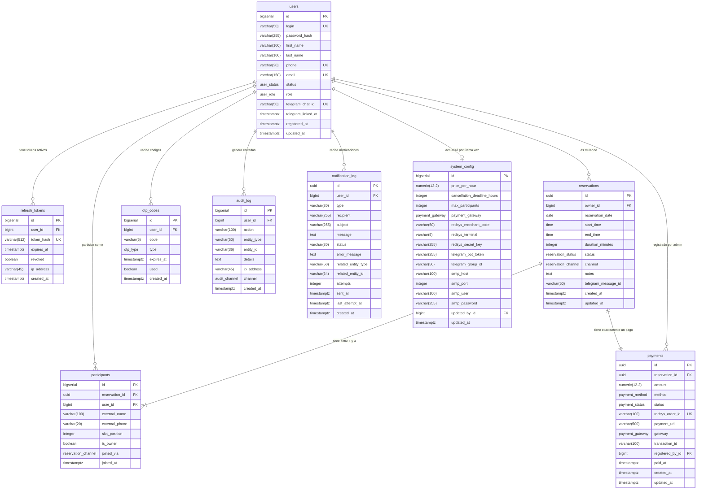

# PadelPro — Modelo de Datos

> **Versión:** 1.0 · **Motor:** PostgreSQL 15 · **Generado:** 2026-05-22
>
> Fuente de verdad para `backend-architect` (mapeo JPA), `database-optimizer` (índices/N+1), `api-tester`/`frontend-engineer` (DTOs) y `security-auditor` (trazabilidad y RGPD).

---

## 1. Resumen ejecutivo

| # | Entidad | Tabla SQL | Responsabilidad | PK | Épica |
|---|---|---|---|---|---|
| 1 | Usuario | `users` | Usuarios registrados, autenticación, roles y vinculación Telegram | `BIGSERIAL` | EP-01 |
| 2 | Token de refresco | `refresh_tokens` | Tokens JWT de larga duración para renovar sesiones | `BIGSERIAL` | EP-01 |
| 3 | Reserva | `reservations` | Ciclo de vida completo de una reserva de pista | `UUID` | EP-02 |
| 4 | Participante | `participants` | Jugadores asignados a una reserva (registrados o externos) | `BIGSERIAL` | EP-02 |
| 5 | Pago | `payments` | Transacción económica asociada a cada reserva | `UUID` | EP-03 |
| 6 | Código OTP | `otp_codes` | Códigos de un solo uso para operaciones críticas (TTL 10 min) | `BIGSERIAL` | EP-01/EP-02/EP-04 |
| 7 | Log de auditoría | `audit_log` | Registro inmutable de todas las acciones del sistema | `BIGSERIAL` | EP-05 |
| 8 | Log de notificaciones | `notification_log` | Registro de mensajes enviados (email; Telegram diferido) | `UUID` | EP-06 |
| 9 | Configuración del sistema | `system_config` | Parámetros globales del club (singleton, id=1) | `BIGSERIAL` | EP-05 |

**Decisiones de modelado clave:**

| Decisión | Elección | Justificación |
|---|---|---|
| PK de entidades externas | `UUID` (`gen_random_uuid()`) | `reservations` y `payments` aparecen en URLs y webhooks externos (Redsys). UUID evita la enumeración secuencial y la correlación de volumen. |
| PK de entidades internas | `BIGSERIAL` (excepto `notification_log`, que usa `UUID`) | `users`, `participants`, `otp_codes`, `audit_log`, `refresh_tokens`, `system_config` nunca se exponen directamente en rutas públicas. BIGSERIAL es más eficiente en índices B-tree. `notification_log` se implementó con PK `UUID` (`gen_random_uuid()`). |
| Enumeraciones | Tipos `ENUM` de PostgreSQL | Garantizan integridad a nivel de BD sin CHECK; el catálogo `pg_type` sirve de documentación viva. |
| Campos monetarios | `NUMERIC(12,2)` | Precisión decimal exacta; nunca `FLOAT` ni `DOUBLE` para importes. |
| Timestamps | `TIMESTAMPTZ` | Todos los instantes se almacenan con zona horaria (UTC). Nunca `TIMESTAMP` sin zona. |
| Borrado de usuarios | Soft-delete (`status=INACTIVE`) | Preserva historial de reservas y auditoría. Nunca borrado físico de usuarios. |
| Borrado de reservas | Transición de estado (`status=CANCELLED`) | Las reservas nunca se borran; la trazabilidad es obligatoria. |
| Campos sensibles cifrados | AES-256 a nivel aplicación | `redsys_secret_key`, `telegram_bot_token`, `smtp_password` en `system_config`. |

---

## 2. Diagrama ER



---

## 3. Especificación entidad por entidad

### 3.1 `users`

**Propósito:** Usuarios registrados en la plataforma. Centraliza la identidad, credenciales, rol, estado de la cuenta y vinculación con Telegram.

**Tabla SQL:** `users`

**Columnas:**

| Nombre | Tipo SQL | Nullable | Default | Constraint | Descripción |
|---|---|---|---|---|---|
| `id` | `BIGSERIAL` | NO | autoincremento | PK | Clave primaria interna |
| `login` | `VARCHAR(50)` | NO | — | UK, `chk_users_login_format` | Nombre de usuario para login. Solo alfanumérico + guión bajo. |
| `password_hash` | `VARCHAR(255)` | NO | — | — | Hash BCrypt de la contraseña |
| `first_name` | `VARCHAR(100)` | NO | — | — | Nombre de pila |
| `last_name` | `VARCHAR(100)` | NO | — | — | Apellidos |
| `phone` | `VARCHAR(20)` | NO | — | UK, `chk_users_phone_format` | Teléfono E.164. Identificador para mensajes directos Telegram. |
| `email` | `VARCHAR(150)` | NO | — | UK | Correo electrónico |
| `status` | `user_status` | NO | `'PENDING'` | — | Estado de la cuenta |
| `role` | `user_role` | NO | `'USER'` | — | Rol en la plataforma |
| `must_change_password` | `BOOLEAN` | NO | `false` | — | Obliga a cambiar la contraseña en el siguiente acceso (tras reset del admin o alta directa). Migración V11 (change acceso-cuenta-prod). |
| `telegram_chat_id` | `VARCHAR(50)` | SÍ | NULL | UK | ID de chat de Telegram. Se rellena cuando el usuario inicia conversación con el bot. |
| `telegram_linked_at` | `TIMESTAMPTZ` | SÍ | NULL | — | Instante en que se vinculó Telegram |
| `registered_at` | `TIMESTAMPTZ` | NO | `now()` | — | Fecha de alta |
| `updated_at` | `TIMESTAMPTZ` | NO | `now()` | — | Última modificación |

**Enums usados:**

```sql
CREATE TYPE user_status AS ENUM ('PENDING', 'ACTIVE', 'INACTIVE');
CREATE TYPE user_role   AS ENUM ('ADMIN', 'USER');
```

**PK:** `id BIGSERIAL`

**FKs:** ninguna (es entidad raíz)

**Índices:**

| Nombre | Columnas | Tipo | Justificación |
|---|---|---|---|
| `users_pkey` | `id` | BTREE UNIQUE | PK automática |
| `idx_users_login` | `login` | BTREE UNIQUE | Q8 — autenticación O(log n) |
| `idx_users_phone` | `phone` | BTREE UNIQUE | Lookup por teléfono (OTP, Telegram DM) |
| `idx_users_email` | `email` | BTREE UNIQUE | Reset de contraseña, unicidad |
| `idx_users_telegram_chat_id` | `telegram_chat_id` | BTREE UNIQUE | Identificación de usuario entrante desde bot |
| `idx_users_status_role` | `(status, role)` | BTREE | Listado admin filtrado por estado y rol |

**Constraints de negocio:**

```sql
ALTER TABLE users ADD CONSTRAINT chk_users_login_format
  CHECK (login ~ '^[a-zA-Z0-9_]{3,50}$');

ALTER TABLE users ADD CONSTRAINT chk_users_phone_format
  CHECK (phone ~ '^\+[1-9]\d{7,14}$');
```

**Campos de auditoría:** `registered_at`, `updated_at`. No hay `created_by` porque el usuario se crea a sí mismo (auto-registro) o por un admin (capturado en `audit_log`).

**Soft-delete:** El borrado es lógico: `status = 'INACTIVE'`. Nunca `DELETE FROM users`.

---

### 3.2 `refresh_tokens`

**Propósito:** Almacena los tokens JWT de refresco activos. Permite invalidar sesiones individuales en logout sin romper otras sesiones del mismo usuario.

**Tabla SQL:** `refresh_tokens`

**Columnas:**

| Nombre | Tipo SQL | Nullable | Default | Constraint | Descripción |
|---|---|---|---|---|---|
| `id` | `BIGSERIAL` | NO | autoincremento | PK | Clave primaria |
| `user_id` | `BIGINT` | NO | — | FK → `users(id)` ON DELETE CASCADE | Usuario propietario del token |
| `token_hash` | `VARCHAR(512)` | NO | — | UK | SHA-256 del refresh token. Nunca se almacena el token en claro. |
| `expires_at` | `TIMESTAMPTZ` | NO | — | — | Expiración del token (típicamente 30 días) |
| `revoked` | `BOOLEAN` | NO | `false` | — | `true` tras logout o rotación |
| `ip_address` | `VARCHAR(45)` | SÍ | NULL | — | IP de origen del login (IPv4/IPv6) |
| `created_at` | `TIMESTAMPTZ` | NO | `now()` | — | Instante de emisión |

**PK:** `id BIGSERIAL`

**FKs:**

| Columna | Referencia | ON DELETE | ON UPDATE |
|---|---|---|---|
| `user_id` | `users(id)` | CASCADE | NO ACTION |

**Índices:**

| Nombre | Columnas | Tipo | Justificación |
|---|---|---|---|
| `refresh_tokens_pkey` | `id` | BTREE UNIQUE | PK automática |
| `idx_rt_token_hash` | `token_hash` | BTREE UNIQUE | Validación O(log n) del refresh token |
| `idx_rt_user_active` | `(user_id, expires_at)` | BTREE parcial `WHERE revoked = false` | Listar tokens activos por usuario |
| `idx_rt_cleanup` | `expires_at` | BTREE parcial `WHERE revoked = false` | Job nocturno de limpieza de tokens expirados |

**Campos de auditoría:** No aplica. La tabla es de infraestructura de seguridad y se limpia automáticamente.

---

### 3.3 `reservations`

**Propósito:** Reserva de la pista. Gestiona el ciclo de vida completo desde `PENDING_CONFIRMATION` hasta `COMPLETED` o `CANCELLED`, incluyendo el canal de creación y el mensaje publicado en Telegram.

**Tabla SQL:** `reservations`

**Columnas:**

| Nombre | Tipo SQL | Nullable | Default | Constraint | Descripción |
|---|---|---|---|---|---|
| `id` | `UUID` | NO | `gen_random_uuid()` | PK | Identificador externo. UUID evita enumeración secuencial. |
| `owner_id` | `BIGINT` | NO | — | FK → `users(id)` | Titular de la reserva y responsable del pago (RN-04) |
| `reservation_date` | `DATE` | NO | — | — | Fecha de la reserva |
| `start_time` | `TIME` | NO | — | `chk_res_start_minutes` | Hora de inicio (en punto o en media hora) |
| `end_time` | `TIME` | NO | — | `chk_res_end_time` | Hora de fin = start_time + duration_minutes |
| `duration_minutes` | `INTEGER` | NO | — | `chk_res_duration` | Duración en minutos: 60, 90, 120, 150 o 180 |
| `status` | `reservation_status` | NO | `'PENDING_CONFIRMATION'` | — | Estado del ciclo de vida |
| `channel` | `reservation_channel` | NO | — | — | Canal por el que se creó la reserva |
| `notes` | `TEXT` | SÍ | NULL | — | Observaciones libres del titular |
| `telegram_message_id` | `VARCHAR(50)` | SÍ | NULL | — | ID del mensaje publicado en el grupo de Telegram para poder editarlo al añadir participantes (US-020) |
| `cancellation_reason` | `VARCHAR(255)` | SÍ | NULL | — | Motivo de cancelación si `status = 'CANCELLED'` |
| `created_at` | `TIMESTAMPTZ` | NO | `now()` | — | Instante de creación |
| `updated_at` | `TIMESTAMPTZ` | NO | `now()` | — | Última modificación |

**Enums usados:**

```sql
CREATE TYPE reservation_status  AS ENUM ('PENDING_CONFIRMATION', 'CONFIRMED', 'CANCELLED', 'COMPLETED');
CREATE TYPE reservation_channel AS ENUM ('WEB', 'TELEGRAM');
```

**PK:** `id UUID`

**FKs:**

| Columna | Referencia | ON DELETE | ON UPDATE |
|---|---|---|---|
| `owner_id` | `users(id)` | RESTRICT | NO ACTION |

**Índices:**

| Nombre | Columnas | Tipo | Justificación |
|---|---|---|---|
| `reservations_pkey` | `id` | BTREE UNIQUE | PK automática |
| `idx_res_owner_id` | `owner_id` | BTREE | FK obligatorio; Q4 historial |
| `idx_res_date_status` | `(reservation_date, status)` | BTREE parcial `WHERE status <> 'CANCELLED'` | Q1 disponibilidad, Q2 calendario |
| `idx_res_date_start` | `(reservation_date, start_time)` | BTREE | Q2 ordenación semanal |
| `idx_res_owner_date` | `(owner_id, reservation_date DESC)` | BTREE | Q4 historial de usuario |
| `idx_res_owner_status` | `(owner_id, status)` | BTREE parcial `WHERE status IN ('PENDING_CONFIRMATION','CONFIRMED')` | Q5 reservas activas del usuario |
| `excl_res_no_overlap` | `tsrange(date+start, date+end)` | GiST EXCLUSION parcial `WHERE status <> 'CANCELLED'` | **Barrera de seguridad anti-solapamiento a nivel BD** |

**Constraints de negocio:**

```sql
-- Extensión necesaria para el exclusion constraint
CREATE EXTENSION IF NOT EXISTS btree_gist;

ALTER TABLE reservations ADD CONSTRAINT chk_res_duration
  CHECK (duration_minutes IN (60, 90, 120, 150, 180));

ALTER TABLE reservations ADD CONSTRAINT chk_res_end_time
  CHECK (end_time = (start_time + (duration_minutes || ' minutes')::INTERVAL));

ALTER TABLE reservations ADD CONSTRAINT chk_res_start_minutes
  CHECK (EXTRACT(MINUTE FROM start_time) IN (0, 30));

ALTER TABLE reservations ADD CONSTRAINT excl_res_no_overlap
  EXCLUDE USING gist (
    reservation_date WITH =,
    tsrange(
      reservation_date + start_time,
      reservation_date + end_time,
      '[)'
    ) WITH &&
  )
  WHERE (status <> 'CANCELLED');
```

**Campos de auditoría:** `created_at`, `updated_at`. El `owner_id` actúa como `created_by` implícito. Las transiciones de estado quedan registradas en `audit_log`.

---

### 3.4 `participants`

**Propósito:** Jugadores asignados a una reserva. Admite tanto usuarios registrados (`user_id NOT NULL`) como jugadores externos sin cuenta (`user_id IS NULL`). Máximo 4 por reserva (RN-03).

**Tabla SQL:** `participants`

**Columnas:**

| Nombre | Tipo SQL | Nullable | Default | Constraint | Descripción |
|---|---|---|---|---|---|
| `id` | `BIGSERIAL` | NO | autoincremento | PK | Clave primaria interna |
| `reservation_id` | `UUID` | NO | — | FK → `reservations(id)` | Reserva a la que pertenece |
| `user_id` | `BIGINT` | SÍ | NULL | FK → `users(id)` | Usuario registrado. NULL si es jugador externo. |
| `external_name` | `VARCHAR(100)` | SÍ | NULL | — | Nombre del jugador externo |
| `external_phone` | `VARCHAR(20)` | SÍ | NULL | `chk_part_phone_format` | Teléfono del jugador externo |
| `slot_position` | `INTEGER` | NO | — | `chk_part_slot`, UK(reservation_id) | Posición en la reserva: 1 = titular, 2-4 = resto |
| `is_owner` | `BOOLEAN` | NO | `false` | — | `true` solo para el titular de la reserva |
| `joined_via` | `reservation_channel` | NO | — | — | Canal por el que se incorporó |
| `joined_at` | `TIMESTAMPTZ` | NO | `now()` | — | Instante de incorporación |

**PK:** `id BIGSERIAL`

**FKs:**

| Columna | Referencia | ON DELETE | ON UPDATE |
|---|---|---|---|
| `reservation_id` | `reservations(id)` | CASCADE | NO ACTION |
| `user_id` | `users(id)` | SET NULL | NO ACTION |

**Índices:**

| Nombre | Columnas | Tipo | Justificación |
|---|---|---|---|
| `participants_pkey` | `id` | BTREE UNIQUE | PK automática |
| `idx_part_reservation_id` | `reservation_id` | BTREE | FK obligatorio; Q2/Q3 JOIN con reservas |
| `idx_part_user_id` | `user_id` | BTREE parcial `WHERE user_id IS NOT NULL` | FK obligatorio; participaciones de un usuario |
| `idx_part_slot_unique` | `(reservation_id, slot_position)` | BTREE UNIQUE | Integridad: posición única por reserva |
| `idx_part_user_reservation` | `(user_id, reservation_id)` | BTREE parcial `WHERE user_id IS NOT NULL` | Verificar si usuario ya está en reserva (CU-02 anti-duplicado) |

**Constraints de negocio:**

```sql
ALTER TABLE participants ADD CONSTRAINT chk_part_slot
  CHECK (slot_position BETWEEN 1 AND 4);

-- Jugador externo XOR registrado: exactamente uno de los dos
ALTER TABLE participants ADD CONSTRAINT chk_part_user_or_external
  CHECK (
    (user_id IS NOT NULL AND external_name IS NULL) OR
    (user_id IS NULL     AND external_name IS NOT NULL)
  );

ALTER TABLE participants ADD CONSTRAINT chk_part_phone_format
  CHECK (external_phone IS NULL OR external_phone ~ '^\+[1-9]\d{7,14}$');

-- Solo un titular por reserva
CREATE UNIQUE INDEX idx_part_one_owner
  ON participants (reservation_id)
  WHERE is_owner = true;
```

**Campos de auditoría:** `joined_at`. No hay `updated_at` porque los participantes no se modifican; se eliminan (en lógica de aplicación con estado). Las acciones se registran en `audit_log`.

---

### 3.5 `payments`

**Propósito:** Transacción económica vinculada a cada reserva. Gestiona el ciclo de pago (online vía Redsys o en efectivo registrado por el admin). Una reserva tiene exactamente un registro de pago; el titular es el único responsable (RN-04, RN-12).

**Tabla SQL:** `payments`

**Columnas:**

| Nombre | Tipo SQL | Nullable | Default | Constraint | Descripción |
|---|---|---|---|---|---|
| `id` | `UUID` | NO | `gen_random_uuid()` | PK | Identificador externo. UUID evita correlación con volumen de negocio. |
| `reservation_id` | `UUID` | NO | — | FK → `reservations(id)`, UK | Una reserva tiene exactamente un pago |
| `amount` | `NUMERIC(12,2)` | NO | — | `chk_pay_amount` | Importe congelado en el momento de crear la reserva (precio/hora × duración/60) |
| `method` | `payment_method` | SÍ | NULL | — | Método elegido. NULL hasta que se inicia el pago. |
| `status` | `payment_status` | NO | `'PENDING'` | — | Estado del ciclo de pago |
| `redsys_order_id` | `VARCHAR(100)` | SÍ | NULL | UK | Referencia Redsys (Ds_Merchant_Order). Única por transacción. |
| `payment_url` | `VARCHAR(500)` | SÍ | NULL | — | URL del TPV virtual Redsys generada para el pago online |
| `gateway` | `payment_gateway` | SÍ | NULL | — | Pasarela usada |
| `transaction_id` | `VARCHAR(100)` | SÍ | NULL | — | Referencia de la pasarela de pago (Ds_AuthorisationCode) |
| `registered_by_id` | `BIGINT` | SÍ | NULL | FK → `users(id)` | Admin que registró el pago en efectivo |
| `paid_at` | `TIMESTAMPTZ` | SÍ | NULL | — | Instante de confirmación del pago |
| `created_at` | `TIMESTAMPTZ` | NO | `now()` | — | Instante de creación del registro |
| `updated_at` | `TIMESTAMPTZ` | NO | `now()` | — | Última modificación |

**Enums usados:**

```sql
CREATE TYPE payment_method  AS ENUM ('REDSYS', 'CASH');
CREATE TYPE payment_status  AS ENUM ('PENDING', 'IN_PROGRESS', 'PAID', 'FAILED', 'CANCELLED', 'REFUNDED');
CREATE TYPE payment_gateway AS ENUM ('REDSYS', 'STRIPE', 'PAYPAL');
```

**PK:** `id UUID`

**FKs:**

| Columna | Referencia | ON DELETE | ON UPDATE |
|---|---|---|---|
| `reservation_id` | `reservations(id)` | RESTRICT | NO ACTION |
| `registered_by_id` | `users(id)` | SET NULL | NO ACTION |

**Índices:**

| Nombre | Columnas | Tipo | Justificación |
|---|---|---|---|
| `payments_pkey` | `id` | BTREE UNIQUE | PK automática |
| `idx_pay_reservation_id` | `reservation_id` | BTREE UNIQUE | FK obligatorio + relación 1:1 |
| `idx_pay_registered_by_id` | `registered_by_id` | BTREE parcial `WHERE registered_by_id IS NOT NULL` | FK obligatorio (efectivo) |
| `idx_pay_status_paid_at` | `(status, paid_at)` | BTREE parcial `WHERE status = 'PAID'` | Q7 dashboard de ingresos por mes |
| `idx_pay_redsys_order_id` | `redsys_order_id` | BTREE UNIQUE parcial `WHERE redsys_order_id IS NOT NULL` | Webhook Redsys: lookup por Ds_Merchant_Order |
| `idx_pay_pending` | `(created_at)` | BTREE parcial `WHERE status = 'PENDING'` | Q5 pagos pendientes del admin |

**Constraints de negocio:**

```sql
ALTER TABLE payments ADD CONSTRAINT chk_pay_amount
  CHECK (amount > 0);

-- Si el método es CASH, registered_by_id no puede ser NULL
ALTER TABLE payments ADD CONSTRAINT chk_pay_cash_admin
  CHECK (
    method IS NULL OR method <> 'CASH' OR registered_by_id IS NOT NULL
  );
```

**Campos de auditoría:** `created_at`, `updated_at`, `registered_by_id`. Todas las transiciones de estado quedan en `audit_log` con acción `PAYMENT_STATUS_CHANGED`.

**Nota sobre el importe:** El campo `amount` congela el precio en el instante de creación de la reserva (`price_per_hour × duration_minutes / 60`). Cambios posteriores en `system_config.price_per_hour` no afectan a reservas ya existentes (US-024 riesgo técnico).

---

### 3.6 `otp_codes`

**Propósito:** Códigos OTP de un solo uso generados para operaciones críticas: confirmar reserva, confirmar cancelación y resetear contraseña. TTL estricto de 10 minutos.

**Tabla SQL:** `otp_codes`

**Columnas:**

| Nombre | Tipo SQL | Nullable | Default | Constraint | Descripción |
|---|---|---|---|---|---|
| `id` | `BIGSERIAL` | NO | autoincremento | PK | Clave primaria interna |
| `user_id` | `BIGINT` | NO | — | FK → `users(id)` | Usuario al que pertenece el código |
| `code` | `VARCHAR(6)` | NO | — | `chk_otp_format` | Código numérico de 6 dígitos |
| `type` | `otp_type` | NO | — | — | Tipo de operación que confirma |
| `expires_at` | `TIMESTAMPTZ` | NO | — | `chk_otp_expiry` | NOW() + 10 minutos |
| `used` | `BOOLEAN` | NO | `false` | — | `true` tras validación. Impide reutilización. |
| `created_at` | `TIMESTAMPTZ` | NO | `now()` | — | Instante de generación |

**Enums usados:**

```sql
CREATE TYPE otp_type AS ENUM ('RESERVATION_CONFIRM', 'CANCELLATION_CONFIRM', 'PASSWORD_RESET');
```

**PK:** `id BIGSERIAL`

**FKs:**

| Columna | Referencia | ON DELETE | ON UPDATE |
|---|---|---|---|
| `user_id` | `users(id)` | CASCADE | NO ACTION |

**Índices:**

| Nombre | Columnas | Tipo | Justificación |
|---|---|---|---|
| `otp_codes_pkey` | `id` | BTREE UNIQUE | PK automática |
| `idx_otp_user_id` | `user_id` | BTREE | FK obligatorio |
| `idx_otp_active` | `(user_id, type, expires_at)` | BTREE parcial `WHERE used = false` | Q6 validación OTP activo < 0.5 ms |
| `idx_otp_cleanup` | `expires_at` | BTREE parcial `WHERE used = false` | Job nocturno de limpieza |

**Constraints de negocio:**

```sql
ALTER TABLE otp_codes ADD CONSTRAINT chk_otp_format
  CHECK (code ~ '^\d{6}$');

ALTER TABLE otp_codes ADD CONSTRAINT chk_otp_expiry
  CHECK (expires_at > created_at);
```

**Campos de auditoría:** No se usan campos de auditoría en esta tabla. Los OTP usados se limpian periódicamente. El `audit_log` registra las validaciones.

---

### 3.7 `audit_log`

**Propósito:** Registro inmutable de todas las acciones del sistema. Cada acción de usuario (crear reserva, pagar, cancelar, modificar configuración…) genera una entrada. **Nunca se borran filas**; la retención se gestiona por política (ver §8).

**Tabla SQL:** `audit_log`

**Columnas:**

| Nombre | Tipo SQL | Nullable | Default | Constraint | Descripción |
|---|---|---|---|---|---|
| `id` | `BIGSERIAL` | NO | autoincremento | PK | Clave primaria interna |
| `user_id` | `BIGINT` | SÍ | NULL | FK → `users(id)` | Usuario que ejecutó la acción. NULL para acciones del sistema/bot. |
| `action` | `VARCHAR(100)` | NO | — | — | Código de acción: `RESERVATION_CREATED`, `PAYMENT_CONFIRMED`, `OTP_VALIDATED`, `USER_DEACTIVATED`… |
| `entity_type` | `VARCHAR(50)` | NO | — | — | Entidad afectada: `RESERVATION`, `PAYMENT`, `USER`, `OTP`, `CONFIG` |
| `entity_id` | `VARCHAR(36)` | SÍ | NULL | — | ID de la entidad afectada (UUID o BIGINT como texto) |
| `details` | `TEXT` | SÍ | NULL | — | JSON con valores anteriores/nuevos u otro contexto |
| `ip_address` | `VARCHAR(45)` | SÍ | NULL | — | IP del cliente (IPv4 o IPv6) |
| `channel` | `audit_channel` | NO | — | — | Canal de origen |
| `created_at` | `TIMESTAMPTZ` | NO | `now()` | — | **Inmutable**. Instante exacto de la acción. |

**Enums usados:**

```sql
CREATE TYPE audit_channel AS ENUM ('WEB', 'TELEGRAM', 'SYSTEM');
```

**PK:** `id BIGSERIAL`

**FKs:**

| Columna | Referencia | ON DELETE | ON UPDATE |
|---|---|---|---|
| `user_id` | `users(id)` | SET NULL | NO ACTION |

**Índices:**

| Nombre | Columnas | Tipo | Justificación |
|---|---|---|---|
| `audit_log_pkey` | `id` | BTREE UNIQUE | PK automática |
| `idx_audit_user_id` | `user_id` | BTREE | FK obligatorio |
| `idx_audit_user_time` | `(user_id, created_at DESC)` | BTREE | Historial de acciones por usuario (admin panel) |
| `idx_audit_entity` | `(entity_type, entity_id)` | BTREE | Trazabilidad completa de una entidad concreta |
| `idx_audit_action_time` | `(action, created_at DESC)` | BTREE | Filtrado por tipo de acción en informes |

**Campos de auditoría:** No aplica. Esta tabla ES el log de auditoría. `created_at` es inmutable.

---

### 3.8 `notification_log`

**Propósito:** Registro de cada notificación enviada (email, Telegram directo, Telegram grupo). Permite detectar fallos de entrega, reintentos y trazar el historial de comunicaciones por usuario.

**Tabla SQL:** `notification_log`

> **Implementado en `V14__create_notification_log.sql`** (change `notificaciones-eventos-email`, #197). El diseño real difiere del boceto original: PK `UUID`, `type`/`status` como `VARCHAR + CHECK` (no enums nativos, para que el mapeo `EnumType.STRING` de JPA funcione igual en PostgreSQL y H2), y por ahora solo el canal `EMAIL` (Telegram diferido a `auth-otp-telegram`).

**Columnas:**

| Nombre | Tipo SQL | Nullable | Default | Constraint | Descripción |
|---|---|---|---|---|---|
| `id` | `UUID` | NO | `gen_random_uuid()` | PK | Clave primaria interna |
| `user_id` | `BIGINT` | SÍ | NULL | FK → `users(id)` | Destinatario registrado. NULL para notificaciones sin titular. |
| `type` | `VARCHAR(20)` | NO | — | CHECK IN (`'EMAIL'`) | Canal de envío (solo email en v1; Telegram diferido) |
| `recipient` | `VARCHAR(255)` | NO | — | — | Email del destinatario |
| `subject` | `VARCHAR(255)` | NO | — | — | Asunto del email |
| `message` | `TEXT` | NO | — | — | Contenido del mensaje enviado (sin datos sensibles, RN-RGPD-04) |
| `status` | `VARCHAR(20)` | NO | `'PENDING'` | CHECK IN (`'PENDING'`,`'SENT'`,`'FAILED'`) | Estado del envío |
| `error_message` | `TEXT` | SÍ | NULL | — | Resumen saneado del error si `status = 'FAILED'` (nombre de clase, sin PII) |
| `related_entity_type` | `VARCHAR(50)` | SÍ | NULL | — | Entidad relacionada: `RESERVATION`, `PAYMENT`, `USER` |
| `related_entity_id` | `VARCHAR(64)` | SÍ | NULL | — | ID de la entidad relacionada |
| `attempts` | `INTEGER` | NO | `0` | CHECK `>= 0` | Nº de intentos de envío (tope 3 en el job de reintentos) |
| `sent_at` | `TIMESTAMPTZ` | SÍ | NULL | — | Instante de entrega confirmada |
| `last_attempt_at` | `TIMESTAMPTZ` | SÍ | NULL | — | Instante del último intento (para el backoff del job) |
| `created_at` | `TIMESTAMPTZ` | NO | `now()` | — | Instante de creación del registro |

**PK:** `id UUID` (`gen_random_uuid()`)

**FKs:**

| Columna | Referencia | ON DELETE | ON UPDATE |
|---|---|---|---|
| `user_id` | `users(id)` | SET NULL | NO ACTION |

**Índices:**

| Nombre | Columnas | Tipo | Justificación |
|---|---|---|---|
| `notification_log_pkey` | `id` | BTREE UNIQUE | PK automática |
| `idx_notif_status` | `status` | BTREE | El job de reintentos escanea entradas `FAILED` por debajo del tope de intentos |
| `idx_notif_related_entity` | `(related_entity_type, related_entity_id)` | BTREE | Trazabilidad de notificaciones por entidad (inspección ADMIN) |

**Campos de auditoría:** `created_at`. No hay `updated_at`; solo `status`, `attempts`, `sent_at` y `last_attempt_at` se actualizan durante el envío/reintento.

---

### 3.9 `system_config`

**Propósito:** Configuración global del club. Singleton estricto (siempre `id = 1`). Contiene precio, políticas de cancelación, credenciales de integraciones externas (cifradas a nivel aplicación) y configuración de Telegram y SMTP.

**Tabla SQL:** `system_config`

**Columnas:**

| Nombre | Tipo SQL | Nullable | Default | Constraint | Descripción |
|---|---|---|---|---|---|
| `id` | `BIGSERIAL` | NO | — | PK, `chk_cfg_singleton` | Siempre `1`. El CHECK garantiza el singleton. |
| `price_per_hour` | `NUMERIC(12,2)` | NO | — | `chk_cfg_price` | Precio por hora en EUR |
| `cancellation_deadline_hours` | `INTEGER` | NO | `2` | `chk_cfg_deadline` | Horas mínimas de antelación para cancelar sin penalización |
| `max_participants` | `INTEGER` | NO | `4` | `chk_cfg_max_part` | Máximo de jugadores por reserva (actualmente 4, RN-03) |
| `payment_gateway` | `payment_gateway` | NO | `'REDSYS'` | — | Pasarela de pago activa |
| `redsys_merchant_code` | `VARCHAR(50)` | SÍ | NULL | — | Código de comercio Redsys |
| `redsys_terminal` | `VARCHAR(5)` | SÍ | NULL | — | Número de terminal Redsys |
| `redsys_secret_key` | `VARCHAR(255)` | SÍ | NULL | — | Clave HMAC SHA-256 Redsys. **Cifrada AES-256 a nivel aplicación.** |
| `telegram_bot_token` | `VARCHAR(255)` | SÍ | NULL | — | Token del bot de Telegram. **Cifrado AES-256 a nivel aplicación.** |
| `telegram_group_id` | `VARCHAR(50)` | SÍ | NULL | — | ID del grupo de Telegram de la comunidad |
| `smtp_host` | `VARCHAR(100)` | SÍ | NULL | — | Servidor SMTP |
| `smtp_port` | `INTEGER` | SÍ | NULL | `chk_cfg_smtp_port` | Puerto SMTP (ej. 587) |
| `smtp_user` | `VARCHAR(100)` | SÍ | NULL | — | Usuario SMTP |
| `smtp_password` | `VARCHAR(255)` | SÍ | NULL | — | Contraseña SMTP. **Cifrada AES-256 a nivel aplicación.** |
| `updated_by_id` | `BIGINT` | SÍ | NULL | FK → `users(id)` | Admin que realizó el último cambio |
| `updated_at` | `TIMESTAMPTZ` | NO | `now()` | — | Última modificación |

**PK:** `id BIGSERIAL`

**FKs:**

| Columna | Referencia | ON DELETE | ON UPDATE |
|---|---|---|---|
| `updated_by_id` | `users(id)` | SET NULL | NO ACTION |

**Índices:**

| Nombre | Columnas | Tipo | Justificación |
|---|---|---|---|
| `system_config_pkey` | `id` | BTREE UNIQUE | PK automática |
| `idx_cfg_updated_by_id` | `updated_by_id` | BTREE | FK obligatorio |

**Constraints de negocio:**

```sql
ALTER TABLE system_config ADD CONSTRAINT chk_cfg_singleton
  CHECK (id = 1);

ALTER TABLE system_config ADD CONSTRAINT chk_cfg_price
  CHECK (price_per_hour > 0);

ALTER TABLE system_config ADD CONSTRAINT chk_cfg_deadline
  CHECK (cancellation_deadline_hours >= 0);

ALTER TABLE system_config ADD CONSTRAINT chk_cfg_max_part
  CHECK (max_participants BETWEEN 1 AND 4);

ALTER TABLE system_config ADD CONSTRAINT chk_cfg_smtp_port
  CHECK (smtp_port IS NULL OR smtp_port BETWEEN 1 AND 65535);
```

**Campos de auditoría:** `updated_at`, `updated_by_id`. Los cambios de configuración también se registran en `audit_log` con `entity_type='CONFIG'`.

**Nota sobre campos sensibles:** `redsys_secret_key`, `telegram_bot_token` y `smtp_password` se cifran mediante AES-256 (clave derivada de una variable de entorno `APP_ENCRYPTION_KEY`) antes de persistirse. El `SystemConfigDTO` cacheado en memoria ya tiene los valores descifrados. Esto es aceptable en un despliegue On-Premise de instancia única.

---

## 4. Relaciones y reglas de integridad

### 4.1 Relaciones principales

| Relación | Cardinalidad | Descripción |
|---|---|---|
| `users` → `reservations` | 1 : N | Un usuario puede ser titular de múltiples reservas. FK `owner_id`. |
| `users` → `participants` | 1 : N (opcional) | Un usuario registrado puede participar en múltiples reservas como jugador. FK `user_id` nullable. |
| `reservations` → `participants` | 1 : N (1..4) | Una reserva tiene entre 1 y 4 participantes. Exactamente uno tiene `is_owner=true`. |
| `reservations` → `payments` | 1 : 1 | Cada reserva tiene exactamente un registro de pago creado al mismo tiempo. FK UNIQUE. |
| `users` → `payments` | 1 : N (opcional) | Un admin puede registrar múltiples pagos en efectivo. FK `registered_by_id` nullable. |
| `users` → `refresh_tokens` | 1 : N | Un usuario puede tener múltiples tokens activos (distintos dispositivos). ON DELETE CASCADE. |
| `users` → `otp_codes` | 1 : N | Un usuario puede tener múltiples OTP activos de distintos tipos. ON DELETE CASCADE. |
| `users` → `audit_log` | 1 : N (opcional) | Un usuario genera múltiples entradas. FK nullable (acciones del sistema). |
| `users` → `notification_log` | 1 : N (opcional) | Un usuario puede recibir múltiples notificaciones. FK nullable (notificaciones al grupo). |
| `users` → `system_config` | 1 : 0..1 | El admin que actualizó por última vez la configuración. |

### 4.2 Creación atómica de reserva + pago

Al crear una reserva (`POST /api/reservas`), la capa `Application` realiza en una única transacción `@Transactional`:

1. `INSERT INTO reservations …` → obtiene UUID
2. `INSERT INTO payments (reservation_id, amount, status='PENDING') …` → crea el registro de pago inmediatamente
3. `INSERT INTO participants (reservation_id, user_id, slot_position=1, is_owner=true) …` → añade al titular

Si cualquiera de los tres pasos falla, la transacción se revierte completa. No puede existir una reserva sin su registro de pago asociado.

### 4.3 Anti-solapamiento: doble barrera

| Barrera | Mecanismo | Nivel |
|---|---|---|
| **Capa Application** | `SELECT FROM reservations WHERE … FOR UPDATE` antes del INSERT | Aplicación |
| **Capa BD** | `EXCLUDE USING gist (tsrange …) WHERE status <> 'CANCELLED'` | Base de datos |

La barrera de BD es la definitiva: aunque hubiera un bug en Application o acceso directo a la BD, el exclusion constraint rechaza solapamientos con un error de integridad.

### 4.4 Congelación del importe

El campo `payments.amount` se calcula y persiste en el momento de crear la reserva:

```
amount = system_config.price_per_hour × (reservations.duration_minutes / 60.0)
```

Cambios posteriores en `system_config.price_per_hour` **no** afectan reservas ya creadas. Esto garantiza que el titular paga el precio vigente en el momento de la reserva (US-024 riesgo técnico).

### 4.5 Ciclo de vida de estados

**`reservations.status`:**

```
PENDING_CONFIRMATION → CONFIRMED → COMPLETED
                    ↘               ↗
                      CANCELLED ←─
```

- `PENDING_CONFIRMATION`: recién creada (web) o pendiente de OTP (Telegram)
- `CONFIRMED`: OTP validado o creada directamente desde web sin OTP
- `COMPLETED`: la pista ya se jugó (transición automática o por admin)
- `CANCELLED`: cancelada por el titular o el admin

**`payments.status`:**

```
PENDING → IN_PROGRESS → PAID
       ↘              ↗
         FAILED
       ↘
         CANCELLED
PAID → REFUNDED (solo si admin revierte)
```

### 4.6 Soft-delete y datos históricos

| Entidad | Borrado | Razón |
|---|---|---|
| `users` | `status = 'INACTIVE'` | Preservar historial de reservas, auditoría y RGPD (retención) |
| `reservations` | `status = 'CANCELLED'` | Nunca se borra una reserva; trazabilidad completa |
| `payments` | Sin borrado. Estados: `CANCELLED`/`REFUNDED` | Trazabilidad fiscal obligatoria |
| `participants` | Eliminación física permitida solo si la reserva está `CANCELLED` | Excepción controlada |
| `otp_codes` | Limpieza periódica de `used=true` o `expires_at < NOW()-7d` | Datos técnicos sin valor histórico |
| `refresh_tokens` | ON DELETE CASCADE o limpieza de `revoked=true` | Infraestructura de seguridad |
| `audit_log` | Nunca. Retención por política (ver §8) | Inmutable por definición |
| `notification_log` | Purga tras 2 años *(política definida; job de purga aún no implementado — follow-up #199)* | Datos operativos de rotación alta |

---

## 5. Estrategia de migraciones (Flyway)

### 5.1 Convención de nombres

```
V<n>__<descripcion_snake_case>.sql
```

Ejemplos:

```
V1__create_enum_types.sql
V2__create_users_table.sql
V3__create_refresh_tokens_table.sql
V4__create_reservations_table.sql
V5__create_participants_table.sql
V6__create_payments_table.sql
V7__create_otp_codes_table.sql
V8__create_audit_log_table.sql
V9__create_notification_log_table.sql
V10__create_system_config_table.sql
V11__create_all_indexes.sql
V12__seed_initial_data.sql
```

El orden importa: los enums deben existir antes de las tablas que los usan, y las tablas padre antes de las hijo (FKs).

### 5.2 Reglas zero-downtime

| Regla | Descripción | Aplicable a |
|---|---|---|
| **Columna nullable primero** | Al añadir una columna a una tabla con datos, declararla `NULLABLE` primero. Luego backfill. Luego `ALTER ... SET NOT NULL`. | Toda `ALTER TABLE ADD COLUMN` |
| **Índice CONCURRENTLY** | Crear índices nuevos con `CREATE INDEX CONCURRENTLY` para no bloquear lecturas. Nunca en una transacción (Flyway usa `nonTransactional` para estas migraciones). | `CREATE INDEX` en tablas con datos |
| **DROP después de validar** | No eliminar columnas o tablas en la misma migración que deja de usarlas. Separar en: (1) deprecar en código, (2) deploy, (3) migración de borrado. | `DROP COLUMN`, `DROP TABLE` |
| **FK diferida** | Al añadir FKs a tablas con datos existentes, usar `NOT VALID` primero y `VALIDATE CONSTRAINT` después para evitar full table scan bloqueante. | `ADD CONSTRAINT FOREIGN KEY` |

### 5.3 Política de migraciones reversibles

Flyway no soporta rollback automático. La estrategia es:

1. **Migraciones aditivas:** siempre reversibles manualmente (DROP COLUMN, DROP TABLE).
2. **Migraciones destructivas** (rename, type change, DROP): requieren una migración de rollback manual preparada y aprobada antes de ejecutar la original.
3. **Snapshots:** `pg_dump` antes de cualquier migración en producción. Los backups diarios son la red de seguridad principal.

---

## 6. Datos seed

Los datos seed se aplican en `V12__seed_initial_data.sql` y son los mínimos para que la aplicación arranque en DES/SIT.

```sql
-- ─────────────────────────────────────────────────────────────────────────
--  V12__seed_initial_data.sql
-- ─────────────────────────────────────────────────────────────────────────

-- Enum values están ya creados (V1). Aquí solo insertamos filas.

-- 1. Usuario administrador inicial
--    Contraseña: "Admin1234!" → hash BCrypt generado por la aplicación en startup
--    (En producción, cambiar en el primer acceso)
INSERT INTO users (login, password_hash, first_name, last_name, phone, email, status, role, registered_at, updated_at)
VALUES (
  'admin',
  '$2a$12$PLACEHOLDER_BCRYPT_HASH_GENERATED_AT_BUILD_TIME',  -- ver scripts/gen-admin-hash.sh
  'Administrador',
  'Club',
  '+34600000000',
  'admin@padelpro.local',
  'ACTIVE',
  'ADMIN',
  now(),
  now()
);

-- 2. Configuración inicial del sistema (singleton id=1)
--    Todos los campos sensibles en NULL hasta que el admin los configure desde la UI
INSERT INTO system_config (
  id,
  price_per_hour,
  cancellation_deadline_hours,
  max_participants,
  payment_gateway,
  updated_at
) VALUES (
  1,
  15.00,      -- 15 €/h como valor de ejemplo; el admin debe ajustarlo
  2,          -- 2 horas de antelación mínima para cancelar
  4,          -- máximo 4 jugadores por pista
  'REDSYS',
  now()
);
```

**Notas de seed:**

| Campo | Valor DES | Acción en producción |
|---|---|---|
| `admin.password_hash` | Hash de `Admin1234!` generado por script | Cambiar en primer acceso |
| `system_config.price_per_hour` | `15.00` | Ajustar en panel de admin |
| `system_config.redsys_*` | NULL | Configurar tras contrato con banco |
| `system_config.telegram_bot_token` | NULL | Configurar con token del bot real |
| `system_config.smtp_*` | NULL | Configurar con credenciales SMTP reales |

---

## 7. Consideraciones de rendimiento

### 7.1 Consultas de alto volumen

| ID | Consulta | Frecuencia | Índices activos | Tiempo esperado |
|---|---|---|---|---|
| Q1 | Comprobación de disponibilidad (anti-solapamiento) | Cada intento de reserva | `idx_res_date_status` + `excl_res_no_overlap` | < 1 ms |
| Q2 | Calendario semanal (dashboard) | Cada carga de página | `idx_res_date_status`, `idx_res_date_start`, `idx_part_reservation_id` | < 5 ms |
| Q3 | Reservas incompletas (unirse a partida) | Frecuente | `idx_res_date_status`, `idx_part_reservation_id` | < 5 ms |
| Q4 | Historial de reservas del usuario | Bajo demanda | `idx_res_owner_date`, `idx_pay_reservation_id` | < 10 ms |
| Q5 | Pagos pendientes del usuario | Badge en UI | `idx_res_owner_status`, `idx_pay_reservation_id` | < 2 ms |
| Q6 | Validación de OTP activo | Cada operación crítica | `idx_otp_active` | < 0.5 ms |
| Q7 | Dashboard de ingresos por mes (admin) | Bajo demanda | `idx_pay_status_paid_at` | < 20 ms |
| Q8 | Autenticación (lookup por login) | Cada login | `idx_users_login` (UNIQUE) | < 1 ms |

### 7.2 Riesgos N+1 conocidos y mitigación

| Riesgo | Contexto | Mitigación recomendada |
|---|---|---|
| `reservations` + `participants` | Al cargar el calendario semanal (Q2), cada reserva puede disparar N queries para cargar sus participantes | Usar `@EntityGraph(attributePaths = {"participants"})` o `JOIN FETCH p.participants` en la query de dominio |
| `reservations` + `payments` | Al listar reservas del usuario con estado de pago | Incluir JOIN FETCH con `payments` en la misma query; la relación 1:1 garantiza sin duplicados |
| `participants` + `users` | Al mostrar nombres de participantes registrados | JOIN FETCH en `ReservaJpaAdapter.findWithParticipantsAndUsers()` |
| `audit_log` paginado | El panel admin puede cargar miles de filas | Paginación obligatoria (`LIMIT/OFFSET` o keyset con `id`); nunca `findAll()` |

**Regla general:** ningún método de repositorio devuelve colecciones sin límite explícito. Todos los métodos que puedan devolver más de 100 filas deben aceptar `Pageable`.

### 7.3 Estrategia de caché (Caffeine, in-JVM)

| Caché | Clave | TTL | Invalidación explícita |
|---|---|---|---|
| `system-config` | `'singleton'` | Sin expiración | `@CacheEvict` en `actualizarConfig()` |
| `available-slots` | `fecha (LocalDate)` | 30 s | `@CacheEvict` en `crearReserva()` y `cancelarReserva()` |
| `weekly-calendar` | semana (inicio LocalDate) | 30 s | `@CacheEvict` en `crearReserva()` y `cancelarReserva()` |
| `user-profile` | `userId (Long)` | 5 min | `@CacheEvict` en `actualizarPerfil()` y cambio de estado admin |

Los OTP, pagos en curso y el log de auditoría **no se cachean** (datos de seguridad, webhooks en tiempo real, solo escritura).

---

## 8. Cumplimiento normativo (RGPD)

### 8.1 Campos sujetos a RGPD

| Tabla | Campo | Categoría | Base legal |
|---|---|---|---|
| `users` | `first_name`, `last_name` | Dato personal identificativo | Ejecución de contrato (reservas) |
| `users` | `phone` | Dato de contacto | Ejecución de contrato + interés legítimo (OTP) |
| `users` | `email` | Dato de contacto | Ejecución de contrato + interés legítimo (notificaciones) |
| `users` | `telegram_chat_id` | Identificador de servicio de mensajería | Consentimiento (vinculación voluntaria) |
| `users` | `password_hash` | Credencial de acceso | Ejecución de contrato |
| `participants` | `external_name`, `external_phone` | Dato personal de tercero (jugador casual) | Interés legítimo mínimo (gestión de la partida) |
| `audit_log` | `ip_address` | Dato de red identificativo | Interés legítimo (seguridad) |
| `notification_log` | `recipient`, `message` | Dato de comunicación | Ejecución de contrato |
| `system_config` | `smtp_password`, `redsys_secret_key`, `telegram_bot_token` | Credencial de sistema (no personal) | — |

### 8.2 Política de retención por tabla

| Tabla | Retención | Estrategia |
|---|---|---|
| `users` | Indefinido mientras la cuenta exista. Tras inactivación, 5 años. | Soft-delete; purga física tras 5 años de inactividad. |
| `reservations` | 5 años (obligación fiscal) | Sin borrado. Archivado opcional tras 5 años. |
| `payments` | 5 años (obligación fiscal / AEAT) | Nunca se borran. |
| `participants` | Vinculado a la reserva (5 años) | ON DELETE CASCADE de reserva solo si permitido. |
| `audit_log` | 2 años | Purga anual por job programado. Partición por año recomendada si > 500k filas. |
| `notification_log` | 2 años | Purga anual por job programado *(aún no implementado — follow-up #199)*. |
| `otp_codes` | 7 días tras expiración | Job nocturno: `DELETE WHERE expires_at < now() - INTERVAL '7 days'`. |
| `refresh_tokens` | 30 días (TTL del token) + 7 días de gracia | Job nocturno: `DELETE WHERE expires_at < now() - INTERVAL '7 days'`. |

### 8.3 Estrategia de borrado y anonimización

Al ejercer el **derecho al olvido** (Art. 17 RGPD) sobre un usuario:

1. **Anonimizar** en `users`: sobrescribir `first_name='ANONIMIZADO'`, `last_name='ANONIMIZADO'`, `phone=NULL`, `email='deleted_{id}@padelpro.invalid'`, `telegram_chat_id=NULL`, `telegram_linked_at=NULL`.
2. **Anonimizar** en `participants`: sobrescribir `external_name='ANONIMIZADO'`, `external_phone=NULL` donde `user_id = {id}`.
3. **No tocar** `reservations`, `payments`, `audit_log` — la trazabilidad fiscal y de seguridad prevalece sobre el derecho al olvido para registros contables (Art. 17.3.b RGPD).
4. **Registrar** la anonimización en `audit_log` con `action='USER_ANONYMIZED'`.
5. **Revocar** todos los `refresh_tokens` del usuario (`revoked=true`).
6. **Invalidar** todos los `otp_codes` activos (`used=true`).

---

## 9. Pendiente / abierto

Las siguientes decisiones de modelado no han podido cerrarse con la información disponible y requieren confirmación:

| # | Decisión abierta | Impacto | Acción requerida |
|---|---|---|---|
| P1 | **`users.telegram_chat_id`**: ¿se rellena en el momento del registro (si el admin ya tiene el chat ID) o solo cuando el usuario inicia chat con el bot? | Determina si el campo puede ser `NOT NULL` o debe mantenerse nullable. | Confirmar el flujo de onboarding del bot (US-004). |
| P2 | **Confirmación OTP en reservas web**: el API spec (`POST /api/reservas`) indica que se envía OTP de tipo `RESERVATION_CONFIRM`, pero el flujo web descrito en CU-01 no requiere OTP (solo el flujo de Telegram lo necesita). ¿Es el OTP obligatorio también en web? | Si no es obligatorio en web, el estado inicial de la reserva sería `CONFIRMED` directamente, no `PENDING_CONFIRMATION`. | Validar la regla de negocio RN-07 para el canal WEB. |
| P3 | **`participants` y derechos RGPD de jugadores externos**: `external_name`/`external_phone` son datos personales de terceros que no han firmado ningún consentimiento explícito. | Podría requerirse una política de retención más corta para estos campos (ej. anonimizar tras 1 año). | Revisar con asesoría legal. |
| P4 | **Configuración de horario de apertura**: el sistema no almacena en ninguna tabla el horario de apertura del club (ej. 08:00–22:00). Actualmente no hay restricción en BD sobre `start_time`. | Si se añade, `system_config` necesita columnas `opening_time TIME` y `closing_time TIME`, o una tabla de configuración de franja horaria. | Confirmar si los horarios son un requisito v1.0 o v2. |
| P5 | **`payments` por participante vs. por reserva**: la regla de negocio (RN-04/RN-12) es clara (1 pago por reserva, a cargo del titular), pero el endpoint `POST /api/admin/pagos/{reservaId}/efectivo` retorna `pagosActualizados: 3`. ¿Se crean múltiples registros de pago o se actualiza solo el estado de los `participants`? El modelo actual asume 1:1 reserva:pago. | Si se confirma que son pagos por participante, la estructura de `payments` cambia a 1:N con `participants`. | Confirmar con el dueño del producto. |
