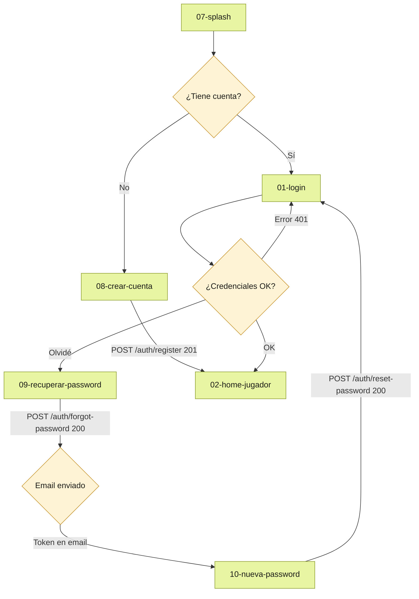
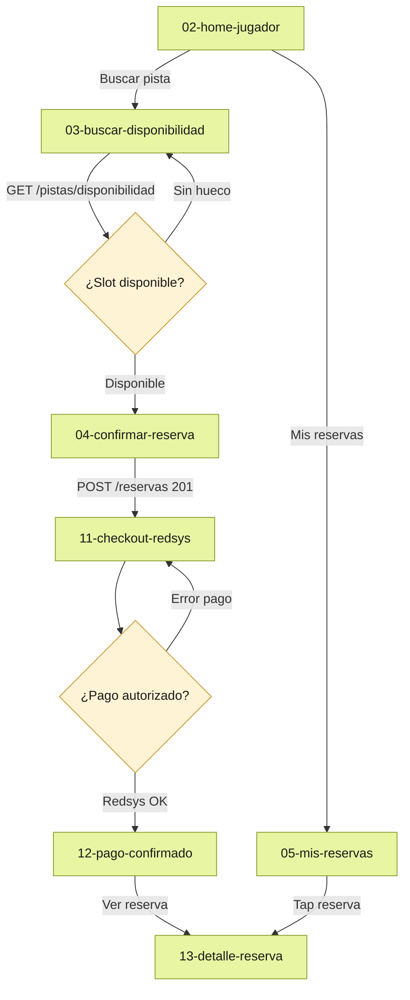

# PadelPro · Flujos de usuario

Seis diagramas Mermaid que cubren los flujos principales de la aplicación.
Las pantallas se referencian por su nombre de fichero (sin extensión).

---

## Flujo 1 · Onboarding y autenticación



---

## Flujo 2 · Buscar y reservar pista



---

## Flujo 3 · Pago Redsys

```mermaid
flowchart LR
    classDef screen fill:#e8f5a3,stroke:#8a9a2a,color:#1a1a17
    classDef external fill:#e0e8fa,stroke:#4a6fa5,color:#1a1a17
    classDef decision fill:#fff3d6,stroke:#c8922a,color:#1a1a17

    CONFIRMAR[04-confirmar-reserva]:::screen
    CHECKOUT[11-checkout-redsys]:::screen
    REDSYS[Redsys TPV]:::external
    WEBHOOK[Webhook backend]:::external
    SUCCESS[12-pago-confirmado]:::screen
    DETALLE[13-detalle-reserva]:::screen

    AUTH_OK{¿3DS OK?}:::decision
    WEBHOOK_OK{¿Webhook 200?}:::decision

    CONFIRMAR -->|POST /pagos/iniciar| CHECKOUT
    CHECKOUT -->|Datos tarjeta| REDSYS
    REDSYS --> AUTH_OK
    AUTH_OK -- Autorizado --> WEBHOOK
    AUTH_OK -- Denegado --> CHECKOUT
    WEBHOOK --> WEBHOOK_OK
    WEBHOOK_OK -- OK --> SUCCESS
    WEBHOOK_OK -- Fallo --> DETALLE
    SUCCESS -->|Ver reserva| DETALLE
```



---

## Flujo 4 · Vinculación Telegram y OTP

```mermaid
flowchart TD
    classDef screen fill:#e8f5a3,stroke:#8a9a2a,color:#1a1a17
    classDef external fill:#e0e8fa,stroke:#4a6fa5,color:#1a1a17
    classDef decision fill:#fff3d6,stroke:#c8922a,color:#1a1a17

    PERFIL[14-mi-perfil]:::screen
    VINCULAR[15-vincular-telegram]:::screen
    BOT[Bot @PadelPro_bot]:::external
    OTP[16-otp-telegram]:::screen

    VINCULADO{¿Vinculado?}:::decision
    OTP_OK{¿Código correcto?}:::decision
    CADUCADO{¿Expirado?}:::decision

    PERFIL --> VINCULADO
    VINCULADO -- No --> VINCULAR
    VINCULADO -- Sí --> PERFIL
    VINCULAR -->|POST /telegram/link/initiate| BOT
    BOT -->|Código 6 dígitos| OTP
    OTP --> OTP_OK
    OTP_OK -- OK -->|POST /telegram/link/verify 200| PERFIL
    OTP_OK -- Error --> CADUCADO
    CADUCADO -- Expirado --> VINCULAR
    CADUCADO -- Incorrecto --> OTP
```

---

## Flujo 5 · Partidas: crear y unirse

```mermaid
flowchart TD
    classDef screen fill:#e8f5a3,stroke:#8a9a2a,color:#1a1a17
    classDef decision fill:#fff3d6,stroke:#c8922a,color:#1a1a17

    HOME[02-home-jugador]:::screen
    ABIERTAS[21-partidas-abiertas]:::screen
    CREAR[20-crear-partida]:::screen
    DETALLE_R[13-detalle-reserva]:::screen
    UNION[22-confirmar-union]:::screen
    SUCCESS[12-pago-confirmado]:::screen

    COMPLETA{¿Partida completa?}:::decision
    PAGO_OK{¿Pago OK?}:::decision
    NIVEL_OK{¿Nivel compatible?}:::decision

    HOME -->|Buscar partidas| ABIERTAS
    HOME -->|Nueva partida| DETALLE_R
    DETALLE_R -->|Crear partida pública| CREAR
    CREAR -->|POST /partidas 201| ABIERTAS
    ABIERTAS -->|Tap partida| UNION
    UNION --> NIVEL_OK
    NIVEL_OK -- Compatible --> PAGO_OK
    NIVEL_OK -- Incompatible --> ABIERTAS
    PAGO_OK -- Pago OK -->|POST /partidas/{id}/unirse 200| SUCCESS
    PAGO_OK -- Error pago --> UNION
    SUCCESS --> COMPLETA
    COMPLETA -- Sí --> SUCCESS
    COMPLETA -- No (1h antes) --> ABIERTAS
```

---

## Flujo 6 · RGPD: exportar datos y eliminar cuenta

```mermaid
flowchart TD
    classDef screen fill:#e8f5a3,stroke:#8a9a2a,color:#1a1a17
    classDef danger fill:#fbe8e0,stroke:#c0392b,color:#1a1a17
    classDef decision fill:#fff3d6,stroke:#c8922a,color:#1a1a17
    classDef external fill:#f0f0ec,stroke:#c0c0b8,color:#666

    PERFIL[14-mi-perfil]:::screen
    DATOS[23-mis-datos]:::screen
    ELIMINAR[24-eliminar-cuenta]:::danger
    EMAIL[Email con JSON]:::external
    LOGIN[01-login]:::screen

    CONFIRM_OK{¿"ELIMINAR [nombre]"?}:::decision
    EXPORT_OK{¿Export enviado?}:::decision

    PERFIL -->|RGPD| DATOS
    DATOS -->|Solicitar exportación| EXPORT_OK
    EXPORT_OK -- OK -->|POST /users/me/export 202| EMAIL
    EXPORT_OK -- Error --> DATOS
    DATOS -->|Eliminar cuenta| ELIMINAR
    ELIMINAR --> CONFIRM_OK
    CONFIRM_OK -- Correcto -->|DELETE /users/me 204| LOGIN
    CONFIRM_OK -- Incorrecto --> ELIMINAR
```
